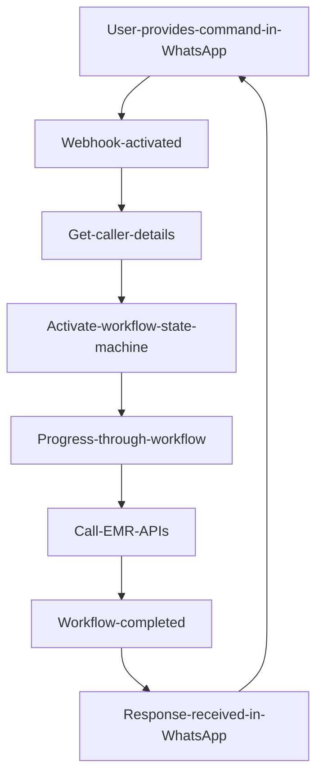

## Sofware-Tools
---

<div align="center">

<a href=""></a>

</div>

<p align="center">
  <a href="https://github.com/caliwyr"></a>
  <a href="http://creativecommons.org/publicdomain/zero/1.0/"></a>
  
</p>
<!--platinum start-->
<table>
  <tbody>
    <tr>
      <td align="center" valign="middle">
        <a href="https://vueschool.io/?utm_source=Vuejs.org&utm_medium=Banner&utm_campaign=Sponsored%20Banner&utm_content=V1" target="_blank">
          
        </a>
      </td>
      <td align="center" valign="middle">
        <a href="https://vehikl.com/" target="_blank">
          
        </a>
      </td>
      <td align="center" valign="middle">
        <a href="https://passionatepeople.io/" target="_blank">
          
        </a>
      </td>
      <td align="center" valign="middle">
        <a href="https://www.storyblok.com" target="_blank">
          
        </a>
      </td>
    </tr><tr></tr>
    <tr>
      <td align="center" valign="middle">
        <a href="https://ionicframework.com/vue?utm_source=partner&utm_medium=referral&utm_campaign=vuesponsorship&utm_content=vuedocs" target="_blank">
          
        </a>
      </td>
      <td align="center" valign="middle">
        <a href="https://nuxtjs.org/" target="_blank">
          
        </a>
      </td>
      <td align="center" valign="middle">
        <a href="https://www.refurbed.org/?utm_source=vuejs" target="_blank">
          
        </a>
      </td>
    </tr><tr></tr>
  </tbody>
</table>

**Caliwyr**


<!--platinum end-->

> Update 18 Desember 2022

>
| Nama Sofware   | URL | Status |  | Deskripsi | `Auth` |
| --------------- |:---------:|:---:|:-------:|:----------|:------:|
| Tools BOX | Bypass Tools | [Link](https://github.com/caliwyr/Software/tree/main/Tools%20BOX) | `Aktif` | Sofware Tools Bypass 'id' `#` | `Aktif` |
| Bypass Tools | Toolskit | [Link](https://github.com/caliwyr/Software/tree/main/Bypass%20Tools/) | `Aktif` | Tools Bypass 'id' `#` | `Aktif` |
| Daftar Api Lokal | Api Lokal | [Link](https://github.com/caliwyr/Software/tree/main/Daftar%20Api%20Lokal) | `Aktif` | Sofware Tools Bypass 'id' `#` | `Aktif` |
| Google Dork | Hacking | [Link](https://github.com/caliwyr/Software/tree/main/Google%20Dork) | `Aktif` | Sofware Tools Bypass 'id' `#` | `Aktif` |
| Host Domain | Bypass Tools | [Link](https://github.com/caliwyr/Software/tree/main/Host%20Domain) | `Aktif` | Tools Bypass 'id' `#` | `Aktif` |
| Template Premium | Blogger | [Link](https://github.com/caliwyr/Software/tree/main/Template%20Premium/BLOGGER) | `Aktif` | Template Blogger 'id' `#` | `Aktif` |
| Termux Hacking | Tools | [Link](https://github.com/caliwyr/Software/tree/main/Termux%20Hacking) | `Aktif` | Tools Termux 'id' `#` | `Aktif` |


## Desain
| Nama Sofware   | URL | Status | Deskripsi | | `Software` |
| --------------- |:---------:|:---:|:-------:|:----------|:------:|
| Dribble | https://dribbble.com/ | `Sukses` | Desain |
| Behance | https://www.behance.net/ | `Sukses` | Desain |
| Awwards | https://www.awwards.com/websites/ | `Sukses` | Desain |
| TriangLify | https://trianglify.io/ | `Sukses` | Desain |
| Wicked | https://wickedbackgrounds.com/ | `Sukses` | Desain |
| Felixg | https://felixg.io/products/inline | `Sukses` | Desain |
| DesignVault | https://designvault.io/ | `Sukses` | Desain |
| Boxicons | https://boxicons.com/ | `Sukses` | Desain |
| Graphics | https://tool.graphics/mondrian | `Sukses` | Desain |
| PixelTrue | https://www.pixeltrue.com/scenic-illustrations | `Sukses` | Desain |
| Daily UI | https://www.dailyui.co/ | `Sukses` | Desain |
| Typewolf | https://www.typewolf.com/ | `Sukses` | Desain |

## Gambar menarik gratis
| Nama Sofware   | URL | Status | Deskripsi | | `Software` |
| --------------- |:---------:|:---:|:-------:|:----------|:------:|
- https://themeisle.com/blog/free-illustrations/#IRA
- https://designstripe.com/
- https://www.pixeltrue.com/free-packs/adventure-illustrations

## Korektor Bahasa
| Nama Sofware   | URL | Status | Deskripsi | | `Software` |
| --------------- |:---------:|:---:|:-------:|:----------|:------:|
| https://languagetool.org/pt-BR

## Ferramentas untuk UX/UI
| Nama Sofware   | URL | Status | Deskripsi | | `Software` |
| --------------- |:---------:|:---:|:-------:|:----------|:------:|
| https://miro.com/
| https://www.notion.so/
| https://www.figma.com/
| https://evernote.com/

## Situs Melhores
| Nama Sofware   | URL | Status | Deskripsi | | `Software` |
| --------------- |:---------:|:---:|:-------:|:----------|:------:|
| https://www.csswinner.com/
| https://www.cssdesignawards.com/
| https://www.awwards.com/
| http://cssreel.com/

## Aksesibilidade para situs
| Nama Sofware   | URL | Status | Deskripsi | | `Software` |
| --------------- |:---------:|:---:|:-------:|:----------|:------:|
| http://acessibilida.de/
| http://mwpt.com.br/transformacao/teste-acessibilidade/
| autisme
| http://talitapagani.com/gaia/  
| Baixa Visão
| https://contrastchecker.com/
| https://webaim.org/

## Seo
| Nama Sofware   | URL | Status | Deskripsi | | `Software` |
| --------------- |:---------:|:---:|:-------:|:----------|:------:|
| https://sitechecker.pro/pt/
| https://sitechecker.pro/pt/open-graph/
| https://jamseotools.com/
| https://validator.w3.org/

## Desain Dan Programming
| Nama Sofware   | URL | Status | Deskripsi | | `Software` |
| --------------- |:---------:|:---:|:-------:|:----------|:------:|
| https://coderbyte.com/
| https://www.hackerrank.com/
| https://www.jschallenger.com/
| https://www.devchallenge.com.br/challenges
| https://www.urionlinejudge.com.br/judge/en/login
| https://www.spoj.com/
| https://www.codewars.com/
| https://leetcode.com/

## Desain Icons Pack
| Nama Sofware   | URL | Status | Deskripsi | | `Software` |
| --------------- |:---------:|:---:|:-------:|:----------|:------:|
| https://heroicons.com/
| https://icons8.com/
| https://thenounproject.com/
| https://app.streamlinehq.com/icons/material-line

## Editor Video online
| Nama Sofware   | URL | Status | Deskripsi | | `Software` |
| --------------- |:---------:|:---:|:-------:|:----------|:------:|
| https://app.clipchamp.com/

## Kode status HTTP
| Nama Sofware   | URL | Status | Deskripsi | | `Software` |
| --------------- |:---------:|:---:|:-------:|:----------|:------:|
| https://httpsstatusdogs.com/

## Cursos gratuitos Dan Programmer
| Nama Sofware   | URL | Status | Deskripsi | | `Software` |
| --------------- |:---------:|:---:|:-------:|:----------|:------:|
| https://digitalinnovation.one/
| https://www.freecodecamp.org/
| https://igorhalfeld.teachable.com/p/treinamento-completo-e-gratuito-de-vue-js-3-do-iniciante-ao-avancado

## APIS
| Nama Sofware   | URL | Status | Deskripsi | | `Software` |
| --------------- |:---------:|:---:|:-------:|:----------|:------:|
| https://hgbrasil.com/
| https://www.themoviedb.org/documentation/api

## Vagas
| Nama Sofware   | URL | Status | Deskripsi | | `Software` |
| --------------- |:---------:|:---:|:-------:|:----------|:------:|
| https://seujob.tech/

# Peralatan
Repositori ini adalah kumpulan alat online yang sangat berguna untuk pengembangan web dan keingintahuan sehari-hari.

## Bermacam-macam
| Nama Sofware   | URL | Status | Deskripsi | | `Software` |
| --------------- |:---------:|:---:|:-------:|:----------|:------:|
 * Versi alat https://verstory.com/
 * Teknologi di mana sebuah situs dikembangkan https://builtwith.com
 * Shell: Lihat perintah Shell yang dijelaskan https://explainshell.com/
 * Radar Penerbangan https://www.flightradar24.com/-29.89,-62.41/7
 * Kita makan apa hari ini https://www.yummly.com/
 * Belajar bermain piano https://www.synthesiagame.com/
 * Gitmoji, tambahkan emoji ke git commit, berguna juga untuk slack https://gitmoji.carloscuesta.me/

## Iklim dan Alam
| Nama Sofware   | URL | Status | Deskripsi | | `Software` |
| --------------- |:---------:|:---:|:-------:|:----------|:------:|
 * Berangin: Peta angin https://www.windy.com/
 * Peta gempa https://earthquake.usgs.gov/earthquakes/map/
 * Gempa bumi baru-baru ini https://es.earthquaketrack.com/recent
 * Peringatan cuaca AR http://www.smn.gov.ar/?mod=pron&id=51
 * Peta Api https://firms.modaps.eosdis.nasa.gov/firemap/

## Penerbit
| Nama Sofware   | URL | Status | Deskripsi | | `Software` |
| --------------- |:---------:|:---:|:-------:|:----------|:------:|
 * Editor StackOverflow https://stackedit.io/editor
 * Editor GitHub https://jbt.github.io/markdown-editor
 * Editor GitHub https://dillinger.io
 
## Arsitektur
| Nama Sofware   | URL | Status | Deskripsi | | `Software` |
| --------------- |:---------:|:---:|:-------:|:----------|:------:|
 * Perencana Lantai https://floorplanner.com

## Monetizer dan Crowdfunding
| Nama Sofware   | URL | Status | Deskripsi | | `Software` |
| --------------- |:---------:|:---:|:-------:|:----------|:------:|
 * Kickstarter https://www.kickstarter.com
 * GoFundMe https://www.gofundme.com
 * Patreon https://www.patreon.com
 * Idegogo https://www.indiegogo.com
 * Luncurkan kami https://www.lanzanos.com
 * Ulele https://es.ulule.com
 * Goteo http://www.goteo.org
 * Sponsor Kode https://codesponsor.io
 * Ko-fi: https://ko-fi.com/
 
## Generator
| Nama Sofware   | URL | Status | Deskripsi | | `Software` |
| --------------- |:---------:|:---:|:-------:|:----------|:------:|
 * CNPJ, CPF, TELEPON, TEKS http://www.theonegenerator.com/es
 * Teks http://es.lipsum.com/
 * Teks https://codebeautify.org/lorem-ipsum
 * Bagikan tautan https://codebeautify.org/share-link-generator
 * Generator Nomor Palsu Kartu Kredit https://codebeautify.org/credit-card-fake-number-generator
 * Generator skema warna https://coolors.co/app
 * Generator Skema Warna http://paletton.com/
 * Generator umpan balik otomatis! https://mschmitt.org/performance/

## seru
| Nama Sofware   | URL | Status | Deskripsi | | `Software` |
| --------------- |:---------:|:---:|:-------:|:----------|:------:|
 * Cowsay http://cowsay.morecode.org/
 
## Nomor Acak
| Nama Sofware   | URL | Status | Deskripsi | | `Software` |
| --------------- |:---------:|:---:|:-------:|:----------|:------:|
 * Generator Integer membuat angka acak dalam interval yang dapat dikonfigurasi https://www.random.org/integers/
 * Generator Urutan akan mengacak urutan bilangan bulat pilihan Anda https://www.random.org/sequences/
 * Generator Set Integer membuat set integer yang tidak berulang https://www.random.org/integer-sets/
 * Generator Gaussian membuat angka acak agar sesuai dengan distribusi normal https://www.random.org/gaussian-distributions/
 * Generator Pecahan Desimal membuat angka dalam kisaran [0,1] dengan tempat desimal yang dapat dikonfigurasi https://www.random.org/decimal-fractions/
 * Byte Acak Mentah berguna untuk banyak tujuan kriptografi https://www.random.org/bytes/
 
## daftar acak
| Nama Sofware   | URL | Status | Deskripsi | | `Software` |
| --------------- |:---------:|:---:|:-------:|:----------|:------:|
 * Daftar Randomizer akan mengacak daftar apa pun yang Anda miliki (nama, nomor telepon, dll.) https://www.random.org/lists/
 * String Generator membuat string alfanumerik acak https://www.random.org/strings/
 * Pembuat Kata Sandi membuat kata sandi aman untuk Wi-Fi Anda atau akun Gmail ekstra https://www.random.org/passwords/
 * Generator Waktu Jam akan memilih waktu acak dalam sehari https://www.random.org/clock-times/
 * Generator Tanggal Kalender akan memilih hari acak selama hampir tiga setengah milenium https://www.random.org/calendar-dates/
 * Generator Koordinat Geografis akan memilih tempat acak di permukaan planet kita https://www.random.org/geographic-coordinates/
 * Bitmap hitam putih https://www.random.org/bitmaps/
 * Generator Kode Warna Heksadesimal akan memilih kode warna, misalnya untuk digunakan sebagai warna web<br> https://www.random.org/colors/hex
 * File Pregenerated berisi sejumlah besar bit acak yang dapat diunduh https://www.random.org/files/
 * Pure White Audio Noise untuk komposisi atau hanya untuk menguji peralatan audio Anda https://www.random.org/audio-noise/
 * Timbangan Jazz untuk melatih improvisasi bagi siswa gitar jazz https://www.random.org/jazz-scales/
 * Prosa pendek Samuel Beckett yang dibuat secara acak https://www.random.org/lessness/
 
## Percantik dan pemformat
| Nama Sofware   | URL | Status | Deskripsi | | `Software` |
| --------------- |:---------:|:---:|:-------:|:----------|:------:|
 * Encoder Formatter HTML https://www.textfixer.com/html/html-character-encoding.php
 * HTML, CSS, JSON, Lainnya https://codebeautify.org/
 * JSON https://jsonformatter.org/

## BARANG
| Nama Sofware   | URL | Status | Deskripsi | | `Software` |
| --------------- |:---------:|:---:|:-------:|:----------|:------:|
 * IP saya https://codebeautify.org/ipcheck-weatherinfo-latestnews
 * Status Pager http://www.isitdownrightnow.com
 * Daftar lisensi Open Source https://spdx.org/licenses/
 * Daftar lisensi Open Source https://opensource.org/licenses
 * Daftar lisensi Open Source https://getcomposer.org/doc/04-schema.md#license
 * Cepat (kecepatan uji dari netflix): https://fast.com/es
 
## Pengonversi Satuan
| Nama Sofware   | URL | Status | Deskripsi | | `Software` |
| --------------- |:---------:|:---:|:-------:|:----------|:------:|
 * Konverter Panjang https://codebeautify.org/length-converter
 * Konverter Berat https://codebeautify.org/weight-converter
 * Konverter Volume https://codebeautify.org/volume-converter
 * Konverter Area https://codebeautify.org/area-converter
 * Konverter Suhu https://codebeautify.org/temperature-converter
 * Konverter Kecepatan https://codebeautify.org/speed-converter
 * Konverter Sudut https://codebeautify.org/angle-converter
 * Konverter Bytes/Bit https://codebeautify.org/bytes-converter
 * Konverter Kepadatan https://codebeautify.org/density-converter
 * Konverter Arus Listrik https://codebeautify.org/electric-current-converter
 * Konverter Energi https://codebeautify.org/energy-converter
 * Pengonversi Paksa https://codebeautify.org/force-converter
 * Konverter Bahan Bakar https://codebeautify.org/fuel-converter
 * Konverter Massal https://codebeautify.org/mass-converter
 * Konverter Daya https://codebeautify.org/power-converter
 * Konverter Tekanan https://codebeautify.org/pressure-converter
 * Konverter Waktu https://codebeautify.org/time-converter
 * Konverter Astronomi https://codebeautify.org/astronomical-converter
 * Konverter Frekuensi https://codebeautify.org/frequency-converter
 
 ## Kegunaan
| Nama Sofware   | URL | Status | Deskripsi | | `Software` |
| --------------- |:---------:|:---:|:-------:|:----------|:------:|
 * Penguji Situs Web Responsif https://codebeautify.org/responsive-website-tester  
 * Penguji XPath https://codebeautify.org/Xpath-Tester
 * Penguji Jalur Json https://codebeautify.org/jsonpath-tester
 * Json Minifier https://codebeautify.org/jsonminifier
 * Perbedaan File https://codebeautify.org/file-diff
 * Pemeriksa Tautan Rusak https://codebeautify.org/broken-link-checker
 * Skema json http://json-schema.org/
 * Liburan berikutnya http://www.elproximoferiado.com

## Utilitas String
| Nama Sofware   | URL | Status | Deskripsi | | `Software` |
| --------------- |:---------:|:---:|:-------:|:----------|:------:|
 * Generator Kata Acak https://codebeautify.org/random-word-generator
 * Pembuat Kata Sandi https://codebeautify.org/password-generator
 * Pembuat String https://codebeautify.org/string-builder
 * NOMOR ke KONVERTER KATA https://codebeautify.org/number-to-word-converter
 * PENGHITUNG KATA https://codebeautify.org/wordcounter
 * String Terbalik https://codebeautify.org/reverse-string
 * Encode HTML https://codebeautify.org/html-encode-string
 * Dekode HTML https://codebeautify.org/html-decode-string
 * Base64-Encode https://codebeautify.org/base64-encode
 * Base64-Decode https://codebeautify.org/base64-decode
 * URL-Encode A String https://codebeautify.org/url-encode-string
 * URL-Decode A String https://codebeautify.org/url-decode-string
 * Konverter String ke Hex https://codebeautify.org/string-hex-converter
 * Konverter Hex ke String https://codebeautify.org/hex-string-converter
 * Konverter String ke Biner https://codebeautify.org/string-binary-converter
 * Konverter Biner ke String https://codebeautify.org/binary-string-converter
 * Konverter Kasus https://codebeautify.org/case-converter
 * Ekstraktor Teks Terbatas https://codebeautify.org/delimited-text-extractor
 * Hapus Aksen https://codebeautify.org/remove-accents
 * Hapus Garis Duplikat https://codebeautify.org/remove-duplicate-lines
 * Hapus Baris Kosong https://codebeautify.org/remove-empty-lines
 * Hapus Spasi Ekstra https://codebeautify.org/remove-extra-spaces
 * Hapus Line Breaks https://codebeautify.org/remove-line-breaks
 * Hapus Baris yang Mengandung https://codebeautify.org/remove-lines-containing
 * Urutkan Baris Teks https://codebeautify.org/sort-text-lines

## Validator
| Nama Sofware   | URL | Status | Deskripsi | | `Software` |
| --------------- |:---------:|:---:|:-------:|:----------|:------:|
 * VALIDATOR CSS https://codebeautify.org/cssvalidate
 * VALIDATOR JAVASCRIPT https://codebeautify.org/jsvalidate
 * JSON VALIDATOR https://codebeautify.org/jsonvalidator
 * XML VALIDATOR https://codebeautify.org/xmlvalidator
 * VALIDATOR KARTU KREDIT https://codebeautify.org/credit-card-validate
 * Tes API https://codebeautify.org/api-test
 * YAML VALIDATOR https://codebeautify.org/yaml-validator
 * HTML, CSS, JS di Browser https://caniuse.com/
 * Pembuatan Web dengan https://builtwith.com/

## Utilitas Nomor
| Nama Sofware   | URL | Status | Deskripsi | | `Software` |
| --------------- |:---------:|:---:|:-------:|:----------|:------:|
 * Konverter Semua Angka https://codebeautify.org/all-number-converter
 * Konverter Desimal ke Biner https://codebeautify.org/decimal-binary-converter
 * Konverter Desimal ke Hex https://codebeautify.org/decimal-hex-converter
 * Konverter Desimal ke Oktal https://codebeautify.org/decimal-octal-converter
 * Konverter Biner ke Desimal https://codebeautify.org/binary-decimal-converter
 * Konverter Biner ke Hex https://codebeautify.org/binary-hex-converter
 * Konverter Biner ke Oktal https://codebeautify.org/binary-octal-converter
 * Konverter Hex ke Desimal https://codebeautify.org/hex-decimal-converter
 * Konverter Hex ke Biner https://codebeautify.org/hex-binary-converter
 * Konverter Hex ke Oktal https://codebeautify.org/hex-octal-converter
 * Konverter Oktal ke Desimal https://codebeautify.org/octal-decimal-converter
 * Konverter Oktal ke Biner https://codebeautify.org/octal-binary-converter
 * Konverter Oktal ke Hex https://codebeautify.org/octal-hex-converter
 
## Pengonversi
| Nama Sofware   | URL | Status | Deskripsi | | `Software` |
| --------------- |:---------:|:---:|:-------:|:----------|:------:|
* Gambar ke Base64 https://codebeautify.org/image-to-base64-converter
* Base64 ke Gambar https://codebeautify.org/base64-to-image-converter
* Kalkulator Tanggal https://codebeautify.org/date-time-calculator
* CSV ke DATA MULTILINE https://codebeautify.org/csv-to-multi-line-converter
* SQL ke JSON CONVERTER https://codebeautify.org/sql-to-json-converter
* SQL ke YAML CONVERTER https://codebeautify.org/sql-to-yaml-converter
* KONVERTER SQL ke HTML https://codebeautify.org/sql-to-html-converter
* RGB ke CMYK CONVERTER https://codebeautify.org/rgb-to-cmyk-converter
* KONVERTER HEX ke CMYK https://codebeautify.org/hex-to-cmyk-converter
* Tableizer Online https://codebeautify.org/tableizer
* Konverter HTML ke CSV https://codebeautify.org/html-to-csv-converter
* Konverter HTML ke TSV https://codebeautify.org/html-to-tsv-converter
* Konverter HTML ke PHP https://codebeautify.org/html-to-php-converter
* Transformasi XML-XSL https://codebeautify.org/xml-xsl-transformation
* XML ke JSON https://codebeautify.org/xmltojson
* JSON ke XML https://codebeautify.org/jsontoxml
* CSV ke XML/JSON https://codebeautify.org/csv-to-xml-json
* YAML CONVERTER https://codebeautify.org/yaml-to-json-xml-csv
* EXCEL ke HTML https://codebeautify.org/excel-to-html
* EXCEL ke XML https://codebeautify.org/excel-to-xml
* EXCEL ke JSON https://codebeautify.org/excel-to-json
* JSON ke YAML https://codebeautify.org/json-to-yaml
* XML ke YAML https://codebeautify.org/xml-to-yaml
* CSV ke XML https://codebeautify.org/csv-to-xml-converter
* CSV ke JSON https://codebeautify.org/csv-to-json-converter
* CSV ke HTML https://codebeautify.org/csv-to-html-converter
* JSON ke CSV https://codebeautify.org/json-to-csv
* JSON ke TSV https://codebeautify.org/json-to-tsv-converter
* XML ke CSV https://codebeautify.org/xml-to-csv-converter
* HTML ke CSV https://codebeautify.org/html-to-csv-converter
* CSV ke SQL https://codebeautify.org/csv-to-sql-converter
* SQL ke CSV CONVERTER https://codebeautify.org/sql-to-csv-converter
* SQL ke XML CONVERTER https://codebeautify.org/sql-to-xml-converter
* OPML ke JSON https://codebeautify.org/opml-to-json-converter
* HEX ke Pantone CONVERTER https://codebeautify.org/hex-to-pantone-converter
* RGB ke KONVERTER Pantone https://codebeautify.org/rgb-to-pantone-converter
*HSV ke KONVERTER Pantone https://codebeautify.org/hsv-to-pantone-converter
* CMYK ke Pantone CONVERTER https://codebeautify.org/cmyk-to-pantone-converter
* CMYK ke HEX CONVERTER https://codebeautify.org/cmyk-to-hex-converter
* CMYK ke RGB CONVERTER https://codebeautify.org/cmyk-to-rgb-converter
* CMYK ke HSV CONVERTER https://codebeautify.org/cmyk-to-hsv-converter
* HSV ke HEX CONVERTER https://codebeautify.org/hsv-to-hex-converter
*HSV ke RGB CONVERTER https://codebeautify.org/hsv-to-rgb-converter
* HSV ke CMYK CONVERTER https://codebeautify.org/hsv-to-cmyk-converter
* KONVERTER HEX ke HSV https://codebeautify.org/hex-to-hsv-converter
* RGB ke HEX CONVERTER https://codebeautify.org/rgb-to-hex-converter
* RGB ke HSV CONVERTER https://codebeautify.org/rgb-to-hsv-converter
* KONVERTER HEX ke RGB https://codebeautify.org/hex-to-rgb-converter
* JSON ke HTML https://codebeautify.org/json-to-html-converter
* XML ke HTML https://codebeautify.org/xml-to-html-converter
* JSON ke Excel https://codebeautify.org/json-to-Excel-converter
* XML ke Excel https://codebeautify.org/xml-to-Excel-converter
* CSV ke Excel https://codebeautify.org/csv-to-excel-converter
* YAML ke Excel https://codebeautify.org/yaml-to-Excel-converter

## Penampil / Editor Web
| Nama Sofware   | URL | Status | Deskripsi | | `Software` |
| --------------- |:---------:|:---:|:-------:|:----------|:------:|
 * JSON VIEWER https://codebeautify.org/jsonviewer
 * XML VIEWER https://codebeautify.org/xmlviewer
 * PENAMPIL MXML https://codebeautify.org/mxmlviewer
 * PENAMPIL HTML https://codebeautify.org/htmlviewer/
 * CSS BEAUTIFY DAN MINIFY https://codebeautify.org/css-beautify-minify
 * JAVASCRIPT VIEWER https://codebeautify.org/jsviewer
 * PENAMPIL RSS https://codebeautify.org/rssviewer
 * PENAMPIL KODE SUMBER https://codebeautify.org/source-code-viewer
 * PENAMPIL OPML https://codebeautify.org/opmlviewer
 * Kolaborasi Pada Kode https://codebeautify.org/collabe-code

 ## Editor Pemrograman
| Nama Sofware   | URL | Status | Deskripsi | | `Software` |
| --------------- |:---------:|:---:|:-------:|:----------|:------:|
 * EDITOR XML https://codebeautify.org/online-xml-editor
 * JSON EDITOR https://codebeautify.org/online-json-editor
 * EDITOR ONLINE https://codebeautify.org/aleditor
 * JAVA EDITOR https://codebeautify.org/javaviewer
 * C# EDITOR https://codebeautify.org/csharpviewer
 * EDITOR Skrip Aksi https://codebeautify.org/actionscript
 * SQL EDITOR https://codebeautify.org/sqlformatter

 ## Alat Escape Unescape
| Nama Sofware   | URL | Status | Deskripsi | | `Software` |
| --------------- |:---------:|:---:|:-------:|:----------|:------:|
 * HTML Escape Unescape https://codebeautify.org/html-escape-unescape
 * XML Escape Unescape https://codebeautify.org/xml-escape-unescape
 * Java Escape Unescape https://codebeautify.org/java-escape-unescape
 * C# Escape Unescape https://codebeautify.org/csharp-escape-unescape
 * Javascript Escape Unescape https://codebeautify.org/javascript-escape-unescape
 * CSV Escape Unescape https://codebeautify.org/csv-escape-unescape
 * SQL Escape Unescape https://codebeautify.org/sql-escape-unescape
 * Hapus Tautan Google https://codebeautify.org/un-google-link

## CryptoGraphyTools
| Nama Sofware   | URL | Status | Deskripsi | | `Software` |
| --------------- |:---------:|:---:|:-------:|:----------|:------:|
  * Enkripsi-Dekripsi https://codebeautify.org/encrypt-decrypt
  * Enkripsi-Dekripsi https://cifraronline.com/

## Referensi
| Nama Sofware   | URL | Status | Deskripsi | | `Software` |
| --------------- |:---------:|:---:|:-------:|:----------|:------:|
 * Referensi HTML http://htmlreference.io/
 * Referensi CSS http://cssreference.io/
 * HTML & CSS http://marksheet.io/
 
## menggores
| Nama Sofware   | URL | Status | Deskripsi | | `Software` |
| --------------- |:---------:|:---:|:-------:|:----------|:------:|
  * Web Scraper http://webscraper.io/
  * Python Scraper https://scrapy.org/
  
## Media sosial
| Nama Sofware   | URL | Status | Deskripsi | | `Software` |
| --------------- |:---------:|:---:|:-------:|:----------|:------:|
 * Socialblade - https://socialblade.com/youtube

## Presentasi
| Nama Sofware   | URL | Status | Deskripsi | | `Software` |
| --------------- |:---------:|:---:|:-------:|:----------|:------:|
 * Prezi: https://prezi.com
 * RealTimeBoard: https://realtimeboard.com
 
## Cuaca
| Nama Sofware   | URL | Status | Deskripsi | | `Software` |
| --------------- |:---------:|:---:|:-------:|:----------|:------:|
 * Waktu Hitung Mundur: https://www.online-stopwatch.com/

## Emoji
| Nama Sofware   | URL | Status | Deskripsi | | `Software` |
| --------------- |:---------:|:---:|:-------:|:----------|:------:|
 * Emojipedia - https://emojipedia.org/

***
***
**[â—„â—„ Back to Wiki Index](https://www.reddit.com/r/FREEMEDIAHECKYEAH/wiki/index)**
***
***

***

**[Table of Contents](https://i.imgur.com/9EomDae.png)** - *For mobile users*

***
***

#### 3D Modeling Apps

[Blender](https://www.blender.org/), [Spline](https://spline.design/), [Anim8or](https://www.anim8or.com/), [Wings 3D](http://www.wings3d.com/), [JustSketch.Me](https://justsketch.me/), [Tinkercad](https://www.tinkercad.com/), [Chakoku](https://github.com/itta611/ChokokuCAD), [PovRay](http://www.povray.org/), [FreeCAD](https://www.freecadweb.org/), [PicoCad](https://johanpeitz.itch.io/picocad), [Vectary](https://www.vectary.com/), [LibreCAD](https://librecad.org/), [Art of Illusion](http://aoi.sourceforge.net/) 

***

#### 3D Models

[CGPersia](https://cgpersia.com/), [Clara](https://clara.io/library), [Sketchfab](https://sketchfab.com/), [GrabCad](https://grabcad.com/), [Daz3D](https://www.3dcu.com/), [3DRU](https://3dru.net/), [CGDownloads](https://cgdownloads.com/), [P3DM](https://p3dm.ru/), [3D-Load](https://3d-load.net/), [CGTrader](https://www.cgtrader.com/free-3d-models), [Free3D](https://free3d.com/), [VRModels](https://vrmodels.store/), [TurboSquid](https://www.turbosquid.com/), [CadNav](https://www.cadnav.com/), [BlendSwap](https://www.blendswap.com/), [3DModelsCC0](https://www.3dmodelscc0.com/), [Blenders-Models](https://www.blender-models.com/), [Render State](https://render-state.to/), [Open3DModel](https://www.open3dmodel.com/), [KiCad](https://kicad.github.io/), [Archive3d](https://archive3d.net/), [TopGFX](http://topgfx.info/index.php), [3DPirate](https://3dpirate.net/), [3dexport](https://3dexport.com/free-3d-models), [shop3dmili](https://shop3dmili.com/free), [archibaseplanet](https://archibaseplanet.com/), [cults3d](https://cults3d.com/), [3dsky](https://3dsky.org/), [turbosquid](https://www.turbosquid.com/Search/3D-Models/free), [3dwarehouse](https://3dwarehouse.sketchup.com/)

***

#### 3DS Roms

* [CIA-3DS](https://www.cia-3ds.com/)
* [HShop](https://hshop.erista.me/)
* [CIA Drive](https://drive.google.com/drive/u/0/folders/1a1U18ImPv-VunSHanHBDTLht6kVf5AP6), [2](https://drive.google.com/drive/folders/1R5c6-nY5mMns8G1u2tcbYumfTCGXDQ5w), [3](https://drive.google.com/drive/folders/1a9BYbFlhQ96zaKtuL99m8N_r4qv8L_FK), [4](https://drive.google.com/drive/folders/1vDIlIfJL1I8Nzv616YBIX-QXmudoxKxM?usp=sharing), [5](https://archive.org/download/3DSCIA_testitem1), [6](https://archive.org/details/nintendo-3ds-complete-collection), [7](https://drive.google.com/drive/u/0/folders/1a9BYbFlhQ96zaKtuL99m8N_r4qv8L_FK)  

***

#### Absolute Enable Right Click

Absolute Enable - [Firefox](https://addons.mozilla.org/en-US/firefox/addon/absolute-enable-right-click/) /
[Chrome](https://chrome.google.com/webstore/detail/absolute-enable-right-cli/jdocbkpgdakpekjlhemmfcncgdjeiika) / [Script](https://greasyfork.org/en/scripts/23772-absolute-enable-right-click-copy)

Simple Allow - [Firefox](https://addons.mozilla.org/en-US/firefox/addon/simple-allow-copy/) / [Chrome](https://chrome.google.com/webstore/detail/simple-allow-copy/aefehdhdciieocakfobpaaolhipkcpgc?hl=en)

***

#### Adblock Defenders

 **[AdGuardExtra](https://github.com/AdguardTeam/AdGuardExtra)** / [Script](https://userscripts.adtidy.org/release/adguard-extra/1.0/adguard-extra.user.js), **[fuck fuckadblock](https://bogachenko.github.io/fuckfuckadblock/)**, [BlockAdblock Blocker](https://greasyfork.org/en/scripts/406036-blockadblock-blocker), [Easylist](https://easylist-downloads.adblockplus.org/antiadblockfilters.txt), [Assassinate Ad Block Blockers](https://greasyfork.org/en/scripts/382482-assassinate-ad-block-blockers)

[Test Adblock Defender](https://blockads.fivefilters.org/)

***

#### After Effects Templates

[ShareAE](https://www.shareae.com/), [HunterAE](https://hunterae.com/), [AEShares](https://aeshares.com/), [AEDownload](https://aedownload.com/), [AERiver](https://aeriver.com/), [CGNullded](https://cgnulled.com/), [Intro HD](https://intro-hd.net/), [AEDownloadPro](https://www.aedownloadpro.com/) [DownAE](https://downae.com/), [Adobe After Effects Collection](https://drive.google.com/drive/folders/17-qFK26tVxfds2S-q5zjMVwa4o81Bm_e)

***

# **Tools**

## Subdomains Enumeration


- Assetfinder 
  - https://github.com/tomnomnom/assetfinder
- Amass
  - https://github.com/OWASP/Amass
- Subfinder
  - https://github.com/projectdiscovery/subfinder
- Aquatone
  - https://github.com/michenriksen/aquatone
- Chaos.projectdiscovery.io
  - https://chaos.projectdiscovery.io/#/
- Securitytrails.com
  - https://securitytrails.com/
- OneforAll
  - https://github.com/shmilylty/OneForAll/


#### Examples scripts & commands

```bash
subfinder -d domain| httpx -silent | githound
```

```bash
subfinder -d $1 -silent | httpx -silent | xargs -I %% bash -c 'python3 /root/../SecretFinder.py -i %% -e -o cli'
```

```bash
subfinder -d domain -silent | httpx -silent | nuclei -t ../nuclei-templates/cves/ -o fileout
```

```bash
subfinder -d $ -silent | httpx -silent | nuclei -t ../nuclei-templates/ -o $2
```

```bash
cat $1 | httpx -follow-redirects -status-code -vhost -threads 100 | sort -u | grep "[200}" | cut -d [ -f1 | uniq | tee $2
```

## Intel Gathering

- Amass
  - https://github.com/OWASP/Amass
- Whois
  - https://whois.net/
- Shodan
  - https://www.shodan.io/
- Github
  - https://github.com/
- Search Engine

### Examples Shodan

Shodan search : org:organization
				hostname: domain
				
				

## Directory Bruteforcing/Content Discovery

- dirsearch
  - https://github.com/maurosoria/dirsearch
- fuff
  - https://github.com/ffuf/ffuf
- gospider
  - https://github.com/jaeles-project/gospider
- gobuster
  - https://github.com/OJ/gobuster

---
{"dg-publish":true,"permalink":"/apps/","dgShowBacklinks":true,"dgShowLocalGraph":true}
---

<!-- START doctoc generated TOC please keep comment here to allow auto update -->
<!-- DON'T EDIT THIS SECTION, INSTEAD RE-RUN doctoc TO UPDATE -->
**Table of Contents** *generated with [DocToc](https://github.com/thlorenz/doctoc)*

- [Apps](#apps)
  - [Cross-Platform](#cross-platform)
  - [Docker](#docker)
  - [iOS](#ios)
  - [Linux](#linux)
  - [MacOS](#macos)
  - [Online](#online)
  - [Packages](#packages)
  - [VS Code](#vs-code)
  - [Windows](#windows)

<!-- END doctoc generated TOC please keep comment here to allow auto update -->

---

# Apps

- [A Markdown Editor for the 21st Century - Zettlr](https://zettlr.com/)

- [Zenkit Hypernotes - Experience a new way of collaborative writing.](https://zenkit.com/en/hypernotes/)

- [Zengobi Curio](https://zengobi.com/curio/)

- [VNote - A pleasant note-taking platform](http://app.vnote.fun/en_us/)

- [Transno - Outlines, Notes, Mind Map](https://transno.com/)

- [tiddlyroam · your open source external brain](https://tiddlyroam.org/)

- [Tangent Notes](https://www.tangentnotes.com/)

- [RemNote – The all-in-one tool for thinking and learning.](https://www.remnote.com/)

- [Reflect](https://reflect.app/)

- [Recall - Your personal encyclopedia](https://www.recall.wiki/)

- [Your Second Brain - myReach](https://myreach.io/)

- [NotePlan - Your tasks, notes, and calendar. All linked in one place.](https://noteplan.co/)

- [Nota Bene](https://www.notabene.com/)

- [Nota - Pro notes app designed for local Markdown files.](https://nota.md/)

- [Mind Map & Brainstorm Ideas](https://www.mindnode.com/)

- [MindMeister: Online Mind Mapping and Brainstorming](https://www.mindmeister.com/)

- [mindlib - Your personal mind library](https://mindlib.de/login)

- [Marginnote](https://www.marginnote.com/)

- [Innos Note](https://innos.io/)

- [Best Notes App - Write and Organize with UpNote](https://getupnote.com/)

- [Dive into big ideas with Muse](https://museapp.com/)

- [RemNote – The all-in-one tool for thinking and learning.](https://www.remnote.io/)

- [POLAR - Easily manage your reading. Tag, annotate, and highlight PDFs and web content.](https://app.getpolarized.io/)

- [μPad | Take and organise notes for free](https://getmicropad.com/)

- [Mem: The self-organizing workspace](https://get.mem.ai/)

- [Escape - Mind mapping & Outlining for iOS](https://escapeapp.cloud/)

- [dokuwiki [DokuWiki]](https://www.dokuwiki.org/dokuwiki)

- [Dendron](https://www.dendron.so/)

- [Defter Notes | iPad app for deft handwritten notes & spatial organizing.](https://defternotes.com/)

- [Notorious](https://danobot.github.io/notorious-landing/)

- [Craft - The Future of Documents](https://www.craft.do/)

- [CmapTools | Cmap](https://cmap.ihmc.us/cmaptools/)

- [The developer notepad | Stashpad](https://www.stashpad.com/)

- [Boost Note | Chronicle your Stories](https://boostnote.io/)

- [Capacities](https://app.capacities.io/)

- [Anytype.io](https://anytype.io/en)

- [Amplenote: Best Note-taking App for To-do Lists & Calendar Scheduling](https://www.amplenote.com/)

- [AFFiNE - All In One Workos](https://affine.pro/)

- [ABLE | Dive into learning, spark insights, find your perfect flow](https://able.ac/)

## Cross-Platform

- [Notesnook | Open source & zero knowledge private note taking app](https://notesnook.com/)

- [Glamorous Toolkit](https://gtoolkit.com/)

- [acreom — IDE for your workflow](https://acreom.com/)

- [cherrytree – giuspen](https://www.giuspen.com/cherrytree/)

- [Memrey](https://www.memrey.com/)

- [Nuclino](https://www.nuclino.com/)

- [Zim - a desktop wiki](https://www.zim-wiki.org/?utm_source=saashub&utm_medium=marketplace&utm_campaign=saashub)

- [TiddlyWiki — a non-linear personal web notebook](https://tiddlywiki.com/)

- [Roam Research – A note taking tool for networked thought.](https://roamresearch.com/)

- [Notion – The all-in-one workspace for your notes, tasks, wikis, and databases.](https://www.notion.so/)

- [MindForger - Thinking Notebook and Markdown Editor](https://www.mindforger.com/)

- [Create amazing 3D Mind Maps and Flowcharts with our software](http://www.buildyourmap.com/)

- [AppFlowy.IO](https://www.appflowy.io/)

- [Anytype Community](https://community.anytype.io/)


## Docker

- [Hello from Personal Management System | Personal Management System](https://volmarg.github.io/)

- [Gist - Data becomes knowledge](https://www.gistapp.com/?ref=producthunt)


## iOS

- [‎Muse — tool for thought](https://apps.apple.com/in/app/muse-tool-for-thought/id1501563902)

- [mindlib - Your personal mind library](https://mindlib.de/)

- [Relanote | List](https://app.relanote.com/platform/notes-list)

- [‎Quine 2](https://apps.apple.com/us/app/quine-2/id1450128957)

- [Note Garden](https://notegarden.web.app/)

- [‎KnowledgeBase Builder](https://apps.apple.com/us/app/knowledgebase-builder/id1448579863)

- [‎Kase: Your Personal Database](https://apps.apple.com/us/app/kase-your-personal-database/id1481308987)


## Linux

- [Focalboard: Open source alternative to Trello, Asana, and Notion](https://www.focalboard.com/)


## MacOS

- [Tinderbox: The Tool For Notes](http://www.eastgate.com/Tinderbox/index.html)

- [Notenik Home](https://notenik.app/)

- [Agenda - Date-focused Note Taking.](https://agenda.com/)

- [A Markdown Editor for the 21st Century](https://www.zettlr.com/)

- [Note taking and mind mapping combined in one app](https://brainio.com/#/)

- [cryo file manager](https://cryonet.io/?ref=producthunt)


## Online

- [Word Webs](https://wordwebs.app/home)

- [Scolary](https://scolary.com/)

- [Data Stewardship Wizard](https://ds-wizard.org/)

- [The Dataverse Project - Dataverse.org](https://dataverse.org/)

- [wizdom.ai - intelligence for everyone](https://www.wizdom.ai/)

- [Academicons](https://jpswalsh.github.io/academicons/)

- [D3.js - Data-Driven Documents](https://d3js.org/)

- [Authorea](https://www.authorea.com/)

- [ELN and Project Management for science labs](https://www.colabra.app/)

- [mathieudutour/gatsby-digital-garden: 🌷 🌻 🌺 Create a digital garden with Gatsby](https://github.com/mathieudutour/gatsby-digital-garden)

- [Hyperdraft](https://hyperdraft.rosano.ca/)

- [bCisive - online decision mapping](https://www.bcisiveonline.com/)

- [Notabase](https://notabase.io/)

- [Apps with 'Knowledge Management' feature](https://alternativeto.net/feature/knowledge-management/)

- [Go beyond Bookmarks with BrainTool, the online Topic Manager](https://braintool.org/)

- [bundleIQ | Think Better](https://www.bundleiq.com/)

- [capacities – Your second brain](http://capacities.io/)

- [You need a wiki](https://youneedawiki.com/app)

- [Wavebox](https://wavebox.io/)

- [Wannadocs – Knowledge Base Management System](https://wannadocs.com/?ref=producthunt)

- [Spaceli — Turn Google Docs into a knowledge base](https://spaceli.io/?ref=producthunt)

- [SlimWiki — Beautiful Wikis for Teams](https://slimwiki.com/)

- [SigmaOS](https://sigmaos.com/?ref=producthunt)

- [Schema - The most productive cloud drive](https://www.schema.team/?ref=producthunt)

- [OrgPad - Universal, yet so simple](https://orgpad.com/)

- [Neatly Dashboard](https://app.useneatly.com/dashboard/categories/61c1b21284920b00c2388cad)

- [Legend](https://legendapp.com/)

- [KgBase - No-code knowledge graphs](https://www.kgbase.com/)

- [Interactive step-by-step guides and troubleshooting | Stonly](https://stonly.com/product/knowledge-base-software?ref=producthunt)

- [Fibery | Build your company workspace with no code](https://fibery.io/)

- [Databyss](https://www.databyss.org/?ref=producthunt)

- [Curabase: We make it easy to curate, collaborate, and share bookmarks.](https://www.curabase.com/?utm_source=saashub&utm_medium=marketplace&utm_campaign=saashub)

- [Connected Knowledge Networks Connect, organize, and visualize your knowledge.](https://www.ramsync.com/)

- [Build a Wiki on Google Drive - Kbee](https://www.kbee.app/?ref=producthunt)


## Packages

- [Screenshot tour · zadam/trilium Wiki · GitHub](https://github.com/zadam/trilium/wiki/Screenshot-tour)

- [cotoami/cotoami: Cotoami is a platform where people can weave a large network of wisdom from tiny ideas.](https://github.com/cotoami/cotoami#flow-timeline-and-stock-structured-content)

- [Argdown](https://argdown.org/)

- [Neuron Zettelkasten](https://neuron.zettel.page/)

- [Wiki.js](https://js.wiki/?utm_source=saashub&utm_medium=marketplace&utm_campaign=saashub)

- [Personal Knowledge Base with Vimwiki](https://www.rockyourcode.com/personal-knowledge-base-with-vimwiki/)

- [Pandoc - About pandoc](https://pandoc.org/?utm_source=saashub&utm_medium=marketplace&utm_campaign=saashub)

- [Onivim 2 - Modal Editing from the Future](https://v2.onivim.io/)

- [jKanban - Javascript plugin for Kanban boards](https://www.riccardotartaglia.it/jkanban/?ref=producthunt)

- [Index - Archivy](https://archivy.github.io/)


## VS Code

- [Dendron](https://www.dendron.so//)

- [Foam - Visual Studio Marketplace](https://marketplace.visualstudio.com/items?itemName=foam.foam-vscode)

- [Foam](https://foambubble.github.io/foam)


## Windows

- [MyInfo Note Taking & Personal Information Manager](https://www.myinfoapp.com/)

## Subdomain TakeOvers

- Subjack
  - https://github.com/haccer/subjack
- Aquatone
  - https://github.com/michenriksen/aquatone
- Tko-subs
  - https://github.com/anshumanbh/tko-subs
- Can-i-takeover-xyz (manual)
  - https://github.com/EdOverflow/can-i-take-over-xyz


## Parameter Discovery

- Arjun
  - https://github.com/s0md3v/Arjun
- ParamSpider
  - https://github.com/devanshbatham/ParamSpider


## PortScan

- NMap
  - https://nmap.org/
- Masscan
  - https://github.com/robertdavidgraham/masscan
- Naabu
  - https://github.com/projectdiscovery/naabu


## Github Recon/Leak Finding

- Githound
  - https://github.com/tillson/git-hound
- Secret Finder
  - https://github.com/m4ll0k/BurpSuite-Secret_Finder
- gitrob
  - https://github.com/michenriksen/gitrob
- Trufflehog
  - https://github.com/dxa4481/truffleHog


## JS Link Analysers

- JS-Scan
  - https://github.com/zseano/JS-Scan
- Burp JS Link finder
  - https://github.com/PortSwigger/js-link-finder
- Link Finder
  - https://github.com/GerbenJavado/LinkFinder


## Useful Scripts & Tools to Automate Recon

- Httprobe
  - https://github.com/tomnomnom/httprobe
- Waybackurls
  - https://github.com/tomnomnom/waybackurls
- Tomnomnom Hacks
  - https://github.com/tomnomnom/hacks
- gwen001/pentest-tools
  - https://github.com/gwen001/pentest-tools
- Hakluke's Scripts (Hakrawler and others)
  - https://github.com/lc/hacks
  - https://github.com/hakluke
  - https://github.com/hakluke/hakrawler
- dalfox
  - https://github.com/hahwul/dalfox
- GF
  - https://github.com/tomnomnom/gf
- GAU
  - https://github.com/lc/gau
- S3Scanner
  - https://github.com/sa7mon/S3Scanner
- AWSBucketDump
  - https://github.com/jordanpotti/AWSBucketDump


## Online Services & Search Engines

- Shodan
  - https://www.shodan.io/
- Censys
  - https://censys.io/
- Fofa.so
  - https://fofa.so/
- BinaryEdge
  - https://www.binaryedge.io/
- Google/Bing/DuckDuckGo
  - https://www.google.com/
  - https://www.bing.com/
  - https://duckduckgo.com/
- Github/bitBucket Search
  - https://github.com/gwen001/github-search
- Hardenize.io
  - https://www.hardenize.com/
- Httpstatus.io
  - https://httpstatus.io/
- Mxtoolbox.com
  - https://mxtoolbox.com/
- Postb.in
  - https://postb.in/
- Crunchbase
  - https://www.crunchbase.com/
- Owler
  - https://www.owler.com/company/search-inc

# Introduction

This is a collection of (awe)some resources, mostly focused on front-end web development.

- [Introduction](#introduction)
- [API](#api)
- [Data-Structures-and-Algorithms](#data-structures-and-algorithms)
    - [Algorithm-Challenges](#algorithm-challenges)
    - [Algorithm-Books](#algorithm-books)
    - [Algorithm-Websites](#algorithm-websites)
- [Design](#design)
    - [Design-Articles](#design-articles)
    - [Design-Books](#design-books)
    - [Colors](#colors)
    - [Design-Systems](#design-systems)
    - [Fonts](#fonts)
    - [Icons](#icons)
    - [Optimization Tools](#optimization-tools)
    - [Stock Photos-Illustrations-Mockups](#stock-photos-illustrations-mockups)
    - [Tools-for-Responsive-Design](#tools-for-responsive-design)
    - [Tools](#tools)
    - [Typography](#typography)
    - [Design-Websites](#design-websites)
- [HTML](#html)
    - [Accessibility](#accessibility)
    - [HTML-Articles](#html-articles)
    - [Checklist](#checklist)
    - [Performance](#performance)
    - [Validation](#validation)
    - [HTML-Websites](#html-websites)
- [CSS](#css)
    - [CSS-Articles](#css-articles)
    - [Architectures-Methodologies](#architectures-methodologies)
    - [CSS-in-JS](#css-in-js)
    - [CSS-Design-Systems](#css-design-systems)
    - [CSS-Generators](#css-generators)
    - [CSS-Videos](#css-videos)
    - [CSS-Websites](#css-websites)
- [Front-End-Resources](#front-end-resources)
    - [Front-End-Articles](#front-end-articles)
    - [Front-End-Challenges](#front-end-challenges)
    - [Front-end-Surveys](#front-end-surveys)
    - [Front-End-Websites](#front-end-websites)
- [Git\&Github](#gitgithub)
    - [Git-Courses](#git-courses)
    - [Git-Videos](#git-videos)
    - [Git-Websites](#git-websites)
    - [Git-Tools](#git-tools)
- [JavaScript](#javascript)
    - [JavaScript-Articles](#javascript-articles)
    - [JavaScript-Books](#javascript-books)
    - [JavaScript-Conference-Talks](#javascript-conference-talks)
    - [JavaScript-Courses-Practices](#javascript-courses-practices)
    - [JavaScript-Tools](#javascript-tools)
    - [JavaScript-Websites](#javascript-websites)
- [React](#react)
    - [React-Articles](#react-articles)
    - [React-Frameworks](#react-frameworks)
    - [React-Hooks](#react-hooks)
    - [React-State-Management](#react-state-management)
    - [React-Tools](#react-tools)
- [TypeScript](#typescript)
    - [TypeScript-Articles](#typescript-articles)
    - [TypeScript-Courses](#typescript-courses)
    - [TypeScript-Challenges](#typescript-challenges)
    - [TypeScript-Tools](#typescript-tools)
- [Other-Content](#other-content)
    - [Blogs](#blogs)
    - [Other-Books](#other-books)
    - [Code-Formatters](#code-formatters)
    - [Developer\&Productivity-Tools](#developerproductivity-tools)
    - [Discord Communities](#discord-communities)
    - [Documentations](#documentations)
    - [Interactive-Games](#interactive-games)
    - [Interview Practices](#interview-practices)
      - [System Design](#system-design)
    - [Newsletters](#newsletters)
    - [Podcasts](#podcasts)
    - [Reddit-Subreddits](#reddit-subreddits)
    - [Roadmaps](#roadmaps)
    - [Online-Curriculums](#online-curriculums)
    - [Youtube-Channels](#youtube-channels)
    - [Mixed-Content](#mixed-content)

<hr />

# API

- [RapidAPI](https://rapidapi.com/collection/list-of-free-apis) - Free Public APIs for Developers
- [any-api](https://any-api.com/) - Documentation and Test Consoles for Over 1400 Public APIs
- [public-apis](https://github.com/public-apis/public-apis) - A collective list of free APIs for use in software and web development
- [API list](https://apilist.fun/) - A collective list of APIs
- [free-open apis](https://blog.hubspot.com/website/free-open-apis) - 30 Free & Open APIs for Marketers & Content Developers
- [json placeholder](https://jsonplaceholder.typicode.com/) - Free fake API for testing and prototyping

# Data-Structures-and-Algorithms

### Algorithm-Challenges

- [CodeWars](https://www.codewars.com)
- [HackerRank](https://www.hackerrank.com)
- [coderbyte](https://coderbyte.com/)
- [exercism.io](https://exercism.io)
- [AlgoExpert](https://www.algoexpert.io)
- [HackerEarth Codemonk](https://www.hackerearth.com/practice/codemonk/)
- [LeetCode](https://leetcode.com/)
- [edabit](https://edabit.com/)
- [NeetCode.io](https://neetcode.io/)

### Algorithm-Books

- [grokking algorithms](https://edu.anarcho-copy.org/Algorithm/grokking-algorithms-illustrated-programmers-curious.pdf)
- [Think Like A Programmer](http://www.r-5.org/files/books/computers/overviews/patterns/V_Anton_Spraul-Think_Like_a_Programmer-EN.pdf)

### Algorithm-Websites

- [Algorithm Visualiser](https://algorithm-visualizer.org/)

# Design

### Design-Articles

- [Pixel Perfect Web Development: 5 Essential Steps by Daniel Corin Stig](https://thewhitelabelagency.com/pixel-perfect-web-development-5-essential-steps/)
- [Learn Responsive Design! by web.dev](https://web.dev/learn/design/)
- [Everything I Know About Style Guides, Design Systems, and Component Libraries](https://leerob.io/blog/style-guides-component-libraries-design-systems)
- [Atomic Design](https://bradfrost.com/blog/post/atomic-web-design/)

### Design-Books

- [Atomic Design](https://www.softouch.on.ca/kb/data/Atomic%20Design.pdf)

### Colors

- [coloors](https://coolors.co) - color schemes generator
- [Hex Colors](https://hexcolor.co/) - color palette generator
- [Canva Colors](https://www.canva.com/colors/) - multiple color tools
- [contrast ratio](https://contrast-ratio.com/) - contrast checker
- [Adobe Color](https://color.adobe.com/create/color-wheel) - color wheel and other tools
- [Name that Color](https://chir.ag/projects/name-that-color/#9AB4D0) - color namer
- [Accessible Brand Colors](https://abc.useallfive.com/) - accessibilty checker for colors
- [Flat UI Colors](https://flatuicolors.com/) - color palettes
- [Coolors Palette Creator](https://coolors.co/006e90-f18f01-adcad6-99c24d-41bbd9) - random color palette generator
- [mycolor Palette Creator](https://mycolor.space/) - random color palette generator

### Design-Systems

- [Polaris by shopify](https://polaris.shopify.com/)
- [Evergreen Segment](https://evergreen.segment.com/)
- [Eva Design Assets](https://eva.design/)
- [Vercel](https://vercel.com/design)
- [Ant Design](https://ant.design/)
- [Carbon](https://carbondesignsystem.com/)
- [Storybook](https://github.com/storybookjs/design-system)
- [Radix](https://www.radix-ui.com/)
- [Primer](https://primer.style/)
- [Blueprint](https://blueprintjs.com/)
- [Atlassian](https://atlassian.design/)
- [chakra](https://chakra-ui.com/)

### Fonts

- [Google Fonts](https://fonts.google.com/) - huge font library
- [Font Flipper](https://fontflipper.com/upload) - random font generator
- [Font Squirrel](https://www.fontsquirrel.com/tools/webfont-generator) - webfont generator
- [Online Font Converter](https://onlinefontconverter.com/) - create @font-face rules and convert fonts online
- [fonts in the wild](https://www.fontsinthewild.com/) - font library
- [webfontloader](https://github.com/typekit/webfontloader) - tool for controling @font-face rules
- [BEfonts](https://befonts.com/) - free fonts for designers

### Icons

- [flaticon](https://www.flaticon.com/) - vector icons & stickers
- [Material Icons](https://fonts.google.com/icons) - huge icons library
- [icones](https://icones.netlify.app/) - icon sets
- [Tabler Icons](https://tablericons.com/) - fully customizable free svg icons
- [iconmonstr](https://iconmonstr.com/) - icon library
- [IcoMoon](https://icomoon.io/) - pixel perfect icon solutions
- [heroicons](https://heroicons.dev/) - free icon library
- [heroicons](https://heroicons.com/) - by the makers of tailwindcss
- [Bootstrap Icons](https://icons.getbootstrap.com/) - free icon library
- [Font Awesome](https://fontawesome.com/) - icon library
- [Simlpe Icons](https://simpleicons.org/) - icon library
- [Icon Finder](https://www.iconfinder.com/) - icon library and illustrations
- [700+ CSS Icons](https://css.gg/) - open-source svg and figma ui icons
- [Streamline](https://streamlinehq.com/) - icons and emojis

### Optimization Tools

- [Squoosh](https://squoosh.app/) - image optimization
- [tiny png](https://tinypng.com/)
- [ImageOptim](https://imageoptim.com/mac)

### Stock Photos-Illustrations-Mockups

- [Unsplash](https://unsplash.com/) - royalty free stock photos
- [Pexels](https://www.pexels.com/) - free stock photos & videos
- [Pixabay](https://pixabay.com/) - free images & royalty free stock
- [Doodle Ipsum](https://doodleipsum.com/) - free illustrations and doodles
- [ls.graphics, Mockups and UI toolsl](https://www.ls.graphics/) - mockups, illustration and ui tools
- [PurePNG](https://purepng.com/) - Pure PNG Image Library
- [FavPNG](https://favpng.com/) - Free Transparent PNG Images
- [CleanPNG](https://www.cleanpng.com/) - Free PNG Images
- [StickPNG](http://www.stickpng.com/) - Free PNG Stickers

### Tools-for-Responsive-Design

- [MY DEVICE.io](https://www.mydevice.io/) a tool for responsive design, browser features

### Tools

- [10015](https://10015.io/) - All Online Tools in “One Box”
- [Contrast](https://usecontrast.com/) - a tool for contrast checker

### Typography

- [Typography 101 - Web Design For Beginners by Dev Ed](https://www.youtube.com/watch?v=HnpsOtIcfbo&feature=emb_title) - typography 101 introduction video
- [The Fastest Google Fonts by CSS Wizardry](https://csswizardry.com/2020/05/the-fastest-google-fonts/) - an article about how to enhance performance with google fonts

### Design-Websites

- [Laws of UX](https://lawsofux.com/) - best practices for design and user interfaces
- [uxcel](https://uxcel.com/) - ui/ux design courses and skill tests
- [Ux Tools](https://uxtools.co/) - tutorials and methods, skills about design
- [Design Resources](https://www.designresourc.es/) - huge source for all kind of design tools
- [UI Design Daily](https://www.uidesigndaily.com/) - daily design and ui pieces
- [Daily Handpicked Free UI Kits for Your Projects](https://uifreebies.net/) daily design and ui pieces

<hr>

# HTML

### Accessibility

- [A Complete Guide To Accessible Front-End Components by Vitaly Friedman](https://www.smashingmagazine.com/2021/03/complete-guide-accessible-front-end-components)
- [The Importance Of Manual Accessibility Testing](https://www.smashingmagazine.com/2018/09/importance-manual-accessibility-testing/)

### HTML-Articles

- [How Web Works by Vasa](https://github.com/vasanthk/how-web-works)
- [7 useful HTML attributes you may not know ](https://dev.to/simonpaix/7-useful-html-attributes-you-may-not-know-7mn)
- [Building an adaptive favicon](https://web.dev/building-an-adaptive-favicon/)

### Checklist

- [Front-End Checklist by David Dias](https://github.com/thedaviddias/Front-End-Checklist)
- [Checklist by The A11y Project](https://www.a11yproject.com/checklist/)
- [The Front-End Checklist](https://frontendchecklist.io/)
- [HTML Best Practices](https://github.com/hail2u/html-best-practices)

### Performance

- [My Challenge to the Web Performance Community](https://philipwalton.com/articles/my-challenge-to-the-web-performance-community/?utm_source=stefanjudis&utm_medium=email)

### Validation

- [Can I use?](https://caniuse.com/)
- [Can Include](https://caninclude.glitch.me/)
- [Browser Default Styles](https://browserdefaultstyles.com/)
- [W3C Markup Validation Service](https://validator.w3.org/)
- [What the tag ?!](https://whatthetag.com/#/)

### HTML-Websites

- [HTML CheatSheet](https://htmlcheatsheet.com/)
- [How HTTPS works](https://howhttps.works/)
- [How DNS works](https://howdns.works/)

<hr>

# CSS

### CSS-Articles

- [An Interactive Guide to Flexbox by Josh W Comeau](https://www.joshwcomeau.com/css/interactive-guide-to-flexbox/)
- [Understanding Clip Path in CSS by Ahmad Shadeed](https://ishadeed.com/article/clip-path)
- [Defensive CSS by Ahmad Shadeed](https://ishadeed.com/article/defensive-css/)
- [Efficient font stack with Sass by Fabrice Lejeune](https://gist.github.com/fabricelejeune/bcdd3d4725d4e4cea672)
- [Responsive Typography With Sass Maps by Jonathan Suh](https://www.smashingmagazine.com/2015/06/responsive-typography-with-sass-maps)
- [What Does a Well-Documented CSS Codebase Look Like? by Kaloyan Kosev](https://css-tricks.com/well-documented-css-codebase-look-like/)
- [The Options for Programmatically Documenting CSS by Kaloyan Kosev](https://css-tricks.com/options-programmatically-documenting-css)
- [Structuring your SASS projects](https://itnext.io/structuring-your-sass-projects-c8d41fa55ed4)
- [A Complete Guide to Grid](https://css-tricks.com/snippets/css/complete-guide-grid/)
- [14 CSS Topics You Must Know ](https://dev.to/ageekdev/14-css-topics-you-must-know-2e0g)
- [Simplifying Form Styles With `accent-color`](https://www.smashingmagazine.com/2021/09/simplifying-form-styles-accent-color/)
- [The Large, Small, and Dynamic Viewports](https://www.bram.us/2021/07/08/the-large-small-and-dynamic-viewports/?utm_source=stefanjudis&utm_medium=email)
- [Understanding Layout Algorithms](https://www.joshwcomeau.com/css/understanding-layout-algorithms/)

### Architectures-Methodologies

- [Sass Guidelines by Kiltty Giraudel](https://sass-guidelin.es/)
- [Scalable and Modular Architecture for CSS by Jonathan Snook](http://smacss.com/)
- [CSS Guidelines by Harry Roberts](https://cssguidelin.es/)
- [An Introduction To Object Oriented CSS (OOCSS)](https://www.smashingmagazine.com/2011/12/an-introduction-to-object-oriented-css-oocss/)
- [A Simple SCSS Architecture by Matthew Elsom](https://matthewelsom.com/blog/simple-scss-playbook.html)
- [BEM Cheat Sheet](https://9elements.com/bem-cheat-sheet)
- [Organizing Your CSS / SCSS Code](https://portalzine.de/dev/css/sass/organizing-your-css-scss-code/)

### CSS-in-JS

- [Styled Components](https://styled-components.com)
- [Stitches](https://stitches.dev/)
- [JSS](https://cssinjs.org/)
- [Emotion](https://emotion.sh/docs/introduction)

### CSS-Design-Systems

- [Css Layout](https://csslayout.io/)
- [SmolCSS](https://smolcss.dev/)

### CSS-Generators

- [CSS-GEN box-shadow Generator](https://generate-css.com/box-shadow-generator/)
- [CSS-GEN border-radius Generator](https://generate-css.com/border-radius-generator/)
- [CSS-GEN transform Generator](https://generate-css.com/transform-generator/)
- [CSS-GEN image-filter Generator](https://generate-css.com/image-filter/)
- [CSS Grid Generator](https://cssgrid-generator.netlify.app/) - grid generator
- [CSS Buttons Generator](https://markodenic.com/tools/buttons-generator/) - Button generator
- [CSS box-shadow generator](https://box-shadow.dev/) - box-shadow generator
- [Neumorphism.io](https://neumorphism.io/#e0e0e0) - Generate Sof-UI CSS code
- [Make some waves!](https://getwaves.io/) - Wave generator
- [CSS Separator Generator](https://wweb.dev/resources/css-separator-generator/) - make awkward separators html and css
- [uiGradients](https://uigradients.com/#Dull) - gradient generator
- [Easing Gradients](https://larsenwork.com/easing-gradients/) - gradient generator
- [CSS Gradient](https://cssgradient.io/) - gradient generator
- [gradient-designer](https://gradient-designer.csspost.com/) - gradient generator
- [Mesh Gradient](https://meshgradient.com/) - gradient generator
- [Fancy Border Radius](https://9elements.github.io/fancy-border-radius/) - border-radius generator
- [Smooth shadow gradient](https://shadows.brumm.af/) - box-shadow gradient
- [CSS Scroll Shadows!](https://bit.ly/3JxejGt)

### CSS-Videos

- [Sass Tutorial for Beginners - CSS With Superpowers by codeSTACKr](https://www.youtube.com/watch?v=_a5j7KoflTs)

### CSS-Websites

- [css-tricks](https://css-tricks.com/)
- [cssreference.io](https://cssreference.io/)
- [cssauthor](https://cssauthor.com/)
- [Modern Css Solutions by Stephanie Eckles](https://moderncss.dev/)
- [Style Stage by Stephanie Eckles](https://stylestage.dev/)
- [Every Layout by Heydon Pickering & Andy Bell](https://every-layout.dev/)
- [CSS { In Real Life } by Michelle Barker](https://css-irl.info/)
- [Css CheatSheet](https://htmlcheatsheet.com/css/)
- [State of CSS](https://2020.stateofcss.com/en-US/)
- [Sass cheatsheet](https://devhints.io/sass)
- [Curated list of awesome Sass and SCSS frameworks, libraries, style guides, articles, and resources.](https://github.com/Famolus/awesome-sass)
- [What does 100% mean in CSS?](https://wattenberger.com/blog/css-percents)

<hr>

# Front-End-Resources

### Front-End-Articles

- [Smashing Magazine - Guides to Web Design and Development ](https://www.smashingmagazine.com/guides/)
- [Why learning to code is so damn hard?](https://www.thinkful.com/blog/why-learning-to-code-is-so-damn-hard/)
- [The Front-End Developer's Guide to the Terminal](https://www.joshwcomeau.com/javascript/terminal-for-js-devs/)
- [How To Learn Stuff Quickly](https://www.joshwcomeau.com/blog/how-to-learn-stuff-quickly/)
- [Front-end may soon need new sub-disciplines](https://medium.com/@muratcorlu/front-end-may-soon-need-new-sub-disciplines-60a4cde20562)
- [Learning to Code: How to Think Like a Programmer - Zapier](https://zapier.com/blog/think-like-a-programmer/)
- [How to write maintainable JavaScript code in 2023 — Web or Node.js](https://blog.devgenius.io/how-to-write-maintainable-javascript-code-in-2023-web-or-node-js-d66d8baead67)

### Front-End-Challenges

- [Frontend Mentor.io](https://www.frontendmentor.io)
- [DevProjects by codementor.io](https://www.codementor.io/projects)
- [Ace FrontEnd](https://www.acefrontend.com/)
- [codewell](https://www.codewell.cc)
- [devChallenges](https://devchallenges.io/)

### Front-end-Surveys

- [State of Frontend 2022](https://tsh.io/State-of-Frontend-2022.pdf)
- [State of JavaScript](https://stateofjs.com/en-us/)
- [State of CSS](https://stateofcss.com/en-us/)

### Front-End-Websites

- [Patterns](https://web.dev/patterns/) - A collection of code snippets to help you optimize your web projects.
- [The Valley of Code](https://thevalleyofcode.com/)
- [This vs That](https://thisthat.dev/)
- [101 DevTools Tips](https://devtoolstips.org/)
- [Front End Web Development Resources by Ritik Patni](https://github.com/RitikPatni/Front-End-Web-Development-Resources)
- [Front-End Dev Bookmarks by Tim Navrotskyy](https://github.com/dypsilon/frontend-dev-bookmarks)
- [200+ Ultimate Resources for Front-End Development in 2021 by Rahul](https://rahulism.hashnode.dev/200-ultimate-resources-for-front-end-development-in-2021)
- [ZTM Free Developer Resources](https://zerotomastery.io/resources/?utm_source=mailerlite&utm_medium=email&utm_campaign=the_1_question_i_get_asked_by_students&utm_term=2022-06-05)

# Git&Github

### Git-Courses

- [Learn Git Branching](https://learngitbranching.js.org/)
- [Introduction to GitHub](https://lab.github.com/githubtraining/introduction-to-github)

### Git-Videos

- [Git & GitHub Crash Course For Beginners by Traversy Media](https://www.youtube.com/watch?v=SWYqp7iY_Tc)
- [Git Explained in 100 Seconds by Fireship](https://www.youtube.com/watch?v=hwP7WQkmECE)
- [Getting Started with GitKraken for GitHub Users](https://www.youtube.com/watch?v=AMFoJoNh3V4)

### Git-Websites

- [Git Explorer](https://gitexplorer.com/)
- [Dangit, Git!?!](https://dangitgit.com/)
- [Git from Beginner to Advanced by MadeByMike](https://www.madebymike.com.au/writing/how-to-git/)
- [Advanced Git Tutorials by Bitbucket](https://www.atlassian.com/git/tutorials/advanced-overview)
- [Little Things I Like to Do with Git](https://csswizardry.com/2017/05/little-things-i-like-to-do-with-git/)
- [Oh Shit, Git!?!](https://ohshitgit.com/)

### Git-Tools

- [lazygit](https://github.com/jesseduffield/lazygit) simple terminal UI for git commands

<hr>

# JavaScript

### JavaScript-Articles

- [Top 6 JavaScript ES12 Features You Should Use](https://www.syncfusion.com/blogs/post/top-6-javascript-es12-features-you-should-use.aspx)
- [Javascript in Plain English - New JavaScript content every day](https://javascript.plainenglish.io/)
- [Building the DOM faster: speculative parsing, async, defer and preload by Milica Mihajlija](https://hacks.mozilla.org/2017/09/building-the-dom-faster-speculative-parsing-async-defer-and-preload/)
- [The Ultimate Tutorial on JavaScript DOM - JS DOM with Examples ](https://dev.to/ubahthebuilder/the-ultimate-tutorial-on-javascript-dom-js-dom-with-examples-1b47)
- [Learn map(), filter(), reduce(), and sort() in JavaScript ](https://dev.to/ashutoshmishra4/some-advanced-and-important-array-methods-in-javascript-day-4-of-javascript30-2ao3)
- [How to create a dark theme system in 5 minutes or less with vanilla JS. ](https://dev.to/codedgar/how-to-create-a-dark-theme-system-in-5-minutes-or-less-with-vanilla-js-2922)
- [ES6 Handbook](https://devdojo.com/shreya/es6-handbook)
- [Introduction to Promises and Async and Await Promises in Javascript! ✨](https://saharanitaa.hashnode.dev/introduction-to-promises-and-async-and-await-promises-in-javascript)
- [How I built a modern website in 2021](https://kentcdodds.com/blog/how-i-built-a-modern-website-in-2021)
- [17 Life-Saving JavaScript One-Liners 🔥](https://javascript.plainenglish.io/17-life-saving-javascript-one-liners-part1-b0b0b32c9f61)
- [2ality – JavaScript and more](https://2ality.com/index.html)
- [How to Use JavaScript Arrays Like a Pro](https://javascript.plainenglish.io/how-to-use-javascript-arrays-like-a-pro-3137b3218fef)
- [How much JavaScript should I learn? 🤔](https://medium.com/@shadmansaalim321/how-much-javascript-should-you-learn-8c9178ef6f5)
- [Statements Vs. Expressions](https://www.joshwcomeau.com/javascript/statements-vs-expressions/)
- [165+ JavaScript terms you need to know](https://opensource.com/article/22/9/javascript-glossary)

### JavaScript-Books

- [You Don't Know Javascript by Kyle Simpson](https://github.com/getify/You-Dont-Know-JS)
- [Functional Light JavaScript by Kyle Simpson](https://github.com/getify/Functional-Light-JS)
- [Eloquent Javascript by Marijn Haverbeke](https://eloquentjavascript.net/)
- [JSbooks - The best free JavaScript resources](https://jsbooks.revolunet.com/)
- [Exploring JS: JavaScript books for programmers](https://exploringjs.com/)
- [Learning Patterns by Lydia Hallie and Addy Osmani](https://www.patterns.dev/)
- [JavaScript Allongé: A strong cup of functions, objects, combinators, and decorators](https://leanpub.com/javascriptallongesix/read#leanpub-auto-about-javascript-allong)

### JavaScript-Conference-Talks

- [Becoming a better developer by using the SOLID design principles by Katerina Trajchevska](https://www.youtube.com/watch?v=rtmFCcjEgEw)
- [The myth of the “Real JavaScript Developer” by Brenna O'Brien](https://www.youtube.com/watch?v=Xt5qpbiqw2g)
- [How to fix the web by Brendan Eich](https://www.youtube.com/watch?v=zlcnOr81lPc&list=PLTektvstDHecgS_5pW3JKSepAq8IGWgLE&index=1)
- [Get better at JavaScript with just JavaScript - Wes Bos](https://www.youtube.com/watch?v=pws4qzGn5ak&list=PLTektvstDHecgS_5pW3JKSepAq8IGWgLE&index=2&t=360s)
- [Learning Functional Programming with JavaScript - Anjana Vakil](https://www.youtube.com/watch?v=e-5obm1G_FY&t=1s)

### JavaScript-Courses-Practices

- [30 Days of JavaScript](https://javascript30.com/)
- [Introduction to How to Write an Open Source JavaScript Library - egghead](https://egghead.io/lessons/javascript-introduction-to-how-to-write-an-open-source-javascript-library)
- [Learn Modern Javascript - scrimba](https://scrimba.com/learn/es6)
- [Learn JavaScript for free - scrimba](https://scrimba.com/learn/learnjavascript)
- [clean-code-javascript](https://github.com/ryanmcdermott/clean-code-javascript)
- [node.js-best-practices](https://github.com/goldbergyoni/nodebestpractices)
- [JavaScript Algorithms and Data Structures](https://github.com/trekhleb/javascript-algorithms)
- [JavaScript Cheat Sheet: The Advanced Concepts](https://zerotomastery.io/cheatsheets/javascript-cheatsheet-the-advanced-concepts/#JavaScriptEngine)

### JavaScript-Tools

- [vite.js](https://vitejs.dev/)
- [Parcel](https://parceljs.org/)
- [gulp](https://gulpjs.com/)
- [webpack](https://webpack.js.org/)
- [esbuild](https://esbuild.github.io/)
- [Grunt](https://gruntjs.com/)
- [Babel](https://babeljs.io/)
-

### JavaScript-Websites

- [Just Javascript](https://justjavascript.com/) - text based javascript course
- [whatthefuck.is - ](https://whatthefuck.is/) - dan's javascript glossary
- [JavaScript Patterns Workshop](https://javascriptpatterns.vercel.app/patterns)
- [Free Javascript Resources](https://www.java5cript.com/)
- [Javascript CheatSheet](https://htmlcheatsheet.com/js/)
- [SheCodes Javascript Cheatsheet](https://www.frontendcheatsheets.com/javascript)
- [JavaScript For Cats](http://jsforcats.com/)
- [Javascript.info](https://javascript.info/)
- [Learn Javascript Online](https://learnjavascript.online/)
- [LEARN JS](https://www.learn-js.org/)
- [egghead.io - Javascript](https://egghead.io/q/javascript)
- [codecademy - Learn Javascript](https://www.codecademy.com/learn/introduction-to-javascript)
- [public-apis](https://github.com/public-apis/public-apis)
- [JSON Crack](https://jsoncrack.com/) - seamlessly visualize your JSON data instantly into graphs
- [Manage HTML DOM with vanilla JavaScript](https://htmldom.dev/)

<hr>

# React

### React-Articles

- [How to learn React - The Effective way ](https://dev.to/shaan_alam/how-to-learn-react-the-effective-way-2km7)
- [5 Packages Every React Developer Must Know](https://javascript.plainenglish.io/5-packages-every-react-developer-must-know-e06bf1b96514)
- [Ultimate ReactJS Resources 🛠For Web Developers 2021👨‍💻 ](https://dev.to/theme_selection/ultimate-reactjs-resources-for-web-developers-2021-424c)
- [React — 5 Things That Might Surprise You](https://medium.com/geekculture/react-5-things-that-might-surprise-you-ddefd9fbac0f)
- [Implementing Atomic Design in Modern React Development](https://charuka95.medium.com/implementing-atomic-design-in-modern-react-development-d58d743a0f0b)
- [Some Features Every React Developer Should Know](https://medium.com/nerd-for-tech/some-features-every-react-developer-should-know-f960117464e8)
- [A Complete Guide to useEffect](https://overreacted.io/a-complete-guide-to-useeffect/#each-render-has-its-own-effects)
- [Persistent login in React using refresh token rotation](https://blog.logrocket.com/persistent-login-in-react-using-refresh-token-rotation/)
- [React Authentication & Access Control](https://css-tricks.com/react-authentication-access-control/#:~:text=Your%20React%20app%20requests%20a,needs%20to%20make%20a%20request.)
- [13 Libraries You Should Know as a React Developer](https://cult.honeypot.io/reads/react-libraries-2022/)
- [19 GitHub Repositories to Become a React Master ⚛️🧙](https://devdojo.com/madzadev/19-github-repositories-to-become-a-react-master)
- [Atomic Design and ReactJS](https://danilowoz.com/blog/atomic-design-with-react)

### React-Frameworks

- [Next.js](https://nextjs.org/)
- [REMIX](https://remix.run/)
- [Gatsby](https://www.gatsbyjs.com/)

### React-Hooks

- [react-use](https://github.com/streamich/react-use)
- [React Hooks Cheatsheet](https://react-hooks-cheatsheet.com/)
- [React Hooks Simplified](https://courses.webdevsimplified.com/react-hooks-simplified)

### React-State-Management

- [Zustand](https://zustand-demo.pmnd.rs/)
- [Jotai](https://jotai.org/)
- [Redux](https://redux.js.org/)
- [Recoil](https://recoiljs.org/)
- [Easy Peasy](https://easy-peasy.vercel.app/)

### React-Tools

- [Mantine](https://mantine.dev/)
- [Create React App](https://create-react-app.dev/)
- [React Starter Projects](https://www.javascriptstuff.com/react-starter-projects/)
- [React Dev-Tools](https://reactjs.org/blog/2015/09/02/new-react-developer-tools.html)
- [React Redux](https://redux.js.org/)
- [Storybook](https://storybook.js.org/)
- [React.js cheatsheet](https://devhints.io/react)
- [evergreen](https://evergreen.segment.com/)
- [React Styleguidist](https://react-styleguidist.js.org/)
- [React Testing Library](https://testing-library.com/docs/react-testing-library/example-intro/)
- [REACTIDE](https://reactide.io/)
- [React Cosmos](https://reactcosmos.org/)
- [React Proto](https://react-proto.github.io/react-proto/)
- [React Hot Loader](https://gaearon.github.io/react-hot-loader/)
- [React Hook Form](https://react-hook-form.com/)
- [React Bits](https://vasanthk.gitbooks.io/react-bits/content/)
- [React Bootstrap](https://react-bootstrap.github.io/)
- [kbar - command + k interface](https://github.com/timc1/kbar)

<hr>

# TypeScript

### TypeScript-Articles

- [TypeScript for React Developers – Why TypeScript is Useful and How it Works](https://www.freecodecamp.org/news/typescript-for-react-developers/#whyuseeslintprettierandhusky)
- [An Introduction to TypeScript](https://devdojo.com/suniljoshi19/an-introduction-to-typescript)
- [The Relevance of TypeScript in 2022](https://css-tricks.com/the-relevance-of-typescript-in-2022/)
- [Creating a TypeScript React Application with Vite](https://developer.okta.com/blog/2022/03/14/react-vite-number-converter)
- [Creating Custom Types in Typescript](https://fjolt.com/article/typescript-creating-custom-types)
- [React Event Handlers with TypeScript](https://www.carlrippon.com/React-event-handlers-with-typescript/)
- [With 30+ Articles, You Will Not Be Confused When Learning TypeScript](https://medium.com/frontend-canteen/with-these-articles-you-will-not-be-confused-when-learning-typescript-d96a5c99e229)

### TypeScript-Courses

- [React+TypeScript Cheatsheets](https://github.com/typescript-cheatsheets/react)
- [Beginners TypeScript Tutorial](https://github.com/total-typescript/beginners-typescript-tutorial)

### TypeScript-Challenges

- [Type Challenges](https://github.com/type-challenges/type-challenges)
- [TypeScript exercises](https://typescript-exercises.github.io/)

### TypeScript-Tools

- [TypeScript Error Translator](https://ts-error-translator.vercel.app/)

# Other-Content

### Blogs

- [Dav Abramov Medium](https://medium.com/@dan_abramov)
- [Overreacted - Dav Abramov Blog](https://overreacted.io/)
- [Kent C. Dodds Blog](https://kentcdodds.com/blog)
- [DEV Community](dev.to)
- [alligator.io](https://alligator.io/)
- [Flavio Copes](https://flaviocopes.com/)
- [Una Kravets](https://una.im/)
- [Silvestar Bistrović](https://www.silvestar.codes/articles/)
- [Zell Liew](https://zellwk.com/blog/)
- [Kyle Cook (Web Dev Simplified)](https://blog.webdevsimplified.com/)
- [Lydia Hallie](https://www.lydiahallie.io/)
- [Lee Rob](https://leerob.io/blog)

### Other-Books

- [Frontend Masters Books](https://frontendmasters.com/books/)

### Code-Formatters

- [Prettier](https://prettier.io/)
- [dirtyMarkup](https://www.10bestdesign.com/dirtymarkup/)
- [awesome-code-formatters](https://github.com/rishirdua/awesome-code-formatters)

### Developer&Productivity-Tools

- [Raycast](https://www.raycast.com/) - Spotlight with super powers with lots of [awesome extensions](https://www.raycast.com/store).
- [Snipetty](https://wojciechkulik.pl/snippety) - Tool for developers to create code snippets.
- [Polypane](https://polypane.app/) - Development focused browser for building apps and refactoring.
- [React Developer Tools](https://chrome.google.com/webstore/detail/react-developer-tools/fmkadmapgofadopljbjfkapdkoienihi?hl=en) - Chrome extension for React Development.
- [Thor](https://github.com/gbammc/Thor) - Easy switch between apps by custom shortcuts.
- [AltTab](https://alt-tab-macos.netlify.app/) - Customize your alt-tab settings deeply.
- [xScope](https://xscopeapp.com/) - Great tool for both design and development.
- [Sip](https://sipapp.io/) - Color picker for Mac OS.
- [RainDrop](https://raindrop.io/) - Bookmark manager.
- [Github Copilot](https://copilot.github.com/) - Your AI pair programmer.
- [WakaTime](https://wakatime.com/) - Track your time in both browser and IDE.
- [GitKarken](https://www.gitkraken.com/) - Git GUI & Git CLI with a lot of features.
- [DevBook](https://usedevbook.com/) - Search through the DevDocs and StackOverflow without switching to your browser.
- [daily.dev](https://daily.dev/) - Great tool for finding hottest trends and popular articles.

### Discord Communities

- [Frontend Developers](https://discord.com/invite/aBx8dcu)
- [Kevin Powell - Community](https://discord.com/invite/9Rc6WNhNGJ)
- [KCD - Kent C. Dodds Community](https://discord.com/invite/euBTshKEnm)
- [Reactiflux](https://discord.com/invite/reactiflux)
- [Bruno Simon Community (Three.js)](https://discord.gg/F4WxPafp)
- [Next.js Community](https://discord.gg/nextjs)

### Documentations

- [Mozilla Developer Network](https://developer.mozilla.org/en-US/)
- [React Docs (beta)](https://beta.reactjs.org/)
- [DevDocs](https://devdocs.io/)
- [sass-lang](https://sass-lang.com)
- [TypeScript Documentation](https://www.typescriptlang.org/docs/)
-

### Interactive-Games

- [Flex Box Adventure](https://codingfantasy.com/games/flexboxadventure)
- [Knights of the Flexbox Table](https://knightsoftheflexboxtable.com/)
- [Flexbox Zombies](https://geddski.teachable.com/p/flexbox-zombies)
- [Flexbox Froggy](https://flexboxfroggy.com/)
- [Flexbox Defense](http://www.flexboxdefense.com/)
- [Flexy Boxes](https://the-echoplex.net/flexyboxes/)
- [CSS Grid Garden](https://cssgridgarden.com/)
- [CSS Grid Cheat Sheet](https://alialaa.github.io/css-grid-cheat-sheet/)
- [CSS Grid Attack](https://codingfantasy.com/games/css-grid-attack)
- [CSS Grid Critters ](https://gridcritters.com/)
- [CSS Selectors Cheatsheet](https://frontend30.com/css-selectors-cheatsheet/)
- [CSS Animations](https://css-animations.io/)
- [CSS Rules](https://katydecorah.com/css-ruler/)
- [CSS Filter Blend](https://ilyashubin.github.io/FilterBlend/)
- [CSS Battle](https://cssbattle.dev/)
- [CSS Diner](https://flukeout.github.io/)
- [TypeScript Exercises](https://typescript-exercises.github.io/)
- [React Tutorial](https://react-tutorial.app/)
- [Elevator Saga - JavaScript](https://play.elevatorsaga.com/)
- [Screeps - JavaScript](https://screeps.com/)
- [Untrusted - JavaScript](https://alexnisnevich.github.io/untrusted/)
- [PromiSEES - Javascript](https://bevacqua.github.io/promisees/)
- [JSchallenger](https://www.jschallenger.com/)
- [JSRobot](https://lab.reaal.me/jsrobot/)
- [Service Workies (PWAs)](https://serviceworkies.com/)
- [Learn Git Branching](https://learngitbranching.js.org/)
- [Select Star SQL](https://selectstarsql.com/)
- [SQL Police Department](https://sqlpd.com/)
- [SQLBolt](https://sqlbolt.com/)
- [Regex Crossword](https://regexcrossword.com/)
- [Regex101](https://regex101.com/)
- [RegexOne](https://regexone.com/)
- [CodinGame](https://www.codingame.com/start)
- [OpenVim](https://www.openvim.com/)
- [Jamstack Attack](https://jamstack-attack.herokuapp.com/)
- [JavaScript Quiz](https://javascriptquiz.com/)

### Interview Practices

- [Coding Interview University](https://github.com/jwasham/coding-interview-university)
- [mission-peace interview](https://github.com/mission-peace/interview)
- [Front-end Developer Interview Questions](https://github.com/h5bp/Front-end-Developer-Interview-Questions)
- [React Interview Questions](https://github.com/sudheerj/reactjs-interview-questions)
- [123 Essential JavaScript Interview Questions](https://github.com/ganqqwerty/123-Essential-JavaScript-Interview-Questions)
- [JavaScript Interview Questions & Answers](https://github.com/sudheerj/javascript-interview-questions)
- [JavaScript Questions](https://github.com/lydiahallie/javascript-questions/blob/master/README.md)
- [Tech Interview Handbook](https://techinterviewhandbook.org/)
- [Front End Interview Handbook by Yangshun Tay](https://frontendinterviewhandbook.com/)
- [JavaScript Code Challenges](https://github.com/sadanandpai/javascript-code-challenges)
- [10 Interview Questions Every JavaScript Developer Should Know](https://medium.com/javascript-scene/10-interview-questions-every-javascript-developer-should-know-6fa6bdf5ad95)

#### System Design

- [Front End Engineer](https://www.youtube.com/c/FrontEndEngineer)

### Newsletters

- [STACKR News](https://newsletter.codestackr.com/)
- [newsletter by Kevin Powell](https://www.kevinpowell.co/newsletter/)
- [flaviocopes newsletter](https://flaviocopes.com/page/newsletter/)
- [CSS-Tricks Newsletter](https://css-tricks.com/newsletters/)
- [Smashing Magazine Newsletter](https://www.smashingmagazine.com/the-smashing-newsletter/)
- [ModernCSS by Stephanie Eckles](https://moderncss.dev/newsletter/)
- [Stefan's Web Weekly](https://www.stefanjudis.com/newsletter/)
- [JavaScript Weekly](https://javascriptweekly.com/)
- [Web Tools Weekly](https://webtoolsweekly.com/)
- [Web Dev Simplified newsletter](https://courses.webdevsimplified.com/)
- [Frontend Focus](https://frontendfoc.us/)
- [CSS Animation Weekly](http://weekly.cssanimation.rocks/)
- [Dev Tips](https://umaar.com/dev-tips/)
- [cssweekly](https://css-weekly.com/)

### Podcasts

- [Syntax.](https://syntax.fm/)
- [Front End Happy Hour](https://www.frontendhappyhour.com/)
- [The CSS Podcast](https://thecsspodcast.libsyn.com/)
- [The freeCodeCamp Podcast](https://freecodecamp.libsyn.com/)
- [Shop Talk Show](https://shoptalkshow.com/)
- [CodePen Radio](https://blog.codepen.io/radio/)
- [JavaScript Jabber](https://devchat.tv/show/javascript-jabber)
- [JS Party](https://changelog.com/jsparty)
- [Ladybug Podcast](https://www.ladybug.dev/)
- [Orbit FM - Web of Tomorrow](https://www.orbit.fm/weboftomorrow)
- [Full Stack Radio](https://fullstackradio.com/)
- [Frontside Podcast](https://frontside.com/podcast/)
- [developer tea](https://developertea.com/)
- [egghead.io podcast](https://egghead.io/q?type=podcast)
- [The Front End Podcast](https://thefrontendpodcast.site/)
- [Frontend News 2021](https://podcasts.apple.com/us/podcast/frontend-news-2021-frontendhouse-com/id1549875490)

### Reddit-Subreddits

- [freeCodeCamp.org: Learn to Code for Free From Home](https://www.reddit.com/r/FreeCodeCamp/)
- [programming](https://www.reddit.com/r/programming/)
- [AskComputerScience](https://www.reddit.com/r/AskComputerScience/)
- [iOS Programming](https://www.reddit.com/r/iOSProgramming/)
- [Learn Javascript](https://www.reddit.com/r/learnjavascript/)
- [Computer Science](https://www.reddit.com/r/computerscience/)
- [web_design](https://www.reddit.com/r/web_design/)
- [coding](https://www.reddit.com/r/coding/)
- [learn programming](https://www.reddit.com/r/learnprogramming/)
- [javascript](https://www.reddit.com/r/javascript/)
- [AskProgramming](https://www.reddit.com/r/AskProgramming/)
- [webdev: reddit for web developers](https://www.reddit.com/r/webdev/)
- [HyperText Markup Language](https://www.reddit.com/r/HTML/)
- [HTML5 & Friends](https://www.reddit.com/r/html5/)
- [Bringing the web out of 2007 since 2013.](https://www.reddit.com/r/Frontend/)
- [Cascading Style Sheets](https://www.reddit.com/r/css/)
- [Official announcements pertaining to reddit custom CSS](https://www.reddit.com/r/cssnews/)
- [ProCSS](https://www.reddit.com/r/ProCSS/)
- [css_irl](https://www.reddit.com/r/css_irl/)
- [Help for reddit's CSS](https://www.reddit.com/r/csshelp/)
- [Sass - a language for building awesome CSS](https://www.reddit.com/r/Sass/)

### Roadmaps

- [React Roadmap](https://roadmap.sh/react)
- [2022 Web Dev Roadmap by codeSTACKr](https://courses.codestackr.com/courses/2022-web-dev-roadmap/)
- [Web Skills Roadmap](https://andreasbm.github.io/web-skills/)
- [Step by step guide to becoming a modern frontend developer by roadmap.sh](https://roadmap.sh/frontend)
- [The Front-End Developer Learning Roadmap by FrontendMasters](https://frontendmasters.com/guides/learning-roadmap/)
- [How to Learn Javsascript 2021](https://cult.honeypot.io/reads/how-to-learn-javascript-2021/)
- [React advanced education](https://www.mindmeister.com/1982032240?t=INxEXrxj1w)

### Online-Curriculums

- [freeCodeCamp](https://www.freecodecamp.org/)
- [The Odin Project](https://www.theodinproject.com)
- [Web Dev for Beginners - Microsoft](https://github.com/microsoft/Web-Dev-For-Beginners)
- [Coding Interview University](https://github.com/jwasham/coding-interview-university)

### Youtube-Channels

- [Fireship](https://www.youtube.com/channel/UCsBjURrPoezykLs9EqgamOA)
- [Kevin Powell](https://www.youtube.com/user/KepowOb)
- [codeSTACKr](https://www.youtube.com/channel/UCDCHcqyeQgJ-jVSd6VJkbCw)
- [Traversy Media](https://www.youtube.com/user/TechGuyWeb)
- [DesignCourse](https://www.youtube.com/user/DesignCourse)
- [Web Dev Simplified](https://www.youtube.com/channel/UCFbNIlppjAuEX4znoulh0Cw)
- [Wes Bos](https://www.youtube.com/channel/UCoebwHSTvwalADTJhps0emA)
- [The Net Ninja](https://www.youtube.com/channel/UCW5YeuERMmlnqo4oq8vwUpg)
- [Dev Ed](https://www.youtube.com/channel/UClb90NQQcskPUGDIXsQEz5Q)
- [Adam Argyle](https://www.youtube.com/c/AdamArgyleInk)
- [Coder Coder](https://www.youtube.com/c/TheCoderCoder)
- [Clever Programmer](https://www.youtube.com/channel/UCqrILQNl5Ed9Dz6CGMyvMTQ)
- [Coding Tech](https://www.youtube.com/channel/UCtxCXg-UvSnTKPOzLH4wJaQ)
- [Dorian Develops](https://www.youtube.com/channel/UCUOMtzQmEmhIAF8G_cha_Xw)
- [Adrian Twarog](https://www.youtube.com/channel/UCvM5YYWwfLwpcQgbRr68JLQ)
- [Ben Awad](https://www.youtube.com/channel/UC-8QAzbLcRglXeN_MY9blyw)
- [Kenny Gunderman](https://www.youtube.com/channel/UCkCJ0zLrSg7VudR97g-FNVQ)
- [Tech With Tim](https://www.youtube.com/channel/UC4JX40jDee_tINbkjycV4Sg)
- [Florin Pop](https://www.youtube.com/channel/UCeU-1X402kT-JlLdAitxSMA)
- [Program With Erik](https://www.youtube.com/channel/UCshZ3rdoCLjDYuTR_RBubzw)
- [Codevolution](https://www.youtube.com/c/Codevolution/featured)
- [Devslopes](https://www.youtube.com/channel/UClLXKYEEM8OBBx85DOa6-cg)
- [freeCodeCamp.org](https://www.youtube.com/channel/UC8butISFwT-Wl7EV0hUK0BQ)
- [CS50](https://www.youtube.com/channel/UCcabW7890RKJzL968QWEykA)
- [JSConf](https://www.youtube.com/c/JSConfEU)
- [uidotdev](https://www.youtube.com/c/uidotdev)

### Mixed-Content

- [web.dev](https://web.dev/)
- [Coder Survival Guide](https://raindrop.io/laurent-devernay/coder-survival-guide-7258291)
- [tutorialzine](https://tutorialzine.com/)
- [30 Seconds of Code](https://www.30secondsofcode.org/)
- [Awesome Free Developer Resources by codeSTACKr](https://github.com/codeSTACKr/free-developer-resources)
- [Design Resources by Brad Traversy & Csaba Kissi](https://designresources.dev/)
- [The Ultimate List of Web Development Podcasts](https://www.tuckertriggs.com/blog/ultimate-list-of-web-development-podcasts?__s=mw1vsbos5p3kz1ayksv5&utm_source=pocket_mylist)
- [Best Design Resources for Developers by Suhail Kakar](https://blog.suhailkakar.com/best-design-resources-for-developers)
- [Rico's cheatsheet](https://devhints.io/)
- [cult. by Honeypot](https://cult.honeypot.io/)
- [codecademy Web Development Cheatsheet](https://www.codecademy.com/resources/cheatsheets/subject/web-development)
- [OverAPI - Collecting All Cheat Sheets](https://overapi.com/)
- [codrops](https://tympanus.net/codrops/)
- [free-programming-books](https://ebookfoundation.github.io/free-programming-books/)
- [free-for.dev](https://free-for.dev/#/)
- [awesome-resources](https://github.com/sindresorhus/awesome)
- [Today I Learned by jbranchaud](https://github.com/jbranchaud/til)
- [Every Programmer Should Know 🤔](https://github.com/mtdvio/every-programmer-should-know)
- [Visual Studio Code Cheat Sheet](https://www.vscheatsheet.com/)

## Auto Recon

- Sudomy
  - https://github.com/Screetsec/Sudomy
- TotalRecon
  - https://github.com/vitalysim/totalrecon
- OSMEDEUS 
  - https://github.com/j3ssie/Osmedeus
- Nuclei
  - https://github.com/projectdiscovery/nuclei
- Nettacker
  - https://github.com/zdresearch/OWASP-Nettacker/wiki#introduction

####  Alternative Search Engines

* **https://yandex.com/**
* **https://go.mail.ru/**
* **https://www.baidu.com/**
* **https://r0.ru/** 
* **https://www.ecosia.org/** - *[Firefox](https://addons.mozilla.org/en-US/firefox/addon/ecosia-the-green-search/) / [Chrome](https://chrome.google.com/webstore/detail/ecosia-the-search-engine/eedlgdlajadkbbjoobobefphmfkcchfk)*
* https://oceanhero.today/
* https://www.lycos.com/
* https://www.dogpile.com/
* http://advangle.com/
* http://gigablast.com/
* https://www.webcrawler.com/ 
* https://www.wiby.me/
* https://www.goodshop.com/
* https://lazyweb.ai/
* https://www.instya.com/
* https://ambition.dk/kompetencer/media-search-social/trafik/tools/impersonal/
* https://education.iseek.com/iseek/home.page
* https://www.lycos.com/
* https://search.excite.com/
* https://www.oscobo.com/
* https://www.search.com/
* https://www.metacrawler.com/
* http://fefoo.com/
* https://www.entireweb.com/
* https://www.chatnoir.eu/
* https://felvin.com/
* https://petalsearch.com/
* https://okeano.com/ 
* http://www.seekport.com/
* https://www.exalead.com/search/
* http://www.search.tl/
* https://search.carrot2.org/#/web
* http://www.surfcanyon.com/
* https://you.com/
* https://www.teoma.com/
* https://www.4search.com/
* https://www.info.com/
* https://www.yahoo.com/
* http://frogfind.com/
* https://search.visymo.com/
* https://presearch.org/ + [GitHub](https://github.com/presearchofficial)
* https://search.aol.com/
* https://www.bing.com/
* https://www.entireweb.com/
* https://all-io.net/
* https://www.alltheinternet.com/
* https://www.etools.ch/
* https://www.faganfinder.com/
* http://www.goofram.com/
* https://www.izito.com/
* https://www.hugedomains.com/domain_profile.cfm?d=metabear&e=com
* http://www.myallsearch.com/
* http://www.sputtr.com/
* https://www.zapmeta.com/
* https://biznar.com/biznar/desktop/en/search.html
* https://www.etools.ch/search.do
* http://citeseer.ist.psu.edu/index
* https://www.harmari.com/search/unified/
* https://worldwidescience.org/
* https://www.startpage.com/

**Non-English**

* http://www.alleba.com/
* https://www.eniro.se/
* https://www.goo.ne.jp/
* http://www.najdi.si/
* https://www.naver.com/
* https://www.onet.pl/
* https://www.orange.fr/portail
* http://www.parseek.com/
* https://www.sapo.pt/
* https://www.walla.co.il/
* https://www.2lingual.com/

***

# Awesome Crypto Trading

# About 

**An awesome curated list of resources, software and tools for crypto traders**:sparkles:

# Contents

- [Blockchain and Cryptocurrencies](#blockchain-and-cryptocurrencies)

- [Cryptocurrency Trading](#cryptocurrency-trading)

- [Trading Platforms](#trading-platforms)
  * [Crypto Exchanges](#crypto-exchanges)
    - [Spot Exchanges](#spot-exchanges)
    - [Derivative Exchanges](#derivative-exchanges)
  * [OTC Trading](#otc-trading)
  * [Charting and Trading Platforms](#charting-and-trading-platforms)  
  * [Trading Simulators](#trading-simulators)

- [Fundamental Analysis (FA)](#fundamental-analysis-fa)

- [Technical Analysis (TA)](#technical-analysis-ta)
  * [Getting Started With TA](#getting-started-with-ta)
  * [Go-to TA Resources](#go-to-ta-resources)  

- [Trackers](#trackers)
  * [Market Trackers](#market-trackers)
  * [Portfolio and Tax Trackers](#portfolio-and-tax-trackers)      

- [Trading tools](#trading-tools)
  * [Events and News Aggregators](#events-and-news-aggregators)
  * [Market Screeners](#market-screeners)  
  * [Data Analytics Platforms](#data-analytics-platforms)   
  * [Automate Your Trading](#automate-your-trading)   
  * [Other Trading Tools](#other-trading-tools)

- [Coding Your Own Bots](#coding-your-own-bots)
  * [Trading Bots and Bot Frameworks](#trading-bots-and-bot-frameworks)
    - [Market Making Bots](#market-making-bots)
    - [Arbitrage](#arbitrage)  
  * [Backtesters](#backtesters)    
  * [API and Datasets](#api-and-datasets)
     - [API](#api)
     - [Datasets](#datasets)
  * [Other Projects](#others-projects)

- [Crypto Communities](#crypto-communities)

***

# Blockchain and Cryptocurrencies

* [Basics of Bitcoin](https://bitcoin.org/en/getting-started) - Getting started with Bitcoin by Bitcoin.org

* [Bitcoin Wiki](https://en.bitcoin.it/wiki/Main_Page) - Wiki with over 1.000 pages of information about Bitcoin and Cryptocurrency.

* [Blockchain Basics](https://consensys.net/academy/blockchain-basics-book/) - This guide is about what is blockchain technology, how it works, and how it could affect the world around us.

* [Blockchain Explained](https://www.investopedia.com/terms/b/blockchain.asp) - Guide to Blockchain by Investopedia. Covers blockchain basics, history and its applications.

* [Glossary](https://blockspot.io/crypto-dictionary/) - Glossary of terms commonly used in the world of blockchain and cryptocurrency.

* [WTF is The Blockchain?](https://hackernoon.com/wtf-is-the-blockchain-1da89ba19348) - Introduction to blockchain technology by a real world analogy.

# Cryptocurrency Trading

* [Beginner's Guide to Crypto Trading](https://academy.binance.com/economics/a-complete-guide-to-cryptocurrency-trading-for-beginners) - A complete guide to cryptocurrency trading for beginners by Binance academy.
* [Bitcoin Trading for Beginners](https://www.youtube.com/watch?v=c7VH96My_3I) - Youtube video guide on how to trade Bitcoin for beginners
* [The Total Beginner’s Guide](https://www.tradingheroes.com/cryptocurrency-trading-guide-beginners/) - The total beginner’s guide to cryptocurrency trading

# Trading Platforms

## Crypto Exchanges
### Spot Exchanges
* [Binance](https://www.binance.com/en)
* [Bitfinex](https://www.bitfinex.com/)
* [Bithumb](https://www.bithumb.com/)
* [Bitstamp](https://www.bitstamp.net/)
* [Coinbase Pro](https://pro.coinbase.com/)
* [Huobi Global](https://www.huobi.com/en-us/)
* [Kraken](https://www.kraken.com/)

### Derivative Exchanges
* [Binance (Futures)](https://www.binance.com/en)
* [Bitmex](https://www.bitmex.com/)
* [Bybit](https://www.bybit.com/)
* [FTX](https://ftx.com/)
* [Huobi (Futures)](https://www.huobi.com/)
* [Okex (Futures)](https://www.okex.com/)

## OTC Trading
 * [OTC Trading Desks](https://medium.com/@cointastical/bitcoin-crypto-otc-trading-desks-7f77276c6dc) - Bitcoin / Crypto OTC trading desks
 
## Charting and Trading Platforms

 * [Coinigy](https://www.coinigy.com/) - Charting and trading platform listing more cryptocurrency exchanges in comparison with others mentioned here. But, it does not allow for the sharing of trading ideas within its system.
 * [Cryptowat.ch](https://cryptowat.ch/) - Charting and trading platform owned by Kraken and is exclusively designed for bitcoin and altcoin traders.
 * [Tradingview](https://www.tradingview.com/) - Biggest charting and trading platform and social network with traders sharing trading ideas.

## Trading Simulators

Play with trading simulators where you can engage with the market and practice your strategies before moving on to the real deal.

 * [Altcoinfantasy](https://www.altcoinfantasy.com/)
 * [Bitcoinflip](https://bitcoinflip.app/)
 * [Cryptoparrot](https://cryptoparrot.com/)

# Fundamental Analysis (FA)

 * [Basics of Fundamental Analysis](https://academy.binance.com/economics/what-is-fundamental-analysis-fa) - What is fundamental analysis?
 * [Binance Research](https://research.binance.com/) - Research reports by Binance, covering the topics in the digital asset industry such as blockchain, economics, and finance.
 * [Crypto Research Report](https://cryptoresearch.report/) - Crypto Reserach Report has a quarterly report which goes through interviews, statistical analysis, fundamental analysis, and the future outlook for the market.
 * [Fundamental Analysis of Projects. Guide 1](https://yellowblock.io/how-to-research-altcoins/) - Guide to fundamental analysis of blockchain projects. [Guide 2](https://blog.tokenmetrics.com/crypto-fundamental-analysis-guide-48896e83a8b9/).
 * [On-chain Fundamental Analysis. Part 1](https://medium.com/hackernoon/cryptoasset-fundamental-analysis-7-indicators-ratios-to-watch-e905da4b6c5) - Article on using network metrics to assess the primary value of the cryptoassets. [Part 2](https://hackernoon.com/crypto-fundamental-analysis-part-ii-ix7fe31e3). 

# Technical Analysis (TA)
## Getting Started With TA
* [Babypips](https://www.babypips.com/) - Babypips has an online course (School of Pipsology) that helps beginners to learn how to trade, use chart indicators, spot chart patterns and more.

* [ChartSchool by StockCharts](https://school.stockcharts.com/doku.php) - ChartSchool is the educational section of StockCharts which offers series of articles that introduce you to the concepts, strategies and common terminology of technical analysis and other financial analysis methods.

* [Zerodha Varsity](https://zerodha.com/varsity/module/technical-analysis/) - Series of articles to learn the basics of technical analysis.

* [Udemy's TA Courses](https://www.udemy.com/courses/search/?q=technical%20analysis) - Udemy is an online learning and teaching marketplace with many courses, including courses on technical analysis.

## Go-to TA Resources
* [Investopedia](https://www.investopedia.com/) - Investopedia has a comprehensive financial terms dictionary which includes defination for most terms in trading, including cryptocurrency. Investopedia also has an [academy](https://academy.investopedia.com/) where you can learn technical analysis, chart reading skills and other TA related stuff.

* [ThePatternSite](http://thepatternsite.com/) - Website is based on the researches of Thomas N. Bulkowski, the author of several in-depth studies of chart patterns. His website has more than 800 pages of investment information, including a daily blog.

# Trackers
## Market Trackers
 * [Coinmarketcap](https://coinmarketcap.com/) - CoinMarketCap provides information about all digital currencies that are traded in at least one public exchange.
 * [Coingecko](https://www.coingecko.com/en) - Like CMC, CoinGecko is a platform for tracking cryptocurrencies and blockchain assets.
 * [Coin360](https://coin360.com/) - Heatmap of cryptocurrency prices, market capitalizations, and volumes.
 
## Portfolio and Tax Trackers
 * [BlockFolio](https://blockfolio.com/) - Mobile cryptocurrency portfolio tracker app.
 * [CoinTracking](https://cointracking.info/) - CoinTracking is a portfolio tracking platform with tax report generation tool.
 * [TokenTax](https://tokentax.co/) - Token Tax is a tax-focused software which calculates your crypto taxes in addition to your full income.

# Trading Tools
## Events and News Aggregators 
 * [Coindar](https://coindar.org/) - Events calendar with ability to view major events happening soon at a glance.
 * [Coindesk](https://www.coindesk.com/) - News site specializing in cryptocurrencies and digital assets. 
 * [Coinmarketcal](https://coinmarketcal.com/en/) - Events calendar that shows you upcoming events on different projects.
 * [Cointelegraph](https://cointelegraph.com/) - News site covering news on blockchain technology, crypto assets, and fintech. 
 * [Cryptopanic](https://cryptopanic.com/) - News aggregator.
 * [Cryptocontrol News HeatMap](https://cryptocontrol.io/en/heatmap) - News heatmap lets you view headlines in a different way - the bigger the title, the more important the article.
 * [Faws](https://faws.com/) - Another News aggregator.

## Market Screeners
 * [Crypto Screener by Wallmine](https://wallmine.com/cryptocurrency-screener?d=d&o=m) - Cryptocurrency Screener that offers several metrics and filters.
 * [Tradingview Crypto Screener](https://www.tradingview.com/crypto-screener/) - Filter out assets based on their performance and other technical metrics. 

## Data Analytics Platforms
 * [BitcoinVisuals](https://bitcoinvisuals.com/) - See how the Bitcoin network is doing from a technical perspective.
 * [Blockchain Charts](https://www.blockchain.com/charts) - Charts on currency statistics, block details, mining information, network activity, wallet activity and market signals.
 * [Coinmetrics](https://coinmetrics.io/) - Coin Metrics provides crypto asset market and network data. 
 * [Datalight](http://datalight.me/) - Blockchain activity, social media and market data analytics tool.
 * [Glassnode](https://studio.glassnode.com/) - On-Chain Market Indicators. Glassnode also has an [academy](https://academy.glassnode.com/) to learn about diffferent on-chain metrics.
 * [Omenics](https://omenics.com/) - Market sentiment and crypto coins tracker.
 * [Skew](https://skew.com/) - Real-time data analytics for Bitcoin and Ether derivatives: Options, Futures and Perpetual Swaps.
 * [Santiment](https://app.santiment.net/) - Analytics platform for cryptocurrencies, sourcing on-chain, social and development information.
 * [Woobull Charts](http://charts.woobull.com/) - Various price models for Bitcoin.

## Automate Your Trading

 * [3Commas](https://3commas.io/) - Ready-to-use bots; Copy trading platform; Trailing stop-loss/take-profit orders.
 * [Cryptohopper](https://www.cryptohopper.com/) - Cryptohopper is rich in features to automate TA strategy. There's also a marketplace where you can copy other users' strategies.
 * [HaasOnline](https://www.haasonline.com/) - HaasOnline offers quite advanced tools to automate TA strategy at a cost which does seem more like an enterprise solution.
 * [Shrimpy](https://www.shrimpy.io/) - Portfolio management tool with social trading and automated portfolio rebalancing features.  

## Other Trading Tools 
 * [Coinfarm Online](https://www.coinfarm.online/) - Provides information about long/short positions on derivative markets.
 * [Cryptomiso](https://www.cryptomiso.com/) - Github commit history of cryptocurrencies based on most popular repo.
 * [Datamish](https://datamish.com/) - Charts for long/short positions and liquidations on Bitinex and Bitmex. 
 * [Trade aggregator](https://aggr.trade) - Significant trades aggregator.
 * [Whale Alert](https://twitter.com/whale_alert) - Blockchain tracker reporting large transactions.

# Coding Your Own Bots 

## Trading Bots and Bot Frameworks
 * [Bowhead](https://github.com/joeldg/bowhead) - A REST-API and console-based cryptocurrency trading bot framework written in PHP.
 * [Bxbot](https://github.com/gazbert/bxbot) - A simple Bitcoin trading bot written in Java. 
 * [Crypto Trading Bot](https://github.com/Haehnchen/crypto-trading-bot) - Cryptocurrency trading bot in Javascript.
 * [Freqtrade](https://github.com/freqtrade/freqtrade) - Crypto trading bot written in Python that features backtesting, plotting and money management tools.
 * [Gekko](https://github.com/askmike/gekko) - Gekko is a Bitcoin TA trading and backtesting platform that connects to popular Bitcoin exchanges. It is written in JavaScript and runs on Node.js.
 * [Gocryptotrader](https://github.com/thrasher-corp/gocryptotrader) - A cryptocurrency trading bot and framework supporting multiple exchanges written in Golang. 
 * [Kelp](https://github.com/stellar/kelp) - Golang algorithmic cryptocurrency trading bot that runs on centralized exchanges and Stellar DEX.
 * [Zenbot](https://github.com/DeviaVir/zenbot) - Zenbot is a command-line cryptocurrency trading bot using Node.js and MongoDB.   

### Market Making Bots 
 * [DexBot](https://github.com/Codaone/DEXBot) - A Trading Bot provided with two very flexible market-making strategies.
 * [HummingBot](https://github.com/CoinAlpha/hummingbot) - Hummingbot: a client for crypto market making.
 * [Krypto Trading Bot](https://github.com/ctubio/Krypto-trading-bot) - Self-hosted crypto trading bot (automated high frequency market making) in Node.js, Angular, Typescript and C++.
 * [Market Maker Keeper](https://github.com/makerdao/market-maker-keeper) - Maker keeper framework.
 * [Sample Market Maker](https://github.com/BitMEX/sample-market-maker) - Sample BitMEX market-making bot.
 * [Tribeca](https://github.com/michaelgrosner/tribeca) - A high frequency, market-making cryptocurrency trading platform in Node.js.  

### Arbitrage
 * [Bitcoin Arbitrage](https://github.com/maxme/bitcoin-arbitrage) - Bitcoin arbitrage opportunity detector.
 * [Binance Triangle Arbitrage](https://github.com/bmino/binance-triangle-arbitrage) - Detects arbitrage opportunities in Binance with triangle arbitrage.
 * [Blackbird](https://github.com/butor/blackbird) - Blackbird Bitcoin Arbitrage: a long/short market-neutral strategy.
 * [Peregrine](https://github.com/wardbradt/peregrine) - Detects arbitrage opportunities across 131 cryptocurrency exchanges in 50 countries.

## Backtesters
 * [Backtrader](https://github.com/mementum/backtrader) - Python backtesting library for trading strategies.
 * [Catalyst](https://github.com/enigmampc/catalyst) - Python library to backtest trading strategies.
 * [Lean](https://github.com/QuantConnect/Lean) - Algorithmic trading engine built for strategy research, backtesting and live trading. 
 * [Quantconnect](https://www.quantconnect.com/) - Code, backtest, and deploy automated trading strategies.
 * [Quantopian](https://www.quantopian.com/home) - Platform for developing and backtesting trading algorithms with Python.
 * [Zipline](https://github.com/quantopian/zipline) - Zipline is the underlying software for the Quantopian's backtesting engine. 
   
## API and Datasets

### API
 * [CCXT](https://github.com/ccxt/ccxt) - A JavaScript / Python / PHP cryptocurrency trading unified API interface.
 * [CoinAPI](https://www.coinapi.io/) - Cryptocurrency data API solely focused on providing price and market data.
 * [CoinGecko](https://www.coingecko.com/en/api) - CoinGecko provides both market and non-market data such as development & social community statistics, events and on-chain metrics.
 * [CryptoCompare](https://min-api.cryptocompare.com/documentation) - CryptoCompare includes a variety of data from market, trade, blockchain, and social sources.
### Datasets
 * [Bitcoin Trades Data](http://api.bitcoincharts.com/v1/csv/) - Bitcoin trades history data from Bitcoincharts in csv format.
 * [Bitcoinity Data](http://data.bitcoinity.org/) - You can export markets and blockchain data in csv and xlsx file formats.

## Other Projects
 * [Algo Trading Strategies](https://github.com/je-suis-tm/quant-trading) - Some quantitative trading strategies.
 * [Awesome Quant](https://github.com/wilsonfreitas/awesome-quant) - A curated list of libraries, packages and resources for Quants.
 * [Awesome Quant ML Trading](https://github.com/grananqvist/Awesome-Quant-Machine-Learning-Trading) - Quant/Algorithm trading resources with an emphasis on Machine Learning. 
 * [Crypto Signals](https://github.com/CryptoSignal/crypto-signal) - Command line tool to automate crypto currency TA.
 * [Gekko Strategies](https://github.com/xFFFFF/Gekko-Strategies) - Strategies to Gekko trading bot with backtests results. 

# Crypto Communities
 * [BitcoinTalk](https://bitcointalk.org/) - Forum zone which coordinates almost everything that happens around the crypto world.
 * [Reddit](https://www.reddit.com/) - One of the hottest place for the crypto community is Reddit. The most popular crypto sub-reddits are [Cryptocurrency](http://www.reddit.com/r/CryptoCurrency/) and [Bitcoin](http://www.reddit.com/r/Bitcoin/).
 * [Telegram](https://telegram.org/) - Popular messaging app among crypto enthusiasts. Many crypto companies and publications have their own groups and channels there. 
 * [Twitter](https://twitter.com/) - Twitter is a popular social media for crypto traders and prominent members of the crypto community. Plus, companies post announcements and crypto publications there.


## License

[](http://creativecommons.org/publicdomain/zero/1.0/)

#### Alternative Software / App Sites

[Ethical](https://ethical.net/resources/), [AlternativeTo](https://alternativeto.net/), [Slant](https://www.slant.co/), [SaaSHub](https://www.saashub.com/), [switching.software](https://switching.software/), [GCemetery Alternatives](https://gcemetery.co/google-alternatives/), [ALTERNATIVES](https://github.com/mayfrost/guides/blob/master/ALTERNATIVES.md), [Alternative.me](https://alternative.me/)

***

#### Alternative Twitch Player

[Firefox](https://addons.mozilla.org/en-US/firefox/addon/twitch_5/), [Chrome](https://chrome.google.com/webstore/detail/alternate-player-for-twit/bhplkbgoehhhddaoolmakpocnenplmhf)

***

#### Ambient Rain Sounds

**[RainyMood](https://www.rainymood.com/)**, [Rainbow Hunt](https://rainbowhunt.com/), [Pluvior](https://pluvior.com/), [rainfor.me](http://rainfor.me/), [Raining.fm](https://raining.fm/), [Rainyscope](https://rainyscope.com/)

***

#### Android Audio Players

[VLC](https://www.videolan.org/vlc/download-android.html), [mpv-android](https://f-droid.org/packages/is.xyz.mpv), [Foobar2000](https://www.foobar2000.org/apk), [Vanilla Music](https://f-droid.org/packages/ch.blinkenlights.android.vanilla), [Vinyl Music Player](https://f-droid.org/packages/com.poupa.vinylmusicplayer), [BlackHole](https://github.com/Sangwan5688/BlackHole), [RAAG](https://github.com/raag-music/raag/), [Metro](https://f-droid.org/en/packages/io.github.muntashirakon.Music/), [Pulse Music](https://f-droid.org/en/packages/com.hardcodecoder.pulsemusic/), [Musicolet](https://play.google.com/store/apps/details?id=in.krosbits.musicolet&hl=en_US&gl=US), [RetroMusicPlayer](https://github.com/RetroMusicPlayer/RetroMusicPlayer), [Auxio](https://f-droid.org/en/packages/org.oxycblt.auxio/), [Harmonoid](https://github.com/alexmercerind/harmonoid), [RetroPad](https://jamesob.com/apps/retropod.html), [Apollo-Music](https://github.com/nuclearfog/Apollo-Music), [audacium](https://audacium.xyz/), [Music Player GO](https://github.com/enricocid/Music-Player-GO), [TREBL](https://play.google.com/store/apps/details?id=cyberwolf.musicplayer)

***

#### Android Browsers

**[Browsers Wiki](https://en.m.wikipedia.org/wiki/Comparison_of_web_browsers)**, [2](https://en.m.wikipedia.org/wiki/List_of_web_browsers), [Iceraven Browser](https://github.com/fork-maintainers/iceraven-browser), [Kiwi](https://kiwibrowser.com/), [Stargon Browser](https://play.google.com/store/apps/details?id=net.onecook.browser), [Berry Browser](https://play.google.com/store/apps/details?id=jp.ejimax.berrybrowser), [Ecoasia](https://play.google.com/store/apps/details?id=com.ecosia.android), [AlohaBrowser](https://alohabrowser.com/), [Naked Browser](https://play.google.com/store/apps/details?id=com.fevdev.nakedbrowser), [Via](https://play.google.com/store/apps/details?id=mark.via.gp), [Lynket](https://github.com/arunkumar9t2/lynket-browser), [Lightning](https://github.com/anthonycr/Lightning-Browser), [Dot Browser](https://github.com/dothq/browser-android) 

***

#### Android Note Apps

[xaviertobin](https://play.google.com/store/apps/details?id=com.xaviertobin.noted), [colornote](https://www.colornote.com/), [notion](https://www.notion.so/), [joplinapp](https://joplinapp.org/), [standardnotes](https://standardnotes.org/), [zoho](https://www.zoho.com/notebook/), [getupnote](https://play.google.com/store/apps/details?id=com.getupnote.android), [onenote](https://support.microsoft.com/en-us/office/microsoft-onenote-for-android-46b4b49d-2bef-4746-9c30-6abb5e20b688), [markor](https://fossdroid.com/a/markor.html), [Leaflet](https://github.com/PotatoProject/Leaflet), [neuriNote](https://github.com/appml/neutrinote), [easy4u](https://play.google.com/store/apps/details?id=co.easy4u.writer), [orgzly](http://www.orgzly.com/), [Markor](https://gsantner.net/project/markor.html) / [GitHub](https://github.com/gsantner/markor), [sNotz](https://sunilpaulmathew.github.io/sNotz/) / [GitHub](https://github.com/sunilpaulmathew/sNotz)

***

#### Android Operating Systems

**[Android Rom List](https://github.com/musabcel/android_rom_list)**, [LineageOS](https://www.lineageos.org/), [Replicant](https://www.replicant.us/), [potatoproject](https://potatoproject.co/), [ArrowOS](https://arrowos.net/download), [CDroid](https://crdroid.net/), [HavocOS](https://sourceforge.net/projects/havoc-os/), [Corvusrom](https://www.corvusrom.com/), [BlissRoms](https://downloads.blissroms.org/), [ParanoidAndroid](https://paranoidandroid.co/), [PixelExperience](https://download.pixelexperience.org/), [Evolution-x](https://evolution-x.org/), [e.foundation](https://e.foundation/), [BeyondROM_S20](https://t.me/BeyondROM_S20), [Anarchy Droid](https://anarchy-droid.com/) / [GitHub](https://github.com/amo13/Anarchy-Droid), [ProtonAOSP](https://protonaosp.org/) / [GitHub](https://github.com/ProtonAOSP)

***

#### Android TV IPTV Players

[TiviMate](https://play.google.com/store/apps/details?id=ar.tvplayer.tv), [implayer](https://implayer.tv/), [iptvsmarters](https://www.iptvsmarters.com/), [ottnavigator](https://play.google.com/store/apps/details?id=studio.scillarium.ottnavigator). [homeiptv](https://www.homeiptv.com/)

***

#### Anime Download Apps

[Monkey-DL](https://github.com/Oshan96/monkey-dl), [HakuNeko](https://hakuneko.download/) / [2](https://github.com/manga-download/hakuneko), [Anime Downloader](https://github.com/anime-dl/anime-downloader), [Anigrab](https://github.com/ngomile/anigrab), [AnimeDL](https://github.com/justfoolingaround/animdl), [ultimate-batch-anime-downloader](https://github.com/KorigamiK/ultimate-batch-anime-downloader), [AnimeClassroom](https://github.com/justdvnsh/AnimeClassroom), [Anime-Downloader](https://github.com/henry-richard7/Anime-Downloader), [Anime-dl](https://github.com/gabelluardo/anime-dl) / [2](https://github.com/vrienstudios/anime-dl) / [3](https://github.com/vrienstudios/anime-dl) 

***

#### Anti-Grabify 

[Firefox](https://addons.mozilla.org/en-US/firefox/addon/anti-grabify/) / [Chrome](https://chrome.google.com/webstore/detail/anti-grabify/mdiikcjojbiohaoechokgkdiodcfokpn)

***

#### Antivirus

**[Malwarebytes Premium](https://rentry.co/malwarebytespremium)**, [Hitman Pro](https://filecr.com/?s=HitmanPro), [Kaspersky Premiuim](https://rentry.org/Kaspersky), [Adaware Antivirus](https://www.adaware.com/free-antivirus-download), [ClamAV](https://www.clamav.net/), [Emisoft Emergency Kit](https://www.emsisoft.com/en/home/emergencykit/), [Immunet](https://www.immunet.com). [Eset nod32](https://eset.version-2.sg/event/trial/) (Use Temp Accounts)

***

#### Audio Converters

[FFmpeg](https://ffmpeg.org/), [Audio Converter Online](https://online-audio-converter.com/), [FlicFlac](https://github.com/DannyBen/FlicFlac), [FreeAC](https://www.freac.org/downloads-mainmenu-33), [LameXP](https://sourceforge.net/projects/lamexp/), [FFaudioConverter](https://github.com/Bleuzen/FFaudioConverter/), [SoX](http://sox.sourceforge.net/), [FreeAC](https://www.freac.org/), [OnlineAudioConverter](https://onlineaudioconverter.com/), [dBpoweramp](https://www.dbpoweramp.com/dmc.htm), [FLAC2iTunes](https://github.com/pathartl/FLAC2iTunes/releases/tag/1.0.0), [M4AtoMP3](https://m4amp3.com/),  [M4AtoWAV](https://m4atowav.com/)

***

#### Audio Editors 

**[Audacity](https://github.com/cookiengineer/audacity)**, [2](https://archive.org/details/audacity-2.4.2), [3](https://www.audacityteam.org/), [4](https://github.com/temporary-audacity/audacity), [5](https://tenacityaudio.org/) / [DarkAudacity](http://www.darkaudacity.com/), [MusE](https://muse-sequencer.github.io/), [Lexis Audio Editor](https://www.lexisaudioeditor.com/), [mp3DirectCut](https://mpesch3.de/), [Ardour](https://ardour.org/), [LMMS](https://lmms.io/), [AudioMass](https://audiomass.co/), [FamiStudio](https://famistudio.org/), [ocenaudio](https://www.ocenaudio.com/en/startpage), [mp3mymp3](https://mp3mymp3.digitalliquid.com/), [Wavosaur](https://www.wavosaur.com/), [Sneedcity](https://github.com/Sneeds-Feed-and-Seed/sneedacity), [Radium](https://users.notam02.no/~kjetism/radium/), [AudioDope](http://www.audiodope.org/index.htm), [FL Studio](https://www.image-line.com/fl-studio-download/), [OpenMPT](https://openmpt.org/), [Schism](http://schismtracker.org/), [Radium](https://users.notam02.no/~kjetism/radium/index.php), [WaveBots](https://krasse.itch.io/wavebots-editor)

***

#### Audio Plugins 

[OpenAudio](https://github.com/webprofusion/OpenAudio), [/r/CrackedPlugins2](https://www.reddit.com/r/CrackedPlugins2/), [/u/BitterApple69 Plugins](https://drive.google.com/drive/folders/1vgBCLfSFnHmBzUFPzog0wVdziAEAdi0p), [FreeVSTPlugins](https://freevstplugins.net/), [KVRAudio](https://www.kvraudio.com/), [PLUGINS4FREE](https://plugins4free.com/), [dskmusic](https://www.dskmusic.com/), [landr](https://blog.landr.com/best-free-vst-plugins/), [vstpirate](https://www.vstpirate.com/), [native-instruments](https://www.native-instruments.com/en/specials/free-vst-plugins/), [sparta](https://leomccormack.github.io/sparta-site/), [IEM](https://plugins.iem.at/), [PluginTorrent](https://plugintorrent.com/), [/r/PluggnB/](https://www.reddit.com/r/PluggnB/), [BlueLabPlugins](https://bluelab-plugs.com/)

***

#### Audio Servers

**[iBroadcast](https://ibroadcast.com)**, [koel](https://koel.dev/) / [Docker](https://github.com/0xcaff/docker-koel), [Fidbak](https://fidbak.audio/), [MadSonic](https://www.madsonic.org/pages/index.jsp), [Navidrome](https://www.navidrome.org/), [Koozic](https://koozic.net/), [mStream](https://mstream.io/) / [Git](https://github.com/IrosTheBeggar/mStream), [Serviio](https://www.serviio.org/), [Airsonic](https://airsonic.github.io/), [Airsonic Advanced](https://github.com/airsonic-advanced/airsonic-advanced) / [Advanced UI](https://github.com/tamland/airsonic-refix), [SoundGasm](https://soundgasm.net/), [Polaris](https://github.com/agersant/polaris), [Echo](https://github.com/anhthii/Echo), [Black Candy](https://github.com/aidewoode/black_candy), [Mopidy](https://mopidy.com/) / [GitHub](https://github.com/mopidy)

***

#### Audio Synthesizers

[Web Synth V2](http://aikelab.net/websynthv2/), [SuperCollider](https://supercollider.github.io/), [ZynAddSubFX](https://zynaddsubfx.sourceforge.io/), [Surge](https://surge-synthesizer.github.io/), [Dexed](https://asb2m10.github.io/dexed/), [Bespoke](https://www.bespokesynth.com/), [Helm](https://tytel.org/helm/), [TANGUY](http://tanguysynth.com/), [SunVox](https://warmplace.ru/soft/sunvox/), [Sinsy](http://www.sinsy.jp/), [DSoundSoft](http://dsoundsoft.com/), [Hydrogen](http://hydrogen-music.org/), [Ribs](https://hvoyaaudio.itch.io/ribs), [Qasar Beach](https://adamstrange.itch.io/qasarbeach)

***

####  Automation Tools

[integromat](https://www.integromat.com/), [zapier](https://zapier.com/), [Automate.io](https://automate.io/), [huginn](https://github.com/huginn/huginn), [ifttt](https://ifttt.com/), [Microsoft Flow](https://flow.microsoft.com/), [n8n](https://n8n.io/), [automatio](https://automatio.co/) 

***

#### Auto Text Expander 

[Firefox](https://addons.mozilla.org/en-US/firefox/addon/auto-text-expander/) / [Chrome](https://chrome.google.com/webstore/detail/auto-text-expander-for-go/iibninhmiggehlcdolcilmhacighjamp?hl=en)

***

#### Background Removers 

[Remove.bg](https://www.remove.bg/) / [Gimp](https://github.com/manu12121999/RemoveBG-GIMP), [Remove Background](https://pixlr.com/remove-background/), [Rembg](https://github.com/danielgatis/rembg), [Adobe BG Remover](https://www.adobe.com/express/feature/image/remove-background), [bgremover](https://icons8.com/bgremover), [Removal.ai](https://removal.ai/upload/), [Trace](https://www.stickermule.com/trace), [Background Burner](https://burner.bonanza.com/), [BackgroundCut](https://backgroundcut.co/), [Retoucher](https://retoucher.online/), [Erase-BG](https://www.erase.bg/en/upload), [FocoClippings](https://www.fococlipping.com/)

***

#### Base64 Decode Extensions

[Chrome](https://chrome.google.com/webstore/detail/base64-encoderdecoder/afdannbjainhcddbjjlhamdgnojibeoi), [Firefox](https://addons.mozilla.org/en-US/firefox/addon/base64-decoder/), [Opera](https://addons.opera.com/en/extensions/details/base64-encode-and-decode/)

***

#### BetterDiscord Tools

[Plugins](https://betterdiscord.app/plugins) / [Addons](https://github.com/QbDesu/BetterDiscordAddons) / [Themes](https://www.limeshark.dev/editor), [2](https://bdeditor.dev/) / [Support](https://discord.gg/0Tmfo5ZbORCRqbAd), [2](https://discord.gg/sbA3xCJ) / [Animated PFP](https://discord.gg/xzwKqwvQcP) / [Alt DevilBroPlugins](https://github.com/BD-MemorySeal/DevilBro-Alternatives/tree/distribution) / [Discord](https://discord.gg/6hkKNa4MRN) / [Account Switcher](https://github.com/l0c4lh057/AccountSwitcher)

***

#### Browser EBook Readers

[fViewer](https://www.fviewer.com/), [Reader View](https://add0n.com/chrome-reader-view.html) / [2](https://mybrowseraddon.com/reader-view.html), [Tranquility](https://addons.mozilla.org/en-GB/firefox/addon/tranquility-1/), [EpubPress](https://epub.press/), [ePubReader](https://www.epubread.com/en/), [Mercury](https://mercury.postlight.com/), [LoudReader](https://www.loudreader.com/), [ReadWok](https://readwok.com/), [2read](https://2read.net/), [Reader Mode](https://readermode.io/)

***

#### Browser Startpages 

**[WebOas.is](https://weboas.is/)** / [Source](https://pastebin.com/CczqreS4), **[monknow](https://www.monknow.com/)**, [8bitdash](https://www.8bitdash.com/), [8Bitdashboard](https://8bitdashboard.com/), [Startpage Emporium](https://startpages.github.io/), [Awesome Startpage](https://github.com/jnmcfly/awesome-startpage), [StartTree](https://github.com/Paul-Houser/StartTree), [New Tab Addons](https://www.reddit.com/r/FREEMEDIAHECKYEAH/wiki/storage#wiki_customizable_new_tab_page), [clippingmini](https://www.clippingmini.com/), [klepit](https://www.klepit.com/), [draggo](http://draggo.com/), [atavi](https://atavi.com/), [homepage](https://homepage.ninja/), [bookmarkee](https://www.bookmarkee.com/), [pearltrees](https://www.pearltrees.com/), [lasso](https://www.lasso.net/), [nextcloud](https://apps.nextcloud.com/apps/bookmarks), [cling](https://cling.com/), [symbaloo](https://www.symbaloo.com/), [tixio](https://tixio.io/), [Bento](https://github.com/migueravila/Bento)

***

#### Bookmark Managers

[saved.io](https://saved.io/), [BookmarkOS](https://bookmarkos.com/), [Bookmarkify](https://bookmarkify.it/), [Patchwork](http://patchworkapp.com/), [start.me](https://start.me/start/int/startpage), [buku](https://github.com/jarun/buku), [Booky](https://booky.io/), [Raindrop](https://raindrop.io/), [WebCrate](https://webcrate.app/), [Unmark](https://unmark.it/), [Diigo](https://diigo.com/), [Papaly](https://papaly.com/), [linkding](https://github.com/sissbruecker/linkding), [linkace](https://www.linkace.org/), [tagpacker](https://tagpacker.com/), [yabs](https://www.yabs.io/), [readthedocs](https://shaarli.readthedocs.io/en/master/), [mission-control](https://mission-control.app/), [histre](https://histre.com/), [brainytab](https://brainytab.com/), [saveforlater](http://saveforlater.com/), [tryzulu](https://tryzulu.com/), [contentle](https://contentle.com/), [clipix](https://www.clipix.com/), [webcull](https://webcull.com/), [colllect](https://colllect.io/), [sqworl](https://sqworl.com/), [trovenow](https://trovenow.com/), [ggather](https://web.ggather.com/), [openoox](https://openoox.com/), [dropmark](https://www.dropmark.com/), [moodboard](https://moodboard-mvp.web.app/), [bookmarkme](https://bookmarkme.io/), [bublup](https://www.bublup.com/), [bkmark](https://bkmark.io/)    

**Extensions** 

[MyMark](https://www.mymark.me/), [Sidebery](https://addons.mozilla.org/en-US/firefox/addon/sidebery/), [Bookmarkify](https://addons.mozilla.org/en-US/firefox/addon/bookmarkos/), [Bookmarks Organizer](https://github.com/cadeyrn/bookmarks-organizer), [Qlearly](https://qlearly.com/)

***

#### Bulk File Renamers 

[Advanced Renamer](https://www.advancedrenamer.com/), [theRenamer](http://therenamer.com/), [Hydrus](https://hydrusnetwork.github.io/hydrus/), [Bulk Rename Utility](https://www.bulkrenameutility.co.uk/), [mnamer](https://github.com/jkwill87/mnamer), [Szyszka](https://github.com/qarmin/szyszka), [MassiveFileRenamer](https://github.com/IvanRF/MassiveFileRenamer), [Massren](https://github.com/laurent22/massren), [Renamer](https://github.com/Craftplacer/Renamer)

***

#### Calculator Sites

**[Awesome Calculators](https://github.com/xxczaki/awesome-calculators)**, **[Omni Calculator](https://www.omnicalculator.com/)**, [RapidTables](https://www.rapidtables.com/),  [Calculator.net](https://www.calculator.net/sitemap.html), [CalculatorSoup](https://www.calculatorsoup.com/), [QuickMath](https://quickmath.com/), [NumberEmpire](https://www.numberempire.com/), [Easy Calculation](https://www.easycalculation.com/), [Calculatorhut](https://www.calculatorhut.com/)

***

#### Calendars

[calendso](https://calendso.com/) / [2](https://github.com/calendso/calendso), [Calendly](https://calendly.com/), [Zoho](https://www.zoho.com/calendar/), [Outlook Calendar](https://outlook.office.com/calendar/), [Agenda](https://agenda.edo.io/), [Calendar.com](https://www.calendar.com/), [Tweek](https://tweek.so/), [TinyMonth](https://tinymonth.com/), [arlim](https://arl.im/), [Reclaim](https://reclaim.ai/) 

***

#### Calibre Libraries

* http://24.13.229.188:8090/
* http://104.131.175.196:8080/
* http://185.215.227.81:8081/
* http://5.9.21.194:8080/
* http://70.88.180.169:8088/
* http://207.237.122.161:8080/
* http://24.13.229.188:8090/
* http://104.131.175.196:8080/
* http://185.215.227.81:8081/
* http://5.9.21.194:8080/
* http://70.88.180.169:8088/
* http://207.237.122.161:8080/#library_id=Calibre&panel=book_list

***

#### Calibre Tools

[Libraries](https://www.reddit.com/r/FREEMEDIAHECKYEAH/wiki/storage#wiki_calibre_libraries), [2](https://reddit.com/r/opencalibre), [3](https://the-eye.eu/public/Books/Calibre_Libraries/) / [Search](https://www.shodan.io/search?query=server%3A+calibre), [4](https://redd.it/nugkl3) / [Web App](https://github.com/janeczku/calibre-web)  

***

#### CanvasBlocker

[Firefox](https://addons.mozilla.org/en-US/firefox/addon/canvasblocker/), [Chrome](https://chrome.google.com/webstore/detail/nomnklagbgmgghhjidfhnoelnjfndfpd)

***

#### Character / Word Counters

[CharacterCountOnline](https://www.charactercountonline.com/), [CharacterCounter](https://charactercounter.com/), [CharacterCounterTool](https://charactercounttool.com/), [OnlineEditText](https://onlinetextedit.com/), [LetterCount](https://www.lettercount.com/), [TheWordCounter](https://thewordcounter.com/), [CharCounter](https://charcounter.com/), [CharacterCounter](https://charactercounter.com/ucas), [WordCounter](https://wordcounter.io/), [CharacterCounter](https://charactercounter.nl/)

***

#### Clipboard Managers

[ArsClip](http://www.joejoesoft.com/vcms/97/), [Ditto Clipboard Manager](https://ditto-cp.sourceforge.io/), [clipboardmemo](https://gitlab.com/fabrom/clipboardmemo), [CopyQ](https://hluk.github.io/CopyQ/), [Free Clipboard Viewer](https://freeclipboardviewer.com/), [Clip Angel](https://sourceforge.net/projects/clip-angel/), [xClipper](https://github.com/KaustubhPatange/XClipper), [MultiClipBoardSlots](https://www.softwareok.com/?seite=Microsoft/MultiClipBoardSlots), [Clipboard Canvas](https://github.com/d2dyno1/ClipboardCanvas), [Xtra Clipboard](https://xtra-clipboard.com/), [Control V](https://ctrl.vi/)

***

#### Code Editors 

[SpaceVim](https://spacevim.org/), [Onivun](https://onivim.io/), [vimrc](https://github.com/amix/vimrc), [NeoVim](https://neovim.io/) / [Frontend](https://github.com/rohit-px2/nvui), [Vim](https://www.vim.org/), [Emacs](https://www.gnu.org/software/emacs/) / [Docs](https://www.emacsdocs.org/), [Lite XL](https://lite-xl.github.io/), [Kakoune](http://kakoune.org/), [Brackets](http://brackets.io/), [Micro Editor](https://micro-editor.github.io/index.html), [BlueFish](http://bluefish.openoffice.nl/index.html), [KomodoEdit](https://github.com/Komodo/KomodoEdit), [TextAdept](https://foicica.com/textadept), [SpaceMacs](http://spacemacs.org/), [Notepad2](https://www.flos-freeware.ch/notepad2.html), [Sublime Text](https://www.sublimetext.com/), [Atom](https://atom.io/), [CudaText](https://cudatext.github.io/) / [Git](https://github.com/Alexey-T/CudaText), [Light Table](http://lighttable.com/), [4coder](https://4coder.itch.io/4coder), [lapce](https://github.com/lapce/lapce) 

**Online Code Editors**

[JDFiddle](https://jsfiddle.net/), [W3Schools](https://www.w3schools.com/tryit/trycompiler.asp?filename=demo_python), [CollabEdit](http://collabedit.com/), [Portacode](https://portacode.com/), [IDE One](https://www.ideone.com/), [SoloLearn](https://www.sololearn.com/) / [Playground](https://code.sololearn.com/), [JSFiddle](https://jsfiddle.net/), [PlayCode](https://playcode.io/) 

***

####Color Palette Generators

[Colormind](http://colormind.io/), [SchemeColor](https://www.schemecolor.com/), [MyColor](https://mycolor.space/), [MaterialPalette](https://www.materialpalette.com/), [Adobe Colors](https://color.adobe.com/), [0to255](https://www.0to255.com/), [0xrgb](http://0xrgb.com/), [bootflat](https://bootflat.github.io/color-picker.html), [brandcolors](https://brandcolors.net/), [colorfulgradients](https://colorfulgradients.tumblr.com/), [colourlovers](https://www.colourlovers.com/), [webkul](https://webkul.github.io/coolhue/), [flatuicolors](https://flatuicolors.com/), [materialui](https://materialui.co/colors/), [ColorHunt](https://colorhunt.co/), [colorswall](https://colorswall.com/), [pigment](https://pigment.shapefactory.co/), [Color Palette Generator](http://www.patorjk.com/color-palette-generator/), [colourcode](https://www.toptal.com/designers/colourcode/), [colorscales](http://www.colorscales.com/), [colors.lol](https://colors.lol/), [Color Pallete](http://www.degraeve.com/color-palette), [colorbox](https://colorbox.io/), [colors.eva](https://colors.eva.design/), [hihayk](https://hihayk.github.io/scale/), [calcolor](https://calcolor.co/), [colorlisa](http://www.colorlisa.com/), [cohesive-colors](https://javier.xyz/cohesive-colors/), [colorleap](https://colorleap.app/), [colorhuddle](https://colorhuddle.co/), [Coolors](https://coolors.co/)

***

#### Collaboration Platforms

[Doozy](https://doozy.live/), [Zulip](https://zulip.com/), [Miro](https://miro.com/),[Mattermost](https://mattermost.org/), [Twake](https://twake.app/), [Asana](https://asana.com/), [Freedcamp](https://freedcamp.com/), [Lumeer](https://www.lumeer.io/), [Slab](https://slab.com/), [TipiCalls](https://tipicalls.com/), [Focalboard](https://www.focalboard.com/), [Wekan](https://wekan.github.io/), [Kanboard](https://kanboard.org/), [Skiff](https://www.skiff.org/), [Mural](https://www.mural.co/), [Dendron](https://www.dendron.so/) 

***

#### Color Pickers

[Colordot](http://color.hailpixel.com/), [Sorted Colors](https://enes.in/sorted-colors/), [spencerhamm](https://chroma.spencerhamm.com/), [color.adobe](https://color.adobe.com/explore), [colorhexpicker](https://www.colorhexpicker.com/), [obscuredetour](https://color.obscuredetour.com/), [colorkit](https://colorkit.io/), [colorpicker](https://colorpicker.fr/), [culrs](https://www.culrs.com/), [colorwise](https://colorwise.io/), [geenes](https://geenes.app/welcome), [image-color](https://image-color.com/), [instant-eyedropper](http://instant-eyedropper.com/), [khroma](http://khroma.co/), [colorpicker](https://annystudio.com/software/colorpicker/), [materialpalettes](https://materialpalettes.com/), [picular](https://picular.co/), [react-color](http://casesandberg.github.io/react-color/), [viz-palette](https://projects.susielu.com/viz-palette), [leonardocolor](https://leonardocolor.io/, [Any11](http://clrs.cc/a11y/)

***

#### Cooking YouTube Channels

* [Binging with Babish](https://www.youtube.com/channel/UCJHA_jMfCvEnv-3kRjTCQXw)
* [JamieOliver](https://www.youtube.com/user/JamieOliver)
* [Bon Appetit](https://www.youtube.com/user/BonAppetitDotCom)
* [Mythical Kitchen](https://www.youtube.com/user/rhettandlink4)
* [Peaceful Cuisine](https://www.youtube.com/user/ryoya1983) 
* [Seonkyoung Longest](https://www.youtube.com/user/SeonkyoungLongest)

***

#### Copy Google Drives

[gdrive-copy](https://github.com/ericyd/gdrive-copy), [googledrive-copy-downloader](https://github.com/jonathanTIE/googledrive-copy-downloader), [TgFolderClone](https://github.com/Loli-Killer/TgFolderClone), [Telegram-CloneBot](https://github.com/jagrit007/Telegram-CloneBot), [Copy Folder](https://chrome.google.com/webstore/detail/copy-folder/kfbicpdhiofpicipfggljdhjokjblnhl), [GDrive-Clone](https://github.com/alx-xlx/gdrive-clone), [Telegram Bots](https://www.reddit.com/r/FREEMEDIAHECKYEAH/wiki/storage#wiki_telegram_file_tools)

***

#### Conversational Chatbots

[Replika](https://replika.ai/), [Mitsuku](https://www.pandorabots.com/mitsuku/), [cleverbot](https://www.cleverbot.com/), [eviebot](https://www.eviebot.com/en/), [rose](http://ec2-54-215-197-164.us-west-1.compute.amazonaws.com/speech.php), [jabberwacky](http://www.jabberwacky.com/), [Kajiwoto](https://kajiwoto.com/) (ai builder), [God](http://www.dumb.com/god/), [Talk-Bot](http://www.frontiernet.net/~wcowart/index.shtml), [Madam Zena](http://www.madamzena.com/)

***

#### Command Line Shells

* zsh - https://www.zsh.org/
* Fish - https://fishshell.com/
* bash - https://www.gnu.org/software/bash/ (Preinstalled on most distros)
* elvish - https://elv.sh/
* es - https://wryun.github.io/es-shell/
* ion - https://github.com/redox-os/ion
* yash - https://yash.osdn.jp/
* xonsh - https://xon.sh/
* nushell - https://github.com/nushell/nushell 

***

#### Compression Programs

**[Conversion Tutorial Index](https://fileforums.com/showthread.php?t=96782)**, **[7-zip](https://www.7-zip.org/)** / [Fork](https://github.com/M2Team/NanaZip) / [Dark](https://github.com/huanrenfeng/7zipDarkmode) / [Benchmarks](https://s1.hoffart.de/7zip-bench/), [win-rar](https://www.win-rar.com/) / [Remove Popup](http://cooltricksb.blogspot.com/2015/03/how-to-remove-40-days-trial-period.html?m=1), [SuperCompression](https://supercompression.ru/), [peazip](https://peazip.github.io/), [hamstersoft](https://hamstersoft.com/), [Unzip Online](https://unzip-online.com/en), [kgbarchiver](https://github.com/RandallFlagg/kgbarchiver), [Pigz](https://zlib.net/pigz/), [GNU Gzip](http://www.gnu.org/software/gzip/), [ezyZip](https://www.ezyzip.com/), [FreeARC](https://sourceforge.net/projects/freearc/) / [FreeARC 0.666](https://www68.zippyshare.com/v/qZUpSdVT/file.html), [UltraARC](https://www.fileforums.com/showpost.php?p=476660&postcount=1135), [p7zip](https://github.com/jinfeihan57/p7zip), [Razorx](https://fileforums.com/showthread.php?t=103577&highlight=Razorx), [DZip](http://speeddemosarchive.com/dzip/), [FileOptimizer](https://nikkhokkho.sourceforge.io/static.php?page=FileOptimizer), [bzip2](http://sourceware.org/bzip2/), [bandizip](http://www.bandisoft.com/bandizip/), [tugzip](http://www.tugzip.com/), [compress](https://github.com/clowdhaus/compress) (GitHib Actions), [objectfixzip](https://www.essentialdatatools.com/products/objectfixzip/) (repair zip), [Benchmark](https://github.com/powturbo/TurboBench), [7-Zip-zstd](https://github.com/mcmilk/7-Zip-zstd), [Unrar.online](https://unrar.online/), [izarc](https://www.izarc.org/), [zipextractor](https://zipextractor.app/), [zipware](https://www.zipware.org/), [winzip](https://www.winzip.com/)

***

#### Covers / Posters

[Film](https://beta.flim.ai/), [The Poster Database](https://theposterdb.com/), [covercentury](https://www.covercentury.com/), [covrik](http://www.covrik.com/), [dvd-covers](https://www.dvd-covers.org/), [cover-addict](https://www.cover-addict.com/), [Gaming Alexandria](https://www.gamingalexandria.com/), [BoxEqualArt](http://boxequalsart.com/), [poster-man](http://www.poster-man.com/), [dlhcollections](https://www.dlhcollections.com/index.html), [postercollector](https://postercollector.co.uk/), [moviepostersgallery](https://www.moviepostersgallery.com/), [filmonpaper](https://www.filmonpaper.com/blog/), [gametdb](https://www.gametdb.com/), [Joblo](https://www.joblo.com/movie-posters/), [MoviePosterPorn](https://www.reddit.com/r/MoviePosterPorn/), [andydecarli](http://andydecarli.com/Video%20Games/Collection/)

**Album Art** 

[iTunes Artwork Grabber](https://artwork.themoshcrypt.net/) or [Album Art Downloader](https://sourceforge.net/projects/album-art/) 

***

#### Customizable New Tab Page

[StartPage](https://github.com/deepjyoti30/startpage), [NightTab](https://github.com/zombieFox/nightTab), [hexagonTab](https://github.com/zombieFox/hexagonTab), [CaretTab](https://www.carettab.com/), [mesmerized](https://mesmerized.me/), [Bonjourr](https://bonjourr.fr/), [Perfect Home](https://github.com/perfect-things/perfect-home), [yet another speed dial](https://github.com/conceptualspace/yet-another-speed-dial), [Tabliss](https://tabliss.io/), [Epiboard](https://github.com/Alexays/Epiboard), [Infinity New Tab](https://en.infinitynewtab.com/), [b2ntp](https://d3ward.github.io/b2ntp/) 

* [Custom Start Page](https://github.com/midnitefox/Nord-Theme-Ports-and-Assets/tree/main/custom-start-page) - *Terminal Style Start Page*
* [Tabiverse](https://tabiverse.com/) - *Universe New Tab Page / [Discord](https://discord.gg/MUgRGwE)*
* [Tabs with a View](https://www.withaview.co/ext/) - *Virtual Sights New Tab Page*
* [Minecraft Weather New Tab](https://github.com/sawyerpollard/Minecraft-Weather-New-Tab) - *Weather Based Minecraft New Tab Page*

***

#### Custom Rich Discord Presence

[CustomRP](https://www.customrp.xyz/), [EasyRP](https://github.com/Pizzabelly/EasyRP), [RPCEngine](https://github.com/qoobes/rpcengine), [eidolonrp CodeFactor](https://github.com/kairusds/eidolonrp), [discord-custom-rich-presence](https://github.com/HyperBeasty/discord-custom-rich-presence), [CustomDiscordRPC](https://github.com/PryosCode/CustomDiscordRPC)

*** 

#### Dark Background and Light Text

[Firefox](https://addons.mozilla.org/en-US/firefox/addon/dark-background-light-text/) / [Chrome](https://chrome.google.com/webstore/detail/dark-background-and-light/cdcoopnlkdlmphjpjggdmhohkiklonkh?hl=en)

***

#### Design Resources 

[design-resources-for-developers](https://github.com/bradtraversy/design-resources-for-developers), [Freebies.ByPeople](http://freebies.bypeople.com/), [HiddenTools](https://hiddentools.dev/), [Graphic Design Elements](https://onehack.us/t/get-20-000-graphic-design-elements/155320), [ImCreator](http://www.imcreator.com/free), [DesignBundles](https://designbundles.net/free-design-resources), [DesignResources](https://designresourc.es/), [UIOnline](https://uionline.io/), [psddd](https://psddd.co/), [GraphicBurger](https://graphicburger.com/), [GraphicsFuel](https://www.graphicsfuel.com/), [Pixeden](https://www.pixeden.com/), [NoDesign](https://nodesign.dev/), [SketchRepo](https://sketchrepo.com/), [Interfaces](https://interfacer.xyz/), [Freebiesbug](http://freebiesbug.com/), [Sketch App Sources](https://www.sketchappsources.com/), [FreebiesUI](https://freebiesui.com/, [Envato Elements Collection](https://mega.nz/folder/j3oEWa6Q#p-maimh5W4WFWOLwTVw0Fg/folder/zqxS0KTY), [CreativeFabrica](https://www.creativefabrica.com/freebies/), [recursos-gratuitos](https://github.com/iuricode/recursos-gratuitos/blob/master/translation/english/README.en.md)

***

#### Developer Tools

[free-for.dev](https://free-for.dev/), [DevToys](https://github.com/veler/DevToys), [JetBrains](https://jetbrains.com/) / [Trial Reset](https://rentry.org/52oyb), [SmallDev.tools](https://smalldev.tools/), [WebdevHome](https://webdevhome.github.io/), [Eclipse](https://www.eclipse.org/), [DevBox](https://intab.io/resources/), [Free Dev stuff](https://freestuff.dev/), [Tiny Tools](https://tinytools.directory/)

***

#### Discord Embed Generators

[Discohook](https://discohook.org/), [DEG](https://embedl.ink/), [Rauf's Embed Generator](https://embed.rauf.wtf), [discord.club](https://discord.club/embedg/), [0x71](https://em.0x71.cc/), [Webhook Gold](https://webhook.discord.gold/), [PSDiscord](https://github.com/EvotecIT/PSDiscord), [Rauf's Embed Generator](https://test.rauf.workers.dev/) 

***

#### Discord Server / Bot Lists

[Disboard](https://disboard.org/), [DiscordLabs](https://www.discordlabs.org/), [RovelStars](https://discord.rovelstars.com/), [DiscordServers](https://discordservers.com/), [Discord Street](https://discord.st/), [discordlist.io](https://discordlist.io/), [DiscordServers.me](https://discordservers.me/), [Discords](https://discords.com/), [Discord Me](https://discord.me/), [Disforge](https://disforge.com/), [FindADiscord](https://findadiscord.com/)

**Bots** 

[BotBlock](https://botblock.org/), [Top.gg](https://top.gg/), [Bots on Discord](https://bots.ondiscord.xyz/), [Discord Bots Labs](https://bots.discordlabs.org/), [Discord Bots](https://discord.bots.gg/), [Top Bots](https://s.advaith.io/topbots), [motiondevelopment](https://www.motiondevelopment.top/), [infinitybotlist](https://infinitybotlist.com/), [fateslist](https://fateslist.xyz/), [discordservices](https://discordservices.net/), [discordlistology](https://discordlistology.com/), [discordlist](https://discordlist.space/), [discordbots](https://discordbots.co/), [discordbots](https://discordbots.app/), [discordbotlist](https://discordbotlist.com/), [discord.boats](https://discord.boats/), [discord-botlist](https://discord-botlist.eu/), [carbonitex](https://www.carbonitex.net/), [botlist](https://botlist.me/), [blist](https://blist.xyz/), [bladelist](https://bladelist.gg/), [paradisebots](https://paradisebots.net/), [topcord](https://topcord.xyz/), [radarbotdirectory](https://radarbotdirectory.xyz/), [yabl](https://yabl.xyz/), [spacebotlist](https://spacebotlist.xyz/), [stellarbotlist](https://stellarbotlist.com/), [wonderbotlist](https://wonderbotlist.com/), [voidbots](https://voidbots.net/), [void.yt](https://void.yt/)

***

#### Disk Usage Analyzers

[WizTree](https://wiztreefree.com/), [WinDirStat](https://windirstat.net/), [baobab](https://github.com/GNOME/baobab), [2](https://gitlab.gnome.org/GNOME/baobab), [HDSentinel](https://www.hdsentinel.com/), [Space Sniffer](http://www.uderzo.it/main_products/space_sniffer/), [CrystalDiskInfo](https://crystalmark.info/en/software/crystaldiskinfo/), [Macrorit Partition Expert](https://macrorit.com/partition-magic-manager/partition-expert-download.html), [Disk Space Saver](https://qiplex.com/software/disk-space-saver/)

***

#### DOS Games

[DOSGamesLibrary](https://www.dosgamesarchive.com/), [DOSBox](https://www.dosbox.com/), [DOS Haven](http://www.doshaven.eu/), [LiquidDoom](http://dos.liquiddoom.net/), [The Software Library](https://archive.org/details/softwarelibrary_msdos), [Best Old Games](http://www.bestoldgames.net/eng/), [DosGames](https://dosgames.com/), [PlayDOSGames](https://www.playdosgames.com/), [ClassicDOSGames](https://www.classicdosgames.com/), [AbandonwareDOS](https://www.abandonwaredos.com/), [DOSGames](https://www.dosgames.com/), [zczc](https://dos.zczc.cz/) (Chinese)

***

#### Down Site Checkers

**[Down for Everyone or Just Me](https://downforeveryoneorjustme.com/)**, **[IsItDownRightNow](https://www.isitdownrightnow.com/)**, [IsThisServiceDown](https://istheservicedown.com/), [down.com](https://down.com/), [DownDetector](https://downdetector.com/), [websitedown](http://www.websitedown.info/), [isitup](https://isitup.org/)

***

#### Email Clients

[thunderbird](https://www.thunderbird.net/en-US/), [ElectronMail](https://github.com/vladimiry/ElectronMail), [k9mail](https://k9mail.app/), [getmailspring](https://getmailspring.com/), [bluemail](https://www.bluemail.me/), [claws-mail](https://www.claws-mail.org/), [emclient](https://www.emclient.com/), [rainloop](http://www.rainloop.net/), [roundcube](https://roundcube.net/), [spikenow](https://www.spikenow.com/), [canarymail](https://canarymail.io/), [twobird](https://www.twobird.com/), [kanmail](https://kanmail.io/)

***

#### Email Forwarding

[Forward Email](https://forwardemail.net/), [SimpleLogin](https://simplelogin.io/), [Firefox Relay](https://relay.firefox.com/), [spamgourmet](https://www.spamgourmet.com/index.pl), [Burner Mail](https://burnermail.io/), [scr.im](http://scr.im/), [Mailsac](https://mailsac.com/), [AnonAddy](https://anonaddy.com/), [AltMails](https://altmails.com/), [SpamCage](https://www.spamcage.com/), [YopMail](https://yopmail.com/en/)

**Telegram Bots**

[FakemailBot](https://t.me/FakemailBot), [DropmailBot](https://t.me/DropmailBot), [ccgen_robot](https://t.me/ccgen_robot) 

**Extensions**

[Mailvelope](https://mailvelope.com/)


***

####  Email Sites

[Dispostable](https://www.dispostable.com/), [GMX](https://gmx.com/), [German GMX](https://gmx.net/), [Mail.com](https://www.mail.com/), [1337.no](https://www.1337.no/)

***

#### Encrypted Android Messengers

[Threema](https://mirrorace.com/m/3DIja), [Session](https://getsession.org/), [Status](https://status.im/), [Signal](https://github.com/mollyim/mollyim-android) / [2](https://langis.cloudfrancois.fr/) / [3](https://play.google.com/store/apps/details?id=org.thoughtcrime.securesms) / [4](https://github.com/benarmstead/Signal-BA), [Confide](https://play.google.com/store/apps/details?id=cm.confide.android), [Anonymous Messenger](https://f-droid.org/en/packages/com.dx.anonymousmessenger/), [ChatSecure](https://ballinger.io/apps/chatsecure/), [surespot](https://www.surespot.me/), [Snikket](https://www.f-droid.org/en/packages/org.snikket.android/), [RetroShare](https://f-droid.org/en/packages/org.retroshare.android.qml_app/), [BiP](https://bip.com/en/), [Olvid](https://olvid.io/en/), [Berty](https://berty.tech/)

*** 

#### Encrypted Email Services

**[ProtonMail](https://protonmail.com/)** / [Client](https://github.com/Steccas/ProtonClient) / [.onion](https://protonirockerxow.onion/) / [Account Creator](https://github.com/hendrikbgr/ProtonMail-Account-Creator), [Enigmail](https://www.enigmail.net/index.php/en/), [Private-Mail](https://privatemail.com/), [ShazzleMail](https://shazzlemail.com/), [Mailfence](https://mailfence.com/), [OnionMail](https://en.onionmail.info/), [secMail (tor)](http://secmailw453j7piv.onion/src/login.php), [TorBox (tor)](http://torbox3uiot6wchz.onion/), [sigaintevyh2rzvw](http://sigaintevyh2rzvw.onion/), [CTemplar](https://ctemplar.com/) / [Invite](https://i.imgur.com/0vODE91.png) / [Invite 2](https://redd.it/gycqbd), [Tilda](https://www.tildamail.com/), [Disroot](https://disroot.org/en/services/email), [Tutanota](https://tutanota.com/), [GMX](https://www.gmx.com/), [NeoMailBox](https://www.neomailbox.com/), [CounterMail](https://countermail.com/), [mailpile](https://www.mailpile.is/), [MSGSafe](https://www.msgsafe.io/), [MsgSafe](https://www.msgsafe.io/), [SecureNym](http://www.securenym.net), [TheHelm](https://thehelm.com/), [OnMail](https://www.onmail.com/), [mailpile](https://www.mailpile.is/)

***

#### Encrypted Messengers

**[Signal](https://signal.org/)**, [RetroShare](https://retroshare.cc/), [Off-the-Record](https://otr.cypherpunks.ca/), [Session](https://getsession.org/), [Opensaw](https://www.opensaw.com/), [Demonsaw](https://www.demonsaw.com/), [Bitmessage](https://wiki.bitmessage.org/Main_Page) / [Reference Client](https://github.com/Bitmessage/PyBitmessage), [Enigma](https://enigma-reloaded.github.io/enigma-reloaded), [Mirage](https://github.com/mirukana/mirage), [Keybase](https://keybase.io/) / [.onion](http://fncuwbiisyh6ak3i.onion/), [CWTCH](https://cwtch.im/), [Bip](https://bip.com/en/), [Simplex](https://simplex.chat/), [Emberclear](https://emberclear.io/, [Matrix](https://matrix.org/) / [Cinny](https://cinny.in/), [Commune](https://commune.chat/) 

**Matrix Home Servers**

[Conduit](https://gitlab.com/famedly/conduit)
[Matrix Servers](https://joinmatrix.org/servers/)
[publiclist.anchel](https://archive.md/4xZE4) 
* [Tatsumoto Ren](https://tatsumoto-ren.github.io/blog/list-of-matrix-servers.html)
* [Public Servers](https://wiki.asra.gr/en:public_servers) 
* [List of Matrix Servers](https://tatsumoto.neocities.org/blog/list-of-matrix-servers.html)

***

#### Encrypted XMPP Servers

[Server List](https://xmpp.net/directory.php) / [2](https://xmpp-servers.404.city/), [Creep](https://creep.im/), [Hot Chilli](https://www.hot-chilli.eu/jabber/), [XMPP.jp](https://xmpp.jp/) / [xmpp.is](https://xmpp.is/), [webchat.disroot](https://webchat.disroot.org/), [snopyta](https://snopyta.org/service/xmpp/), [dismail](https://dismail.de/), [blah](https://blah.im/), [xabber](https://www.xabber.com/), [Gajim](https://gajim.org/), [ChatServer.space](https://chatserver.space/)

***

#### External Subs Player

**[Penguin](https://github.com/carsonip/Penguin-Subtitle-Player)**, [Subtitle-Buddy](https://github.com/vincemann/Subtitle-Buddy), [Greenfish](https://www.softpedia.com/get/Multimedia/Video/Other-VIDEO-Tools/Greenfish-Subtitle-Player.shtml), [SRTViewer](https://sourceforge.net/projects/srtviewer/), [SubtitlePlayer](https://sourceforge.net/projects/subtitleplayer/), [JustSubsPlayer](https://archive.codeplex.com/?p=justsubsplayer), [FreeSubtitlePlayer](https://sourceforge.net/projects/freesubtitleplayer/) 

***

#### Flash Player Tools

* [How to Download & Play Flash Games](https://i.imgur.com/T6huIGF.png), [2](https://www.wikihow.com/Download-a-Flash-Game)
* [Ruffle](https://ruffle.rs/) or [AwayFL](https://github.com/awayfl) - *Flash Emulator* 
* [swf2js](https://swf2js.com/en/) - *JavaScript Flash Player Emulator*
* [Flash Browser](https://flash.pm/) / [Git](https://github.com/radubirsan/FlashBrowser) / [Discord](https://discord.com/invite/aeaq4Vbqr6) or [Basilisk](https://archive.org/details/basilisk-portable-with-flash) - *Flash Player Browser*
* [SuperNova](https://www.getsupernova.com/) or [VidKidz](https://vidkidz.github.io/) - *Browser Flash Player*
* [Lightspark](https://lightspark.github.io/) - *Open-Source Flash Player*
* [CleanFlash](https://web.archive.org/web/20210923173709/https://github.com/CleanFlash/installer/releases/tag/v1.5) - *Open-Source Flash Player*
* [FlashPatch](https://github.com/darktohka/FlashPatch) - *Adobe Flash Fix*
* [Animate Archive](https://animatearchive.neocities.org/), [Clean Flash Builds](https://github.com/darktohka/clean-flash-builds) or [FlashPlayerArchive](https://archive.org/details/flashplayerarchive) - *Flash Player Archive*
* [JPEXS Decompiler](https://github.com/jindrapetrik/jpexs-decompiler) - *Flash Decompiler*
* [swf2exe](https://sourceforge.net/projects/swf2exe/) - *SWF to EXE Converter*
* [swf-to-exe](http://swf-to-exe.com/) - *SWF to EXE Online Converter*

***

#### Fun Indexes

[Neal.fun](https://neal.fun/), [AIDN](https://aidn.jp/), [Neave](https://codepen.io/neave), [BoredHumans](http://boredhumans.com/), [puissant](https://sandwichpuissant.net/), [ThisIsMyWebsiteNow](http://www.thisismywebsitenow.com/), [Mr.doob](https://mrdoob.com/), [Bimble Space](https://in.bimble.space/toys), [Creative Tech Guy](https://creativetechguy.com/), [Just For Fun](https://justforfun.io/), [Andrew Marsh](http://andrewmarsh.com/software), [JenniferDewalt](https://jenniferdewalt.com/), [Chrome Experiments](https://www.chromeexperiments.com/)

***

#### Free DNS Servers

* https://www.cloudns.net/
* https://dns.he.net/
* https://www.dnspod.com/
* https://www.luadns.com/
* https://dynu.com/
* https://www.1984.is/product/freedns/
* https://www.namecheap.com/domains/freedns/
* https://selectel.com/services/dns/
* https://zilore.com/en/dns
* https://docs.glauca.digital/hexdns/
* https://sharedns.io/
* https://www.zoneedit.com/free-dns/
* https://www.dnsabr.com/

***

#### Free VPN Configs

* https://courvix.com/ / [Discord](https://discord.gg/ZP47YRdn83)
* https://www.racevpn.com/
* https://www.greenssh.com/
* https://cyberssh.com/vpn/config
* https://www.sshmonth.com/
* https://www.vpnjantit.com/
* https://pisovpn.com
* https://www.lionssh.com/
* https://www.sshocean.com/
* https://www.vpnhack.com/ 
* https://www.monthlyssh.com/ 
* https://www.dynamicssh.com/ 
* https://www.freevpn.us/ 
* https://www.sshocean.net/ 
* https://www.cloudssh.us/ 
* https://www.fullssh.com/ 
* https://starssh.com/ 
* https://www.skyssh.co/ 
* https://unlissh.com/
* https://www.sshinjector.net/ 
* https://www.vpnstunnel.com/
* https://www.sshdropbear.net/ 
* https://www.portssh.com/ 
* https://www.jetssh.com/ 
* https://www.goodssh.com/ 
* https://www.ssh-free.com/ 
* https://cloudssh.net/ 
* https://www.contassh.com/ 

***

#### Free Webhosting Sites

**[netlify](https://www.netlify.com/)**,  **[heroku](https://www.heroku.com/)**, [profreehost](https://profreehost.com/), [000webhost](https://www.000webhost.com/), [infinityfree](https://infinityfree.net/), [openshift](https://www.openshift.com/), [vercel](https://vercel.com/) /  [2](https://vercel.app/), [GitHub Pages](https://pages.github.com/), [surge](https://surge.sh/), [firebase](https://firebase.google.com/products/hosting), [openode](https://www.openode.io/) / [Github](https://github.com/openode-io), [workers.dev](https://workers.cloudflare.com/), [cloudaccess](https://www.cloudaccess.net/), [Gitlab Pages](https://docs.gitlab.com/ee/user/project/pages/index.html), [glitch](https://glitch.com/), [biz.nf](https://www.biz.nf/), [coolify](https://coolify.io/), [wix](https://www.wix.com/), [byet.host](https://byet.host/free-hosting), [webs](https://www.webs.com/), [weebly](https://www.weebly.com/in), [yola](https://www.yola.com/), [wordpress](https://wordpress.com/) / [2](https://wordpress.org/), [fosshost](https://fosshost.org/), [jimdo](https://www.jimdo.com/), [awardspace](https://www.awardspace.com/), [pythonanywhere](https://www.pythonanywhere.com/), [droppages](https://droppages.com/), [Zeronet](https://cheapskatesguide.org/articles/zeronet-site.html), [Zeronet 2](https://zeronet.io/docs/site_development/getting_started/), [ibm cloud](https://www.ibm.com/cloud/free), [hubzilla](https://zotlabs.org/page/zotlabs/home), [site123](https://www.site123.com/), [hostbreak](https://hostbreak.com/web-hosting/free), [moodlecloud](https://moodlecloud.com/), [tilda](https://tilda.cc/), [paiza.cloud](https://paiza.cloud/), [boomla](https://boomla.com/), [BitBucket](https://support.atlassian.com/bitbucket-cloud/docs/publishing-a-website-on-bitbucket-cloud/), [repl.it](https://docs.repl.it/repls/web-hosting), [render](https://render.com/), [roast](https://www.roast.io/), [Fleek](https://fleek.co/), [stormkit](https://www.stormkit.io/), [hostman](https://hostman.com/), [freehosting](https://freehosting.host/), [gearhost](https://www.gearhost.com/), [freewebhostingarea](https://www.freewebhostingarea.com/), [DriveToWeb](https://drv.tw/), [freenom](http://freenom.com/), [milkshake](https://milkshake.app/), [ikoula](https://www.ikoula.com/), [fanspace](http://www.fanspace.com/), [dotera](https://dotera.net/), [fc2](https://web.fc2.com/en/), [pages.cloudflare](https://pages.cloudflare.com/), [w3schools](https://www.w3schools.com/spaces/), [freehostia](https://www.freehostia.com/), [olitt](https://www.olitt.com/), [uhostfull](https://www.uhostfull.com/), [atspace](https://www.atspace.com/), [ophosting](https://ophosting.net/), [x10hosting](https://x10hosting.com/), [crystalcloud](https://crystalcloud.xyz/), [lenyxo](https://lenyxo.com/freehosting/), [yunohost](https://yunohost.org/), [1freehosting](https://www.1freehosting.net/)

***

#### File Backup Tools

[Cloning Tools](https://github.com/SpamVerse/Piratezparty/blob/main/Cloning-Tools.md), [BackupPC](https://backuppc.github.io/backuppc/), [TeraCopy](https://www.codesector.com/teracopy), [Ashampoo Backup 202](https://www.ashampoo.com/en/usd/lpa/VNR-1759), [DeltaCopy](http://www.aboutmyip.com/AboutMyXApp/DeltaCopy.jsp), [restic](https://restic.net/), [UrBackup](https://www.urbackup.org/), [BlobBackup](https://github.com/BlobBackup/BlobBackup), [Paragon](https://www.paragon-software.com/free/br-free/), [ZPaq](http://mattmahoney.net/dc/zpaq.html), [SafeCopy](https://www.elwinsoft.com/safecopy-free.html), [FastCopy](http://fastcopy.jp/), [OCCT](https://www.ocbase.com/), [Aomei](https://www.ubackup.com/), [Veeam](https://www.veeam.com/), [Duplicati](https://www.duplicati.com/), [Borg](https://www.borgbackup.org/)

***

#### File Conversion Tools

**[CloudConvert](https://cloudconvert.com/)**, [File Converter](https://file-converter.org/), [Bear File Converter](https://www.ofoct.com/), [FreeConvert](https://www.freeconvert.com/), [Online Convert](https://www.online-convert.com/), [Convertio](https://convertio.co/), [Zamzar](https://www.zamzar.com/), [Online Converter](https://www.onlineconverter.com/), [Format Factory](http://www.pcfreetime.com/formatfactory/index.php?language=en), [File-Coversion](https://www.files-conversion.com/), [PPT Online](https://www.aspose.app/), [File-Conversion](https://www.files-conversion.com/), [AnyConvert](https://anyconv.com/), [Converter 365](https://www.converter365.com/), [MiConv](https://miconv.com/), [11zon](https://www.11zon.com/), [Webp2JPGjs](https://webp2jpgjs.com/), [Convert Town](https://convert.town/), [ACConvert](https://www.aconvert.com/), [ConvertFiles](https://www.convertfiles.com/)

**Telegram Bots**

[newfileconverterbot](https://t.me/newfileconverterbot), [convrt_bot](https://t.me/convrt_bot), [FileConvertBot](https://t.me/FileConvertBot), [newfileconverterbot](https://t.me/newfileconverterbot), [SmartConverter_bot](https://t.me/SmartConverter_bot), [cloud_convert_bot](https://t.me/cloud_convert_bot), [wololopdfbot](https://t.me/wololopdfbot), [pdfbot](https://t.me/pdfbot), [Gpdfbot](https://t.me/Gpdfbot)       

***

#### File Download Managers

* **[JDownloader](https://jdownloader.org/jdownloader2)** / [Dark Theme](https://github.com/Vinylwalk3r/JDownloader-2-Dark-Theme/) / [Debloating](https://rentry.org/jdownloader2), [2](https://rentry.org/jdownloader2opt)
* [Motrix](https://www.motrix.app/) / [Firefox](https://addons.mozilla.org/en-US/firefox/addon/motrixwebextension/) /[Chrome](https://github.com/gautamkrishnar/motrix-webextension/) / [GitHub](https://github.com/agalwood/Motrix)
* [IDM](https://rentry.org/IDM), [2](https://filecr.com/?s=Internet+Download+Manager+%28IDM%29) / [IDMHelper](https://github.com/unamer/IDMHelper) / [Trial Reset](https://github.com/J2TEAM/idm-trial-reset) / [Fix](https://libredd.it/r/Piracy/comments/fe8l96/idm_trial_reset_not_working_anymore_what_now/fjmxjdk/)
* [XDM](https://github.com/subhra74/xdm), [2](https://subhra74.github.io/xdm/)
* [pyLoad](https://pyload.net/)
* [wfdownloader](https://www.wfdownloader.xyz/)
* [FireDM](https://github.com/firedm/FireDM) 
* [Mipony](https://www.mipony.net/)
* [SpeedBit](http://www.speedbit.com/) 
* [FlashGet](http://www.flashget.com/index_en.html) 
* [Westbyte](https://www.westbyte.com/ida/) 
* [Ant Download Manager](https://antdownloadmanager.com/)
* [Xtreme Downlaod Manager](https://xtremedownloadmanager.com/) 
* [massivedl](https://github.com/dimkouv/massivedl)
* [Neat Download Manager](https://www.neatdownloadmanager.com/)
* [Free Download Manager](https://www.freedownloadmanager.org/), [2](https://sourceforge.net/projects/freedownload/)
* [uGet](https://ugetdm.com/) / [Extension](https://github.com/ugetdm/uget-integrator)
* [Persepolis](https://persepolisdm.github.io/)
* [DownZemAll](https://setvisible.github.io/DownZemAll/)

***

#### File Recovery Tools

[ZAR Recovery](https://www.z-a-recovery.com/), [R-Undelete](https://www.r-undelete.com/Download.shtml), [PhotoRec](https://www.cgsecurity.org/wiki/PhotoRec), [StellarInfo](https://filecr.com/?s=Stellar+Data+Recovery), [Windows File Recovery](https://www.microsoft.com/en-us/p/windows-file-recovery/9n26s50ln705), [DMDE](https://dmde.com/download.html), [Recuva](https://www.ccleaner.com/recuva), [TestDisk](https://www.cgsecurity.org/wiki/TestDisk_Download)

***

#### File Sharing Tools

**Cloud Storage** 

**[GDrive](https://drive.google.com/)**, **[mega](https://mega.nz/)** / [GitHub](https://github.com/meganz), [dropbox](https://www.dropbox.com/) / [Client](https://github.com/SamSchott/maestral), [disk.yandex](https://disk.yandex.com/), [TeledriveApp](https://teledriveapp.com/), [dubox](https://dubox.com/), [mediafire](https://www.mediafire.com/), [unlimcloud](https://www.unlimcloud.cloud/), [terabox](https://terabox.com/), [clouddrive](https://www.clouddrive.site/), [icedrive](https://icedrive.net/), [trainbit](https://trainbit.com/), [degoo](https://degoo.com/), [gdflix](https://gdflix.bar/), [alfafile](https://www.alfafile.net/), [aliyundrive](https://www.aliyundrive.com/), [backblaze](https://www.backblaze.com/), [perkeep](https://perkeep.org/), [filen](https://filen.io/), [internxt](https://internxt.com/), [MrOwl](https://www.mrowl.com/), [storj](https://www.storj.io/) 

**Multi Host Uploaders**

**[Z-o-o-m](https://z-o-o-m.eu/)**, [MirrorAce](https://mirrorace.com/), [MultiUp](https://multiup.eu/) / [2](https://multiup.org/), [Mirrorcreator](https://www.mirrored.to/), [PlowShare](https://github.com/mcrapet/plowshare)

**File Hosts**

**[File Sharing Host List](https://dirtywarez.org/cat/filehost)** / [2](https://pomfcrawl.pythonanywhere.com/), [mixdrop](https://mixdrop.co/), [File Pizza](https://file.pizza/), [bashupload](https://bashupload.com/), [sharedrop](https://www.sharedrop.io/), [xkcd949](http://xkcd949.com/), [wetransfer](https://wetransfer.com/), [dropall](https://dropall.stream/), [justbeamit](https://justbeamit.com/), [krakenfiles](https://krakenfiles.com/), [lufi](https://upload.disroot.org/), [share.riseup](https://share.riseup.net/), [ufile](https://ufile.io/), [put.re](https://put.re/), [envelop](https://envelop.app/), [swisstransfer](https://www.swisstransfer.com/en), [Bayfiles](https://bayfiles.com/), [FireLoad](https://www.fireload.com/), [cyberdrop](https://cyberdrop.me/), [Cum.zone](https://thecum.zone/), [tresorit](https://send.tresorit.com/) / [2](https://web.tresorit.com/), [pixeldrain](https://pixeldrain.com/), [anonfiles](https://anonfiles.com/), [StrongFiles](https://strongfiles.net/), [SecureHa](https://securesha.re/), [dropmb](https://dropmb.com/), [zippyshare](https://www.zippyshare.com/), [catbox](https://catbox.moe/), [wormhole](https://wormhole.app/), [demo.lufi](https://demo.lufi.io/), [filewhopper](https://filewhopper.com/), [filedropper](https://www.filedropper.com/),  [clicknupload](https://clicknupload.co/), [tusfiles](https://tusfiles.com/), [gofile](https://gofile.io/), [takemetospace](https://take-me-to.space/), [shitpost.to](https://shitpost.to/), [bunkr](https://bunkr.to/), [safe.0x0](https://safe.0x0.la/), [iizu](https://iizu.dev/), [awoo](https://awoo.cafe/), [anonvodka](https://files.anonvodka.xyz/), [transferfile](https://www.transferfile.io/) [racaty](https://racaty.net/), [file.lozy.pink](https://file.lozy.pink/), [hexupload](https://www.hexupload.net/), [netnaijafiles](https://www.netnaijafiles.xyz/), [gachimuchi](https://manly.gachimuchi.men/), [myonri](https://i.myonri.me/), [msafe](https://msafe.i0.tf/), [btrfs](https://i.btrfs.no/), [fuckingweeb](https://fuckingweeb.site/), [safe.vikavo](https://safe.vikavo.lt/), [imouto](https://imouto.kawaii.su/), [zz](https://zz.ht/), [edisk](https://www.edisk.cz/), [ttm](https://ttm.sh/), [youdbox](https://youdbox.com/), [send-anywhere](https://send-anywhere.com/), [1fichier](https://1fichier.com/), [9xupload](https://9xupload.asia/), [indishare](https://www.indishare.org/), [desiupload](https://dl1.desiupload.to/), [uploadflix](https://uploadflix.org/), [filestore](http://filestore.to/), [hubfiles](https://hubfiles.ws/), [uploadraja](http://uploadraja.com/), [doodrive](https://doodrive.com/), [download.gg](https://download.gg/), [megaup](https://megaup.net/), [upload.ee](https://www.upload.ee/), [dropapk](https://dropapk.to/), [tusfiles](https://tusfiles.com/), [upload.vaa.red](https://upload.vaa.red/), [sql.gg](https://sql.gg/), [teknik](https://upload.teknik.io/), [starfiles](https://starfiles.co/), [opacity](https://www.opacity.io/), [send](https://gitlab.com/timvisee/send) / [instances](https://gitlab.com/timvisee/send-instances), [Gokapi](https://github.com/Forceu/Gokapi), [intoupload](http://intoupload.net/), [zofile](https://www.zofile.com/), [skytransfer](https://skytransfer.hns.siasky.net/), [vault.ooo](https://vault.ooo/), [blackhost](https://blackhost.xyz/?id=fup), [pipe](https://miroware.io/pipe/), [ninjashare](https://ninjashare.to/), [transfer](https://transfer.sh/), [workupload](https://workupload.com/), [sendspace](https://www.sendspace.com/), [secufiles](https://secufiles.com/index), [uploadboy](http://uploadboy.com/), [toffeeshare](https://toffeeshare.com/), [decentrafile](https://decentrafile.com/), [file.io](https://www.file.io/), [thgss](http://thgss.com/), [onuploads](http://www.onuploads.com/), [moepantsu](https://www.moepantsu.com/), [pomf](https://pomf.lain.la/), [cockfile](https://cockfile.com/), [uguu](https://uguu.se/), [uguu](https://uguu.se/), [qu.ax](https://qu.ax/), [fileditch](https://fileditch.com/), [volkor](https://volkor.me/), [easyupload](https://www.easyupload.io/), [sundryshare](https://www.sundryshare.com/), [cloudghost](https://www.cloudghost.net/), [filebin](https://filebin.net/), [tiny-files](https://tiny-files.com/), [up-4ever](https://www.up-4ever.org/), [easyupload](https://easyupload.io/), [fromsmash](https://fromsmash.com/), [androiddownload](https://www.androiddownload.net/), [filechick](https://filechick.com/), [prefiles](https://www.prefiles.com/), [solidfiles](https://www.solidfiles.com/), [fileblade](https://www.fileblade.com/), [dropcx](https://dropcx.com/), [usersdownload](https://www.usersdownload.com/), [fshare](https://www.fshare.vn/), [sharry](https://eikek.github.io/sharry/), [bunkr](https://bunkr.is/), [anoxinon](https://share.anoxinon.de/), [filefactory](https://www.filefactory.com/), [rapidshare](https://rapidshare.io/), [jptorrent](https://www.jptorrent.org/), [batshare](http://batshare.net/), [95.215.205.103](http://95.215.205.103/), [meerodrop](https://www.meerodrop.com/), [filehosting](https://www.filehosting.org/), [depositFiles](https://depositfiles.com/), [FastShare](https://fastshare.cz/), [sendbig](https://www.sendbig.com/), [filemail](https://www.filemail.com/), [sharefast](https://sharefast.me/), [fileconvoy](https://www.fileconvoy.com/), [sendeyo](https://sendeyo.com/en/, [shareupld](https://shareupld.com/), [anarkrypto](https://anarkrypto.github.io/upload-files-to-ipfs-from-browser-panel/public/), [My-Files](https://my-files.su/), [vfxfile](https://www.vfxfile.com/), [uploadproper](https://uploadproper.net/), [filesharego](https://www.filesharego.com/), [filedit](https://filedit.ch/)

**File Sync / Network Share**

[dropbox](https://www.dropbox.com/) / [Client](https://github.com/SamSchott/maestral), [file.pizza](https://file.pizza/), [keybase](https://book.keybase.io/docs/files), [syncthing](https://syncthing.net/), [onionshare](https://onionshare.org/), [OwnCloud](https://owncloud.com/), [MLDonkey](https://github.com/ygrek/mldonkey), [Slate](https://slate.host/), [etesync](https://www.etesync.com/), [WinSCP](https://winscp.net/eng/index.php), [freefilesync](https://freefilesync.org/), [allwaysync](https://allwaysync.com/), [sharik](https://github.com/marchellodev/sharik), [Simple.Savr](https://www.ssavr.com/), [FileBrowser](https://filebrowser.org/), [Snapdrop](https://snapdrop.net/), [KDEConnect](https://kdeconnect.kde.org/), [Resilio](https://www.resilio.com/individuals/), [croc](https://f-droid.org/packages/com.github.howeyc.crocgui), [Ziggs](https://ziggs.io/), [dsynchronize](http://www.dimio.altervista.org/eng/dsynchronize/dsynchronize.html), [landrop](https://landrop.app/), [uploadtransfer](https://uploadtransfer.com/), [Surge](https://getsurge.io/), [odin](https://github.com/odinapp/odin), [dcplusplus](https://dcplusplus.sourceforge.io/index.html), [brig](https://github.com/sahib/brig), [sparkleshare](https://www.sparkleshare.org/), [saladroom](https://saladroom.net/), [zansfer](https://zansfer.io/), [passfile](https://passfile.me/), [blymp.io](https://blymp.io/) / [GitHub](https://github.com/vantezzen/blymp-io), [drop.lol](https://drop.lol/) / [GitHub](https://github.com/mat-sz/filedrop-web), [sendfiles](https://sendfiles.online/), [Blaze](https://blaze.vercel.app/) / [GitHub](https://github.com/blenderskool/blaze), [XD-Torrent](https://xd-torrent.github.io/), [lightning](https://lightning-share.vercel.app/)

**Android File Sync**

[croc](https://f-droid.org/packages/com.github.howeyc.crocgui), [Snapdrop Android](https://github.com/fm-sys/snapdrop-android), [TrebleShot](https://trebleshot.monora.org/), [Clipt](https://play.google.com/store/apps/details?id=studio.onelab.clipboard)

**SkyNet**

[Skynet](https://skydrain.net/), [2](https://skynet.tutemwesi.com/), [3](https://vault.lightspeedhosting.com/), [4](https://siasky.net/)

*** 

#### FMovies Clones

* [FlixHQ](https://flixhq.net/), [2](https://flixhq.ru/)
* [FBox](https://www1.fbox.to/), [2](https://www3.fbox.to/)
* [HuruWatch](https://hurawatch.com/), [2](https://hurawatch.ru/)
* [Movies7](https://movies7.to/)
* [Flixtor](https://flixtor.one/)
* [BFlix](https://www1.bflix.to/)
* [SWatchseries.ru](https://swatchseries.ru/) 

***

#### Forest 

[Firefox](https://addons.mozilla.org/en-US/firefox/addon/forest-stay-focused-be-present/) / [Chrome](https://chrome.google.com/webstore/detail/forest-stay-focused-be-pr/kjacjjdnoddnpbbcjilcajfhhbdhkpgk)

***

#### Gameboy Roms

* [Gameboy Drive](https://drive.google.com/drive/folders/1pCXaEjukH0NsTsSCb1F0hNbjs8_-LMXf), [2](https://drive.google.com/drive/folders/1VxjINYMDvvUSRKA_k2aJqq6JzmRQCI1s), [3](https://archive.org/details/Cyles_Gameboy_roms)
* [merwanachibet](http://merwanachibet.net/gameboy-roms.html)
* [Unreleased Gameboy Games](https://ufile.io/70vmpyng)

***

#### Gamecube Roms

* [MarioCube](https://mariocube.com/)
* [GameCube Archive](https://archive.org/details/gamecubenaiso), [2](https://archive.org/details/RedumpNintendoGameCubeAmerica), [3](https://archive.org/details/RedumpNintendoGameCubeAmericaPart2), [4](https://archive.org/details/RedumpNintendoGameCubeAmericaPart3), [5](https://archive.org/details/RedumpNintendoGameCube2018Aug25AmericaGamesReUpload)

***

#### Game Libraries / Launcher

**[GoG Galaxy](https://www.gog.com/galaxy)**, [Launchbox](https://www.launchbox-app.com/), [GameHub](https://tkashkin.tk/projects/gamehub/) / [GitHub](https://github.com/tkashkin/GameHub), [Arc](https://www.arcgames.com/en/about/client), [Playnite](https://playnite.link/), [Gnome Games](https://wiki.gnome.org/Apps/Games), [chad_launcher](https://notabug.org/johncena141/chad-launcher)

***

#### German Telegram Movie Downloads

[Deutsche Filme](https://t.me/deutsche_filme_german_movies), [Deutsche Filmee](https://t.me/Deutschefilmee), [GERMAN MOVIES](https://t.me/german_movie_channel)

***

#### Google Drive Search
[Movies](https://databasegdriveplayer.co/movie.php), [TV](https://databasegdriveplayer.co/series.php), [Anime](https://databasegdriveplayer.co/anime.php), [KDrama](https://databasegdriveplayer.co/drama.php)

***

#### Google Piracy Discussion Groups

* https://techy-transistor.notion.site/Team-drives-ab7ebffc1e5040b5b5362e9d70fca4d5
* https://groups.google.com/g/hkteamdrive1group
* https://groups.google.com/g/torrent-drive
* https://groups.google.com/forum/#!forum/sammytorrents
* https://groups.google.com/forum/embed/?place=forum/seedboxsl
* https://groups.google.com/g/team-drive99
* https://groups.google.com/g/roshanstgbot
* https://groups.google.com/g/zanime
* https://groups.google.com/g/rdrivelinks

***

#### GoldMovies Clones

* [CMovies](https://cmovies.ac/)
* [WWatchSeries](https://wwatchseries.com/)
* [YesMovies.sx](https://yesmovies.sx/)

***

#### Grammar Check

**[Scribens](https://www.scribens.com/)**, [Wordtune](https://www.wordtune.com/), [DraftMap](https://draftmap.com/), [HemingwayApp](http://hemingwayapp.com/), [Grammark](https://grammark.org/), [SlickWrite](https://www.slickwrite.com/), [Ginger Software](https://www.gingersoftware.com/grammarcheck), [LanguageTool](https://languagetool.org/), [Grammarly](https://www.grammarly.com/)  / [Free Premium](https://redd.it/kfncju), [Grammica](https://grammica.com/), [Ludwig](https://ludwig.guru/), [Scribbr](https://www.scribbr.com/), [Writer](https://writer.com/), [WordCounter](https://wordcounter.net/), [RewriteTools](https://www.rewritertools.com/), [TextGears](https://textgears.com/check-grammar-online), [PolishMyWriting](https://www.polishmywriting.com/) , [Reverso Spellcheck](https://www.reverso.net/spell-checker/english-spelling-grammar/), [spellcheckplus](https://spellcheckplus.com/), [GrammarCheck](https://www.grammarcheck.net/) 

***

#### HiMovies Clones

* https://theshit.me/ 
* https://www2.6movies.net/
* https://www1.movieorca.com/
* https://www1.movierot.com/
* https://www.actvid.com/
* https://hdtoday.tv/ 
* https://www.tikmovies.com/
* https://dopebox.to/
* https://www2.movies7.to/
* https://fboxtv.com/
* https://movies2watch.tv/
* https://www3.hdseries.cc/ 
* https://fmoviesgo.to/
* https://tinyzonetv.to/
* https://aa01.net/
* https://www6.f2movies.to/
* https://2kmovie.cc/
* https://www.sflix.pro/
* https://cineb.net/
* https://www.divicast.com/
* https://kk01.net/
* https://myflixerhd.ru/
* https://www.moviecrumbs.net/
* https://myflixer.link/
* https://myflixer.to/
* https://myflixer.com/
* https://myflixertv.to/
* https://ainiesta.com/
* https://www3.f2movies.to/
* https://www1.bemovies.to/
* https://ev01.to/
* https://www3.watchserieshd.ru/
* https://flixhd.cc/
* https://www.iwatchfreestreams.to/
* https://www3.musichq.net/
* https://www1.zoechip.com/
* https://zoechip.org/
* https://www1.attacker.tv/
* https://quitt.net/
* https://www1.seeingblind.net/
* https://fmovie.ws/
* http://bemovies.cc/
* https://www6.123moviesgo.tv/
* https://moviecracker.net/
* https://www1.ummagurau.com/
* https://fmovieshd.vip/
* https://moviesjoy.to/
* https://www.ladresstina.com/
* https://www.redbeltmovie.com/
* https://fullmoviehd4k.com/
* https://cataz.net/ 
* https://tinyzonetv.to/
* https://tinyzonetv.cc/
* https://tinyzonetv.to/
* https://www.showboxmovies.net/
* https://www.watch4freemovies.com/
* https://www2.filmlicious.net/
* https://www.fullmoviefilm.org/
* https://www.moviekids.tv/
* https://www.freemovies360.com/

***

####  Icon Download Sites

**[Awesome Icons](https://github.com/notlmn/awesome-icons), [Awesome Stock Resources](https://github.com/neutraltone/awesome-stock-resources), [Icon Repositories](https://github.com/search?q=icon)**, [IconFinder](https://www.iconfinder.com/), [IconSeeker](http://www.iconseeker.com/), [Flaticon](https://www.flaticon.com/), [SVG Repo](https://www.svgrepo.com/), [SimpleIcons](https://simpleicons.org/), [Noun Project](https://thenounproject.com/), [tablericons](https://tablericons.com/), [Gumroad](https://www.google.com/search?q=site%3Agumroad.com+%240+icons), [IconPacks](https://www.iconpacks.net/), [Streamline Icons](https://streamlineicons.com/download/), [game-icons](https://game-icons.net/), [icons8](https://icons8.com/icons), [ikonate](https://ikonate.com/), [iconmonstr](https://iconmonstr.com/), [styled-icons](https://styled-icons.js.org/), [glitter-graphics](http://www.glitter-graphics.com/), [Icon Archive](https://iconarchive.com/), [IconDuck](https://iconduck.com/), [Photoshop Vector Icons](https://docs.google.com/document/d/11VSl8DZ7nxmCs-AvUivC_W047_v80F2McMPWDHipMU0/edit), [HeroIcons](https://heroicons.com/), [fontawesome](https://fontawesome.com/), [css.gg](https://css.gg/), [EvaIcons](https://akveo.github.io/eva-icons/), [publicicons](https://publicicons.lllllllllllllllll.com/), [getbootstrap](https://icons.getbootstrap.com/), [remixicon](https://remixicon.com/), [IconSets](http://www.iconsets.com/), [coolarchive](http://www.coolarchive.com/), [2k Vector Icons](https://drive.google.com/drive/folders/0B_VmbVyD4eT3N1VUbGN4Wjd5OVE?resourcekey=0-V5nCTH9etA0yB7a4XZOh9w), [flexiple](https://2.flexiple.com/scale/all-illustrations), [uispace](https://uispace.net/free-icons), [freeicons](http://freeicons.io/), [Quick Feather Icons](https://quick-feather-icons.vercel.app/), [illlustrations](https://illlustrations.co/), [vector.toolxox](https://vector.toolxox.com/), [icon icons](https://icon-icons.com/), [27k Pfps](https://mega.nz/file/Q5AzEQYB#c2H4gaVzVHAOwo45DafdlDsd340ShNxdc_CzSwdBMGE), [fontawesome icons](https://fontawesome.com/v5.15/icons), [100 Awesome Icon Sets](https://www.designwall.com/blog/100-awesome-free-icons-sets/), [feathericons](https://feathericons.com/), [IconHub](https://iconhub.io/), [Icon Megadrive](https://mega.nz/file/V1NmiRyK#kLWeSwP3tx8gzuXpJyvVPDEXyisOIcsBmOE3pvdU0yE), [icons-for-free](https://icons-for-free.com/), [RealFaviconGenerator](https://realfavicongenerator.net/), [Material Icons](https://material.io/icons/), [TheForgeSmith](https://icons.theforgesmith.com/), [Basic Icons](https://basicons.xyz/), [CaptainIconWeb](https://mariodelvalle.github.io/CaptainIconWeb/), [entypo](http://www.entypo.com/), [mapsicon](https://github.com/djaiss/mapsicon), [materialui](https://materialui.co/icons/), [iconoir](https://iconoir.com/), [weloveiconfonts](https://weloveiconfonts.com/), [weather-icons](https://erikflowers.github.io/weather-icons/), [typicons](https://www.s-ings.com/typicons/), [topcoat](https://github.com/topcoat/icons), [toicon](https://www.toicon.com/), [standart](https://standart.io/), [stackicons](http://stackicons.com/), [pathlove](https://pathlove.com/icons/), [useiconic](https://useiconic.com/open), [primer](https://primer.style/octicons/), [kudakurage](http://kudakurage.com/ligature_symbols/), [ionic](https://ionic.io/ionicons), [iconstore](https://iconstore.co/), [icomoon](https://icomoon.io/), [zurb](https://zurb.com/playground/foundation-icon-fonts-3), [fontello](https://fontello.com/), [devicons](https://vorillaz.github.io/devicons), [grommet](https://icons.grommet.io/), [ant.design](https://ant.design/components/icon/), [icons modulz](https://icons.modulz.app/), [tabler icons](https://tabler-icons.io/), [iconshock](https://www.iconshock.com/freeicons/), [eos-icons](https://eos-icons.com/), [1001freedownloads](https://www.1001freedownloads.com/), [iconsvg](https://iconsvg.xyz/), [polaris](https://polaris-icons.shopify.com/), [ionicons](https://ionicons.com/), [SuperTinyIcons](https://github.com/edent/SuperTinyIcons), [systemuicons](https://systemuicons.com/), [healthicons](https://healthicons.org/), [iconsplace](https://iconsplace.com/), [emblemicons](https://emblemicons.in/), [icofont](https://icofont.com/icons), [Phosphor Icons](https://phosphoricons.com/) / [Github](https://github.com/phosphor-icons/phosphor-home), [lineicons](https://lineicons.com/)

***

#### Image Design Resources

[AvaxGFX](https://www.avaxgfx.com/), [Freeject](https://www.freeject.net/), [PDFTree](https://pngtree.com/), [ExtraGFX](http://www.extragfx.top/), [NitroGFX](https://nitrogfx.pro/), [Designer Candies](https://designercandies.net/category/freebies/), [Poliigon](https://www.poliigon.com/), [PolyHaven](https://polyhaven.com/), [GraphicPear](https://www.graphicpear.com/), [FreeDesignResources](https://freedesignresources.net/), [Huge Graphics Pack](https://onehack.us/t/mega-bundle-huge-graphics-pack-450gb/111819), [Design Elements](https://mega.nz/file/xkshVIBJ#ZGG_iGzOjLFFR8mYmpGlGFtcEseYMzj_SIREge-XOlw), [/r/BLKMARKET](https://reddit.com/r/blkmarket), [GraphixTree](https://graphixtree.com/), [PSDLY](https://www.psdly.com/), [CreativeFabrica](https://send.cm/s/1A/Bundles) / [PW](https://pastebin.com/VW1eEdJa), [creaxy](https://www.creaxy.com/), [CGArchives](https://www.cgarchives.com/), [gfxcosy](https://gfxcosy.com/), [555 GB Graphic Collection](https://ufile.io/98tu9sns), [SearchGFX](https://searchgfx.com/)

***

#### Image Download Extensions

[Download all Images](https://add0n.com/save-images.html), [Cute Save Button](https://github.com/Dezaimasu/cute-button), [DownAlbum](https://chrome.google.com/webstore/detail/downalbum/cgjnhhjpfcdhbhlcmmjppicjmgfkppok?hl=en), [Cute Save Button](https://github.com/Dezaimasu/cute-button), [Download all Images](https://add0n.com/save-images.html), [Save Images](https://github.com/belaviyo/save-images/)

***

#### Image Editing

**Editing Software**

**[Gimp](https://www.gimp.org/)** / [Photoshop UI](https://github.com/Diolinux/PhotoGIMP), [2](https://github.com/cttynul/gimpshop-reloaded), [PhotoDemon](https://github.com/tannerhelland/PhotoDemon), [Paint.net](https://www.getpaint.net/index.html), [Glimpse](https://glimpse-editor.github.io/), [Photoscape](http://www.photoscape.org/), [PhotoFiltre](http://www.photofiltre.com/), [Polarr](https://www.polarr.com/), [ImageMagick](https://imagemagick.org/index.php) / [Scripts](http://www.fmwconcepts.com/imagemagick/index.php), [Pinta Project](https://www.pinta-project.com/), [RawTherapee](https://rawtherapee.com/), [Pixeluvo](http://www.pixeluvo.com/), [Luna Paint](https://marketplace.visualstudio.com/items?itemName=Tyriar.luna-paint) (VS Code), [Glimpse](https://glimpse-editor.org/), [Gimel Studio](https://gimelstudio.github.io/), [Luminar](https://skylum.com/chip-luminar4)

**Online Editors**

**[Photopea](https://www.photopea.com/)** / [Adblocker](https://greasyfork.org/en/scripts/426936-cleanphotopea), [Pixlr](https://pixlr.com/), [BeFunky](https://www.befunky.com/), [Resize Pixel](https://www.resizepixel.com/), [FotoFlexer](https://fotoflexer.com/), [Sumopaint](https://www.sumopaint.com/), [Lunapic](https://lunapic.com/), [Polotno Studio](https://studio.polotno.dev/), [OIE](https://www.online-image-editor.com/), [ResizeImage](https://resizeimage.net/), [IMG online](https://www.imgonline.com.ua/eng/), [BitMappery](https://www.igorski.nl/application/bitmappery/), [Kapwing](https://www.kapwing.com/), [Photoshop.adobe](https://photoshop.adobe.com/), [ILoveImg](https://www.iloveimg.com/photo-editor), [Panzoid](https://panzoid.com/), [Stet](https://stet.io/), [GifGit](https://www.gifgit.com/), [Polarr](https://photoeditor.polarr.co/), [UpperPix](https://upperpix.com/), [webp2jpg](https://renzhezhilu.github.io/webp2jpg-online/), [Picverse](https://www.picverse.com/), [Image Online](https://pencilsketch.imageonline.co/), [Fotor](https://www.fotor.com/), [PictureEditor](https://www.pictureeditor.com/), [PhotoStack](https://edit.photostack.app/)

***

####  Image hosting / Processing 

**Hosting** 

[WebOasis IPFS](https://weboas.is/ipfs/), [IMGrPost](https://imgrpost.com/), [ImgBB](https://imgbb.com/), [Shutterfly](https://www.shutterfly.com/), [Imgur](https://imgur.com/), [FreeImage.Host](https://freeimage.host/), [snipboard](https://snipboard.io/), [vaa.red](https://upload.vaa.red/), [Postimages](https://postimages.org/), [imgbox](https://imgbox.com/), [pasteboard](http://www.pasteboard.co/), [vgy](https://vgy.me/), [i](https://tikolu.net/i/), [tixte](https://tixte.com/), [gpic](https://gpic.site/), [linkpicture](https://www.linkpicture.com/), [imagebam](https://www.imagebam.com/), [imagevenue](https://www.imagevenue.com/), [ipfs pics](http://ipfs.pics/), [imageserver](https://imageserver.link/), [pixelfed](https://pixelfed.org/), [talaikis](https://ipfs.talaikis.com/upload), [sharpphotos](https://www.sharpphotos.io/)

**Processing**

**[Sirv](https://sirv.com/)**, **[CloudImage](https://www.cloudimage.io/)**, [filestack](https://www.filestack.com/), [imagga](https://imagga.com/), [kraken](https://kraken.io/), [cloudinary](https://cloudinary.com/), [image4](https://image4.io/), [tiny.pictures](https://tiny.pictures/), [zara4](https://zara4.com/), [RawTherapee](https://www.rawtherapee.com/)

***

#### Image Upscalers 

[Waifu2x](https://github.com/nagadomi/waifu2x), [ESRGAN Models](https://icedrive.net/1/43GNBihZyi), [Upscale Model Database](https://upscale.wiki/wiki/Model_Database), [ESRGAN](https://github.com/JoeyBallentine/ESRGAN), [GigaPixel](https://filecr.com/?s=Topaz+Gigapixel), [upscaler](https://icons8.com/upscaler), [Bigjpg](https://bigjpg.com/), [Crunch](https://github.com/chrissimpkins/Crunch), [Resizer](https://resizer.in/), [PNG-Upscale](https://github.com/Araxeus/PNG-Upscale), [Cupscale](https://github.com/n00mkrad/cupscale), [Img.Upscaler](https://pdf-ocr.com/), [Upscaler Stockphotos](https://upscaler.stockphotos.com/), [ImageUpscaler](https://imageupscaler.com/) / [2](https://image-upscaler.beatsnoop.com/), [image upscaler](https://image-upscaler.com/), [CupScale](https://github.com/n00mkrad/cupscale)

**Waifu2x Tools**

[Guide](https://i.imgur.com/55s8sU5.png) / [Colab](https://colab.research.google.com/drive/1RjyCk30cc24ez1-a1Qa3CP3g_yk9AJwq) / [GUI](https://github.com/YukihoAA/waifu2x_snowshell/releases), [2](https://github.com/tanakamura/waifu2x-converter-cpp), [3](https://waifu2x.booru.pics/), [4](https://waifu2x.pro/), [5](https://waifu2x.me/), [6](http://waifu2x.udp.jp/), [7](https://waifu2x.org/), [8](https://github.com/AaronFeng753/Waifu2x-Extension-GUI), [9](https://github.com/nihui/waifu2x-ncnn-vulkan)

***

#### Image Viewers

**[IrfanView](https://www.irfanview.com/)**, [qimgv](https://github.com/easymodo/qimgv), [XnView](https://www.xnview.com/en/), [nomacs](https://nomacs.org/), [ImageGlass](https://imageglass.org/), [PhotoQt](https://github.com/luspi/photoqt), [Win 7 Photos](https://mega.nz/file/94AwRBiZ#ySswvrH88PlmNrLcbmrIZROWVcmLum-N0tAZS31l72U), [PicView](https://github.com/Ruben2776/PicView), [JPEGView](https://github.com/sylikc/jpegview), [Image Eye](https://www.fmjsoft.com/imageeye.html), [qView](https://interversehq.com/qview/), [Quick Picture Viewer](https://moduleart.github.io/quick-picture-viewer/) / [Git](https://github.com/ModuleArt/quick-picture-viewer), [Fragment](https://www.fragmentapp.info/)

***

#### Interactive Math Sites

**[AoPS Alcumus](https://artofproblemsolving.com/alcumus),** [Cut The Knot](http://www.cut-the-knot.org/), [Mathlets](https://mathlets.org/), [GeoGebra](https://www.geogebra.org/), [Mathspad](https://www.mathspad.co.uk/resources.php?interactives=1) 

***

#### Internet Speed Test

[fast](https://fast.com/), [LibreSpeed](https://librespeed.org/), [Xfinity Speed Test](https://speedtest.xfinity.com/), [DLS Reports](http://www.dslreports.com/tools), [Bandwidth Place](https://www.bandwidthplace.com/), [Cloudflare](https://speed.cloudflare.com/), [Speedtest](https://www.speedtest.net/), [wifiman](http://wifiman.com/), [Net Speed Meter](https://www.microsoft.com/en-gb/p/app/9nmbx01pxz4l), [PeerFast](https://diegorbaquero.github.io/PeerFast/) (P2P), [Speedtest-Tracker](https://github.com/henrywhitaker3/Speedtest-Tracker)

***

#### Into The Black Hole

[Firefox](https://addons.mozilla.org/en-US/firefox/addon/into-the-black-hole/) / [Chrome](https://chrome.google.com/webstore/detail/into-the-black-hole-true/faeadnfmdfamenfhaipofoffijhlnkif)

***

#### IP Checkers

[My IP Address](https://myipaddress.ru/), [WhatIsMyIPAdress](https://whatismyipaddress.com/), [IPInfoDB](https://ipinfodb.com/), [IP Burger](https://www.ipburger.com/ip/), [NSUpdate](https://www.nsupdate.info/), [IfConfig](https://ifconfig.me/), [elahmad](http://www.elahmad.com/api/), [myip](https://myip.ms/), [WhatIsMyIPLookup](https://whatismyiplookup.com/), [ipturtle](https://ipturtle.com/), [iphorse](https://www.iphorse.com/), [ippig](http://ippig.net/), [ipcow](https://www.ipcow.com/), [ipchicken](https://ipchicken.com/)

***

#### IP / DNS Leak Tests

**IP Leak Tests**

[BrowserLeaks](https://browserleaks.com/), [Astrill](https://rentry.co/astrill), [Comparitech](https://www.comparitech.com/privacy-security-tools/dns-leak-test/), [Netease](https://nstool.netease.com/), [Do I leak?](https://www.doileak.com/), [IPLeak](https://ipleak.org/), [IPLeak.com](https://ipleak.com/)

**DNS Leak Tests**

[DNS Leak Test](https://www.dnsleaktest.com/), [tenta](https://tenta.com/test/), [Bash DNS Test](https://bash.ws/dnsleak) 

***

#### IPTV Tools

[Plex + Emby Proxy](https://xteve.de/) / [m3u to txt](https://siptv.eu/converter/) / [M3U Editor](https://m3u4u.com/) / [Dummy EPG](https://github.com/yurividal/dummyepgxml)

****

#### IPTV Playlists

[HLS Cat](https://hlscat.com/), [IPTVCat](https://iptvcat.net/), [DailyIPTVList](https://www.dailyiptvlist.com/ip-tv/), [AllIPTV](https://www.alliptvlinks.com/), [CCcam](https://cccamiptv.cc/), [TVLab](https://t.me/tvlab), [IPTV_Sport](https://t.me/iptv_sport), [Leaksat](https://leaksat.com/category/free-iptv/), [GratisIPTV](http://www.gratisiptv.com/), [iptvmate](https://iptvmate.net/), [inks-iptv](https://www.links-iptv.com/), [iptvm3ufree](https://www.iptvm3ufree.com/), [IPTV](https://www.iptvsource.com/free-ip-tv/), [iptvm3ulist](https://www.iptvm3ulist.com/), [dailym3uiptv](https://dailym3uiptv.com/), [5-Minute-IPTV](https://github.com/nezbednik/5-Minute-IPTV), [iptv-gratuits](https://iptv-gratuits.com/), [iptvsat](https://iptvsat.info/), [eja.tv](https://eja.tv/), [iptv4sat](https://www.iptv4sat.com/), [iptv-work](https://iptv-work.at.ua/), [xtemus](https://xtemus.com/), [freeiptvm3ulists](https://freeiptvm3ulists.com/), [Hacxx-Free-IPTV](http://bit.ly/Hacxx-Free-IPTV)

****

#### IRC Book Sites

* irc://irc.undernet.org/bookz
* irc://irc.irchighway.net/ebooks

***

#### Jigsaw Puzzles

[jigidi](https://www.jigidi.com/), [jigsawonline](https://jigsawonline.net/), [jigsawplanet](https://www.jigsawplanet.com/), [puzzlefactory](https://puzzlefactory.pl/en), [epuzzle](https://www.epuzzle.info/en), [dkmgames](https://dkmgames.com/Jigsaw/), [jigzone](http://www.jigzone.com/), [jigcardgallery](http://www.jigcardgallery.com/), [justjigsawpuzzles](https://justjigsawpuzzles.com/)

***

#### Location Guard

[Firefox](https://addons.mozilla.org/en-US/firefox/addon/change-geolocation-locguard/) / [2](https://addons.mozilla.org/en-US/firefox/addon/location-guard/), [Chrome](https://chrome.google.com/webstore/detail/change-geolocation-locati/lejoknkbcogjceoniealiipllomkpioe) / [2](https://chrome.google.com/webstore/detail/location-guard/cfohepagpmnodfdmjliccbbigdkfcgia), [Opera](https://addons.opera.com/en-gb/extensions/details/change-geolocation-location-guard/)

***

#### LibGen Tools

[Desktop](https://wiki.mhut.org/software:libgen_desktop) / [Mobile](https://github.com/manuelvargastapia/libgen_mobile_app), [2](https://github.com/FunkyMuse/Aurora) / [Download Tool](https://github.com/bagaswastu/librebook) / [Need Seeds](https://phillm.net/libgen-seeds-needed.php) / [Python Script](https://github.com/NadalVRoMa/PyLibGen) / [Onion](http://genotypeinczgrxr.onion/) / [Backup](https://redd.it/edwi9b) / [/r/libgen](https://reddit.com/r/libgen)

**Mirrors**

* https://whereislibgen.now.sh/
* https://www.reddit.com/r/FREEMEDIAHECKYEAH/wiki/storage#wiki_libgen_clones
* http://vertsluisants.fr/index.php?article4/where-scihub-libgen-server-down
* https://sguru.org/libgen-proxy/
* https://libgen.me/
* http://libgen.rs/ 
* http://libgen.rs/
* https://libgen.xyz/
* https://libgen.space/
* http://libgen.lc/
* http://libgen.li/

***

#### Linux Distros 

**[Babbies First Linux](https://wiki.installgentoo.com/index.php/Babbies_First_Linux)**, [ArchiveOS](https://archiveos.org/), [LinuxTracker](https://linuxtracker.org/), [tohoku](http://www.cs.tohoku-gakuin.ac.jp/pub/Linux/), [OpenSourceFeed](https://www.opensourcefeed.org/), [minerswin](http://root3.minerswin.de/ISO/), [Pkgs](https://pkgs.org/), [DistroWatch](https://distrowatch.com/dwres.php?resource=popularity), [ComputerFreely](https://computefreely.org/), [Devuan](https://devuan.org/os/free-software), [AntiXLinux](https://antixlinux.com/)

***

#### Linux Themes

[Gnome-Look](https://www.gnome-look.org/), [OCS Store](https://www.opendesktop.org/p/1175480/), [Oomox](https://github.com/themix-project/oomox), [Adapta](https://github.com/adapta-project/adapta-gtk-theme), [Arc](https://github.com/jnsh/arc-theme), [Numix](https://github.com/numixproject/numix-gtk-theme), [Evopop](https://github.com/solus-project/evopop-gtk-theme), [Flatablous](https://github.com/anmoljagetia/Flatabulous), [Flatablous Arc](https://github.com/andreisergiu98/arc-flatabulous-theme), [Material Ocean](https://github.com/material-ocean/material-ocean), [Ant ](https://github.com/EliverLara/Ant ), [xfce-look](https://www.xfce-look.org/) 

***

#### Live Webcams

[EarthCam](https://www.earthcam.com/), [Explore](https://explore.org/), [Opentopia](http://www.opentopia.com/), [The Webcam Network](https://www.the-webcam-network.com/), [Insecam](https://www.insecam.org/), [OpenStreetCam](https://openstreetcam.org/map), [IP-24](https://ip-24.net/list.php), [WebcamGalore](https://www.webcamgalore.com/), [WebcamTaxi](https://www.webcamtaxi.com/en/), [WorldCams](https://worldcams.tv/), [WorldCam](https://worldcam.eu/), [BalticLiveCam](https://balticlivecam.com/), [SkylineWebcams](https://www.skylinewebcams.com/en.html), [CamStreaner](https://camstreamer.com/live), [/r/controllablewebcams](https://reddit.com/r/controllablewebcams) / [Discord](https://discord.gg/wdjtevG), [CamVista](https://www.camvista.com/), [Fisgonia](http://www.fisgonia.com/), [PicTimo](https://www.pictimo.com/), [WXYZWebcams](http://wxyzwebcams.com/) [snoweye](https://www.snoweye.com/), [ip-24](https://ip-24.net/webcams.php), [camscape](https://www.camscape.com/), [whatsupcams](https://www.whatsupcams.com/), [worldcam](https://www.worldcam.pl/), [gobefore](https://gobefore.me/), [webcamhopper](https://www.webcamhopper.com/), [SpiedLife](https://www.spiedlife.com/), [explore.org](https://explore.org/livecams), [Windy Webcams](https://www.windy.com/-Webcams/webcams), [Insecam](http://www.insecam.org/en/), [Airport Webcams](https://airportwebcams.net/) (Airports), [Africam](https://www.africam.com/wildlife/live-african-wildlife-safari-streams) (Wildlife), [TFLJamCams](https://www.tfljamcams.net/) (London Traffic), [Monterey Bay Aquarium](https://www.montereybayaquarium.org/animals/live-cams) (Animals), [Curlie Webcam Animals](https://curlie.org/en/Computers/Internet/On_the_Web/Webcams/Animals) (Animals), [San Diego Zoo](https://zoo.sandiegozoo.org/live-cams), (Animals), [Zoo.org](https://www.zoo.org/webcams) (Animals), [AnimalsLife](https://animalslife.net/) (Kittens) 

***

#### M3U Players

[hlsplayer](https://www.hlsplayer.net/), [PlaylistEditorTV](https://github.com/Isayso/PlaylistEditorTV), [m3u8player](https://m3u8player.net/)

***

#### M4UFree Clones

[M4uFree](http://m4ufree.tv), [Streamm4u](http://streamm4u.com), [m4ufree.to](https://m4ufree.to/), [m4uhd.tv](https://m4uhd.tv/)

***

#### Magic / Esoteric Telegram Ebooks

* https://t.me/LivrosdeMagia
* https://t.me/magickaris
* https://t.me/magZtore
* https://t.me/ocultarias
* https://t.me/WonderlandLibraryOfMagicBooks
* https://t.me/spiritualbooks
* https://t.me/spiritualitybooks
* https://t.me/synchroncity1111

***

#### Manga Download Bots

[HakuNeko](https://github.com/manga-download/hakuneko), [Comics Downloader](https://github.com/Girbons/comics-downloader), [FMD](https://sourceforge.net/projects/fmd/), [MangaRipper](https://github.com/NguyenDanPhuong/MangaRipper), [Comic-DL](https://github.com/Xonshiz/comic-dl), [work_crawler](https://github.com/kanasimi/work_crawler/blob/master/document/README.en-US.md), [Free Manga Downloader](https://sourceforge.net/projects/newfmd/), [mangadownbot](https://t.me/mangadownbot), [MangaBot](http://mangabot.github.io/), [MangaRipper](https://www.softpedia.com/get/Internet/Download-Managers/MangaRipper.shtml), [Manga Downloader](https://www.redsquirrel87.altervista.org/doku.php/manga-downloader), [AnimeClassroom](https://github.com/justdvnsh/AnimeClassroom), [HDoujinDownloader](https://github.com/HDoujinDownloader/HDoujinDownloader), [FMD2](https://github.com/dazedcat19/FMD2), [mangadesk](https://github.com/darylhjd/mangadesk), [nice-pferd](https://github.com/augustin64/nice-pferd), [manga-py](https://manga-py.com/), [mdownloader](https://github.com/Rudoal/mdownloader), [ScrapScan](https://github.com/Mr-Monster-0248/ScrapScan), [mangapy](https://pypi.org/project/mangapy/), [manga2mobi](https://github.com/KevCui/manga2mobi), [Akianonymus](https://github.com/Akianonymus/mangadl-bash), [simple-manga-downloader](https://github.com/Kanjirito/simple-manga-downloader), [mangodl](https://github.com/Gyro7/mangodl), [anime-dl](https://github.com/vrienstudios/anime-dl) / [2](https://github.com/vrienstudios/anime-dl)

***

#### Manhua / Manhwa Manga

* https://toonily.com/
* https://manhwa18.net/
* https://manhuafast.com/
* https://manhwakool.com/
* https://www.mangahz.com/
* https://manhwatop.com/
* https://www.instamanhwa.com/
* https://manhwa.biz/
* https://manhwa365.com/
* https://manhwa68.com/
* https://zinmanga.com/
* https://mwmanhwa.net/
* https://manhwaworld.com/
* https://manhwatop.com/
* https://readmanhwa.com/en/
* https://manhwaz.com/
* https://manhwafull.com/
* https://manhuabox.net/
* https://www.topmanhua.com/
* https://manhuas.net/
* https://manhuachill.com/
* https://manhuabox.net/
* https://manhuadex.com/am/
* https://bestmanhua.com/
* https://manhuaes.com/
* https://manhuadragon.com/
* https://manhuafast.com/
* https://manhuahot.com/
* https://manhuapro.com/
* https://manhuatoon.com/
* https://manhuazone.com/
* https://manhuaga.com/
* https://teenmanhua.com/

***

#### Manually Scrape Sites

Add the following commands to a search to manually scrape each site. 

**Try on [google](https://www.google.com/), [duckduckgo](https://duckduckgo.com/), [yandex](https://yandex.com) & [yahoo.](https://search.yahoo.com/web)**

`site:vup.to`

`site:vidlox.me`

`site:videobin.co`

`site:vidoza.net`

`site:vk.com`

`site:drive.google.com`

`-inurl:(htm|html|php|pls|txt) intitle:index.of “last modified” (mp4|wma|aac|avi)`(Archive Scrape)

***

#### Media Servers

* **[Plex](https://www.plex.tv/)** + */r/plexshares / [Setup Guide](https://redd.it/ma1hlm), [2](https://hoarding.me/) / [Plex Pass](https://github.com/binhex/arch-plexpass)*
* [Autodownload Tools](https://redd.it/hbwnb2) - *Companion Apps for Media Servers*
* [Emby](https://emby.media/) + */r/EmbyShares*
* [Jellyfin](https://jellyfin.org/) + */r/JellyfinShares / [Anime Plugin](https://github.com/jellyfin-archive/jellyfin-plugin-anime) / [Desktop Client](https://github.com/jellyfin/jellyfin-media-player) / [Android](https://github.com/jarnedemeulemeester/findroid) / [Last.fm](https://github.com/jesseward/jellyfin-plugin-lastfm) / [Playlist Export](https://github.com/pyluyten/jellyfin_playlist_exporter) / [Customization Guide](https://youtu.be/F85qMyBeiDI) / [Minimal Skin](https://github.com/prayag17/JellySkin)* 
* [Universal Media Server](https://www.universalmediaserver.com/)
* [OSMC](https://osmc.tv/)
* [Olaris](https://gitlab.com/olaris/olaris-server/tree/master)
* [Subsonic](http://www.subsonic.org/) 
* [Kawaii-Player](https://github.com/kanishka-linux/kawaii-player)
* [Streama](https://github.com/streamaserver/streama)
* [Gerbera](https://gerbera.io/)
* [Serviio](https://www.serviio.org/)
* [Dim](https://github.com/Dusk-Labs/dim) 
* [WatchIt](https://github.com/ZorrillosDev/watchit-app) 
* [Rygel](https://wiki.gnome.org/Projects/Rygel)
* [MiniDLNA](https://sourceforge.net/projects/minidlna/)
* [SimpleDLNA](https://nmaier.github.io/simpleDLNA/) 
* [Vigilio](https://vigilio.tugcan.net/) - *[GitHub](https://github.com/tugcanolgun/vigilio)*
* [ErsatzTV](https://ersatztv.org/) - *Live Channel Media Server*
* [dizqueTV](https://github.com/vexorian/dizquetv) - *Live Channel Media Server*
* [Autoscan](https://github.com/Cloudbox/autoscan) - *Real-Time Plex & Emby File Changes*
* [Ombi](https://ombi.io/) - *Plex / Emby User Request Management*
* [Overseerr](https://overseerr.dev/) - *Plex User Request Management*
* [TRaSH Guides](https://trash-guides.info/) or [The Complete Guide](https://redd.it/pqsomd) - *Video Server Setup Guides*
* [compare-media-servers](https://github.com/Protektor-Desura/compare-media-servers) - *Media Server Comparisons*

**Kodi**

* [Kodi](https://kodi.tv/) - *Media Server / Streaming App*
* [Builds Chart](https://kodiapps.com/builds-chart) - *Kodi Builds*
* Kodi Addons - [/r/Addons4Kodi](https://reddit.com/r/Addons4Kodi), [Addon Tracker](https://kinkeadtech.com/best-kodi-streaming-addons/) /  [2](https://kodiapps.com/addons-chart)
* [MMA](https://www.bestkoditips.com/best-kodi-addons-to-watch-ufc-online/) - *MMA App*
* [AZNHusband](https://aznhusband.github.io/) / [2](https://github.com/soraxas/aznhusband.github.io/releases) or [cywteow](https://cywteow.github.io/) - *KDrama Apps*
* Kodi Tools - [IPTV](https://kodi.wiki/view/Add-on:PVR_IPTV_Simple_Client) / [Media Tracker](https://simkl.com/) / [Media Manager](https://github.com/komet/mediaelch) / [Plex](https://github.com/plexinc/plex-for-kodi)

***

#### Mind Mapping

**[Logseq](https://logseq.com/)**, [MindMup](https://www.mindmup.com/), [FreeMind](http://freemind.sourceforge.net/wiki/index.php/Main_Page), [Mindomo](https://www.mindomo.com/), [Yuque](https://www.yuque.com/), [MindMapp](https://mindmapp.cedoor.dev/app), [are.na](https://www.are.na/, [Domino](https://kool.tools/domino), [GitMind](https://gitmind.com/), [Coggle](https://coggle.it/) (Collaborative)

***

#### Minecraft Mods

[NordicGames](https://github.com/NordicGamerFE/usefulmods), [CurseForge](https://www.curseforge.com/minecraft/mc-mods), [Planet Minecraft](https://www.planetminecraft.com/), [Modrinth](https://modrinth.com/), [MC Archive](https://mcarchive.net/)

***

#### Minecraft Optimization Mods

[OptiFine](https://optifine.net/), [Fabulously Optimised](https://github.com/Fabulously-Optimized/fabulously-optimized), [Sodium](https://modrinth.com/mod/sodium) / [Indium](https://github.com/comp500/Indium/) / [Extra](https://modrinth.com/mod/sodium-extra), [Phosphor](https://modrinth.com/mod/phosphor), [Hydrogen](https://modrinth.com/mod/hydrogen), [Caffeine](https://github.com/CaffeineMC), [Lithium](https://modrinth.com/mod/lithium), [Ares](https://www.aresclient.com/), [MinecraftTweaker](https://minecrafttweaker.net/)

***

#### Minecraft Servers 

[Hokus](https://hokus.me/) / [Discord](https://discord.gg/H78jcHDphQ), [MineColab](https://colab.research.google.com/github/thecoder-001/MineColab/blob/master/MineColab.ipynb) / [GitHub](https://github.com/thecoder-001/MineColab), [CubeHosting](https://cubehosting.me/), [MineFort](https://minefort.com/), [Minehut](https://www.minehut.com/), [ScalaCube](https://scalacube.com/), [FreeMC.Host](https://freemc.host/), [PloudOS](https://ploudos.com/), [Aternos](https://aternos.org/), [FreeMCServer](https://freemcserver.net/) / [uBO Filter](https://pastebin.com/C2aiXG8p)

***

#### Mouse Gestures

[FoxyGestures (firefox)](https://github.com/marklieberman/foxygestures), [Gesturefy (firefox)](https://github.com/Robbendebiene/Gesturefy), [CrxMouse (chrome)](https://crxmouse.com/), [Simple Gesture (firefox)](https://github.com/utubo/firefox-simple_gesture) 

***

#### Modded Minecraft Launchers

**[SkLauncher](https://skmedix.pl/sklauncher)**, [MultiMC](https://multimc.org/), [GDLauncher](https://gdevs.io/), [Lunar Client](https://www.lunarclient.com/) / [Tweaks](https://discord.gg/solartweaks) / [2](https://github.com/RichardDorian/Solar-Tweaks), [Koala Launcher](https://github.com/KoalaDevs/KoalaLauncher), [Badlion](https://www.badlion.net/), [OG tLauncher](https://tlaun.ch/), [HMCL](https://github.com/huanghongxun/HMCL), [TechnicPack](https://www.technicpack.net/), [ATLauncher](https://atlauncher.com/), [RPMLauncher](https://github.com/RPMTW/RPMLauncher)

***

#### Multireddits 

[Explore All Multireddits](https://www.reddit.com/r/multihub/top/?sort=top&t=all), [Piracy](https://www.reddit.com/user/nbatman/m/piracy/) / [2](https://www.reddit.com/user/rekuloustoad/m/the_piracy_feed/) / [3](https://www.reddit.com/user/nanomuto/m/piracyhub/), [Random](https://www.reddit.com/user/nbatman/m/random/), [Weird YouTube](https://www.reddit.com/user/jarod47/m/wierdpartofyoutube/), [Streaming](https://www.reddit.com/user/nbatman/m/streaming/) / [2](https://www.reddit.com/user/asmailes/m/fullmoviesandtv/), [Cord Free TV](https://www.reddit.com/user/efidol/m/cordfreetv/), [News](https://www.reddit.com/user/nbatman/m/news/), [Tech](https://old.reddit.com/user/goretsky/m/win_itpro/), [Left](https://www.reddit.com/user/nbatman/m/left/) / [2](https://www.reddit.com/user/nbatman/m/left_2/), [Conspiracy](https://www.reddit.com/user/nbatman/m/conspiracy/), [Aliens](https://www.reddit.com/user/nbatman/m/aliens/), [Paranormal](https://www.reddit.com/user/nbatman/m/paranormal/), [Metaphysics](https://www.reddit.com/user/nbatman/m/metaphysics/), [Countries](https://www.reddit.com/user/sneaky5erpent/m/countries/) / [2](https://www.reddit.com/user/sneaky5erpent/m/countries2/), [International AskARedditor](https://www.reddit.com/user/sneaky5erpent/m/ask_people_nationality/), [Text Only](https://www.reddit.com/user/aokaga/m/stories)

***

#### Multi Site Cloud Storage Managers

* **[Air Explorer](https://airexplorer.net/en/)**
* **[RaiDrive](https://www.raidrive.com/)**
* **[RClone](https://rclone.org/)** - *[Heroku](https://github.com/The-Antrax/heroku-buildpack-rclone-mod) / [WebUI](https://github.com/rclone/rclone-webui-react) / [GUI](https://github.com/kapitainsky/RcloneBrowser) / [Colab](https://colab.research.google.com/github/szyha/RcloneLabArchive/blob/master/RcloneLab.ipynb) / [Telegram](https://t.me/rclonexbot)*
* **[gclone](https://github.com/AndreVuillemot160/gclone)**, [2](https://github.com/donwa/gclone) / [Guide](https://telegra.ph/Gclone-Guide-for-Windows-07-20) / [Telegram](https://github.com/wrenfairbank/telegram_gcloner) / [Bot](https://github.com/MsGsuite/CloneBot) / [Discord Bot](https://github.com/Rekulous/CloneCord-bot) / [Colab](https://github.com/Rekulous/GCloneLab), [2](https://colab.research.google.com/github/Rekulous/GCloneLab/blob/main/GCloneLab.ipynb)
* [Rethink Files](https://rethink.software/)
* [Koofr](https://koofr.eu/) 
* [MultiCloud](https://www.multcloud.com/)
* [MSP360](https://www.msp360.com/explorer.aspx)

***

#### Multi Site Video Downloaders

**Sites / Programs**

**[9xbuddy](https://9xbuddy.org/)**, [savieo](https://savieo.com/), [AllTube Download](https://alltubedownload.net/), [grabanymedia](https://grabanymedia.altervista.org/), [Ripsave](https://ripsave.com/), [KeepSaveIT](http://keepsaveit.com/), [TubeOffline](https://www.tubeoffline.com/), [clipconverter](https://www.clipconverter.cc/2/), [clipgrab](https://clipgrab.org/), [4kdownload](https://www.4kdownload.com/), [bitdownloader](https://bitdownloader.io/), [you-get](https://you-get.org/), [annie](https://github.com/iawia002/annie), [catchvideo](https://catchvideo.net/), [DistillVideo](https://distillvideo.com/), [Catch-Tube](https://catch.tube/), [SaveVideo.me](http://savevideo.me/?lang=en), [LocoDownloader](https://locoloader.com/), [Yout](https://yout.com/), [Keepv.id](https://keepv.id/), [downloader-ui](https://github.com/Mqlhaha/downloader-ui), [connectvip](https://connectvip.store/), [Vividl](https://vividl.sourceforge.io/), [ddownloader](https://ddownloader.com/), [pastedownload](https://pastedownload.com/), [weibomiaopai](https://weibomiaopai.com/download-video-parser.php), [gramvio](https://www.gramvio.com/), [tubeninja](https://www.tubeninja.net/), [savethevideo](https://www.savethevideo.com/), [qvideodownloader](https://qvideodownloader.com/), [converteri](https://converteri.online/), [keepvid.pro/](http://www.keepvid.pro/), [dodoconverter](https://www.dodoconverter.com/), [zasasa](http://www.zasasa.com/), [ytvideodownloader](https://ytvideodownloader.net/), [ByClickDownloader](https://www.byclickdownloader.com/), [Lux](https://github.com/iawia002/lux)

**Extensions**

**[Download Helper](http://www.downloadhelper.net/)**, [Video Downloader](https://provd.net/), [AddonCrop](https://addoncrop.com/extensions/), [Cococut](https://cococut.net/), [skyload](http://skyload.io/)

***

#### Multi Tool Sites

[PineTools](https://pinetools.com/), [123Apps](https://123apps.com/), [iTools](http://itools.com/), [Framasoft](https://framasoft.org/), [Browserling Tools](https://www.browserling.com/tools/), [Dan's Tools](https://www.danstools.com/), [WebBrowserTools](https://webbrowsertools.com/), [CyberChef](https://gchq.github.io/CyberChef/), [ManyTools](https://manytools.org/), [Comment Picker](https://commentpicker.com/other-tools.php), [OSINT Combine](https://www.osintcombine.com/tools), [MxToolbox](https://mxtoolbox.com/NetworkTools.aspx), [Sumo](https://sumo.app/), [Melobytes](https://melobytes.com/en), [PatorJK](https://www.patorjk.com/), [SmallSEOTools](https://smallseotools.com/), [UnitPedia](https://unitpedia.com/), [prepostseo](https://prepostseo.com/), [Digital Methods](https://wiki.digitalmethods.net/Dmi/ToolDatabase), [Flippity](https://www.flippity.net/), [AppsCyborg](https://appscyborg.com/), [JNCK Media](https://jnckmedia.com/), [BlackHost](http://www.blackhost.xyz/), [BfoTool](https://bfotool.com/), [SeoMagnifier](https://seomagnifier.com/), [Romanr](http://www.romanr.info/), [Prepostseo](https://www.prepostseo.com/), [Useful](https://useful.tools/), [Semi Colon](https://www.semicolonworld.com/webtools), [FreeToolOnline](https://freetoolonline.com/), [10015.io](https://10015.io/), [JMMG Tools](https://tools.jmmgc.com/), [0wx.org](https://www.0wx.org/), [tinywow](https://tinywow.com/), [Self Publishing Titans](https://tools.selfpublishingtitans.com/), [Inettools](https://inettools.net/), [TuckTools](https://www.tucktools.com/), [Ian Coleman](https://iancoleman.io/), [Toolki](https://toolki.com/)

***

####  Music Libraries / Players

**Multi-System**

**[Foobar2000](https://www.foobar2000.org/)**, [AIMP](http://www.aimp.ru/?do=lang&lng=en), [Roon](https://rutracker.org/forum/tracker.php?nm=roon), [iTunes](https://www.apple.com/itunes/), [Winamp](https://winamp.com/) / [Updates](https://getwacup.com/), [MusicBee](https://getmusicbee.com/), [Clementine](https://www.clementine-player.org/), [Audacious](https://audacious-media-player.org/), [OvoPlayer](http://ovoplayer.altervista.org/), [Dopamine](http://www.digimezzo.com/software/dopamine/), [Strawberry](https://www.strawberrymusicplayer.org/), [Exaile](https://exaile.org/), [JakJuk](http://www.jajuk.info/), [Amarok](https://amarok.kde.org/), [VOX](https://vox.rocks/windows-music-player), [Hysolid](https://www.hysolid.com/), [aidoru](https://github.com/ffwff/aidoru), [Melodie](https://feugy.github.io/melodie/), [Modular Player](https://www.deviantart.com/jaxoriginals/art/ModularPlayers-v1-3-886577256), [goMP](https://github.com/aditya-K2/goMP), [hyperchroma](https://hyperchroma.app/), [Music Player Daemon](https://www.musicpd.org/) (Server-Side), [NCurses](https://github.com/ncmpcpp/ncmpcpp), [XMPlay](https://www.un4seen.com/) (Chiptune-Friendly), [guayadeque](https://github.com/anonbeat/guayadeque), [musique](http://flavio.tordini.org/musique), [sonata](https://github.com/multani/sonata), [exaile](http://www.exaile.org/), [quodlibet](https://github.com/quodlibet/quodlibet/), [ario](http://ario-player.sourceforge.net/), [deadbeef](https://deadbeef.sourceforge.io/), [groovebasin](https://github.com/andrewrk/groovebasin), [destroyer](https://github.com/mashaal/destroyer), [Ampache](https://ampache.org/) / [GitHub](https://github.com/ampache/ampache, [Harmanoid](https://github.com/harmonoid/harmonoid)

**Foobar2000 Tools** 

[Components](https://audio-file.org/foobar2000-list-of-components/), [2](https://www.foobar2000.org/components) / [VU Meter](https://audio-file.org/foobar2000-vu-meter-skins-gallery/), [Last.fm Scrobble](https://github.com/gix/foo_scrobble)

**Linux**

[cmus](https://cmus.github.io/), [Tauon Music Box](https://tauonmusicbox.rocks/), [Lollypop](https://wiki.gnome.org/Apps/Lollypop) / [2](https://gitlab.gnome.org/World/lollypop), [Audacious](https://audacious-media-player.org/), [Rhythmbox](https://wiki.gnome.org/Apps/Rhythmbox)

**Mac**

[Cog](https://cogx.org/), [Cider](https://cider.sh/)

***

#### Name & Identity Generators

[Fake-it](https://fake-it.ws/), [Fake Data](https://www.fakedata.pro/), [namefake](https://en.namefake.com/), [minirandom](https://minirandom.com/), [namegenerators](http://namegenerators.org/), [online-generator.com](https://online-generator.com/index.php), [igopaygo](https://names.igopaygo.com/), [Fake Name Generator](https://www.fakenamegenerator.com/), [fakepersongenerator](https://www.fakepersongenerator.com/), [datafakegenerator](https://datafakegenerator.com/), [elfqrin](https://www.elfqrin.com/), [fakedetail](https://fakedetail.com/), [fauxid](https://fauxid.com/), [fakexy](https://www.fakexy.com/), [fake-id](https://fake-id.ml/)

***

#### News Feed Aggregators

**[WebOasis News](https://weboas.is/news/)**, **[QotNews](https://news.t0.vc/)**, [spidr](https://spidr.today/), [All Sides](https://www.allsides.com/), [NewsLookup](http://www.newslookup.com/), [NewsNow](https://www.newsnow.co.uk/), [Google News](https://news.google.com/), [freepo.st](https://freepo.st/), [TechMeme](https://www.techmeme.com/m/), [Unfeeder](https://unfeeder.com/), [RealClearPolitics](https://www.realclearpolitics.com/), [Their News](https://www.their.news/), [Twuko](https://www.twuko.com/), [Lobsters](https://lobste.rs/​), [Blazing News](https://blazing-news.herokuapp.com/), [68k News](http://68k.news/), [Readspike](https://readspike.com/), [Popurls](http://popurls.com/)

***

#### NetU Hosts

* http://www16.0123movies.org/
* https://123movies.dance/
* https://ww2.123movierulz.me/
* http://www13.123moviesfree.com/
* http://www1.123moviesmovies.com/
* http://topbestsite.live/
* https://cinehindi.com/
* https://videomasti.live/
* https://123movies.gdn/
* https://www.movi.pk/
* https://tunemovie.com/
* https://www.uwatchfree.cz/
* https://wwe.movierulzfree.com/
* https://www4.watchfree.ac/
* http://www2.putlockerstv.org/
* https://www1.movie4u.live/
* https://ww45.movisubmalay.website/
* https://openloadflix.com/
* https://superflix.vc/ 
* https://links4u.co/
* https://serijeonline.net/ 
* https://gledajonline.net/ 
* https://www.hdsaprevodom.com/ 
* https://watchseries.ninja/
* https://topeuropix.site/
* https://www.peramovies.club/ 
* https://ww5.1todaypk.live/category/hollywood-featured/page/0

***

#### Note Taking / To Do Apps

[Notion](https://www.notion.so/), [AppFlowy](https://www.appflowy.io/), [NoteApps](https://noteapps.info/) (index), [Joplin](https://joplinapp.org/) / [Firefox](https://addons.mozilla.org/en-US/firefox/addon/joplin-web-clipper/) / [Chrome](https://chrome.google.com/webstore/detail/joplin-web-clipper/alofnhikmmkdbbbgpnglcpdollgjjfek?hl=en-GB), [GoogleKeepClone](https://github.com/anselm94/googlekeepclone), [DecksApp](https://decksapp.com/), [TinyList](https://tinylist.app/), [Simplenote](https://simplenote.com/), [SilentNotes](https://www.martinstoeckli.ch/silentnotes/) / [Github](https://github.com/martinstoeckli/SilentNotes), [Standard Notes](https://standardnotes.com/), [QOwnNotes](https://www.qownnotes.org/), [TiddlyWiki](https://tiddlywiki.com/), [Idaesbasic](https://www.github.com/BenHerbst/idaesbasic), [To-Do_App](https://github.com/BigFloppa404/To-Do_App), [Zim Wiki](https://zim-wiki.org/), [Glory Todo Desktop](https://github.com/yessGlory17/glory_todo_desktop), [TickTick](https://www.ticktick.com/), [OpenToDoList](https://gitlab.com/rpdev/opentodolist), [Laverna](https://laverna.cc/), [wikidPad](http://wikidpad.sourceforge.net/), [Turtl](https://turtlapp.com/), [tomboy-ng](https://github.com/tomboy-notes/tomboy-ng), [FromScratch](https://fromscratch.rocks/), [Taskwarrior](https://taskwarrior.org/), [Super Productivity](https://super-productivity.com/), [Rnote](https://github.com/flxzt/rnote), [Fokus](https://fokus-website.netlify.app/), [Planner](https://useplanner.com/), [ToDo R](https://todo-r.com/), [rebel](https://github.com/kumarasinghe/rebel), [NotesMan](https://github.com/OnlyDeLtA/NotesMan/), [Notesnook](https://notesnook.com/), [Write Solo](https://writesolo.com/, [Wri.pe](https://wri.pe/), [Columns](https://columns.app/), [Nototo](https://www.nototo.app/), [Zenkit](https://zenkit.com/en/suite/)

***

#### Nuke Anything

[Firefox](https://addons.mozilla.org/en-US/firefox/addon/nuke-anything-enhanced/) / [Chrome](https://chrome.google.com/webstore/detail/nuke-anything/ghoehocgoliemjdnbjjcaohgofgpkfgg)

***

#### Office Suites

* **[Microsoft Office DL Guide](https://rentry.org/officeguidefornoobs)** or [OfficeGuideforNoobs](https://rentry.org/CLEAN-INSTALL-MICROSOFT-OFFICE) / [Download](https://tb.rg-adguard.net/public.php) / [Activate](https://github.com/massgravel/Microsoft-Activation-Scripts/) / [Hot Keys](https://i.imgur.com/PE7l9NB.png)
* [LibreOffice](https://www.libreoffice.org/)
* [FreeOffice](https://www.freeoffice.com/en/)
* [Office Tool Plus](https://otp.landian.vip/en-us/)
* [ClickUp](https://clickup.com/)
* [SSuite](https://www.ssuitesoft.com/software/ssuiteexcalibur.htm) 
* [OpenOffice](https://www.openoffice.org)
* [ArcaneOffice](https://arcaneoffice.com/)
* [WPS](https://www.wps.com/)
* [Calligra](https://calligra.org/) 
* [OnlyOffice](https://personal.onlyoffice.com/) - *Online Office Suite*
* [Office 365 Activators](https://www.reddit.com/r/FREEMEDIAHECKYEAH/wiki/storage#wiki_onedrive_generators)
* [OfficeRTool](https://forums.mydigitallife.net/threads/how-to-support-chat-office-c2r-download-install-activation.62571/) - *Office 2016 Activation Tool* 

***

#### Onedrive Generators 

* Note these also activate Office 365
* **[https://a1_free365.a1od.workers.dev/](https://a1_free365.a1od.workers.dev/)**
* [free365](https://github.com/KusakabeSi/free365) - *Index*
* https://xkx.me/
* https://a1.zxd.workers.dev/
* [https://a1_sc.a1od.workers.dev/](https://a1_sc.a1od.workers.dev/)
* https://azzzzzz.lx.workers.dev/
* http://free.stulive.com/
* https://a1.lx.workers.dev/
* https://teams.xkx.me/
* https://a1p.zha.bi/#intro
* https://od.wasonliu.workers.dev/
* https://a1p.xkx.me/
* [90 Day Trial](https://developer.microsoft.com/en-us/microsoft-365/dev-program)
* [Onedrive Generator List](https://onehack.us/t/mega-collection-of-free-onedrive-office365/200671)

***

#### Online Audio Editors

**[Audioalter](https://audioalter.com/)**, [AudioStudio](https://www.redcoolmedia.net/web-browser-extension-utilities/audio-editor-audiostudio-chrome-firefox-extension), [Audiotool](https://www.audiotool.com/), [SoundTrap](https://www.soundtrap.com/), [BeepBox](https://www.beepbox.co/), [Efflux](https://www.igorski.nl/application/efflux/), [TwistedWave](https://twistedwave.com/online), [AudioToolSet](https://audiotoolset.com/)

***

#### Open Directory Search String Builder

[strixx](https://strixx.now.sh/), [lendx](http://lendx.org/), [eyeofjustice](https://www.eyeofjustice.com/od/), [lumpysoft](https://lumpysoft.com/), [opendirsearch](https://opendirsearch.abifog.com/), [Ewasion](https://ewasion.github.io/opendirectory-finder/), [Palined](http://palined.com/search/), [filechef](https://www.filechef.com/), [doyouneedmorehdd](https://doyou.needmorehdd.space/#), [FonetAsk](http://www.fonetask.com/), [Reecemercer](https://open-directories.reecemercer.dev/), [giitit](http://www.giitit.com/), [odfinder](https://odfinder.github.io/)

***

#### Open Source Intelligence Indexes

**[Awesome OSINT](https://github.com/jivoi/awesome-osint)**, **[AsINT_Collection](https://start.me/p/b5Aow7/asint_collection)**, [OSINT Framework](https://osintframework.com/), [OSINT Essentials](https://www.osintessentials.com/), [OSINT Collection](https://github.com/Ph055a/OSINT_Collection), [OSINT Sources](https://github.com/imuledx/OSINT_sources), [Investigator Tools](https://start.me/p/gyaOJz/investigator-tools), [OSINT Recherche](https://atlas.mindmup.com/digintel/digital_intelligence_training/index.html), [Open Source Intelligence](https://start.me/p/gy0NXp/open-source-intelligence-osint), [geoint](https://start.me/p/W1kDAj/geoint), [OSINT Tools](https://start.me/p/wMdQMQ/tools), [Sector035](https://sector035.nl/links), [Nixintel's OSINT](https://start.me/p/rx6Qj8/nixintel-s-osint-resource-list), [datajournalism-resources](https://github.com/r3mlab/datajournalism-resources/blob/master/README.md), [UK-OSINT](https://www.uk-osint.net/index.html), [OSINTGeek](https://osintgeek.de/tools), [Awesome-Telegram-OSINT](https://github.com/ItIsMeCall911/Awesome-Telegram-OSINT), [Hackers Arise OSINT](https://www.hackers-arise.com/osint), [osint.link](https://osint.link/), [osinttechniques](https://www.osinttechniques.com/osint-tools.html), [Ressources](https://github.com/tzkuat/Ressources/blob/master/OSINT.md), [whatisosint](https://securitytrails.com/blog/what-is-osint-how-can-i-make-use-of-it), [osintdojo](https://www.osintdojo.com/resources/), [netbootcamp](https://netbootcamp.org/osinttools/), [300m](https://300m.com/osint/), [einvestigator](https://www.einvestigator.com/open-source-intelligence-tools/), [researchclinic](http://researchclinic.net/), [toddington](https://www.toddington.com/resources/tii-free-resources-knowledge-base/), [reuser](http://rr.reuser.biz/), [booleanstrings](https://booleanstrings.com/tools/), [coreysdigs](https://www.coreysdigs.com/take-action/must-have-tools-for-digging-videos-podcasts/)

***

#### OS Emulators

* [Qemu](http://www.qemu-project.org/) - *OS Emulator & Virtualization*
* [copy.sh](https://copy.sh/v86/), [OnWorks](https://www.onworks.net/), [simone.computer](https://simone.computer/#/webdesktops) or [Virtual Desktop](http://www.virtualdesktop.org/) - *Multiple OS Emulators*
* [WinXP.now](https://winxp.now.sh/) - *Windows XP Browser Emulator*
* [EmuOS](https://emupedia.org/beta/emuos/), [2](https://emupedia.net/beta/emuos/), [3](https://emuos.net/beta/emuos/), [4](https://emuos.org/beta/emuos/) - *Windows 95, 98 & ME Emulator*
* [98.js](https://98.js.org/), [Rahul](https://rahul.io/) or [Packard Belle](https://packard-belle.netlify.com/) - *Windows 98 Emulator*
* [Windows96.net](https://windows96.net/) - *Windows 96 Browser Emulator*
* [Win95](https://win95.ajf.me/) - *Windows 95 Browser Emulator* 
* [Windows93](http://www.windows93.net/) - *Windows 93 Browser Emulator / Games*
* [EmuOS](https://github.com/Emupedia/emupedia.github.io/) - *Run Classic Games / Apps In Browser* 
* [Windows 1.01](https://classicreload.com/Windows-1-01.html) - *Windows 1.01 Browser Emulator* 
* [RebornXP](https://rebornxp.js.org/) - *Windows XP Browser Emulator*
* [SilveOS](https://www.silveos.com/), [AaronOS](https://aaronos.dev/), [Whimsy](https://whimsy.space/), [OS.JS](https://www.os-js.org/), [X-WebDesktop](https://oxoyo.co/X-WebDesktop-Vue/) or [jQuery Desktop](https://desktop.sonspring.com/) - *OS Browser Emulator*
* [PCE.js](https://jamesfriend.com.au/pce-js/ibmpc-games/) - *PCDOS 5 Emulator* 
* [Quantum Playground](http://www.quantumplayground.net/) - *Quantum Computer Simulator*
* [Win11.vercel](https://win11.vercel.app/), [BlueEdge](https://win11.blueedge.me/), [Rajaniraiyn](https://rajaniraiyn.github.io/windows11/) or [Win11 in React](https://win11.blueedge.me/)/ [GitHub](https://github.com/blueedgetechno/win11React) - *Online Windows 11 Emulator*
* [daedalOS](https://dustinbrett.com/) - *Online Windows 10 Emulator*
* [DistroTest](https://distrotest.net/) or [JSLinux](https://bellard.org/jslinux/) - *Linux Browser Emulator*

***

#### Panic Button

[Firefox](https://addons.mozilla.org/en-US/firefox/addon/panic-button/) / [Chrome](https://chrome.google.com/webstore/detail/panic-button/faminaibgiklngmfpfbhmokfmnglamcm) / [Edge](https://microsoftedge.microsoft.com/addons/detail/panic-button/diijhljenjjfegglhjlehppiengdadcb) / [Opera](https://addons.opera.com/en/extensions/details/hide-tabs-panic-button/)

***

#### Password Managers

* **[KeePass](https://keepass.info/)** - *[Ports](https://keepass.info/download.html), [2](https://keepassxc.org/) / [Plugins](https://keepass.info/plugins.html) / [Read-Only Functionality](https://subdavis.com/Tusk/) / [CLI](https://github.com/rebkwok/kpcli)*
* **[Bitwarden](https://bitwarden.com/)** - *[bitwarden_gcloud](https://github.com/dadatuputi/bitwarden_gcloud) / [Server](https://github.com/dani-garcia/vaultwarden) / [GUI](https://github.com/Sife-ops/dmenu_bw)*
* [LessPass](https://lesspass.com/)
* [Buttercup](https://buttercup.pw/)
* [Clipperz](https://clipperz.is/)
* [Passman](https://passman.cc/) - *[GitHub](https://github.com/nextcloud/passman)*
* [KeeWeb](https://keeweb.info/) - *[Github](https://github.com/keeweb/keeweb)*
* [Spectre](https://spectre.app/)
* [Firefox Lockwise](https://www.mozilla.org/en-US/firefox/lockwise/)
* [UPM](http://upm.sourceforge.net/)
* [Zoho](https://www.zoho.com/vault/)
* [Password Safe](https://www.pwsafe.org/) or [KDE Wallet Manager](https://userbase.kde.org/KDE_Wallet_Manager) - *Password Managing Software* 
* [TeamPass](https://teampass.net/) - *Collaborative Password Manager* 
* [Passbolt](https://www.passbolt.com/) or [PSONO](https://psono.com/) - *Self-Hosted Password Manager*

***

#### Password-Protected Bookmarks

[Firefox](https://addons.mozilla.org/en-US/firefox/addon/webext-private-bookmarks/), [Chrome](https://chrome.google.com/webstore/detail/private-bookmarks/cbheenbihjdgbmbogbefcgnpfoflhnhl)

***

#### Password Data Breach Check

**[HaveIBeenPwned PW](https://haveibeenpwned.com/Passwords)**, [Breach Alarm](https://breachalarm.com/), [Intelligence X](https://intelx.io/), [psbdmp](https://psbdmp.ws/), [Dehashed](https://dehashed.com/) or [Spycloud](https://spycloud.com/), [PasswordSearchBot](https://t.me/PasswordSearchBot), [ScatteredSecrets](https://scatteredsecrets.com/)

***

#### Pastebins

**[Pastebin Search](https://cse.google.com/cse?cx=0cd79b819f26af9d0)**, **[Paste.FMHY](https://paste.fmhy.tk/)**, **[disroot](https://bin.disroot.org/)**, **[rentry](https://rentry.co/)**, [TextBin](https://textbin.xyz/), [PrivateBin](https://privatebin.info/directory/), [paste](https://paste.ee/), [JustPaste.it](https://justpaste.it/), [0bin](https://0bin.net/), [pst.moe](https://pst.moe/), [ZeroBin](http://www.zerobinqmdqd236y.onion/), [Hastebin](https://hastebin.com/), [paste2](https://paste2.org/), [pastelink](https://pastelink.net/), [anonpaste](https://anonpaste.org/), [bin.idrix](https://bin.idrix.fr/), [zerobin](https://zerobin.net/), [teknik](https://paste.teknik.io/), [ghostbin](https://ghostbin.com/), [cryptobin](https://cryptobin.co/), [p.ip.fi](https://p.ip.fi/), [paste.mozilla](https://paste.mozilla.org/), [paste.ubuntu](https://paste.ubuntu.com/), [pastebin](https://pastebin.com/), [telegra.ph](https://telegra.ph/), [codepasta](https://codepasta.app/), [blackhost](https://blackhost.xyz/?id=pst), [protectedtext](https://www.protectedtext.com/), [Cl1p](https://cl1p.net/), [crossface](https://crossface.cf/pastebin/), [shortbin](http://bin.shortbin.eu:8080/), [sicp](https://sicp.me/), [throwbin](https://throwbin.in/), [dpaste](https://dpaste.com/), [copydock](https://copydock.vercel.app/paste), [riseup pad](https://pad.riseup.net/), [tempaste](https://tempaste.com/), [zPaste](https://zpaste.net/), [bitbin](https://bitbin.it/), [pastes.io](https://pastes.io/), [cyberdrop bin](https://bin.cyberdrop.me/), [fssquad](https://share.fssquad.com/), [txt](https://txt.fyi/), [peeplink](https://peeplink.in/), [controlc](https://controlc.com/), [katb](https://katb.in/)

***

#### PDF Editors / Toolkits

**Sites**

**[Sejda](https://www.sejda.com/)**, [iLovePDF](https://www.ilovepdf.com/), [Smallpdf](https://smallpdf.com/), [PDF24](https://tools.pdf24.org/en/), [PDFCandy](https://pdfcandy.com/), [SodaPDF](https://online.sodapdf.com/), [PDFonFly](https://pdfonfly.com/), [PDFShelter](https://pdfshelter.com/), [DocHub](https://dochub.com/), [PDFRedizer](https://www.pdfresizer.com/), [PDFRock](https://pdfrock.com/), [FreePDFConvert](http://www.freepdfconvert.com/), [pdf.online](https://pdf.online/), [LightPDF](https://lightpdf.com/), [DeftPDF](https://deftpdf.com/), [AvePDF](https://avepdf.com/), [YupDocs](https://yupdocs.com/), [PDF2Go](https://www.pdf2go.com/), [CleverPDF](https://www.cleverpdf.com/), [PDF4Me](https://www.pdf4me.com/), [PDFForge](https://tools.pdfforge.org/), [MyPDFTools](https://mypdftools.com/), [chromePDF](https://chromepdf.com/), [PDFYeah](https://www.pdfyeah.com/), [EasePDF](https://www.easepdf.com/all-pdf-tools/)

**Programs** 

**[Acrobat Pro](https://filecr.com/?s=Adobe+Acrobat+PRO+DC)** / **[Guide](https://rentry.co/Acrobat-Pro)**, [PDFTK](https://www.pdflabs.com/tools/pdftk-the-pdf-toolkit/), [xPDFReader](http://www.xpdfreader.com/), [PDFBox](https://pdfbox.apache.org/), [PDFescape](https://www.pdfescape.com/), [OpenPDF](https://github.com/LibrePDF/OpenPDF), [PDFedit](http://pdfedit.cz/en/index.html), [PDFSharp](http://www.pdfsharp.net/), [PDFSam](https://pdfsam.org/), [Poppler](https://blog.alivate.com.au/poppler-windows/), [PDFCore](https://www.pdfcore.com/), [PDFEraser](https://www.pdferaser.net/), [PDFShaper](https://www.pdfshaper.com/), [PoDoFo](https://sourceforge.net/projects/podofo/), [pdftkb](http://www.angusj.com/pdftkb/), [xodo](https://www.xodo.com/app/), [pdf-analyzer](https://pdf-analyzer.com/mdownloads.html), [PDF Forge](https://www.pdfforge.org/), [PDFInsider](https://pdfinsider.com/), [PDFChef](https://pdfchef.com/online-pdf-tools.html), [Didier Stevens PDF Tools](https://blog.didierstevens.com/programs/pdf-tools/) (CLI)

***

#### Persian Asian Drama Download

[justvina](http://justvina.xyz/)

***

#### Persian Video Download

* These sites host both Persian and English videos. Use [Translator](https://addons.mozilla.org/en-US/firefox/addon/traduzir-paginas-web/).
* **[ClubFilm](https://clubfilm4.xyz/)** - *Movies / TV*
* [MelliMovies](https://mellimovi.xyz/) - *Movies / TV* 
* [DigiMoviez](https://digimoviez.com/) - *Movies / TV* 
* [MoboMovies](https://mobomovi.ir/) - *Movies / TV* 
* [PlayStop](https://playstop.ir/) - *Movies / TV* 
* [MahanMovie](https://mahanmovie.com/) - *Movies / TV* 
* [S1Movie](https://s1movie.fun/) - *Movies / TV* 

***

#### Plagiarism Detection

[Plagiarism Checker](https://www.grammarly.com/plagiarism-checker), [PaperRater](https://www.paperrater.com/), [Quetext](https://www.quetext.com/), [PlagiarismDetector](http://www.plagiarismdetector.net/), [CopyScape](https://www.copyscape.com/), [PLText](https://pltext.com/), [plagscan](https://www.plagscan.com/), [plagiarismchecker](https://www.plagiarismchecker.co/), [grammarly](https://www.grammarly.com/plagiarism-checker), [duplichecker](https://www.duplichecker.com/), [writer](https://writer.com/plagiarism-checker/), [unicheck](https://unicheck.com/), [plagiarismsearch](https://plagiarismsearch.com/), [plagiarismcheckerx](https://plagiarismcheckerx.com/), [onlineplagiarismchecker](https://onlineplagiarismchecker.net/), [copyleaks](https://copyleaks.com/), [plagiarismchecker](https://1text.com/plagiarismchecker) 
 
***

#### Piracy Site Proxies

[Unblockit](https://unblockit.tv/) / [2](https://unblockit.pages.dev/) / [3](https://unblock_it.gitlab.io/site/), [Knaben's Proxy List](https://knaben.info/), [nocensor](https://nocensor.space/), [TorrentMirror](https://www.torrentmirror.net/#proxy-list-container), [unblockninja](https://unblockninja.com/), [uProxy](https://uproxy.to/), [unblocktorrent](https://unblocktorrent.com/, [TorrentBay](https://torrentbay.to/), [unblock.soy](https://unblock.soy/) / [2](https://en-proxy.com/) / [3](https://unb.how/), [piracyproxy](https://piracyproxy.page/), [unblockedfor](https://unblockedfor.me/)

***

#### Popup Blocker Links

[Popupblocker All](https://addons.mozilla.org/en-US/firefox/addon/popupblockerall/), [Popup Blocker Strict](https://add0n.com/popup-blocker.html) / [GitHub](https://github.com/schomery/popup-blocker), [PopUpOFF](https://romanisthere.github.io/PopUpOFF-Website/index.html), [PopupBlocker](https://github.com/AdguardTeam/PopupBlocker)

***

#### Portable Apps

[Portapps](https://portapps.io/), [FC Portables](https://www.fcportables.com/), [Portable Freeware](https://www.portablefreeware.com/), [TheHouseOfPortable](https://thehouseofportable.com/), [Windows Portable Apps](https://windowsportableapps.blogspot.com/), [PortableApps](https://portableapps.com/), [Aurelitec](https://www.aurelitec.com/), [Portable4PC](https://portable4pc.com/), [PortableAppZ](https://portableappz.blogspot.com/)

***

#### Portuguese Browser Games

* https://www.clickjogos.com.br/
* https://www.jogos360.com.br/
* https://www.netjogos.com/
* https://www.papajogos.com.br/
* https://www.1001jogos.pt/
* https://www.brincar.pt/
* https://www.jogosde2.com.br/
* https://jogosonlines.com.br/
* http://www.querojogar.com.br/
* https://www.tucajogos.com.br/
* https://lagged.com.br/
* https://www.jogosonlinewx.com.br/

***

#### Portuguese Bibles

* https://www.bibliaon.com/
* https://bo.net.br/
* https://www.bibliacatolica.com.br/
* https://bibliaestudos.com/
* https://novabiblia.com.br/
* https://claret.org.br/biblia
* https://biblia.sbb.org.br/
* https://www.bibliaonline.com.br/
* http://www.receitas-portuguesas.com/
* https://www.jw.org/pt/biblioteca/biblia/biblia-de-estudo/livros/
* https://www.dicionariodenomesproprios.com.br/
* https://www.oracaoefe.com.br/biblia-online/
* [bibliasagradamulher](https://play.google.com/store/apps/details?id=br.com.tunglabs.bibliasagrada.mulher&hl=pt_BR&gl=US) - *Bible App*

***

#### Portuguese Dictionaries / Thesaurus

* https://dicionario.priberam.org/
* https://michaelis.uol.com.br/
* https://aulete.com.br/
* https://www.lexico.pt/
* https://www.dicio.com.br/
* https://www.dicionarioweb.com.br/
* https://dicionariocriativo.com.br/
* https://www.significados.com.br/
* https://www.significadosesinonimos.com.br/
* https://www.sonhos.com.br/
* https://sonhar.info/
* https://www.sonhosbr.com.br/
* https://www.significadodesonhos.net/
* http://www.achando.info/
* https://conceito.de/
* https://www.dicionariodesimbolos.com.br/
* http://significadodossimbolos.com.br/
* https://www.simbolos.net.br/
* https://www.dicio.com.br/
* https://www.simbolos.com.br/
* https://www.significadodascores.com.br/
* https://www.dicionario-sinonimo.com/
* https://sinonimos-online.com/
* https://www.sol.eti.br/index.html
* https://www.dicionarioinformal.com.br/ (Slang)
* https://www.politize.com.br/dicionario/ (Political)
* https://dicionariojuridico.online/ (Legal)
* http://dicionariomineires.com.br/ (Mining)
* https://www.dicionariofinanceiro.com/ (Financial)
* https://dicionarioindigena.blogspot.com/ (Indigenous)
* https://www.antonimos.com.br/ (Antonyms)
* https://www.sinonimos.com.br/ (Thesaurus)
* https://sinonimos.woxikon.pt/ (Thesaurus) 
* https://www.dicionarioetimologico.com.br/ (Etymologies)
* https://www.conjugacao.com.br/ (Verb Conjugations)

***

#### Portuguese Grammar Tips & Lessons 

* https://portuguesaletra.com/
* https://gramaticaonline.com.br/
* http://www.blogdogramaticando.com/
* https://showdegramatica.blogspot.com/
* https://www.portugues.com.br/
* https://www.soportugues.com.br/
* https://www.gramatica.net.br/
* https://grammarnet.com/

***

#### Portuguese Recipes

[amandocozinhar](https://www.amandocozinhar.com/2016/01/12-livros-de-culinaria-para-baixar.html), [Uniao](https://uniao.com.br/), [varandadobolo](https://varandadobolo.com.br/), [receitasdemais](http://receitasdemais.com.br/), [receitasnotadez](https://receitasnotadez.com.br/), [saborintenso](https://www.saborintenso.com/), [cozinhadonabenta](https://www.cozinhadonabenta.com.br/receitas-dona-benta/), [anamariabraga](https://anamariabraga.globo.com/), [vovopalmirinha](https://vovopalmirinha.com.br/), [gastronomias](http://www.gastronomias.com/receitas/), [tecnonoticias](https://tecnonoticias.com.br/downloads-de-receitas/), [tudoreceitas](https://www.tudoreceitas.com/), [tudogostoso](https://www.tudogostoso.com.br/), [receitasnestle](https://www.receitasnestle.com.br/), [panelinha](https://www.panelinha.com.br/), [receitasdecomida](https://www.receitasdecomida.com.br/), [cybercook](https://cybercook.com.br/), [culinaria](https://culinaria.terra.com.br/), [petiscos](https://www.petiscos.com/), [receitaseduguedes](https://www.receitas.eduguedes.com.br/), [teleculinaria](https://www.teleculinaria.pt/), [dietaereceitas](https://dietaereceitas.com.br/), [receitasdecomidas](https://www.receitasdecomidas.com.br/), [gastronomianobrasil](http://gastronomianobrasil.com.br/), [iserv](http://www.iserv.com.br/culinaria/), [receiteria](https://www.receiteria.com.br/), [comidasimples](https://comidasimples.com.br/), [receitasagora](https://www.receitasagora.com.br/), [cantinhovegetariano](http://www.cantinhovegetariano.com.br/), [Emagrecer](https://emagrecercerto.com/)

***

#### Powercord Tools

[CSS](https://discord.gg/QfGXuvy6Qn) / [Plugins](https://github.com/topics/powercord-plugin) / [Embed Generator](https://github.com/TheShadowGamer/safe-embed-generator), [2](https://github.com/ThykeAdams/-PowerCord-Embedify) / [Theme Converter](https://cr3atable.github.io/Powerconvert) / [Premid](https://github.com/MulverineX/premid-powercord) / [Dark Theme](https://github.com/zespire/dark-theme) / [Pronouns](https://github.com/cyyynthia/pronoundb-powercord) / [Automated Powercord Installer](https://github.com/Ryah/Powercord-Utilities)

***

#### Proxy Lists

**[PROXY List](https://github.com/TheSpeedX/PROXY-List)**, [Free-Proxy-List](https://free-proxy-list.net/), [Proxy-Daily](https://proxy-daily.com/), [Cool-Proxy](https://www.cool-proxy.net/), [Proxy-List](https://github.com/Volodichev/proxy-list) / [Telegram](https://t.me/proxy4parsing), [OpenProxyList](https://github.com/roosterkid/openproxylist), [ProxyScrape](https://www.proxyscrape.com/free-proxy-list), [proxy-list](https://github.com/mmpx12/proxy-list), [hide.my proxy list](https://hidemy.name/en/proxy-list/)

***

#### Print Edit WE

[Firefox](https://addons.mozilla.org/en-US/firefox/addon/print-edit-we/) / [Chrome](https://chrome.google.com/webstore/detail/print-edit-we/olnblpmehglpcallpnbgmikjblmkopia)

***

#### Privacy Based Browsers 

**Multi-Platform**

[Hexavalet](https://github.com/Hexavalent-Browser/Hexavalent), [Librewolf](https://gitlab.com/librewolf-community/browser/windows) / [2](https://librewolf.net/), [Librefox](https://github.com/intika/Librefox/), [Netsurf](https://www.netsurf-browser.org/), [Wexond](https://github.com/wexond/desktop), [Otter](https://otter-browser.org/), [BadWolf](https://hacktivis.me/projects/badwolf), [Sphere](https://sphere.tenebris.cc/), [dumb-browser](https://github.com/f32by/dumb-browser), [Breeze](https://github.com/privacyone/breeze-core), [Dot HQ](https://www.dothq.co/) / [Discord](https://invite.gg/dot), [Viper-Browser](https://github.com/LeFroid/Viper-Browser)

**Android**

[Mull](https://divestos.org/fdroid/official?fingerprint=E4BE8D6ABFA4D9D4FEEF03CDDA7FF62A73FD64B75566F6DD4E5E577550BE8467), [DuckDuckGo Privacy Browser](https://duckduckgo.com/app), [BiscuitBrowser](https://github.com/CookieJarApps/BiscuitBrowser), [SmartCookieWeb](https://smartcookieweb.com/), [2](https://github.com/CookieJarApps/SmartCookieWeb-preview) / [YTDL](https://github.com/CookieJarApps/VideoDL), [Privacy Browser](https://f-droid.org/en/packages/com.stoutner.privacybrowser.standard/), [friendly](https://friendly.io/), [InBrowser](https://www.inbrowserapp.com/), [SnapSearch](https://snapsearch.online/)

***

#### Privacy Guides

[Surveillance Self-Defense](https://ssd.eff.org/), [Hitchhiker's Guide to Online Anonymity](https://anonymousplanet.org/), [Defensive Computing Checklist](https://defensivecomputingchecklist.com/), [Security In A Box](https://securityinabox.org/en/), [AvoidTheHack](https://avoidthehack.com/), [Eldritch Data](https://eldritchdata.neocities.org/), [OWASP Cheatsheet](https://cheatsheetseries.owasp.org/index.html) 

***

#### Privacy Tools

**[privacyguides](https://www.privacyguides.org/)**, **[Prism-Break](https://prism-break.org/)**, [Privacy Respecting](https://github.com/nikitavoloboev/privacy-respecting), [Privacy Tools](https://www.privacytools.io/), [Awesome Privacy](https://github.com/pluja/awesome-privacy), [online-tools-for-the-pandemic](https://etherpad.wikimedia.org/p/online-tools-for-the-pandemic), [Privacy Tools List](https://privacytoolslist.com/), [Snopyta](https://snopyta.org/), [Hostux](https://hostux.network/), [Awesome Security](https://github.com/sbilly/awesome-security), [Security List](https://security-list.js.org/), [Awesome Privacy](https://github.com/KevinColemanInc/awesome-privacy), [Thunix](https://thunix.net/), [Zero Data App](https://0data.app/), [De-google-ify Internet](https://degooglisons-internet.org/en/alternatives/), [Alternative Internet](https://github.com/redecentralize/alternative-internet), [silkky.cloud](https://silkky.cloud/), [EPIC](https://www.epic.org/privacy/tools.html), [Techxodus](https://wiki.techxodus.org/en/home), [Awesome Windows Security](https://github.com/chryzsh/awesome-windows-security), [Tzkuat Ressources](https://gitlab.com/tzkuat/Ressources), [Privacy Tools List](https://chef-koch.bearblog.dev/privacy-tools-list-by-chef-koch/), [PrivacySavvy](https://privacysavvy.com/), [The New Oil](https://thenewoil.org/index.html)

*** 

#### PS4 Roms

* [PS4 bitdl.ir](http://s21.bitdl.ir/), [2](http://s22.bitdl.ir/), [3](http://s23.bitdl.ir/), [4](http://s24.bitdl.ir/), [5](http://s25.bitdl.ir/), [6](http://s26.bitdl.ir/)
* [/r/PkgLinks](https://www.reddit.com/r/PkgLinks/)
* [PS4.td](https://ps4.td-index.workers.dev/0:/)
* [PKGPS4](https://www.pkgps4.com/)
* [Auctor](https://auctor.tv/) 
* [PS4 Repo List](https://docs.google.com/spreadsheets/d/1MxBFis83xtZ8KvWfk3t5BaP8vP8qNan1O59etYjFrws/edit#gid=255294685)

***

#### qBitorrent Tools

[Plugins](https://github.com/qbittorrent/search-plugins#search-plugins) / [Enhanced](https://github.com/c0re100/qBittorrent-Enhanced-Edition) / [Themes](https://github.com/jagannatharjun/qbt-theme) / [Dark Theme](https://draculatheme.com/qbittorrent) / [iOS Theme](https://github.com/ntoporcov/iQbit/) / [Docker Build](https://github.com/linuxserver/docker-qbittorrent), [2](https://github.com/binhex/arch-qbittorrentvpn) / [Web Client](https://github.com/sobuj53/web_qbittorrent), [2](https://github.com/WDaan/VueTorrent) / [Mega Upload](https://colab.research.google.com/github/Xavy-13/qbittorrent/blob/main/qBittorrent_MEGA.ipynb) / [Gdrive Upload](https://colab.research.google.com/github/Xavy-13/qbittorrent/blob/main/qBittorrent.ipynb)

***

#### Radio Streaming Sites

**[List of Internet Radio Stations](https://en.wikipedia.org/wiki/List_of_Internet_radio_stations)**

**Live Radio** 

[iHeartRadio](https://www.iheart.com/), [Radio.com](https://www.radio.com/stations), [OnlineRadioBox](https://onlineradiobox.com/), [LiveOnlineRadio](https://liveonlineradio.net/), [WebSDR](http://www.websdr.org/), [System Bus Radio](https://fulldecent.github.io/system-bus-radio/), [myTuner](https://mytuner-radio.com/), [Radio Browser](https://www.radio-browser.info/), [Deep Web Radio](http://anonyradixhkgh5myfrkarggfnmdzzhhcgoy2v66uf7sml27to5n2tid.onion/), [Zeno](https://zeno.fm/), [TuneYou](https://tuneyou.com/), [Tvradiotuner](https://tvradiotuner.com/), [Instant.audio](https://instant.audio/), [Radiodeck](https://www.radiodeck.com/), [VRadio](http://www.akouradio.com/), [WorldRadioMap](https://worldradiomap.com/), [Streema](https://streema.com/)

**Internet Radio** 

[CoreRadio](https://coreradio.ru/listen), [CMD](https://cmd.to/fm), [lainchan](https://lainchan.org/radio), [JetSetRadio](https://jetsetradio.live/), [LivexLive](https://www.livexlive.com/), [RadioParadise](https://radioparadise.com/), [IndieSHuffle](https://www.indieshuffle.com/), [UpBeat](https://upbeat.pw/), [You42](https://www.you42.com/), [Jango](https://www.jango.com/), [RadioTunes](https://www.radiotunes.com/), [Live365](https://live365.com/), [AccuraRadio](https://www.accuradio.com/), [Radio.dubbeh](https://radio.dubbeh.net/), [lainon.life](https://lainon.life/), [Tilderadio](https://tilderadio.org/), [AnonRadio](https://anonradio.net/), [UpBeat](https://upbeatradio.net/v3/UpBeat.Home) / [Discord](https://upbeat.pw/discord), [Radios.yt](https://radios.yt/), [SomaFM](https://somafm.com/)

***

#### Random Sites

[StumblingOn](https://stumblingon.com/), [Stumbled](https://stumbled.to/), [BoredButton](https://www.boredbutton.com/), [Sharkle!](https://sharkle.com/), [The Useless Web](https://theuselessweb.com/) / [2](https://theuselessweb.site/), [JumpStick](https://jumpstick.app/), [OpenBulkURL](https://openbulkurl.com/random/), [WebSurfer](https://meow.sadgrl.online/websurfer/), [The Forest](https://theforest.link/), [WhatsMYIP](http://random.whatsmyip.org/), [takeuselesswebsite](http://www.takeuselesswebsite.com/), [Random-Website](https://random-website.com/)

***

#### Read Paywalled Articles

**[wallabag](https://wallabag.nixnet.services/)**, [Paywall Bypass Index](https://redd.it/rs9ej1), [bypass-paywalls](https://github.com/iamadamdev/bypass-paywalls-chrome#bypass-paywalls), [Framabag](https://framabag.org/), [pocket](https://getpocket.com/), [outline](https://outline.com), [bitbucket](https://bitbucket.org/magnolia1234/bypass-paywalls-firefox-clean/src/master/) / [2](https://gitlab.com/magnolia1234/bypass-paywalls-chrome-clean), [12ft](https://12ft.io/), [Hover Paywalls](https://github.com/nathan-149/hover-paywalls-browser-extension)

* [Bypass paywalls for scientific documents](https://greasyfork.org/en/scripts/35521-bypass-paywalls-for-scientific-documents) - *Bypass Scientific Document Paywalls* 
* [unpaywall](https://unpaywall.org/) - *Bypass Scholarly Article Paywalls*
* [Medium Unlimited](https://github.com/manojVivek/medium-unlimited) or [Scribe](https://scribe.rip/) - *Unlimited Articles on Medium* 

***

#### Reddit Alternatives

**[Reddit Alt Index](https://redd.it/oioeot)**, **[Raddle](https://raddle.me/)** / [onion](http://c32zjeghcp5tj3kb72pltz56piei66drc63vkhn5yixiyk4cmerrjtid.onion/), **[Saidit](https://saidit.net/)** [Lemmy](https://lemmy.ml/), [/r/RedditAlternatives](https://reddit.com/r/RedditAlternatives), [notabug](https://notabug.io/), [postmill](https://postmill.xyz/), [Comet](https://cometx.io/), [Sqwok](https://sqwok.im/), [Ramble](https://ramble.pw/) (Privacy Focused), [Gurlic](https://gurlic.com/), [Dread](http://dreadytofatroptsdj6io7l3xptbet6onoyno2yv7jicoxknyazubrad.onion/), [kddit](http://kddit.kallist4mcluuxbjnr5p2asdlmdhaos3pcrvhk3fbzmiiiftwg6zncid.onion/), [tildes](https://tildes.net/)

***

#### Reddit Desktop Apps

[reditr](http://reditr.com/), [baconit](https://www.microsoft.com/en-us/p/baconit/9wzdncrfj0bc?rtc=1&activetab=pivot:overviewtab), [readit](https://www.microsoft.com/en-us/p/readit/9nblggh189c8?activetab=pivot:overviewtab), [reddit-on-reddhub](https://www.microsoft.com/en-us/p/reddit-on-reddhub/9wzdncrfj9m1?activetab=pivot:overviewtab), [reddplanet](https://www.microsoft.com/en-us/p/reddplanet/9nblggh4s44m?activetab=pivot:overviewtab)

***

#### Remote Desktop Clients

[Parsec](https://parsec.app/), [RustDesk](https://rustdesk.com/), [RemoteDesktop](https://remotedesktop.google.com/), [AnyDesk](https://anydesk.com/en), [TeamViewer](https://www.teamviewer.com/en-us/), [NoMachine](https://www.nomachine.com/), [Remmina](https://remmina.org/), [UltraViewer](https://ultraviewer.net/), [SplashTop](https://www.splashtop.com/personal), [MSP360](https://www.msp360.com/remote-desktop/), [Ammyy](https://www.ammyy.com/en/), [Apache Guacamole](https://guacamole.apache.org/), [FreeRDP](https://www.freerdp.com/), [SimpleHelp](https://simple-help.com/), [Myrtille](https://cedrozor.github.io/myrtille/), [Aspia](https://aspia.org/doku.php), [TightVNC](https://www.tightvnc.com/), [getscreen](https://getscreen.me/), [remoteutilities](https://www.remoteutilities.com/), [p2p](https://github.com/miroslavpejic85/p2p), [Pop](https://pop.com/), [UVNC](https://uvnc.com/), [DistantDesktop](https://www.distantdesktop.com/)

***

#### Restore Classic Google Icons

[Firefox](https://addons.mozilla.org/en-US/firefox/addon/classic-google-icons/), [Chrome](https://chrome.google.com/webstore/detail/restore-old-google-icons/iellnmonjokmoagdlggagdmfjgpiahmb/)

***

#### Resume Makers

**[RX Resume ](https://rx-resume.web.app/)**, [cvmkr](https://cvmkr.com/), [resumonk](https://www.resumonk.com/), [ceev](https://ceev.io/), [creddle](http://creddle.io/), [ineedaresu](https://ineedaresu.me/), [flowcv](https://flowcv.io/), [cv2you](https://cv2you.com/), [cvservant](https://cvservant.com/cv/), [resume-nation](https://resume-nation.github.io/), [sajilocv](https://sajilocv.com/), [resumemaker](https://www.resumemaker.online/), [intelligentcv](https://www.intelligentcv.app/)

***

#### Reverse Image Search

**[Search by Image](https://github.com/dessant/search-by-image)**, [TinEye](https://tineye.com/) / [Extension](https://tineye.com/extensions), [Duplichecker](https://www.duplichecker.com/reverse-image-search.php), [Image Raider](https://infringement.report/api/raider-reverse-image-search/), [ascii2d](https://ascii2d.net/), [iqdb](http://iqdb.org/), [Reverse Image Analyser](https://www.osintcombine.com/reverse-image-analyzer), [same.energy](https://same.energy/), [SauceNao](https://saucenao.com/) / [Extension](https://saucenao.com/tools/), [Yandex Images](https://yandex.com/images/), [VISE](https://www.robots.ox.ac.uk/~vgg/software/vise/), [SmartImage](https://github.com/Decimation/SmartImage), [berify](https://www.berify.com/), [Reverse Image Search](https://www.reverse-image-search.org/)

***

#### Ripcord Tools

[Themes](https://web.archive.org/web/20210116022920/https://tmad40.blue/ripcord_color_schemes.html) / [Binary Patcher](https://github.com/geniiii/patcher) / [Better Notifications](https://github.com/efskap/discord-notify)

***

#### RSS Feed Readers

[FeedReader](http://www.feedreader.com/), [QuiteRSS](https://quiterss.org/), [RSSOwl](http://www.rssowl.org/), [CommaFeed](https://www.commafeed.com/#/welcome), [RSSHub](https://github.com/DIYgod/RSSHub), [spaRSS](https://github.com/Etuldan/spaRSS), [FreshRSS](https://freshrss.org/), [Fluent Reader](https://hyliu.me/fluent-reader/), [Feeder](https://feeder.co/), [The Old Reader](https://theoldreader.com/), [NewsBoat](https://newsboat.org/), [tt-rss](https://tt-rss.org/), [TheFeedReaderBot](https://thefeedreaderbot.com/) (Console), [NewsFlash](https://gitlab.com/news-flash/news_flash_gtk), [Miniflux](https://miniflux.app/), [Photon](https://git.sr.ht/~ghost08/photon)

**Extensions**

[Feedbro](https://nodetics.com/feedbro/), [Brief](https://github.com/brief-rss/brief), [Smart-RSS](https://github.com/SmartRSS/Smart-RSS), [Fraidycat](https://fraidyc.at/)

***

#### Satellite & Street View Maps

**[OrganicMaps](https://organicmaps.app/)**, **[DuckDuckGo](https://duckduckgo.com/?q=maps&ia=web&iaxm=maps)**, [Yandex](https://yandex.com/maps/), [Google](https://www.google.com/maps/), [Satellites.pro](https://satellites.pro/), [Bing](https://www.bing.com/maps), [Wego.Here](https://wego.here.com/), [Terrafly](http://www.terrafly.com/), [EarthExplorer](https://earthexplorer.usgs.gov/), [EarthData](https://search.earthdata.nasa.gov/search), [PortalDeMapas](https://portaldemapas.ibge.gov.br/portal.php#homepage), [Qwant](https://www.qwant.com/maps/), [city2map](https://www.city2map.com/), [Arcane Maps](https://arcanemaps.com/), [MapQuest](https://www.mapquest.com/)

***

#### Save Page WE 

[Firefox](https://addons.mozilla.org/en-US/firefox/addon/save-page-we/), [Chrome](https://chrome.google.com/webstore/detail/save-page-we/dhhpefjklgkmgeafimnjhojgjamoafof)

***

#### Scan Files

**[VirusTotal](https://www.virustotal.com/)** / [Telegram Bot](https://t.me/virus_total_scan_bot) / [Uploader](https://github.com/SamuelTulach/VirusTotalUploader), [Hybrid-Analysis](https://hybrid-analysis.com/), [VirSCAN](https://www.virscan.org/), [BitBaan](https://lab.bitbaan.com/en/home), [Joe Sandbox](https://www.joesandbox.com/), [MetaDefender](https://metadefender.opswat.com/?lang=en), [NoDistribute](https://nodistribute.com/), [Fortiguard](https://www.fortiguard.com/faq/onlinescanner), [Jotti](https://virusscan.jotti.org/en), [Virus Desk](https://opentip.kaspersky.com/), [cuckoo](https://cuckoo.cert.ee/), [Antiscan](https://www.antiscan.me/)

***

####  Screen Recorders

**[OBS](https://obsproject.com/)** / [Guide](https://youtu.be/7fuFGDFDzUY), [Bandicam](https://filecr.com/?s=bandicam), [FFmpeg](https://ffmpeg.org/), [Nchsoftware](https://www.nchsoftware.com/capture/), [RecordMyDesktop](http://recordmydesktop.sourceforge.net/about.php), [Screenpresso](https://www.screenpresso.com/), [LiteCam](https://www.litecam.net/en/), [SRERecorder](https://srecorder.com/), [CamStudio](https://camstudio.org/), [EZVid](https://www.ezvid.com/), [Captura](https://mathewsachin.github.io/Captura/), [ScreenRecorder.2.0](https://github.com/Samuel-dot-cloud/ScreenRecorder.2.0), [Kap](https://getkap.co/), [oCam](https://ohsoft.net/eng/ocam/download.php?cate=1002), [WebMCam](https://github.com/michaelmob/WebMCam), [SimpleScreenRecorder](http://www.maartenbaert.be/simplescreenrecorder/), [Kalmuri](https://global.kilho.net/kalmuri/), [Wink](https://www.debugmode.com/wink/), [RecWide](https://www.recwide.com/recorder/), [Vileo](https://lukasbach.github.io/vileo/), [Shar.ec](https://shar.ec/), [Scre.io](https://scre.io/), [Screen Recorder](https://github.com/akon47/ScreenRecorder), [ScreenREC](https://screen-rec.vercel.app/), [RecordCast](https://www.recordcast.com/), [RecordScreen](https://recordscreen.io/), [RecordJoy](https://shareit.video/)

**Browser Extensions**

[Screen Recorder](https://mybrowseraddon.com/screen-recorder.html), [Screenity](https://chrome.google.com/webstore/detail/screenity-screen-recorder/kbbdabhdfibnancpjfhlkhafgdilcnji?hl=en), [Nimbus Capture](https://nimbusweb.me/screenshot.php), [Screenshot Capture](https://chrome.google.com/webstore/detail/screenshot-capture/giabbpobpebjfegnpcclkocepcgockkc), [Veed.io](https://chrome.google.com/webstore/detail/screen-webcam-recorder-+/mgipbckfkdcalgbcjmkogjijddnkbecc) 

***

#### Scroll Anywhere

[Firefox](https://addons.mozilla.org/en-US/firefox/addon/scroll_anywhere/), [Chrome](https://chrome.google.com/webstore/detail/scrollanywhere/jehmdpemhgfgjblpkilmeoafmkhbckhi), [Opera](https://addons.opera.com/en/extensions/details/scrollanywhere/?display=en)

***

#### Scene Release Trackers

* [/r/CrackWatch](https://reddit.com/r/CrackWatch) / [Discord](https://discord.gg/d9StxkknwX)
* [SteamCrackStatus](https://steamcrackedgames.com/) / [Discord](https://discord.com/invite/hrCtqcyHKw)
* [/r/SteamCrackedGames](https://reddit.com/r/SteamCrackedGames)
* [/r/dailyreleases](https://www.reddit.com/r/dailyreleases/)
* [/r/RepackWorld](https://reddit.com/r/RepackWorld)
* [GameStatus](https://gamestatus.info/)

***

#### Searx Instances

[Fuck Off Google](https://search.fuckoffgoogle.net/) / [nixnet](https://searx.nixnet.services/) / [Instance Index](https://searx.space/), [Instance Index 2](https://www.startpage.com/sp/search?q=%22powered%20by%20Searx%22), [anon.sx](https://anon.sx/), [searx.ninja](https://searx.ninja/), [searx](https://searx.be/)

***

#### Secure Password Generator

[Firefox](https://addons.mozilla.org/en-GB/firefox/addon/secure-password-generator/) / [Chrome](https://chrome.google.com/webstore/detail/secure-password-generator/dapehldnfebpbfpfknddmlhghjlbjhdb?hl=en)

***

#### Send Anonymous Emails

[secure-email](https://www.secure-email.org/), [5ymail](https://www.5ymail.com/), [anonymousemail](https://anonymousemail.me/), [anonymouse](http://anonymouse.org/anonemail.html), [sendanonymousemail](http://www.sendanonymousemail.net/), [send-email](http://send-email.org/), [gilc](http://gilc.org/speech/anonymous/remailer.html), [mytrashmail](http://mytrashmail.com/), [Remailer](https://remailer.paranoici.org/index.php), [MixMaster](http://mixmaster.sourceforge.net/). [mailfreeonline](https://www.mailfreeonline.com/home), [DeadFake](http://deadfake.com/)

***

#### SFX / Loops

[Adobe Audition Downloads](https://offers.adobe.com/en/na/audition/offers/audition_dlc.html), [Free-Loops](http://free-loops.com/), [FreeSOundEffects](https://www.freesoundeffects.com/), [Freesound](http://freesound.org/), [soundbible](https://soundbible.com/), [flashkit](http://www.flashkit.com/soundfx), [ZapsPlat](https://www.zapsplat.com/), [FindSounds](https://findsounds.com/), [OrangeFreeSounds](https://orangefreesounds.com/), [BBC Sound Effects](https://sound-effects.bbcrewind.co.uk/) / [Downloader](https://github.com/FThompson/BBCSoundDownloader), [looperman](https://www.looperman.com/loops), [sonniss2019](http://ftpmirror.your.org/pub/misc/sonniss2019/), [storyblocks](https://www.storyblocks.com/), [LabChirp](http://labbed.net/software/labchirp/), [Bfxr](https://www.bfxr.net/), [Noizable](https://noizable.media/), [sampleswap](https://sampleswap.org/), [samplefocus](https://samplefocus.com/), [soundpacks](https://soundpacks.com/), [Soundfishing](https://www.soundfishing.eu/, [SampleScope](https://samplescope.app/)

***

#### Sheet Music Sites

* [awesome-sheet-music](https://github.com/ad-si/awesome-sheet-music) 
* [Music Reader](https://music-reader.com/) - *Practice Reading Sheet Music*
* [/r/sheetmusic](https://reddit.com/r/sheetmusic)
* [8notes](https://www.8notes.com/)
* [imslp](https://imslp.org/wiki/Main_Page)
* [mutopiaproject](https://www.mutopiaproject.org/)
* [sheetsearch](https://www.sheetsearch.com/)
* [Sheet-Music](https://sheet-music.xyz/)
* [sheetmusicfox](http://www.sheetmusicfox.com/)
* [musopen](https://musopen.org/)
* [CosandScores](http://waltercosand.com/CosandScores/)
* [librescore](https://demo.librescore.org/) 
* [torbybrand](https://torbybrand.com/sheet-music/)
* [78.108.108.201](http://78.108.108.201/) 
* [bateristaspt](https://www.bateristaspt.com/membros/drumscores/) 
* [tchunes](https://www.daev.ca/tchunes/)
* [Sheets Piano](https://sheets-piano.ru/) 
* [partdav](http://partdav.free.fr/partitions/)
* [PianoSheets](https://github.com/mstty/PianoSheets)
* [rocm](http://www.rocm.org/scores/) 
* [Piano Sheet Music Drive](https://drive.google.com/drive/folders/0BxkQJMTuId4dfkxiM01GYnFBUFdDVmRHMGREM1JKYVdBajJtV2pVSExrS2txT1BOdXlfMUE?resourcekey=0-4uwizkHnsGLakmC-cA173A)
* [Anime Sheet Music Drive](https://drive.google.com/drive/folders/0B2k9HIXzBEfMVlgxTlhNWThzZkk?resourcekey=0-q0RdwD55Az5S3NigaliZEA)
* [sniff](http://sniff.numachi.com/)
* [FluteTunes](https://www.flutetunes.com/)
* [cpdl](https://www.cpdl.org/wiki/index.php/Main_Page)
* [Ichigos](https://ichigos.com/)
* [free-scores](https://www.free-scores.com/free-sheet-music.php)
* [bandmusicpdf](https://bandmusicpdf.org/)
* [publicdomainsherpa](http://www.publicdomainsherpa.com/free-sheet-music.html)
* [musescore](https://musescore.org/en) + [Downloader](https://github.com/Xmader/musescore-downloader) 
* [JMSheetMusic](https://t.me/JMSheetMusic) (Jewish Music)

***

#### Site Analytics 

* https://www.alexa.com/siteinfo
* http://websiteoutlook.com/
* https://umami.is/
* https://www.openwebanalytics.com/
* https://matomo.org/
* https://goaccess.io/
* https://count.ly/
* https://ackee.electerious.com/
* https://panelbear.com/
* https://splitbee.io/
* https://www.hotjar.com/
* https://freshlytics.gitbook.io/
* https://www.awstats.org/
* https://counter.dev/
* https://github.com/vesparny/fair-analytics

***

#### Site Legitimacy Check 

**[URL Void](https://www.urlvoid.com/)**, [ThreatStop](https://threatstop.com/checkip), [urlscan.io](https://urlscan.io/), [Scamadviser](https://www.scamadviser.com/), [SiteSheck](https://sitecheck.sucuri.net/), [IsLegitSite](https://www.islegitsite.com/), [scanurl](https://scanurl.net/), [Dr. Web](https://vms.drweb.ru/online/), [Google Safe Browsing](https://transparencyreport.google.com/safe-browsing/search)

***

#### SockShare Clones

* https://sockshare.fm/
* https://sockshare.mn/
* https://sockshare1.com/
* https://cafehulu.com/
* https://www4.123movies.net/
* https://www8.putlockers.fm/
* https://www4.xmovies8.fm/
* https://moviego.net/
* https://wat32.tv/
* https://www.fast32.com/
* https://www1.xmovies8.io/
* https://fastzer.com/ 
* https://moviebb.net/
* https://123hulu.com/
* http://gomovies123.watch/
* https://putlocker.vc
* https://123enjoy.net/
* https://www2.putlockers.gs/
* https://www1.putlockers.sh/
* https://www1.moviesin.co/
* https://www2.putlockers.tw/
* https://watchseri.net/
* https://seriesonline.bz/
* https://www2.putlockers.gy/
* https://www1.fmovies.gs/
* https://www2.putlockers.ws/
* https://primewire.mn/
* https://movieload.net/
* https://fmovie.ac/
* https://123movies.fm
* https://5movies.fm/
* https://123putlocker.io/
* https://fmovies.gy/
* https://www1.e123movies.com/
* https://www1.ezlive.tv/
* https://www1.f123movies.com/
* https://kat.mn/

***

#### Song Identification

**Sites / Programs**

[Midomi](https://www.midomi.com/), 
[AcrCloud](https://www.acrcloud.com/identify-songs-music-recognition-online/), [/r/NameThatSong](https://reddit.com/r/NameThatSong), [Dejavu](https://github.com/worldveil/dejavu) (python), [Audd](https://audd.io/) (api), [MusicRecognizer](https://github.com/NerdSmith/MusicRecognizer), [Mousai](https://github.com/SeaDve/Mousai)

**Mobile Apps**

[Shazam](https://www.shazam.com/), [SoundHound](https://www.soundhound.com/soundhound), [Music ID iOS](https://apps.apple.com/app/musicid/id358838909?ign-mpt=uo%3D8)

***

#### Skip Redirect 

**[FastForward](https://fastforward.team/)** / **[Discord](https://discord.gg/RSAf7b5njt)**, **[bypass.vip](https://bypass.vip/)**, [DL Site Scrubber](https://github.com/PrimePlaya24/dl-site-scrubber), [AdsBypasser](https://adsbypasser.github.io/) / [2](https://github.com/adsbypasser/adsbypasser), [skip-redirect](https://addons.mozilla.org/en-US/firefox/addon/skip-redirect/) / [Chrome](https://chrome.google.com/webstore/detail/skip-redirect/jaoafjdoijdconemdmodhbfpianehlon), [krnl-and-linkvertise-bypasser](https://greasyfork.org/en/scripts/427869-krnl-and-linkvertise-bypasser), [Bypass All Shortlinks](https://greasyfork.org/en/scripts/431691-bypass-all-shortlinks), [Linkvertise-Bypasser](https://github.com/venaxyt/Linkvertise-Bypasser), [Linkvertise-Bypass](https://github.com/Lufzys/Linkvertise-Bypass), [TheBypasser](https://thebypasser.com/), [Bypass-Links](https://github.com/amitsingh-007/bypass-links), [Auto link bypasser](https://chrome.google.com/webstore/detail/auto-link-bypasser/doiagnjlaingkmdjlbfalakpnphfmnoh), [Bypasser](https://yuumari.com/bypass/) 

***

#### SMS Verification Sites

[TextNow](https://www.textnow.com/), [Tempophone](https://tempophone.com/), [2ndline](https://www.2ndline.co/), [ReceiveaSMS](https://www.receiveasms.com/), [SMS Receive Free](https://smsreceivefree.com/), [SMS Online](https://sms-online.co/), [GetFreeSMSNUmber](https://getfreesmsnumber.com/), [SMS Receive](http://sms-receive.net/), [Receive SMS Online](https://www.receivesmsonline.net/), [7Sim](http://7sim.net/), [hs3x](https://hs3x.com/), [receivefreesms](http://receivefreesms.com/), [receivesmsonline](https://receivesmsonline.in/), [receive-sms-online](https://receive-sms-online.com/), [smsver](https://www.smsver.com/), [Sellaite](http://sms.sellaite.com/), [Send SMS Now](https://www.sendsmsnow.com/), [Free Online Phone](https://www.freeonlinephone.org/), [SMS Get](http://smsget.net/), [1s2u](https://1s2u.com/), [receivesmsonline.me](http://receivesmsonline.me/), [My Trash Mobile](https://es.mytrashmobile.com/numeros/), [Temp-Mails](https://www.temp-mails.com/), [GlobFone](https://globfone.com/), [receive-sms](https://receive-sms.com/), [receive-sms-now](http://receive-sms-now.com/), [freesmsverification](http://freesmsverification.com/), [temp-mails-number](https://www.temp-mails.com/number), [countrycode](https://countrycode.org/), [temp-sms](http://temp-sms.org/), [oksms](https://oksms.org/), [temporary-phone-number](https://temporary-phone-number.com/), [cloakmobile](https://cloakmobile.com/), [pumpsms](http://pumpsms.com/), [spoofbox](https://www.spoofbox.com/en/tool/trash-mobile/number), [onlinesim](http://onlinesim.ru/sms-receive), [smska](https://smska.us/), [receive-sms-online](https://www.receive-sms-online.info/), [smsfinders](https://smsfinders.com/), [receivesms](https://www.receivesms.org/)

**No CC Required Trial Sites**

[esendex](https://www.esendex.co.uk/), [burstsms](https://burstsms.com.au/), [directsms](https://www.directsms.com.au/), [vumber](https://www.vumber.com/)

***

#### Soundcloud Downloaders

[SoundCloud Downloader](https://github.com/NotTobi/soundcloud-dl), [Klickaud](https://www.klickaud.co/), [Local SoundCloud Downloader](https://greasyfork.org/en/scripts/394837-local-soundcloud-downloader), [SoundCloud-Playlist-Sync](https://github.com/erwinkramer/SoundCloud-Playlist-Sync), [Soundcloud-Downloader](https://github.com/Kawaizombi/kawai-scripts/tree/master/projects/soundcloud-downloader), [SCDL](https://addons.mozilla.org/pl/firefox/addon/scdl-soundcloud-downloader/) / [Git](https://github.com/flyingrub/scdl), [sclouddownloader](https://sclouddownloader.net/)

***

#### Spanish Anime Telegram

[Animes480pFinalizados](https://t.me/Animes480pFinalizados), [Anime480p_Emision](https://t.me/Anime480p_Emision), [AndrossElLegado](https://t.me/AndrossElLegado), [animes_kawais](https://t.me/animes_kawais), [SimplementeAnime](https://t.me/SimplementeAnime), [animesfinalizadoLSHD](https://t.me/animesfinalizadoLSHD), [AnimeDark17](https://t.me/AnimeDark17)

***

#### Sports Streaming Subs

[/r/MLBStreams](https://www.reddit.com/r/MLBStreams/), [/r/ncaaBBallStreams/](https://www.reddit.com/r/ncaaBBallStreams/), [/r/WWEstreams/](https://www.reddit.com/r/WWEstreams/), [/r/rugbystreams](https://www.reddit.com/r/rugbystreams/)

***

#### Spotify Downloaders

**Legit Downloaders**

[Soggfy](https://github.com/Rafiuth/Soggfy) / [Discord](https://discord.gg/gjqrP5PB8g), [DownOnSpot](https://github.com/oSumAtrIX/DownOnSpot), [CLSpotify](https://agent255.github.io/clspotifyweb/) / [GitHub](https://github.com/agent255/clspotify)

**Spotify YouTube Downloaders** 

[Savify](https://github.com/LaurenceRawlings/savify), [spotify-downloader](https://github.com/rickyrorton/spotify-downloader/), [Spotify-DL](https://github.com/SathyaBhat/spotify-dl), [Sidify](https://sidify.com/), [spotDL](https://github.com/spotDL/spotify-downloader), [Syncify](https://github.com/FindMalek/Syncify) (Playlists), [FreyrJS](https://github.com/miraclx/freyr-js), [spotify-to-mp3](https://spotify-to-mp3.herokuapp.com/)

**Telegram Bots**

[spotifydl_mp3_bo](https://t.me/spotifydl_mp3_bot), [Spotdlrobot](https://t.me/Spotdlrobot), [Spotify Music Downloader](https://t.me/joinchat/DdR2SUvJPBouSW4QlbJU4g), [pymusicdl](https://github.com/insaiyancvk/pymusicdl), [spotify-dl](https://github.com/SwapnilSoni1999/spotify-dl) 

**Recorders** 

[Spytify](https://jwallet.github.io/spy-spotify/overview.html) / [GitHub](https://github.com/jwallet/spy-spotify)

***

#### Spotify Tools

[Lyrics](https://versefy.app/) / [Spotify Companion](https://spotifytools.romanello.xyz/) / [Playlist Manager](https://skiley.net/) / [Dedup](https://spotify-dedup.com/) / [Hotkeys](https://github.com/aleab/toastify) / [Backup](http://www.spotmybackup.com/), [2](https://github.com/watsonbox/exportify) / [Library Size](https://opslagify.deruever.nl/) / [Listening Stats](https://www.statsforspotify.com/), [2](https://volt.fm/), [3](https://spotistats.app/) / [Ad Host Files](https://gist.github.com/teomaragakis/cb187d880c9a3ca2c8a2), [2](https://gist.github.com/opus-x/3e673a9d5db2a214df05929a4eee6a57) / [Song Country Search](https://kira.vercel.app/) / [Taste Judge](https://pudding.cool/2020/12/judge-my-spotify/), [Account Gen](https://github.com/HamzaAnis/go-spotify-account-generator), [2](https://github.com/davide-acanfora/spotify-account-generator)

**Spotify Adblockers**

[Block Ads](https://github.com/amd64fox/SpotX), [2](https://github.com/mrpond/BlockTheSpot), [3](https://www.ericzhang.me/projects/spotify-ad-blocker-ezblocker/), [4](https://git.tcp.direct/dg/Unspotify) / [Linux Adblock](https://github.com/abba23/spotify-adblock)

**Spotify Themes**

[Colorize](https://colorify.live/) / [Spicetify](https://spicetify.app/) / [CLI](https://github.com/khanhas/spicetify-cli), [2](https://github.com/khanhas/Spicetify) / [Addons](https://github.com/3raxton/spicetify-custom-apps-and-extensions) / [Discord](https://discord.gg/VnevqPp2Rr)

***

#### Streaming Site CSE

* [Streaming Sites Search](https://cse.google.com/cse?cx=006516753008110874046:cfdhwy9o57g#gsc.tab=0)
* [Streaming Sites Search 2](https://cse.google.com/cse?cx=006516753008110874046:o0mf6t-ugea#gsc.tab=0)
* [Streaming Sites Search 3](https://cse.google.com/cse?cx=98916addbaef8b4b6)
* [Streaming Sites Search 4](https://cse.google.com/cse?cx=0199ade0b25835f2e)

***

#### Stock Photo Sites

**[EveryPixel](https://www.everypixel.com/)**, [Awesome Stock Resources](https://github.com/neutraltone/awesome-stock-resources), [Png.is](https://png.is/tool/findstock), [Unsplash](https://unsplash.com), [Nohat](https://nohat.cc/), [Pexels](https://www.pexels.com/), [PixaBay](https://pixabay.com/), [PNGIMG (png)](https://pngimg.com/), [StockSnap](https://stocksnap.io/), [allthefreestock](https://allthefreestock.com/), [altphotos](https://altphotos.com/), [chamberofcommerce](https://www.chamberofcommerce.org/findaphoto/), [goodfreephotos](https://www.goodfreephotos.com/), [imagebase](http://imagebase.net/), [morguefile](https://morguefile.com/photos), [desirefx](https://www.desirefx.me/category/stock_images/), [icons8](https://icons8.com/illustrations) / [2](https://icons8.com/photos), [gfxmountain](http://gfxmountain.com/stock-photos/), [all-free-download](https://all-free-download.com/free-photos/), [compfight](http://compfight.com/), [freepik](https://www.freepik.com/), [creativity103](http://creativity103.com/), [photopin](http://photopin.com/), [photos8](https://photos8.com/), [reshot](https://www.reshot.com/), [creativecommons](https://search.creativecommons.org/), [DreamsTime](https://www.dreamstime.com/free-photos), [OpenAccess](https://www.si.edu/OpenAccess), [LibreStock](http://librestock.com/), [FreeImages](https://www.freeimages.com/), [PixelMob](https://pixelmob.co/), [StorySet](https://storyset.com/), [behance](https://www.behance.net/), [barnimages](https://barnimages.com/freebies/), [gratisography](http://gratisography.com/), [freeillustrations](http://freeillustrations.xyz/), [beatsnoop](https://downloaders.beatsnoop.com/), [kaboompics](https://kaboompics.com/), [picjumbo](https://picjumbo.com/), [negativespace](https://negativespace.co/), [burst](https://burst.shopify.com/), [barnimages](https://barnimages.com/), [flexiple](https://2.flexiple.com/scale/multi-color-illustrations), [skuawk](https://skuawk.com/index.html), [undraw](https://undraw.co/), [rawpixel](https://www.rawpixel.com/), [drawkit](https://www.drawkit.io/), [cgispread](https://cgispread.com/), [unblast](https://www.unblast.com/), [freedesignfile](https://freedesignfile.com/), [argfx](https://argfx.co/), [pixabay archive](https://web.archive.org/web/20190108204845/https://pixabay.com/en/service/terms/), [pxhere](https://pxhere.com/en/), [skitterphoto](https://skitterphoto.com/), [copyrightfreephotos](http://www.copyrightfreephotos.com/), [libreshot](https://libreshot.com/), [themeisle](https://mystock.themeisle.com/), [pxfuel](https://www.pxfuel.com/), [freestockimages](https://www.freestockimages.ru/free-photos/), [depositphotos](https://depositphotos.com/), [FreePIK](https://drive.google.com/drive/folders/1PlgpG_QVXYK82eZgqAxT4I_8UsRUgTa5), [foodiesfeed](https://www.foodiesfeed.com/) (Food), [Illustrations](https://mega.nz/file/d8ES0RxT#r6WMKTc8kdthij76J8f2p0fsTHQZ0GvUxs82olNDLqU), [Objects](https://mega.nz/file/A9ciGb6J#ZermRxtupsNMdFT7JS3myfRKOTuyByqRZpOWWwY-nOM), [Humaaans](https://www.humaaans.com/), [blush](https://blush.design/), [cupcake](https://cupcake.nilssonlee.se/), [bucketlistly](https://www.bucketlistly.blog/photos), [magdeleine](https://magdeleine.co/), [splitshire](https://www.splitshire.com/), [littlevisuals](https://littlevisuals.co/), [picography](https://picography.co/), [stickpng](http://www.stickpng.com), [lifeofpix](https://www.lifeofpix.com/), [freenaturestock](https://freenaturestock.com/), [diverseui](https://diverseui.com/) (Human Faces), [designerspics](http://www.designerspics.com/), [travelcoffeebook](https://travelcoffeebook.com/), [publicdomainarchive](https://publicdomainarchive.com/), [twnsnd](https://nos.twnsnd.co/), [moveast](https://moveast.me/), [focastock](https://focastock.com/), [jeshoots](https://jeshoots.com/), [isorepublic](https://isorepublic.com/), [digitalcollections](https://digitalcollections.nypl.org/), [flickr](https://www.flickr.com/commons), [startupstockphotos](https://startupstockphotos.com/), [shutteroo](https://shutteroo.com/), [photostockeditor](https://photostockeditor.com/), [photober](https://www.photober.com/), [goodstock](https://goodstock.photos/), [freerangestock](https://freerangestock.com/), [bara](http://www.bara-art.com/), [thepicpac](https://thepicpac.com/), [streetwill](http://streetwill.co/), [stokpic](https://stokpic.com/), [stockified](https://www.stockified.com/), [splashbase](http://www.splashbase.co/), [snappygoat](https://snappygoat.com/), [realisticshots](https://realisticshots.com/), [pickupimage](https://pickupimage.com/), [jaymantri](https://jaymantri.com/), [freelyphotos](https://www.freelyphotos.com/), [crowthestone](https://crowthestone.tumblr.com/), [cc0](http://cc0.photo/), [albumarium](http://albumarium.com/), [photoeverywhere](http://photoeverywhere.co.uk/), [freejpg](https://en.freejpg.com.ar/), [getrefe](https://getrefe.tumblr.com/), [titania](https://www.titania-foto.com/), [opendoodles](https://www.opendoodles.com/), [woobro](https://woobro.design/), [thestocks](http://thestocks.im/), [sitebuilderreport](https://stockup.sitebuilderreport.com/), [avopix](https://avopix.com/), [openverse](https://wordpress.org/openverse/), [drawkit](https://drawkit.com/), [3D Illustrations](https://3d.khagwal.co/), [3dbay](https://clouddevs.com/3dbay/), [pixeltrue](https://www.pixeltrue.com/free-illustrations), [marker-illustrations](https://usepastel.com/marker-illustrations)

**Vectors** 

[vectorportal](https://www.vectorportal.com/), [publicdomainvectors](https://publicdomainvectors.org/), [Free Vector Sites](https://onehack.us/t/get-download-free-vectors-45-sites-to-grab-vectors/96104), [vecteezy](https://www.vecteezy.com/), [freevectors](http://www.freevectors.org/), [123freevectors](https://www.123freevectors.com/), [freevector](https://www.freevector.com/), [vector](https://vector.me/), [freevectors](https://www.freevectors.net/), [free-vectors](https://free-vectors.com/), [365psd](https://365psd.com/), [vector4free](https://www.vector4free.com/), [zezu](https://www.zezu.org/), [ddpanda](https://ddpanda.net/collection/vectors/)

**Telegrams** 

[Shutterstock Premium](https://t.me/shutterstockpremium), [Free Shutterstock](https://t.me/freeshutter), [freestockphotos](https://t.me/freestockphotos), [Shutter](https://t.me/Shutter)

**Downloaders** 

**[GetPaidStock](https://getpaidstock.com/)**, **[Downloader.la](https://downloader.la/)**, [downloaders](https://downloaders.beatsnoop.com/), [Tomato](https://www.tomato.to/), [sharedvn](https://www.sharedvn.net/), [shutterscrape](https://github.com/chuanenlin/shutterscrape), [visualhunt](https://visualhunt.com/)

***

#### Stock Video Sites

**[VidsPlay](https://www.vidsplay.com/)**, [Awesome Stock Resources](https://github.com/neutraltone/awesome-stock-resources), [Mixkit](https://mixkit.co/), [Coverr](http://coverr.co/), [Elements](https://elements.envato.com/), [BeachFrontBroll](http://www.beachfrontbroll.com/), [Videvo](https://www.videvo.net/), [CuteStockFootage](https://cutestockfootage.com/), [VidEezy](https://www.videezy.com/), [Vecteezy](https://www.vecteezy.com/), [Mazwai](https://mazwai.com/), [Pexels Video](https://www.pexels.com/videos/), [Life of Vids](http://www.lifeofvids.com/), [FreeHD](https://vimeo.com/groups/freehd/),  [Elements](https://elements.techtanic.pw/), [veed.io](https://www.veed.io/videos), [DroneStock](https://dronestock.com/), [MotionPlaces](https://www.motionplaces.com/), [For Creatives](https://wedistill.io/)


***

#### Subreddit Discovery

[/r/DiscoverReddit Index](https://www.reddit.com/r/DiscoverReddit/wiki/index), [/r/Serendipity](https://www.reddit.com/r/Serendipity), [/r/ListOfSubreddits](https://www.reddit.com/r/ListOfSubreddits/), [/r/mistyfront](https://www.reddit.com/r/mistyfront/), [/r/wowthissubexists](https://www.reddit.com/r/wowthissubexists/), [/r/findareddit](https://www.reddit.com/r/findareddit/), [/r/trendingsubreddits](https://www.reddit.com/r/trendingsubreddits), [/r/TrendingReddits/](https://www.reddit.com/r/TrendingReddits/), [subreddit_map](http://www.jacobsilterra.com/subreddit_map/network/index.html), [SubredditMentionsGraph](https://dmarx.github.io/SubredditMentionsGraph/network/), [redditviz](http://rhiever.github.io/redditviz/clustered/)

***

#### Summary Generator

[Skimcast](http://www.skimcast.com/), [SummaryGenerator](https://summarygenerator.com/), [Scholarcy](https://www.scholarcy.com) / [Chrome](https://chrome.google.com/webstore/detail/scholarcy-research-paper/oekgknkmgmaehhpegfeioenikocgbcib), [Resoomer](http://www.resoomer.com/), [tl;dr chrome](https://chrome.google.com/webstore/detail/tldr-chrome/khkpnmmnkenbelkljphmpbjgbmobgonn), [SMMRY](https://smmry.com/),

***

#### Switch Homebrew Discord Servers

* https://discord.gg/switchway
* https://discord.gg/pytKu48eMk
* https://discord.gg/EZMAupDvWE
* https://discord.gg/UkwVjft
* https://discord.gg/MfXkAMwW6Z
* https://discord.gg/tuT59S2zcv
* https://discord.gg/dvP2sJu3EA
* https://discord.gg/VAadvt9KFH

***

#### Switch Roms

* [NXBrew](https://nxbrew.com/)
* [nsw2u](https://nsw2u.xyz/)
* [XCI NSP](https://www.xcinsp.com/)
* [Switchrls](https://switchrls.co/)
* [NswRoms](https://nswrom.com/)
* [Switch Rom Drive](https://drive.google.com/drive/folders/1cvmYivzmjsbVwMb79edP2w0QKvFPfKFJ) 
* [Switch Archive](https://docs.google.com/spreadsheets/d/1lRMTxSAJiASOdT1ZlCyYrUnXkVt58jg46Y-2w3RrMtA/edit) 

***

#### Tab Managers 

[OneTab](https://www.one-tab.com/), [tabby](https://www.tabby.us/), [TabMerger](https://lbragile.github.io/TabMerger-Extension/), [Tab Center Reborn](https://framagit.org/ariasuni/tabcenter-reborn), [Tabli](https://www.gettabli.com/), [Simple Tab Groups](https://github.com/drive4ik/simple-tab-groups), [Acid Tabs](https://github.com/jdhayford/acid-tabs-extension), [Tab Stash](https://josh-berry.github.io/tab-stash/)

***

#### TeamDrive Generators

* Note that these can and do get deleted
* https://gd.404edu.workers.dev/
* https://td.crackhub.site/
* https://white-limit-b897.kfuentes.workers.dev/
* https://drive.hackgence-com.workers.dev/
* https://team.hackgence.com/
* https://td.hackgence.com/
* https://teamdrive.mfoxx.workers.dev/
* https://team.gdrive.vip/
* https://gd.zxd.workers.dev/
* https://driveflask.herokuapp.com/
* https://www.apioffice.workers.dev/#form
* https://ms.jim9527.workers.dev/#form
* https://free-a1.a1od.workers.dev/
* https://freems.1ove.club/ceo/
* https://install.kenci.workers.dev/
* https://cn365.a1od.workers.dev/
* https://free.kits.workers.dev/#mdui-dialog
* [https://a1_sc.a1od.workers.dev/#form](https://a1_sc.a1od.workers.dev/#form)
* https://azure.starter.workers.dev/#form
* https://tv.ssr.workers.dev/
* https://td.msgsuite.workers.dev/ + [Telegram Chat](https://t.me/msgsuitechat)
* https://tb.mygindex.workers.dev/
* https://team.isumit.workers.dev/
* https://bdi-generator.hashhackers.com/ (Code Generator)
* https://pastelink.net/2zw21 (list)

***

#### Temp Email Sites

**[smailpro](https://smailpro.com/)** (gmail), **[Gmailnator](https://www.gmailnator.com/)** (gmail), [Temp Mail List](https://gist.github.com/michenriksen/8710649), [disposable-emails](https://disposable-emails.github.io/), [10 Minute Mail](https://temp-mail.org/en/10minutemail), [Temp Mail](https://temp-mail.org/), [cs.email](https://www.cs.email/), [maildrop](https://maildrop.cc/), [mailinator](https://www.mailinator.com/), [mailnesia](https://mailnesia.com/), [10minutemail](https://10minutemail.com/), [spamgourmet](https://www.spamgourmet.com/), [tempmail.ninja](https://tempmail.ninja/), [getnada](https://getnada.com/), [tempinbox](http://tempinbox.com), [disposable](https://github.com/0x19/disposable), [anonbox](https://anonbox.net/), [youdabomb](https://tempmail.youdabomb.social/), [Generator.email](https://generator.email/), [kuku](https://m.kuku.lu/), [grrmail](http://grrmailb3fxpjbwm.onion/) (tor), [Email on Deck](https://www.emailondeck.com/), [temp-mails](https://www.temp-mails.com/), [Mohmal](https://www.mohmal.com/en), [Mohmal](https://www.mohmal.com/en), [tempmail](https://github.com/sdushantha/tmpmail) (terminal), [Temp Mail](https://rapidapi.com/Privatix/api/temp-mail) (api), [xkx](https://xkx.me/), [33mail](https://33mail.com/), [Guerillamail](https://www.guerrillamail.com/), [edumail](https://edumail.icu/), [Mail.tm](https://mail.tm/en), [temporarymail](https://temporarymail.com/), [FakeMailGenerator](http://www.fakemailgenerator.com/), [emailfake](https://emailfake.com/), [tempmailo](https://tempmailo.com/), [10minutesemail](https://10minutesemail.net/), [emailondeck](http://emailondeck.com/), [tempm](https://tempm.com/), [tempail](https://tempail.com/), [tempmailaddress](https://www.tempmailaddress.com/), [eyepaste](http://www.eyepaste.com/), [mintemail](http://www.mintemail.com/), [mytemp](https://mytemp.email/), [sharklasers](https://www.sharklasers.com/), [yopmail](http://www.yopmail.com/en/), [mail.td](https://mail.td/), [dropmail](https://dropmail.me/en/), [cryptogmail](https://cryptogmail.com/), [inboxkitten](https://inboxkitten.com/), [anonymmail](https://anonymmail.net/), [tmailweb](https://tmailweb.com/), [noopmail](https://www.noopmail.org/), [tmpemails](https://tmpemails.com/), [one-off](https://one-off.email/), [another-temp-mail](https://www.another-temp-mail.com/), [tempr](https://tempr.email/en/), [eTempMail](https://etempmail.net/), [fakemail](https://www.fakemail.net/), [throwawaymail](https://www.throwawaymail.com/), [hour](https://www.hour.email/), [developermail](https://www.developermail.com/), [harakirimail](https://harakirimail.com/), [33mail](https://www.33mail.com/), [hottempmail](https://hottempmail.com/), [dispomail](https://dispomail.xyz/), [tempmail](https://tempmail.dev/)

**Telegram Temp Mail Bots**

[Trashmail](https://redd.it/gpo1ni), [TrashEmail](https://t.me/trashemail_bot), [TempMail_org_bot](https://t.me/TempMail_org_bot), [tmpmailbot](https://t.me/tmpmailbot), [smtpbot](https://t.me/smtpbot), [temp_mail_bot](https://t.me/temp_mail_bot) 

**Temp Mail Extensions**

[Bloody Vikings!](https://addons.mozilla.org/en-US/firefox/addon/bloody-vikings/), [c0x0](https://c0x0.com), [Temp Mail](https://temp-mail.org/)

***

#### Telegram Anime Downloads

* https://t.me/Anime_Gallery
* https://t.me/anidlws
* https://t.me/AnimeCrunch
* https://t.me/Anime_Library
* https://t.me/Anime_4u_Geng
* https://t.me/for_otaku
* https://t.me/anime_everywhere
* https://t.me/AnimeList
* https://t.me/AnimeGuardian_bot
* https://t.me/Hd_Anime_Series
* https://t.me/joinchat/AAAAAFSIbbpvGcBgRC6IKw
* https://t.me/animeze
* https://t.me/AnimeIndexOfficial
* https://t.me/myanimetvbot
* https://t.me/otakulounge
* https://t.me/TGanimehaku 
* https://t.me/animeinc
* https://t.me/AnimeTeleNS
* https://t.me/Animewatching
* https://t.me/anime_a_to_z
* https://t.me/AnimeSeries
* https://t.me/Anime4uGeng_List
* https://t.me/Anime_Flix_Pro
* https://t.me/Animereq45
* https://t.me/Anime_1080p_720p_480p
* https://t.me/Animeworld001
* https://t.me/AnimeRG
* https://t.me/AnimeWorldOngoing
* https://t.me/AnimeFiles
* https://t.me/soulreaperzone
* https://t.me/AnimeFiles
* https://t.me/Anime_Industry
* https://t.me/AnimeKingdomX
* https://t.me/Kingdomofanimeseries
* https://t.me/AnimeMoviesOtaku
* https://t.me/AnimeLibrary_Movies
* https://t.me/animemovies

***

#### Telegram Audiobook Downloads

* https://t.me/BOOK_HOUSE_INTERNATIONAL
* https://t.me/AudiobooksArchive
* https://t.me/eng_audiobooks
* https://t.me/ebookz
* https://t.me/Audiobooks_Collection
* https://t.me/TheBestAudible
* https://t.me/Audiobookclassic
* https://t.me/Audiobookclassic
* https://t.me/audiobookjunkie
* https://t.me/audiobooks_English
* https://t.me/Audiobooks_uk
* https://t.me/blarkhive
* https://t.me/books_in_english_free
* https://t.me/Ebooks_AudioBooks
* https://t.me/eng_audiobooks
* https://t.me/online_audiobooks
* https://t.me/TheAudiobookStop
* https://t.me/UnLibrary 
* https://t.me/audioboookz
* https://t.me/Audoroom
* https://t.me/GroupAudio
* https://t.me/selfhelpaudiobook

***

#### Telegram Audio Download

* [Music Downloader](https://t.me/MusicDownloaderRobot) - *FLAC* 
* [Joey](https://t.me/joeymusicbot) - *FLAC* 
* [flacmusics](https://t.me/flacmusics/) - *FLAC* 
* [flacmusicalbumfree](https://t.me/flacmusicalbumfree/) - *FLAC* 
* [FLACSong](https://t.me/FLACSong) - *FLAC* 
* [flacmu5ic](https://t.me/flacmu5ic/) - *FLAC* 
* [SACDandDSD](https://t.me/SACDandDSD) - *FLAC*
* [FLAC Musik](https://t.me/flacmuzik) - *FLAC*
* [FLAC Album](https://t.me/FLAC_DSD_LOSSLESS_HIRES) - *FLAC*
* [Music_Hunters](https://t.me/Music_Hunters)
* [/Music](https://t.me/music)
* [FlacStoreBot](https://t.me/FlacStoreBot) - *MP3 / FLAC*
* [Musicassistbot](https://t.me/Musicassistbot) - *MP3*
* [musicder_bot](https://t.me/musicder_bot) - *MP3*
* [musical_freely](https://t.me/musical_freely) - *MP3*
* [DeezEmpireBot](https://t.me/DeezEmpireBot) - *MP3 / FLAC*
* [songspkmusic](https://t.me/songspkmusic) - *MP3*
* [Spotifyâ„¢ | DataBase](https://t.me/joinchat/CpMAJhkWaTwk8BVPepASZQ) - *MP3 / FLAC*
* [bassmuzic](https://t.me/bassmuzic) - *MP3*
* [FLAC_DSD_HIRES_MUSIC](https://t.me/FLAC_DSD_HIRES_MUSIC) - *FLAC*
* [MusicsHunterbot](https://t.me/MusicsHunterbot)
* [MArchive](https://t.me/MArchive)
* [ClassicalMusicMe](https://t.me/ClassicalMusicMe) - *Classical* 
* [MeditationRelaxMusic](https://t.me/MeditationRelaxMusic) - *Meditation* 
* [ElectronicMusicMe](https://t.me/ElectronicMusicMe) - *Electronic* 
* [BluesJazz](https://t.me/BluesJazz) - *Blues / Jazz* 

***

#### Telegram Audio Download Bots

* [LyBot](https://t.me/LyBot) - *YouTube* 
* [YouTube Audio Bot](https://t.me/YtbAudioBot ) - *YouTube* 
* [YouTube Audio Download](https://t.me/YoutubeAudioDownloadBot) - *YouTube* 
* [VK Bot](https://t.me/vkmsaverbot) - *VK* 
* [VKM Bot](https://t.me/vkm_bot) - *VK* 
* [Meph Bot](https://t.me/mephbot) - *VK* 
* [yamdbot](https://t.me/yamdbot) - *Yandex* 
* [MP3 downloader](https://t.me/TG_mp3downloader_bot) - *Multi Site* 
* [scdlbot](https://t.me/scdlbot) - *Multi Site* 
* [JioDLBot](https://t.me/JioDLBot) - *Music Downloader* 
* [Song ID](https://t.me/SongIDbot) - *Shazam Alike* 
* [spotifysavebot](https://t.me/spotifysavebot) - *Spotify* 

***

#### Telegram Deezer Bots

* [vkm_bot](https://t.me/vkm_bot)
* [Song_downloaderbot](https://t.me/Song_downloaderbot)
* [songdl_bot](https://t.me/songdl_bot) 
* [m1hbot](https://t.me/m1hbot) - *deezer bots, spotify bots ect.*
* [DeezerMusicBot](https://t.me/DeezerMusicBot) 
* [FusionDL_Bot](https://t.me/FusionDL_Bot) 
* [DeezloaderAn0n_bot](https://t.me/DeezloaderAn0n_bot)
* [FlacStoreBot](https://t.me/FlacStoreBot)

***

#### Telegram File Tools

* [GdriveXbot](https://t.me/GdriveXbot), [HK_upload_bot](https://t.me/HK_driveupload_bot), [gdrive_upload_bot](https://t.me/gdrive_upload_bot), [driveuploadbot](https://t.me/driveuploadbot) or [gdriveupme_bot](https://t.me/gdriveupme_bot) - *Google Drive Telegram upload bots* 
* [Google Drive Bot](https://t.me/Gdriveit_bot) - *Google Drive Client in Telegram*
* [SearchX](https://github.com/iamLiquidX/SearchX) - *Telegram GDrive Search Bot*
* [UploadBots](https://t.me/UploadBots), [Uploadgram](https://uploadgram.me/) / [Bot](https://t.me/uploadgrammebot), [LinkToFileTGBot](https://t.me/LinkToFileTGBot), [UploadURL](https://t.me/UploadsRobot) or [UploadDxbot](https://t.me/UploadDxbot) - *Upload Files to Telegram*  
* [Public Link Bot](https://t.me/Tg2extbot), [AIO Uploader](https://t.me/aiouploaderbot) or [GetPublicLinkBot](https://t.me/GetPublicLinkBot), [FileUploaderBot](https://t.me/FileUploaderBot), [filestolinksbot](https://t.me/filestolinksbot), [highspeedlinksbot](https://t.me/highspeedlinksbot), [LinkForFilebot](https://t.me/LinkForFilebot), [KL_GetPublicUrlBot](https://t.me/KL_GetPublicUrlBot) - *Telegram to File Host Upload Bot*   
* [mediainforobot](https://t.me/mediainforobot) - *Media File Info*
* [MediaDownBot](https://t.me/mediadownbot) - *Social Media Downloader*

***

#### Telegram eBook Download

* https://t.me/joinchat/AAAAAEzJPHplxAzxEO8p-A
* https://t.me/best_bookshelf
* https://t.me/Ebooks254
* https://t.me/BOOK_HOUSE_INTERNATIONAL
* https://t.me/Ebooks_Encyclopedia27
* https://t.me/books_every_day
* https://t.me/booksnow
* https://t.me/Books_worldd
* https://t.me/Ebooksenglish
* https://t.me/free_ebooks_pdfs
* https://t.me/English_Hindi_Novels_Magazine
* https://t.me/ebookz
* https://t.me/English_Books_Magazines_Novels
* https://t.me/BooksThief
* https://t.me/ITBooks4U
* https://t.me/iBooks_Bot
* https://t.me/booksmania
* https://t.me/livresdomainepublic
* https://t.me/eng_books
* https://t.me/ASM_Books_Bot
* https://t.me/bkcrushfilesbot
* https://t.me/BookCornerBot
* https://t.me/bookdownbot
* https://t.me/ebooksdlbot
* https://t.me/eBukBot
* https://t.me/libsan_bot
* https://t.me/pdfobot
* https://t.me/alejandriak
* https://t.me/PDFArchives
* https://t.me/s4n1t4t10n
* https://t.me/yourlibraries
* https://t.me/TheEbookStop
* https://t.me/bookclub7
* https://t.me/BookCrush
* https://t.me/bookhome3
* https://t.me/BooksStreet
* https://t.me/BookWizardTheNewest
* https://t.me/Dao_Qigong_Taiji_TCM_ebooks
* https://t.me/ebooks_house
* https://t.me/EbookzCollection
* https://t.me/EbookzGroup
* https://t.me/freebook9
* https://t.me/lib_of_dos_old_vk
* https://t.me/LibrariesofTelegram
* https://t.me/libraryofdos
* [More Telegram eBook Channels](https://duckduckgo.com/?q=site%3At.me+books&ia=web)

***

#### Telegram Video Download

* [Rare Films](https://t.me/rarefilms) - *Movies* 
* [MoviesVerse](https://t.me/MoviesHomeOFFICIALS) - *Movies / TV* 
* [SeriesArchiveX](https://t.me/SeriesArchiveX) - *Movies / TV*
* [pre_code](https://t.me/pre_code) - *Classic*
* [StommeFilms](https://t.me/StommeFilms) - *Classic*
* [ZwartwitFilms](https://t.me/ZwartwitFilms) - *Classic*
* [Cartoon Kingdom](https://t.me/CartoonKingdom) - *Cartoon*
* [CartoonLibrary](https://t.me/CartoonLibrary) or [Cartoon_Index](https://t.me/Cartoon_Index) - *Cartoons*
* [My_cdrama](https://t.me/My_cdrama) - *Chinese Drama*
* [OnlyKDrama](https://onlykdrama.tk/0:/) - *KDrama  / [Telegram](https://t.me/KoreanHDDrama)*

***

#### Text Adventures

[iFiction](https://www.ifiction.org/) (Index), [IFDB](https://ifdb.org/) (Index), [Ifarchive](https://ifarchive.org/if-archive/games/) (drive), [Pac-Txt](http://www.pactxt.com/), [AI Dungeon](https://play.aidungeon.io/main/landing), [A Dark Room](http://adarkroom.doublespeakgames.com/), [Addventure](http://addventure.com/addventure/), [The Never Ending Quest](https://www.sir-toby.com/extend-a-story/story-1/code/read.php), [The Text Adventure](https://kevan.org/wikitext/), [Seedship](https://philome.la/johnayliff/seedship/play/index.html), [TextAventures](http://textadventures.co.uk/), [Crank](https://faedine.com/games/crank/b39/), [Umbra](https://umbra.avalon-rpg.com/), [Web Adventures](http://www.web-adventures.org/), [WrittenRealms](https://writtenrealms.com/), [MudPortal](http://www.mudportal.com/) 

***

#### Text / Code Collaboration 

[Google Colaboratory](https://colab.research.google.com/), [Mattermost](https://mattermost.com/), [HackMD](https://hackmd.io/), [Taskade](https://www.taskade.com/), [CryptPad](https://cryptpad.fr/), [Socket](https://socket.io/), [Python Online](https://onehack.us/t/awazing-colab-notebook-all-in-one/76652), [Whimsical](https://whimsical.com/), [Firepad](https://firepad.io/), [Etherpad](https://etherpad.org/), [FidusWriter](https://www.fiduswriter.org/), [overleaf](https://www.overleaf.com/)

***

#### Text Editors 

* **[List of Text Editors](https://en.wikipedia.org/wiki/List_of_text_editors)**
* **[Notepad++](https://notepad-plus-plus.org/)**
* [Typora](https://typora.io/)
* [RemNote](https://www.remnote.io/)
* [Foam](https://github.com/foambubble/foam)
* [Xournal++](https://xournalpp.github.io/) 
* [Notepads](https://www.notepadsapp.com/)
* [cherrytree](https://www.giuspen.com/cherrytree/)
* [Xed](https://github.com/linuxmint/xed)
* [Left](https://hundredrabbits.itch.io/left) - *[GitHub](https://github.com/hundredrabbits/Left)*
* [Nano](https://www.nano-editor.org/)
* [Quill](https://quilljs.com/) 
* [Fluent](https://www.microsoft.com/en-us/p/fluentpad/9pdcqcb06s91)
* [Notepad](https://notepad.js.org/)
* [Textreme](https://ash-k.itch.io/textreme) - *[GitHub](https://github.com/cis-ash/TEXTREME)*
* [Geany](https://www.geany.org/)

**Online Text Editors** 

* [TextSlave](https://www.textslave.com/) 
* [Text Mechanic](https://textmechanic.com/)
* [Zen](https://zen.unit.ms/) 
* [NimbleText](https://nimbletext.com/Live) 
* [anotepad](https://anotepad.com/) 
* [takenote](https://takenote.dev/) 
* [onlinenotepad](https://onlinenotepad.org/) 
* [notepad-online.net](https://notepad-online.net/) 
* [AnyTextEditor](https://anytexteditor.com/) 
* [notepad-online.com](https://notepad-online.com/)
* [JustNotePad](https://justnotepad.com/) 
* [Write Box](https://write-box.appspot.com/) 

***

#### Text Rephrashing

[QuillBot AI](https://quillbot.com/), [Rewrite Tool](https://www.rewritetool.net/), [Paraphraz](https://paraphraz.it/), [Rewriter](https://rewriter.tools/), [Spinbot](https://spinbot.com/), [Paraphrasing Tool](https://paraphrasetool.com/), [ArticleReword](https://www.articlereword.com/rewriter/), [Rephrasely](https://rephrasely.com/), [Paraphraser](https://www.paraphraser.io/), [SmartArticleWriter](https://smartarticlerewriter.com/), [Paraphrase-Online](https://paraphrase-online.com/)

***

#### Text to Speech

* [Flow](https://lx.sg/flow)
* [Balabolka](http://balabolka.site/bportable.htm) / [2](http://www.cross-plus-a.com/bportable.htm)
* [15.ai](https://15.ai/)
* [Text To Speech](https://texttospeech.ca/)
* [ttsMP3](https://ttsmp3.com/)
* [Spik](https://www.spik.ai/)
* [TextToMP3](https://www.texttomp3.online/) 
* [Vo.codes](https://vo.codes/)
* [Woord](https://www.getwoord.com/) 
* [TTSFree](https://ttsfree.com/)
* [Wideo](https://wideo.co/text-to-speech/)
* [VoiceGenerator](https://voicegenerator.io/)
* [Text to Speech Free](https://www.texttospeechfree.com/)
* [Lovo ai](https://www.lovo.ai/) 
* [TextToSpeechRobot](https://texttospeechrobot.com/)
* [SoundofText](https://soundoftext.com/)
* [FreeTTS](https://freetts.com/) 
* [VoiceMaker](https://www.voicemaker.in/)
* [Uberduck](https://uberduck.ai/) / [Discord](https://discord.gg/ATYWnMu)
* [readloud](https://readloud.net/)
* [NaturalReaders](https://www.naturalreaders.com/online/)

***

#### TikTok Video Downloaders

[SnapTik](https://snaptik.app/), [RipTok](https://github.com/adamsatyr/RipTok), [TikMate](https://www.tikmate.online/), [TikTokFull](https://tiktokfull.com/), [TikTokDer](https://tiktokder.com/), [TK2DL](https://tk2dl.com/), [Tik.fail](https://tik.fail/), [OnlineTik](https://www.onlinetik.com/), [tikmate](https://tikmate.app/)

***

#### Tor Search Engines

[Search-Darkweb](https://iaca-darkweb-tools.com/search-darkweb/), [DarkSearch](https://darksearch.io/), [Phobos](http://phobosxilamwcg75xt22id7aywkzol6q6rfl2flipcqoc4e4ahima5id.onion/), [Onions Search](https://onionsearchengine.com/), [OnionLandSearch](https://onionlandsearchengine.com/), [Ahmia](https://ahmia.fi/) / [Git](https://github.com/ahmia/ahmia-site ), [Onion.live](https://onion.live/), [Darkdump](https://github.com/josh0xA/darkdump), [doku](http://ujnkg4uirpaiqejr.onion/doku.php), [VisiTOR](http://visitorfi5kl7q7i.onion/), [Tornet](http://tgs5dkeqkg5hrjjk.onion/), [Torgle](http://torglejzid2cyoqt.onion/), [Tordex](http://tordex7iie7z2wcg.onion/), [Torch](http://xmh57jrzrnw6insl.onion/) / [2](http://26ozf35d2rwtmqbk.onion/), [Tor Search Engine](http://searchcoaupi3csb.onion/) / [2](http://searcherc3uwk535.onion/), [Tor Search](http://torsearchruby56z.onion/), [Torrentz 2](http://torrentzwealmisr.onion/), [Tormax](http://tormaxunodsbvtgo.onion/), [Tor77](http://tor77orrbgejplwp.onion/), [Tor66](http://tor66sezptuu2nta.onion/), [Start](http://kaarvixjxfdy2wv2.onion/), [SearX](http://5plvrsgydwy2sgce.onion/), [Phobos](http://phobosxilamwcg75xt22id7aywkzol6q6rfl2flipcqoc4e4ahima5id.onion/), [OnionLand Search Engine](http://3bbaaaccczcbdddz.onion/), [Onion Search Service](http://oss7wrm7xvoub77o.onion/), [Onion Search Engine](http://5u56fjmxu63xcmbk.onion/) / [2](http://onionf4j3fwqpeo5.onion/), [Onion Center](http://oikgfwfqmqkph4rl.onion/), [Onion Bag](http://onionbagy25be2bg.onion/), [Not Evil](http://hss3uro2hsxfogfq.onion/), [MultiVAC](http://multivacigqzqqon.onion/), [I2P Search](http://i2psesltivefcujc.onion/), [Haystak](http://haystakvxad7wbk5.onion/), [Grams](http://grams7ebnju7gwjl.onion/), [Google.Onion](http://ggonionvhfq7brmj.onion/), [Excavator](http://2fd6cemt4gmccflhm6imvdfvli3nf7zn6rfrwpsy7uhxrgbypvwf5fad.onion/), [Evo Search](http://evo7no6twwwrm63c.onion/), [DDG](http://3g2upl4pq6kufc4m.onion/), [Dark Web Links](http://jdpskjmgy6kk4urv.onion/), [Candle](http://gjobqjj7wyczbqie.onion/), [BTDigg](http://btdiggwzoyrwwbiv.onion/), [Ahmia](http://msydqstlz2kzerdg.onion/)

***

#### Torrent to GDrive

**Collab**

**[OneClickRun](https://colab.research.google.com/github/biplobsd/OneClickRun/blob/master/OneClickRun.ipynb)** / [GitHub](https://github.com/biplobsd/OneClickRun), [Colab-Hacks Bot](https://colab.research.google.com/github/PradyumnaKrishna/Colab-Hacks/blob/master/Torrent%20Downloader/Torrent%20Downloader.ipynb) / [GitHub](https://github.com/PradyumnaKrishna/Colab-Hacks), [MasterColab](https://colab.research.google.com/github/yunooooo/Master-Colab/blob/master/Master-Colab.ipynb%20) / [GitHub](https://github.com/yunooooo/Master-Colab), [QBit to Gdrive](https://colab.research.google.com/github/Xavy-13/qbittorrent/blob/main/qBittorrent.ipynb) / [GitHub](https://github.com/xavy-13/qbittorrent) / [How-To](https://rentry.co/TorrentColab), [Torrent_To_Google_Drive_Downloader](https://colab.research.google.com/github/FKLC/Torrent-To-Google-Drive-Downloader/blob/master/Torrent_To_Google_Drive_Downloader.ipynb)

**Sites** 

[Zap-Torrent](https://zap-torrent.com/) 

**Bots** 

[Torrent all-in-one bot](https://github.com/patheticGeek/torrent-aio-bot), [Codemaster](https://github.com/mohitjoshi155/Codemaster), [Mirror-Bot](https://github.com/KenHV/Mirror-Bot), [TorrentLeech](https://github.com/gautamajay52/TorrentLeech-Gdrive) / [2](https://github.com/alfianandaa/TorrentLeech-Gdrive), [TorrentLeechX](https://github.com/XcodersHub/TorrentLeechX) / [Mod](https://github.com/KangersHub/TorrentLeechX), [google-drive-torrent](https://github.com/karl-chan/google-drive-torrent), [torrents-to-google_drive](https://github.com/dabare/torrents-to-google_drive), [EmbetaCloud](https://github.com/Mrigank11/embetacloud), [TorrentMega2GoogleDrive](https://github.com/kakamband/TorrentMega2GoogleDrive), [Torrent-To-Google-Drive-Downloader](https://github.com/FKLC/Torrent-To-Google-Drive-Downloader) / [2](https://github.com/puki56/Torrent-To-Google-Drive-Downloader), [Torrents-to-Google-Drive](https://github.com/cheems/Torrents-to-Google-Drive), [Slam MirrorBot](https://github.com/SlamDevs/slam-mirrorbot)

**Telegram Bots**

* https://t.me/TorrentBots (List)
* https://t.me/kltorrents 
* https://t.me/torrent_drive_direct_llinks_bot
* https://t.me/TorrentXbot
* https://github.com/XcodersHub/TorToolkitX
* https://t.me/torrentdrive_bot
* https://t.me/tgpublicdrive
* https://t.me/publicdrive
* https://t.me/torrent_2_drive
* https://t.me/XtremeCloud 
* https://t.me/torrentbcloudnew
* https://t.me/mirrorLeechTelegramBot
* https://t.me/vipercloud 
* https://t.me/Punishercloud
* https://t.me/KS_LeechStore1
* https://t.me/TorrentLeech_v 
* https://t.me/torrent_mirror_drive
* https://t.me/FreeTorrentDownloader
* https://t.me/slfilmtv
* https://t.me/ARTEMiSLeech 
* https://t.me/torrent_uploader
* https://t.me/Punisherdiscussion
* https://t.me/torrent_leech
* https://t.me/teamdrivegroup 
* https://t.me/RakaPublicLeech
* https://t.me/TorrentPadu
* https://t.me/joinchat/Uq7xK07NNu2v4efS
* https://t.me/torrentogdrive23
* https://t.me/torrent_magnet
* https://t.me/gtorr
* https://t.me/requestinggroup
* https://t.me/UniComTorrent 
* https://t.me/AkkiTorLeecher
* https://t.me/TorrentMir
* https://github.com/yash-dk/TorToolkit-Telegram
* https://pythonrepo.com/repo/ayushteke-slam_aria_mirror_bot_HEROKU
* https://github.com/ogkunald/Torrent-Drive-Telegram-Bot-Using-Colab
* https://t.me/TorrentBots (list)
* https://t.me/TorrentLeechingGroup (list)
* https://t.me/MirrorBots (list) 

*** 

#### Torrentz2 Magnet Links

[Firefox](https://addons.mozilla.org/en-US/firefox/addon/torrentz2-magnet-links/), [Chrome](https://chrome.google.com/webstore/detail/magnet-links-for-torrentz/hkobljcmoojndbempmmgagaphocpmkni)

***

#### Tracker Lists

[ngosang](https://github.com/ngosang/trackerslist), [OpenTrackers](https://opentrackers.org/links/publicly-tracked-torrents/), [Tracker Tracker](https://docs.google.com/spreadsheets/d/1zYZ2107xOZwQ37AjLTc5A4dUJl0ilg8oMrZyA0BGvc0/), [hdvinnie (Private)](https://hdvinnie.github.io/Private-Trackers-Spreadsheet/), [awesome-piracy](https://github.com/Igglybuff/awesome-piracy#public-trackers), [trackerslist](https://trackerslist.com/) /  [2](https://ngosang.github.io/trackerslist/trackers_all.txt), [fossbytes list](https://fossbytes.com/torrent-trackers-list/), [NewTrackOn](https://newtrackon.com/list), [torrent-trackers-list](https://fossbytes.com/torrent-trackers-list/), [TrackersListCollection](https://github.com/XIU2/TrackersListCollection), [OpenTrackers](https://opentrackers.org/)

***

#### Translation Sites

[DeepL](https://www.deepl.com/), [Metalune](https://translate.metalune.xyz/) / [2](https://gtranslate.metalune.xyz/), [Papago](https://papago.naver.com/), [Libretranslate](https://libretranslate.com/) / [2](https://github.com/uav4geo/LibreTranslate), [Translate.com](https://www.translate.com/), [MyMemory](https://mymemory.translated.net/), [Lingva](https://lingva.ml/), [Nice Translator](https://nicetranslator.com/), [Yandex.Translate](https://translate.yandex.com/), [Reverso](https://www.reverso.net/), [GTranslate](https://git.sr.ht/~yerinalexey/gtranslate), [SimplyTanslate_Web](https://git.sr.ht/~metalune/simplytranslate_web), [babelfish](https://www.babelfish.com/), [translation2](https://translation2.paralink.com/), [Free Translations](https://www.freetranslations.org/, [Apertium](https://apertium.org/), [collinsdictionary](https://www.collinsdictionary.com/translator), [online-translator](https://www.online-translator.com/translation), [reverso](https://www.reverso.net/text-translation), [translation](https://translation.babylon-software.com/), [translatedict](https://www.translatedict.com/)

***

#### Typing Lessons

**Lessons** - **[TypingSoft](https://typingsoft.com/)** (Index), [keybr](https://www.keybr.com/), [Monkey Type](https://monkeytype.com/), [Typing.com](https://www.typing.com/), [Colemak Academy](https://www.colemak.academy/), [klavaro](https://klavaro.sourceforge.io/), [TIPP10](https://www.tipp10.com/), [RapidTyping](https://rapidtyping.com/), [TypeLit.io](https://www.typelit.io/) (Novels), [Typing Club](https://www.typingclub.com/), [Ratatype](https://www.ratatype.com/), [JustType](http://www.greatis.com/utilities/justtype/), [Rasyti](https://www.blueseal.eu/rasyti/), [SoloTyping](http://solotyping.com/?locale_id=2), [TypeFast](https://typefast.io/), [TypingBolt](https://www.typingbolt.com/), [AmpheType](https://code.google.com/archive/p/amphetype/), [Stamina](https://typingsoft.com/stamina.htm),[goodtyping](https://www.goodtyping.com/),  [Typing-Fingers](http://www.typing-fingers.com/), [Typing Arena](http://www.typingarena.com/), [TheTypingCat](https://thetypingcat.com/), [typing.academy](https://www.typing.academy/), [TechTypingTutor](https://sourceforge.net/projects/tachtypingtutor/), [klavaro](https://sourceforge.net/projects/klavaro/), [10fastfingers](https://10fastfingers.com/), [Typist](https://apps.apple.com/us/app/typist/id415166115?ign-mpt=uo%3D4&mt=12) (Mac), [KTouch](https://apps.kde.org/en/ktouch) (Linux)

**Games** - [TypeRacer](https://play.typeracer.com/), [ZType](https://zty.pe/), [NitroType](https://www.nitrotype.com/), [Keyma.sh](https://keyma.sh/)

***

#### Twitch Adblockers

**[Purple AdBlock](https://addons.mozilla.org/en-US/firefox/addon/purpleadblock/)**, [Twitch Ad-Blocker-2](https://greasyfork.org/en/scripts/419066-twitch-ad-blocker-2), [TTV LOL](https://chrome.google.com/webstore/detail/ttv-lol/ofbbahodfeppoklmgjiokgfdgcndngjm), [VideoAdBlockForTwitch](https://github.com/saucettv/VideoAdBlockForTwitch), [TwitchAdSolutions](https://github.com/pixeltris/TwitchAdSolutions)
 
***

#### uBlock Filters

**[FilterStalker](https://rentry.co/FilterStalker)**, [dbl.oisd.nl](https://oisd.nl/) / [2](https://hosts.oisd.nl/), [FilterLists](https://filterlists.com/), [webannoyances](https://github.com/yourduskquibbles/webannoyances), [fuck fuckadblock](https://bogachenko.github.io/fuckfuckadblock/), [The Block List Project](https://blocklistproject.github.io/Lists/), [ADFILT](https://github.com/DandelionSprout/adfilt), [EasyList](https://easylist.to/) / [Forum](https://forums.lanik.us/), [urlhaus-filter](https://gitlab.com/curben/urlhaus-filter), [iBlocklist](https://www.iblocklist.com/), [Energized Protection](https://github.com/EnergizedProtection/block), [Additional Undesired Hosts](https://github.com/DRSDavidSoft/additional-hosts), [Noads](https://github.com/deletescape/noads), [PersonalFilterListCollection](https://github.com/kowith337/PersonalFilterListCollection), [my_filter_list](https://github.com/Serdar006/my_filter_list), [fanboy](https://www.fanboy.co.nz/), [CoinBlockerLists (Cryptomining)](https://gitlab.com/ZeroDot1/CoinBlockerLists), [CoinBlockerLists](https://zerodot1.gitlab.io/CoinBlockerLists/list_browser_UBO.txt), [NoTracking blocklist](https://github.com/notracking/hosts-blocklists), [d3ward](https://raw.githubusercontent.com/d3ward/toolz/master/src/d3host.txt), [notracking](https://raw.githubusercontent.com/notracking/hosts-blocklists/master/adblock/adblock.txt), [lan-block](https://raw.githubusercontent.com/gwarser/filter-lists/master/lan-block.txt), [developerdan](https://www.github.developerdan.com/hosts/), [scamblocklist](https://raw.githubusercontent.com/durablenapkin/scamblocklist/master/hosts.txt), [NoADS_RU](https://raw.githubusercontent.com/Zalexanninev15/NoADS_RU/main/ads_list.txt), [iploggerfilter](https://github.com/piperun/iploggerfilter), [Anifiltrs](https://github.com/Karmesinrot/Anifiltrs), [GoodbyeAds](https://goodbyeads.weebly.com/), [neodevhost](https://github.com/neodevpro/neodevhost), [jmdugan/blocklists](https://github.com/jmdugan/blocklists), [referrer-spam-list)](https://github.com/matomo-org/referrer-spam-list), [black-mirror](https://github.com/T145/black-mirror), [CombinedPrivacyBlockLists](https://github.com/bongochong/CombinedPrivacyBlockLists), [hblock](https://hblock.molinero.dev/), [spam404](https://www.spam404.com/), [blacklist](https://github.com/anudeepND/blacklist), [blocklist](https://blocklist.site/), [energized](https://energized.pro/), [Clear URLs](https://raw.githubusercontent.com/DandelionSprout/adfilt/master/ClearURLs%20for%20uBo/clear_urls_uboified.txt)

***

#### Udemy Coupons

**[CouponScorpion](https://couponscorpion.com/)**, [discudemy](https://www.discudemy.com/), [bestcouponhunter](https://bestcouponhunter.com/), [Coursevania](https://coursevania.com/), [Learn Viral](https://udemycoupon.learnviral.com/), [BARONIP COUPONS](https://baronip-coupons.blogspot.com/), [Course Time](https://coursetime.net/), [iDownloadCoupon](http://idownloadcoupon.com/), [freeudemycoupondaily](https://t.me/freeudemycoupondaily)

***

#### URL Unshorteners 

**[urlex](https://urlex.org/)**, **[CheckShortURL](https://checkshorturl.com/)**, [ExpandURL](https://www.expandurl.net/), [unshort.link](https://unshort.link/), [Unshorten.it](https://unshorten.it/), [WhereGoes](https://wheregoes.com/), [LongURL](https://longurl.info/), [urlxray](http://urlxray.com/)

***

#### Userscript Managers

**[Greasymonkey](https://www.greasespot.net/)**, [Tampermonkey](https://www.tampermonkey.net/), [Violentmonkey](https://violentmonkey.github.io/), [Firemonkey](https://addons.mozilla.org/en-US/firefox/addon/firemonkey/) 

***

#### Video Converters

**[HandBrake](https://handbrake.fr/)** / [Guide](https://www.rapidseedbox.com/blog/guide-to-mastering-handbrake), [XMedia Recode](https://www.xmedia-recode.de/en/), [staxrip](https://github.com/staxrip/staxrip/) / [Guide](https://telegra.ph/HEVC-Encoding-with-StaxRip-Settings-for-best-compression-included-05-12 ), [FastFlix](https://fastflix.org/), [AVC](https://www.any-video-converter.com/), [NEAV1E](https://github.com/Alkl58/NotEnoughAV1Encodes), [MP4.to](https://mp4.to/), [Evano](https://evano.com/online-video-converter), [mp4 Video Converter](https://github.com/mebsic/mp4), [OnlineVideoConverter](https://onlinevideoconverter.party/), [WebmtoMP4](https://webmtomp4.com/), [WebM.to](https://webm.to/), [MakeMKV](https://www.makemkv.com/), [Video2Edit](https://www.video2edit.com/), [Winnydows](https://winnydows.com/en/), [RipBot264](https://www.videohelp.com/software/RipBot264), [MeGUI](https://www.videohelp.com/software/MeGUI), [sickbeard_mp4_automator](https://github.com/mdhiggins/sickbeard_mp4_automator), [automatic-ripping-machine](https://b3n.org/automatic-ripping-machine/), [FastFlix](https://github.com/cdgriffith/FastFlix), [avisynth](http://avisynth.nl/index.php/Main_Page), [ShutterEncode](https://www.shutterencoder.com/en/), [Video Express Converter](https://vc.germanov.dev/), [SafeVideoConverter](https://safevideoconverter.com/), [Av1an](https://github.com/master-of-zen/Av1an), [MediaCoderHQ](http://www.mediacoderhq.com/), [Modfy](https://app.modfy.video/) / [GitHub](https://github.com/modfy), [Seven Converter](http://converter.sevenbytes.com/) / [GitHub](https://github.com/SevenbytesSoftware/SevenConverter), [JS Video Converter](https://js-video-converter.com/), [nmkoder](https://github.com/n00mkrad/nmkoder), [AVS4YOU](https://www.avs4you.com/)

**Telegram Bots**

[ConvertVideoTGBot](https://t.me/ConvertVideoTGBot), [FileConvertRobot](https://t.me/FileConvertRobot), [File2videoconvbot](https://t.me/File2videoconvbot)

***

#### Video Resumer

[Firefox](https://addons.mozilla.org/en-US/firefox/addon/video-resumer), [Chrome](https://chrome.google.com/webstore/detail/video-resumer/bongjkoajofkfpofginnhecihgaeldpe) 

***

#### Video Editors

**Programs**

[Olive](https://www.olivevideoeditor.org/), [VirtualDub2](https://sourceforge.net/projects/vdfiltermod/files/), [LosslessCut](https://github.com/mifi/lossless-cut), [DaVinci Resolve](https://www.blackmagicdesign.com/products/davinciresolve), [Shotcut](https://shotcut.org/), [FreeMake](https://www.freemake.com/how_to/free_movie_maker), [EZVid](https://www.ezvid.com/), [OpenShot](https://www.openshot.org/), [Shotcut](https://www.shotcut.org/), [HitFilm](https://fxhome.com/product/hitfilm-express), [kdenlive](https://kdenlive.org/en/), [Lightworks](https://www.lwks.com/), [Windows Movie Maker](https://www.majorgeeks.com/files/details/windows_movie_maker.html), [SimpleMovieMaking](https://simplemoviemaking.com/), [VSDC](http://www.videosoftdev.com/), [Auto-Editor](https://auto-editor.com/) (CLI), [MoviePy](https://zulko.github.io/moviepy/) (Python), [avidemux](http://avidemux.sourceforge.net/, [GOMlab](https://gomlab.com/)

**Online Editors**

[Clideo](https://clideo.com/), [Kapwing](https://www.kapwing.com/), [InVideo](https://invideo.io/), [Biteable](https://biteable.com/), [Mastershot](https://mastershot.app/), [Panzoid](https://panzoid.com/), [KeepVid](https://keepvid.com/), [KeepChangeIt](https://keepchangeit.com/), [Flexclip](https://www.flexclip.com/), [veed.io](https://www.veed.io/tools/video-editor), [FastReel](https://www.fastreel.com/), [Convert2Video](https://convert2video.com/), [Video Cutter](https://video-cutter-js.com/), [FlexClip](https://www.flexclip.com/), [Vididoo](https://vididoo.vercel.app/), [VideoToolbox](http://www.videotoolbox.com/)

***

#### Video Hosting Sites

[mixdrop](https://mixdrop.co/), [vudeo (8tb)](https://vudeo.net/), [vidyard](https://www.vidyard.com/), [streamzz](http://streamzz.to/), [streamtape](https://streamtape.com/), [doodstream](https://doodstream.com/), [aparat](https://aparat.cam/), [supervideo](https://supervideo.tv/), [ninjastream](https://ninjastream.to/), [youdbox](https://youdbox.com/), [cloudvideo](https://cloudvideo.tv/),  [powvideo](http://powvideo.net/), [upstream](https://upstream.to/), [videobin](https://videobin.co/), [streamable](https://streamable.com/), [abyss](https://abyss.to/), [NetU](https://netu.io/view_page.php?pid=4), [voe.sx](https://voe.sx/), [videy](https://videy.co/), [wolfstream](https://wolfstream.tv/), [flashx](https://flashx.pw/), [userload](https://userload.co/), [vidcloud](https://vidcloud.co/), [vidoza](https://vidoza.net/), [youdbox](https://youdbox.net/), [fileone](https://fileone.tv/), [streamlare](https://streamlare.com/), [videovard](https://videovard.to/), [streamsb](https://www.streamsb.com/), [HighStream](https://highstream.tv/), [uqload](https://uqload.com/), [anavidz](https://anavidz.com/), [vupload](https://vupload.com/), [speedostream](https://www.speedostream.com/), [sendvid](https://sendvid.com/), [videovard](https://videovard.sx/)

***

#### Video Players

* **[MPC-HC](https://github.com/clsid2/mpc-hc/releases/)**, [MPC-BE](https://sourceforge.net/projects/mpcbe/) / [Fork](https://github.com/clsid2/mpc-hc)
* **[MPV](https://mpv.io/)** / [2](https://mpv-net.github.io/mpv.net-web-site/), [MPV.net](https://github.com/stax76/mpv.net), [MPV-EASY-Player](https://github.com/422658476/MPV-EASY-Player)
* [VLC](https://www.videolan.org/)
* [Pot Player](http://potplayer.daum.net/)
* [SMPlayer](https://www.smplayer.info/) / [2](https://sourceforge.net/projects/smplayer/)
* [uView](https://www.idruf.com/)

**Video Player Tools**

* MPV Tools - [Frontends](https://github.com/mpv-player/mpv/wiki/Applications-using-mpv) / [Sub Navigation](https://github.com/perogiue/mpv-scripts/releases/) / [SponsorBlock](https://github.com/po5/mpv_sponsorblock) / [MPV-DiscordRPC](https://github.com/cniw/mpv-discordRPC) / [MPC-DiscordRPC](https://github.com/angeloanan/MPC-DiscordRPC) / [Bilibili Player](https://github.com/m13253/BiliDan) / [Config Guide](https://kokomins.wordpress.com/2019/10/14/)
* VLC Tools - [Browser Control](https://mybrowseraddon.com/remote-vlc-player.html) / [Sub Downloader](https://github.com/exebetche/vlsub) / [OpenWithVLC](https://addons.mozilla.org/en-US/firefox/addon/open-with-vlc/) / [Slow Seek Fix](https://redd.it/os6f1q) / [Skins](https://www.videolan.org/vlc/skins.php)
* [Video Player Codecs](http://www.codecguide.com/download_kl.htm)
* [Windows Media Player Skins](https://web.archive.org/web/20100827223732/http://windows.microsoft.com/en-US/windows/downloads/windows-media-player/skins?T1=all) / [2](https://wmpskinsarchive.neocities.org/)

***

####  Video Stream Sync

[SyncPlay](https://syncplay.pl/), [CyTube](https://cytu.be/), [HyperBeam](https://hyperbeam.com/), [Kast](https://kast.gg/), [Gaze](https://letsgaze.com/), [twoseven](https://twoseven.xyz/), [Metastream](https://getmetastream.com/), [Trast](https://trast.live/), [togethertube](https://togethertube.com/), [Watch2Gether](https://w2g.tv/), [Vynchronize](https://vynchronize.herokuapp.com/), [SyncTube](https://sync-tube.de/), [Kosmi](https://kosmi.io/), [Invited.tv](https://invited.tv/), [Caracal Club](https://caracal.club/), [Primewire](https://www.primewire.li/watch-parties), [baked.live](http://baked.live/), [neko](https://github.com/nurdism/neko), [Surge](https://surge.live/), [Giggl](https://giggl.app/), [Screen Share Party](https://ba.net/screen/), [WatchParty](https://www.watchparty.me/), [Stream New](https://stream.new/) / [GitHub](https://github.com/muxinc/stream.new), [bear.cat](https://bear.cat/), [TurtleTV](https://turtletv.app/), [OpenTogetherTube](https://opentogethertube.com/), [WatchPubs](https://watchpubs.com/)

***

#### Video Search Sites

Good for finding classic, obscure & short films. 

* **[Video Search Sites CSE](https://cse.google.com/cse?cx=006516753008110874046:6v9mqdaai6q#gsc.tab=0)**
* **[noodlemagazine](https://noodlemagazine.com)**, [2](https://mat6tube.com/), [3](https://18.tyler-brown.com/) - *Lots of NSFW*
* **[OK](https://ok.ru/video)** 
* [Facebook Videos](https://www.facebook.com/watch/search/?query=fmhy)
* site:vk.com (add to search)
* [my.mail.ru](https://my.mail.ru/video) + try adding `site:my.mail.ru` to a search
* [YouTube](https://www.youtube.com/)
* [Ronemo](https://ronemo.com/)
* [Archive](https://archive.org/) 
* [Dailymotion](https://www.dailymotion.com/us) 
* [Vimeo](https://vimeo.com/)
* [OxDB](https://0xdb.org/) 
* [bilibili](https://www.bilibili.com/)
* [rutube](https://rutube.ru) - *account needed*
* [nicovideo](https://www.nicovideo.jp/) 
* [Veoh](https://www.veoh.com/)
* [lbry](https://lbry.tv/)
* [cda.pl](https://www.cda.pl/)
* [tilvids](https://tilvids.com/)
* [bitchute](https://www.bitchute.com/)
* [PeerTube](https://joinpeertube.org/), [2](https://peertube.tv/), [3](https://peer.tube), [4](https://search.joinpeertube.org/) / [Instances](https://instances.joinpeertube.org/instances)
* [V-S Mobi](https://v-s.mobi/) 
* [Videa](https://videa.hu/)
* [youku](https://www.youku.com/)
* [zloekino](https://zloekino.su/)
* [metacafe](https://www.metacafe.com)
* [NewTube](https://newtube.app/)
* [tudou](https://www.tudou.com/) 
* [BitView](https://www.bitview.net/)
* [Vidlii](https://www.vidlii.com/)
* [Naver](https://tv.naver.com/)
* [vdube](https://www.vdube.com/)
* [ultimedia](https://www.ultimedia.com/)
* [odysee](https://odysee.com/)
* [UTreon](https://utreon.com/)
* [tubidy](https://tubidy.com/) 
* [lbry](https://lbry.com/) - *App*
* [commons.wikimedia](https://commons.wikimedia.org/wiki/Category:Videos) 
* [Myspace Videos](https://myspace.com/search/videos) 
* [Google Videos](https://www.google.com/?tbm=vid)
* [Yandex Videos](https://yandex.ru/video) 
* [DuckDuckGo Videos](https://duckduckgo.com/?q=freemediaheckyeah&iar=videos&iax=videos&ia=videos)
* [Uloz](https://ulozto.net/) - *Short Film Downloads*
* [PeteyVid](https://www.peteyvid.com/) - *Multi-Site Video Search* 

***

#### Wallpapers

**[wallhaven](https://wallhaven.cc/)**, **[Wallpaper Abyss](https://wall.alphacoders.com/)**, [HD wallpapers](https://www.hdwallpapers.net/), [WallpaperFusion](https://www.wallpaperfusion.com/), [WallpaperAccess](https://wallpaperaccess.com/), [Wallpapers.com](https://wallpapers.com/), [Wallpaper Safari](https://wallpapersafari.com/), [CoolBackgrounds](https://coolbackgrounds.io/), [sys.re](https://sys.re/pics/wallpapers/), [WallpaperCave](https://wallpapercave.com/), [Positron Dream](https://www.positrondream.com/), [WalLegend](https://wallegend.net/en/), [SkinBase](https://skinbase.org/), [GetWalls](https://getwalls.io/), [WallpapersMania](http://www.wallpapersmania.com/), [Wallpapers](http://wallpapers.net/), [DualMonitorBackgrounds](https://www.dualmonitorbackgrounds.com/), [SocWall](https://www.socwall.com/), [ThewWallpapers](https://thewallpapers.org/), [WPGallery](http://www.wpgallery.com/), [desktopnexus](https://www.desktopnexus.com/), [wallpaperstock](https://wallpaperstock.net/), [vlad.studio](https://vlad.studio/wallpapers/?sort=free&filter=all), [ewallpapers](http://www.ewallpapers.eu/), [Bing Wallpaper](https://bingwallpaper.anerg.com/), [simpledesktops](http://simpledesktops.com/), [doostihaa](http://dl1.doostihaa.com/files/Wallpaper/), [Mac Wallpapers](https://goo.gl/photos/HjY1hmo6p3jfFz8a7) [2](https://photos.google.com/share/AF1QipNNQyeVrqxBdNmBkq9ILswizuj-RYJFNt5GlxJZ90Y6hx0okrVSLKSnmFFbX7j5Mg?key=RV8tSXVJVGdfS1RIQUI0Q3RZZVhlTmw0WmhFZ2V3), [Microsoft Wallpapers](https://wallpapers.microsoft.design/) / [2](https://mega.nz/folder/QZwW1LLZ#WFjZoQNQm7LfyQzr_rUNIA/folder/MEZTVYDB), [3](https://onedrive.live.com/?authkey=%21AGFudU5q0LqPcSY&id=84D7E222958B8EFB%2118111&cid=84D7E222958B8EFB), [WallpaperHub](https://wallpaperhub.app/), [Wallpaper Tip](https://wallpapertip.com/), [WallpaperFlare](https://www.wallpaperflare.com/), [hdqwalls](https://hdqwalls.com/), [uhdpaper](https://www.uhdpaper.com/), [wallpapersden](https://wallpapersden.com/), [arrowwallpapers](https://arrowwallpapers.blogspot.com/), [MovieMania](https://www.moviemania.io/), [wallsbyjfl](https://sites.google.com/view/wallsbyjfl/home), [Xbox Wallpapers](https://www.xbox.com/en-us/wallpapers/), [JFL](https://photos.app.goo.gl/FS5GRMmuGryKqUUz5), [vsthemes](https://vsthemes.org/en/pictures/), [wallpaperscraft](https://wallpaperscraft.com/), [backiee](https://backiee.com/), [hdwallpapers](https://www.hdwallpapers.in/), [wallpaper-house](https://wallpaper-house.com/), [pixelstalk](https://www.pixelstalk.net/), [7-themes](http://7-themes.com/), [gettywallpapers](http://m.gettywallpapers.com/), [wallpaperset](https://wallpaperset.com/), [wallpapershome](https://wallpapershome.com/), [teahub](https://www.teahub.io/), [sfwallpaper](http://sfwallpaper.com/), [99images](https://www.99images.com/), [wallpaperbetter](https://www.wallpaperbetter.com/), [wallpaperforu](https://wallpaperforu.com/), [wallpapercrafter](https://wallpapercrafter.com/), [wallpapersmug](https://wallpapersmug.com/), [goldposter](https://wallpaper.goldposter.com/), [pikist](https://www.pikist.com/), [hdwallsbox](https://hdwallsbox.com/), [wallpaperbat](https://wallpaperbat.com/), [ilikewallpaper](https://www.ilikewallpaper.net/), [wallup](https://wallup.net/), [wallpaperup](https://www.wallpaperup.com/), [setaswall](https://www.setaswall.com/), [peakpx](https://www.peakpx.com/), [itl](https://www.itl.cat/), [papers](https://papers.co/), [pixel4k](https://www.pixel4k.com/), [suwalls](https://suwalls.com/), [GDrive Collection](https://drive.google.com/drive/folders/1CQ1kZh_iMpG81XD5iJCjUPMUtS2qaR2o), [drawstructure](https://drawstructure.vercel.app/)

**Telegram Wallpaper Channels** 

[wallpapers](https://t.me/wallpapers/), [ull_HD_4K_wallpapers](https://t.me/Full_HD_4K_wallpapers/), [WallpapersGram4K](https://t.me/WallpapersGram4K), [WallpapersGram](https://t.me/WallpapersGram/), [picsart_hd_background](https://t.me/picsart_hd_background), [wallpaper_profilei](https://t.me/wallpaper_profilei/), [Anime_WallpapersHD](https://t.me/Anime_WallpapersHD/), [allwallpaper](https://t.me/allwallpaper), [Wallpaper](https://t.me/Wallpaper), [ZedgeImagesBot](https://t.me/ZedgeImagesBot), [picsart_hd_background](https://t.me/picsart_hd_background)

**Wallpaper Managers**

[Wallpaper Engine](https://steamunlocked.net/?s=wallpaper+engine), [SuperDuperWallpaper](https://gitlab.com/sech1p/superduperwallpaper), [ScreenPlay](https://screen-play.app/), [backiee](https://www.microsoft.com/en-in/p/backiee-wallpaper-studio-10/9wzdncrfhzcd?activetab=pivot:overviewtab), [Daily Reddit Wallpaper](https://github.com/ssimunic/Daily-Reddit-Wallpaper), [Daily Bing Wallpaper](https://github.com/sfn101/bing-daily-lively-wallpaper), [Awesome Wallpaper](http://awesome-wallpaper.com/), [tanck.nl](https://tanck.nl/wallpaper/) 

**Animated Wallpapers**

[/r/LivingBackgrounds](https://reddit.com/r/LivingBackgrounds), [wallpaperwaifu](https://wallpaperwaifu.com/), [Scenic Illustrations](https://www.pixeltrue.com/scenic-illustrations), [MyLiveWallpapers](https://mylivewallpapers.com/), [AnimatedBackgrounds](https://animatedbackgrounds.me/), [Lively](https://rocksdanister.github.io/lively/) (Create)

**Mobile Wallpapers** 

**[Mobile Abyss](https://mobile.alphacoders.com/)**, [Wallpaper Engine](https://www.wallpaperengine.io/android/en), [wallhaven](https://wallhaven.cc/search?categories=110&purity=100&ratios=portrait), [wallpaperfusion](https://www.wallpaperfusion.com/Apps/), [wallpaperaccess](https://wallpaperaccess.com/cat/devices), [wallpapers.com](https://wallpapers.com/mobile), [wallpapersafari](https://wallpapersafari.com/), [wallpapercave](https://wallpapercave.com/categories/devices), [positrondream](https://www.positrondream.com/wallpapers-all), [wallpapersmania](http://www.wallpapersmania.com/iphone_wallpapers.asp), [wallpaperstock](https://wallpaperstock.net/mobile-wallpapers.html), [simpledesktops](http://simpledesktops.com/app/android/), [wallpapertip](https://www.wallpapertip.com/), [wallpaperflare](https://www.wallpaperflare.com/search?wallpaper=vertical), [hdqwalls](https://hdqwalls.com/), [wallpapersden](https://wallpapersden.com/), [arrowwallpapers](https://arrowwallpapers.blogspot.com/), [moviemania](https://www.moviemania.io/phone), [iOS Wallpapers](https://goo.gl/photos/ZVpabTtcezd35XBa9/) / [2](https://photos.google.com/share/AF1QipNi8VN2pw2Ya_xCV8eFgzEZmiXDy1-GwhXbqFtvXoH3HypF10as9puV8FdoVZpOZA?key=WkZjQTIxQTM5a01oZkNUYTE2ZllKTVJKZk1CMTR3), [VectorifyDaHome](https://github.com/enricocid/VectorifyDaHome), [wallsbyjfl](https://sites.google.com/view/wallsbyjfl/home), [JFL](https://photos.app.goo.gl/VQsXEAVwPkZArCov6), [Gradient](https://photos.app.goo.gl/p6BxR9MwGxKwECGDA), [Doodle](https://patrick.zedler.xyz/doodle/), [backiee](https://backiee.com/), [AnimeLibrary_MobileWallpapers](https://t.me/AnimeLibrary_MobileWallpapers/), [Wallpapers_Phone_Mobile](https://t.me/Wallpapers_Phone_Mobile/), [iphone11papers](https://iphone11papers.com/), [Wallpapers Clan](https://wallpapers-clan.com/)

* [Darkinator](https://play.google.com/store/apps/details?id=com.tfuerholzer.darkmodewallpaper) - *Change Wallpaper Depending on System Theme*
* [Drywall](https://play.google.com/store/apps/details?id=com.gsd.drywall.mcd) - *Android Wallpaper App*
* [wallpaperwaifu](https://wallpaperwaifu.com/) - *Live Android Wallpaper App*
* [Chroma Galaxy](https://play.google.com/store/apps/details?id=com.at2_software.terracollageapp) - *Live Android Wallpaper*
* [koncius](https://play.google.com/store/apps/details?id=com.koncius.video.wallpaper) - *Android Video to Wallpaper*
* [Grffe](https://apps.apple.com/ca/app/grffe-wallpapers/id1521368829) - *Static & Live iOS Wallpapers* 
* [Das Image](https://apps.apple.com/ca/app/das-image-search-and-explore/id1464079804) - *iOS Wallpaper App*

***

#### WCO Clones

* https://www.thewatchcartoononline.tv/
* https://www.wcostream.com/
* https://www.wcoforever.com/
* https://www.wcoanimesub.tv/
* https://www.wcoanimedub.tv/
* https://www.wcofun.com/
* https://watchcartoonshd.com/

*** 

#### WebFont Changer

[Firefox](https://addons.mozilla.org/en-US/firefox/addon/web-font-changer/) / [Chrome](https://chrome.google.com/webstore/detail/font-changer/obgkjikcnonokgaiablbenkgjcdbknna)

***

#### Website Creators

[GoHugo](https://gohugo.io/), [SouPalt](https://soupault.app/), [Barly](https://github.com/charludo/barely), [Zola](https://www.getzola.org/), [Jamstack Generators](https://jamstack.org/generators/), [Hugo](https://gohugo.io/), [Jekyll](https://jekyllrb.com/), [Tails](https://devdojo.com/tails), [vveb](https://www.vvveb.com/), [Potion](https://www.potion.so/), [8b](https://8b.com/), [WebFlow](https://webflow.com/), [Universe](https://onuniverse.com/), [Website.com](https://www.website.com/) 

**Simple Site Creators**

[Straw.Page](https://straw.page/), [Own Free Website](https://www.own-free-website.com), [itty.bitty](https://itty.bitty.site/), [txti](http://txti.es/), [Sitey](https://www.sitey.com/), [mmm](https://build.mmm.page/), [cargo](https://cargo.site/), [Talium](https://talium.co/), [Jigsy](https://jigsy.com/), [Temper](https://temper.one/) or [Neocities](https://neocities.org/), [Pagely](https://www.pagely.site/)

***

#### Web Scraping / Archiving Tools

[Wayback Machine](http://web.archive.org/) / [Downloader](https://github.com/hartator/wayback-machine-downloader), [2](https://github.com/jsvine/waybackpack) / [Addon](https://www.reddit.com/r/FREEMEDIAHECKYEAH/wiki/storage#wiki_wayback_machine_extension) / [Script](https://github.com/overcast07/wayback-machine-spn-scripts) / [Toolkit](https://github.com/wabarc/wayback), [awesome-web-scraping](https://github.com/lorien/awesome-web-scraping), [awesome-web-archiving](https://github.com/iipc/awesome-web-archiving), [ArchiveBox](https://github.com/ArchiveBox/ArchiveBox), [Collect](https://github.com/xarantolus/Collect), [grab-site](https://github.com/ArchiveTeam/grab-site), [Heritrix](https://github.com/internetarchive/heritrix3), [HTTrack](https://www.httrack.com/), [wail](https://github.com/machawk1/wail), [Webrecorder](https://github.com/Rhizome-Conifer/conifer), [WikiTeam](https://github.com/WikiTeam/wikiteam), [wallabag](https://github.com/wallabag/docker), [Conifer](https://github.com/Rhizome-Conifer/conifer), [CrowLeer](https://erap320.github.io/CrowLeer/), [brozzler](https://github.com/internetarchive/brozzler), [Kiwix](https://www.kiwix.org/en/), [wpull](https://github.com/ArchiveTeam/wpull), [suckit](https://github.com/skallwar/suckit), [wget](https://www.gnu.org/software/wget/) / [wget2](https://gitlab.com/gnuwget/wget2), [zenscrape](https://zenscrape.com/), [scraping-bot](https://www.scraping-bot.io/), [webscraping](https://webscraping.ai/), [scrapingant](https://scrapingant.com/), [pyscrappy](https://pyscrappy.netlify.app/), [scrapestack](https://scrapestack.com/), [conifer](https://conifer.rhizome.org/), [archivy](https://archivy.github.io/), [archive.vn](https://archive.vn/), [cachedview](https://cachedview.nl/), [archivematica](https://www.archivematica.org/), [webarchive](https://www.webarchive.org.uk/), [cyotek-webcopy](https://www.cyotek.com/cyotek-webcopy), [Website-downloader](https://github.com/AhmadIbrahiim/Website-downloader), [Site-DWLoader](https://site-dwloader.herokuapp.com/), [archive.ph](https://archive.ph/), [timetravel](http://timetravel.mementoweb.org/), [Eternal](https://eternal.report/), [oldweb](https://oldweb.today/), [vortimo](https://www.vortimo.com/), [22120](https://github.com/i5ik/22120) (Browser Controller), [ghostarchive](http://ghostarchive.org/), [webrecorder](https://webrecorder.net/), [web.scraper](https://web.scraper.workers.dev/), [archive.fo](https://archive.fo/), [archivebox](https://archivebox.io/), [cachedpages](http://www.cachedpages.com/), [stealth](https://github.com/tholian-network/stealth)

**Extensions** 

[SingleFileZ](https://github.com/gildas-lormeau/SingleFileZ), [archiveror](https://github.com/rahiel/archiveror), [archiveweb](https://archiveweb.page/), [Wayback Machine](https://github.com/internetarchive/wayback-machine-webextension), [Web Archives](https://github.com/dessant/web-archives), [Vandal](https://vegetableman.github.io/vandal/) / [Git](https://github.com/vegetableman/vandal), [simplescraper](https://simplescraper.io/)

***

#### Wii Roms

* [MarioCube](https://mariocube.com/) 
* [Wii Rom Archive](https://archive.org/details/RedumpNintendoWiiAmericaPart1), [2](https://archive.org/details/RedumpNintendoWiiAmericaPart2), [3](https://archive.org/details/RedumpNintendoWiiAmericaPart3), [4](https://archive.org/details/RedumpNintendoWiiAmericaPart3_201802), [5](https://archive.org/details/RedumpNintendoWiiAmericaPart5), [6](https://archive.org/details/Httpsarchive.orgdetailsRedumpNintendoWiiAmericaPart6)

***

#### Windows 10 Antispy Tools

[ShutUp10](https://www.oo-software.com/en/shutup10), [Blackbird](https://www.getblackbird.net/), [W10Privacy](https://www.w10privacy.de/english-home/), [WPD](https://wpd.app/), [PrivateWin10](https://github.com/DavidXanatos/priv10), [Manage connection endpoints](https://docs.microsoft.com/en-us/windows/privacy/manage-windows-2004-endpoints), [Manage Microsoft Services connection endpoints](https://docs.microsoft.com/en-us/windows/privacy/manage-connections-from-windows-operating-system-components-to-microsoft-services), [gp-pack PaT](https://www.gp-pack.com/gp-pack-pat-privacy-and-telemetry/), [WindowsSpyBlocker](https://github.com/crazy-max/WindowsSpyBlocker), [privacy.sexy](https://privacy.sexy/), [optimizer](https://github.com/hellzerg/optimizer), [purge_windows_10_telemetry](https://github.com/bmrf/tron/blob/master/resources/stage_4_repair/disable_windows_telemetry/purge_windows_10_telemetry.bat), [DisableWinTracking](https://github.com/bitlog2/DisableWinTracking), [win10-unfuck](https://github.com/dfkt/win10-unfuck)

***

#### Windows 10 Debloater

**[QuickBoost](https://github.com/SanGraphic/QuickBoost)**, [Basic Windows (Guide)](https://rentry.co/basic-windows), [Windows 10 Debloater](https://github.com/Sycnex/Windows10Debloater), [Win10AppRemove](https://github.com/WurstCommander/Win10AppRemove), [TronScript](https://old.reddit.com/r/TronScript/), [win10script](https://github.com/ChrisTitusTech/win10script) / [2](https://christitus.com/debloat-windows-10-2020/), [Decrapify Windows 10](https://gitlab.com/secure_croco/decrapify-windows10), [Ninjutsu](https://www.teamos-hkrg.com/threads/window-10-ninjutsu-v1-0-x64.128178/), [BloatBox](https://github.com/builtbybel/bloatbox), [Optimize-Offline](https://github.com/DrEmpiricism/Optimize-Offline), [CleanWin](https://github.com/pratyakshm/cleanwin), [Windows-Decrapifier](https://github.com/n1snt/Windows-Decrapifier), [Windows10PowerShellReimaging](https://github.com/aesser11/windows-reimage-script), [Remove-Windows10-Bloat](https://gist.github.com/matthewjberger/2f4295887d6cb5738fa34e597f457b7f), [Debloat Windows 10](https://github.com/W4RH4WK/Debloat-Windows-10)

***

#### Windows Activation Scripts

**[Microsoft-Activation-Scripts](https://github.com/massgravel/Microsoft-Activation-Scripts/)**, [KMS-Auto](https://kms-auto.site/), [KMS_VL_ALL_AIO](https://github.com/abbodi1406/KMS_VL_ALL_AIO), [KMS VL ALL](https://github.com/kkkgo/KMS_VL_ALL), [hwid.kms38.gen.mk6](https://web.archive.org/web/20210328020828/https://www.saidit.net/s/sjain_guides)/ [2](https://archive.md/8pdfC), [MyDigitalLife](https://forums.mydigitallife.net/), [CMWTAT_Digital_Edition](https://github.com/TGSAN/CMWTAT_Digital_Edition), [EzWindSLIC](https://github.com/ExeCsrss/EzWindSLIC) (server edition), [HEU_KMS](https://github.com/zbezj/HEU_KMS_Activator), [EzHWID](https://github.com/ExeCsrss/EzHWID), [winactivate](https://github.com/luzeadev/winactivate) 

[How Windows Activation Works](https://windowsaddict.ml/readme-activation-faq.html)

***

#### Windows File Explorers

* **[Everything](https://voidtools.com/)**
* [Total Commander](https://www.ghisler.com/)
* [OldNewExplorer](https://m.majorgeeks.com/files/details/oldnewexplorer.html)
* [Q-Dir](https://www.softwareok.com/?seite=Freeware/Q-Dir)
* [Sigma](https://github.com/aleksey-hoffman/sigma-file-manager)
* [Quick Access Popup](https://www.quickaccesspopup.com/) 
* [Xplorer](https://github.com/kimlimjustin/xplorer)
* [One Commander](https://www.onecommander.com/) 
* [Free Commander](https://freecommander.com/)
* [Files](https://files.community/)
* [MUCommander](https://www.mucommander.com/) 
* [TablacusExplorer](https://tablacus.github.io/explorer_en.html) - *[GitHub](https://github.com/tablacus/TablacusExplorer)*
* [AlTap](https://www.altap.cz/)
* [DoubleCMD](https://github.com/doublecmd/doublecmd)
* [ExplorerPatcher](https://github.com/valinet/ExplorerPatcher)
* [Files](https://www.microsoft.com/en-us/p/files/9nghp3dx8hdx#activetab=pivot:overviewtab) - *[Themes](https://www.microsoft.com/en-us/p/themes-for-files/9n20kq61lsfq?activetab=pivot:overviewtab)*
* [Clover](http://en.ejie.me/) or [QTTabBar](http://qttabbar.wikidot.com/) - *Windows Explorer Tabs*
* [WinFile](https://github.com/microsoft/winfile) or [FileSearchEX](https://goffconcepts.com/products/filesearchex/download.html) - *Original Windows File Manager* 
* [Multi Commander](http://multicommander.com/) - *Multi-Tabbed File Manager*

***

#### Windows ISO

* **[TechBench](https://tb.rg-adguard.net/)**
* **[Windows 10 LTSC](https://supreme-gamers.com/t/windows-10-ltsc-the-best-windows-10-version-ever.845/)** - *[/r/Windows10LTSC](https://www.reddit.com/r/Windows10LTSC/)*
* **[Windows AME](https://ameliorated.info/)**
* [Massgravel's Pastebin](https://pastebin.com/raw/jduBSazJ)
* [Bob Pony](https://downloadui.bobpony.com/)
* [Soft.uclv](https://soft.uclv.edu.cu/Microsoft/)
* [MSDN](https://the-eye.eu/public/MSDN/)
* [ReviOS](https://sites.google.com/view/meetrevision)
* [ISO Files](https://isofiles.bd581e55.workers.dev/0:/). [2](https://stuff.mtt-m1.workers.dev/)
* [microsoft-download-link-archive](https://github.com/luzeadev/microsoft-download-link-archive)
* [malwarewatch](https://dl.malwarewatch.org/windows/)
* [Windows ISO Google Doc](https://docs.google.com/spreadsheets/d/1zTF5uRJKfZ3ziLxAZHh47kF85ja34_OFB5C5bVSPumk/) 
* [msdn.hackerc](https://msdn.hackerc.at/)
* [VLSC](http://vlsc.ksu.ac.th/)
* [geeks4christ](http://www.geeks4christ.org/MS-OS/)
* [kacabenggala](https://kacabenggala.uny.ac.id/windows/)
* [jerryching](http://jerryching.spdns.de/Software/ISO%20Backup/)
* [minerswin](http://root3.minerswin.de/ISO/Windows/)
* [ISO GDrive](https://docs.google.com/spreadsheets/d/e/2PACX-1vSScnE8yYzjgTlMiTpoGZ4VwDKHDanTld2_BXXliZg_nTyVVJq0ppvDJHiRFuMEoAO9UKHZqCG2o97T/pubhtml#)
* [AtlasOS](https://atlasos.net/) - *Custom Windows 10 20H2 ISO / [Discord](https://discord.com/invite/xx6S3g3HzE)*
* [ggOS](https://discord.gg/A5BHSQV) - *Custom Windows 10 20H2 ISO*
* [Windows Sun Valley](https://archive.org/details/windows-sv-pro-v-1) - *Custom Windows 10 21H1 ISO*
* [XOS](https://discord.gg/Zs4bpVjJyp) - *Custom Windows 10 1803 ISO*
* [FoxOS](https://discord.gg/A5Y76ymyBY) - *Custom Windows 7 ISO* 
* [UnicornsOS](https://discord.gg/vFwRBB7XBK) - *Custom Windows 7 ISO*
* [OldSchoolOS](https://www.oldschoolos.com/), [OS Vault](https://osvault.weebly.com/directory.html), [VETUSWARE](https://vetusware.com/) or [WinWorldPC](https://winworldpc.com/) - *Oldschool ISO's*
* [MediaCreationTool.bat](https://gist.github.com/AveYo/c74dc774a8fb81a332b5d65613187b15) - *Media Creation Tool Wrapper*
* [Windows 10 Building](https://teamos-hkrg.com/threads/windows-10-building-and-modding-and-custom-os-s.129309/) - *How-to Make Custom Windows 10 ISOs*

***

#### Window Tiling Programs

[Plumb](https://palatialsoftware.com/plumb/), [nog](https://github.com/TimUntersberger/nog), [bug.n](https://github.com/fuhsjr00/bug.n), [GridMove](https://www.dcmembers.com/jgpaiva/), [Amethyst Windows](https://github.com/glsorre/amethystwindows), [yatta](https://github.com/LGUG2Z/yatta), [WorkSpacer](https://www.workspacer.org/), [Komorebi](https://github.com/LGUG2Z/komorebi), [TileMe](https://gitlab.com/slavoutich/tileme), [WindowsGrid](http://windowgrid.net/)

***

#### Wordpress Themes

[gpldl](https://gpldl.com/), [allwpworld](https://allwpworld.com/), [pwned.space](https://pwned.space/wordpress-themes/), [wplocker](https://www.wplocker.com/), [WePlay](https://www.weaplay.com/), [freegetdownloader](https://www.freegetdownloader.com/), [FreeNulledCode](https://freenulledcode.com/), [crackthemes](https://www.crackthemes.com/), [Mega Drive](https://mega.nz/folder/aJoDFaoI#ttGQwG2opF8YUT6FYiCIPw), [jojo-themes](https://www.jojo-themes.net/), [babiato](https://babiato.co/), [newtemplate](https://newtemplate.net/, [justfreewpthemes](https://justfreewpthemes.com/) 

***

#### Worldwide News Sites Index

[ABYZNews](http://www.abyznewslinks.com/), [AllYouCanRead](https://www.allyoucanread.com/), [W3Newspapers.com](https://www.w3newspapers.com/), [World-Newspapers](https://world-newspapers.com/), [OnlineNewspapers](http://www.onlinenewspapers.com/index.shtml)

***

#### Youtube Android Apps

[Vanced](https://vancedapp.com/), [VancedMicroG](https://github.com/YTVanced/VancedMicroG), [Skytube (no login needed)](https://skytube-app.com/), [NewPipe](https://newpipe.net/), [Newpipe w/ Sponsorblock](https://github.com/polymorphicshade/NewPipe)

***

#### YouTube Music Players 

[YTMDesktop](https://github.com/JamesParkDev/ytmdesktop-adblock) / [2](https://ytmdesktop.app/), [AbleMusicPlayer](https://github.com/uditkarode/AbleMusicPlayer), [Youtube-Music](https://th-ch.github.io/youtube-music/) / [2](https://github.com/th-ch/youtube-music), [mps-youtube](https://github.com/mps-youtube/mps-youtube), [YMD](https://github.com/MaverickMartyn/youtube-music-desktop) 

***

#### YouTube to MP3

**[YouTube-DL](https://github.com/ytdl-org/youtube-dl)** / **[Tools](https://www.reddit.com/r/FREEMEDIAHECKYEAH/wiki/storage#wiki_yt-dl_tools)**, **[YT-DLP](https://github.com/yt-dlp/yt-dlp)** / **[Discord](https://discord.com/invite/H5MNcFW63r)**, **[YTMDL](https://ytmdl.deepjyoti30.dev/)** / [GitHub](https://github.com/deepjyoti30/ytmdl), [haruhi-dl](https://git.sakamoto.pl/laudom/haruhi-dl), [Gramophy](https://github.com/rnayabed/gramophy),[YTMP3](https://ytmp3.ch/), [2](https://ytmp3.cc/), [ddownr](https://ddownr.com/), [mps-youtube](https://github.com/mps-youtube/mps-youtube), [Ontiva](https://ontiva.com/), [YMP4](https://ymp4.cc/), [YouTube to MP3 Converter](https://www.mediahuman.com/youtube-to-mp3-converter/), [loader](https://loader.to/), [YoutubeDL-Material](https://github.com/Tzahi12345/YoutubeDL-Material), [DeURL](http://deturl.com/), [Yout](https://yout.com/), [FLVto](https://www.flvto.biz/en83/), [FreeMake](https://www.freemake.com/free_video_downloader/), [AudioJack](http://blue9.github.io/AudioJack-GUI/), [megaconverter](https://megaconverter.net/), [320ytmp3](https://www.320ytmp3.com/), [videovor](https://www.videovor.com/en), [YouTubeMultiDownloader](https://youtubemultidownloader.net/index.html), [onlinevideoconverter](https://onlinevideoconverter.pro/), [kharasach](http://www.kharasach.com/), [yt-mp3s](https://www.yt-mp3s.com/), [savemp3](https://savemp3.cc/), [mp3youtubeconverter](https://mp3youtubeconverter.org/), [ytmp3](https://ytmp3.eu/), [mp3fy](https://mp3fy.com/en37/), [youtubeplaylist](https://youtubeplaylist.cc/), [y2mate](https://en.y2mate.guru/), [odownloader](https://odownloader.com/), [musicmp3](https://musicmp3.ru/), [y2mp3](https://www.y2mp3.net/), [mp3quack](https://mp3quack.wiki/), [mpgun](https://mpgun.com/convert-mp3-mp4-compliant), [yt1s](https://yt1s.com/en26) / [2](https://yt5s.com/en12), [ymp4](https://www.ymp4.download/), [youtubetomp3](https://youtubetomp3.work/), [mp3download](https://mp3download.center/), [snappea](https://www.snappea.com/en7/), [ytmp3x](https://ytmp3x.com/), [ytformp3](https://ytformp3.com/), [snappea](https://www.snappea.com/), [mp3.studio](https://mp3.studio/), [y2meta](https://www.y2meta.com/)

***

#### YouTube Video Downloaders

**[YT-DL](https://github.com/ytdl-org/youtube-dl)** / **[Tools](https://www.reddit.com/r/FREEMEDIAHECKYEAH/wiki/storage#wiki_yt-dl_tools)**, **[YT-DLP](https://github.com/yt-dlp/yt-dlp)**, [haruhi-dl](https://git.sakamoto.pl/laudom/haruhi-dl), [ytmp3](https://ytmp3.cc), [Local Youtube Downloader](https://greasyfork.org/en/scripts/369400-local-youtube-downloader), [Tartube](https://github.com/axcore/tartube), [YoutubeDL-Material](https://github.com/Tzahi12345/YoutubeDL-Material), [Youtube Video Downloader](https://github.com/OmarAflak/Youtube-Video-Downloader), [YouTube MP4](https://youtubemp4.to/), [DeURL](http://deturl.com/), [Ontiva](https://ontiva.com/), [YMP4](https://ymp4.cc/), [LocoDownloader](https://locoloader.com/), [FLVto](https://www.flvto.biz/en80/), [FreeMake](https://www.freemake.com/free_video_downloader/), [megaconverter](https://megaconverter.net/), [videovor](https://www.videovor.com/en), [onlinevideoconverter](https://onlinevideoconverter.pro/), [projectlounge ytdl](https://projectlounge.pw/ytdl), [kharasach](http://www.kharasach.com/), [snappea](https://www.snappea.com/en7/), [YoutubeDownloader](https://github.com/Tyrrrz/YoutubeDownloader), [savemp3](https://savemp3.cc/), [mp3youtubeconverter](https://mp3youtubeconverter.org/), [y2mate](https://en.y2mate.guru/), [odownloader](https://odownloader.com/), [ymp4](https://www.ymp4.biz/), [mpgun](https://mpgun.com/convert-mp3-mp4-compliant), [pobieracz](https://pobieracz.net/), [ymp4](https://www.ymp4.download/), [snappea](https://www.snappea.com/), [ytmp4converter](https://ytmp4converter.com/)

**Playlists**

[Loader](https://loader.to/), [YouTubeMultiDownloader](https://youtubemultidownloader.net/index.html), [KeepVid](https://keepvid.works/), [ddownr](https://ddownr.com/), [youtubeplaylist](https://youtubeplaylist.cc/)

***

#### YT-DL Tools

* [GUI](https://mrs0m30n3.github.io/youtube-dl-gui/), [2](https://youtube-dl-helper.github.io/), [3](https://github.com/JaGoLi/ytdl-gui), [4](https://stacher.io/), [5](https://jely2002.github.io/youtube-dl-gui/), [6](https://github.com/KoleckOLP/yt-dl), [7](https://github.com/stefnotch/downline), [8](https://github.com/alexta69/metube), [9](https://github.com/Maxstupo/ydl-ui), [10](https://github.com/ShalmonAnandas/GUI-Youtube-dl), [11](https://github.com/emberedsky/skydl), [12](https://github.com/oleksis/youtube-dl-gui), [13](https://github.com/jely2002/youtube-dl-gui), [14](https://jeanslack.github.io/Videomass/)
* [CLI](https://github.com/mhogomchungu/media-downloader), [2](https://github.com/blackjack4494/yt-dlc)
* [Scripts Index](https://github.com/TheFrenchGhosty/TheFrenchGhostys-Ultimate-YouTube-DL-Scripts-Collection) or [ytBATCH](https://github.com/eppic/ytBATCH)
* [Colab](https://colab.research.google.com/drive/13G4Q8scsCPh6r9YqX39hqEUu7axq4Xr2)
* [Bookmarklet](https://github.com/tardisx/gropple)

***

#### Z-Library Mirrors 

* https://b-ok.org/
* https://b-ok.cc/
* https://b-ok.asia/
* https://booksc.org/
* https://b-ok.global/
* https://b-ok.lat/
* https://b-ok.africa/
* https://ua1lib.org/
* https://en.bookfi.net/

***

#### Z-Library Tools

[Mirrors](https://www.reddit.com/r/FREEMEDIAHECKYEAH/wiki/storage#wiki_z-library_mirrors) / [Scraper](https://github.com/SofianeHamlaoui/b-ok-scraper) / [Amazon Links](https://github.com/annaelmoussa/amazon-zlibrary)

***

#### Zoom WE

[Firefox](https://addons.mozilla.org/en-US/firefox/addon/zoom-page-we/), [Chrome](https://chrome.google.com/webstore/detail/zoom-page-we/bcdjhkphgmiapajkphennjfgoehpodpk)

Developers and Open Source authors now have a massive amount of services offering free tiers, but it can be hard to find them all to make informed decisions.

This is a list of software (SaaS, PaaS, IaaS, etc.) and other offerings that have free tiers for developers.

The scope of this particular list is limited to things that infrastructure developers (System Administrator, DevOps Practitioners, etc.) are likely to find useful. We love all the free services out there, but it would be good to keep it on topic. It's a bit of a grey line at times so this is a bit opinionated; do not be offended if I do not accept your contribution.

This list is the result of Pull Requests, reviews, ideas and work done by 1100+ people. You too can help by sending [Pull Requests](https://github.com/ripienaar/free-for-dev) to add more services or by remove ones whose offerings have changed or been retired.

[](https://www.trackawesomelist.com/ripienaar/free-for-dev)

**NOTE**: This list is only for as-a-Service offerings, not for self-hosted software. For a service to be eligible it has to offer a free tier and not just a free trial. If the free tier is time-bucketed it has to be for at least a year. We also consider the free tier from a security perspective, so SSO is fine but I will not accept services that restrict TLS to paid-only tiers.

Table of Contents
=================

   * [Major Cloud Providers' Always-Free Limits](#major-cloud-providers)
   * [Cloud management solutions](#cloud-management-solutions)
   * [Analytics, Events and Statistics](#analytics-events-and-statistics)
   * [APIs, Data and ML](#apis-data-and-ml)
   * [Artifact Repos](#artifact-repos)
   * [BaaS](#baas)
   * [CDN and Protection](#cdn-and-protection)
   * [CI and CD](#ci-and-cd)
   * [CMS](#cms)
   * [Code Quality](#code-quality)
   * [Code Search and Browsing](#code-search-and-browsing)
   * [Crash and Exception Handling](#crash-and-exception-handling)
   * [Data Visualization on Maps](#data-visualization-on-maps)
   * [DBaaS](#dbaas)
   * [Design and UI](#design-and-ui)
   * [Design Inspiration](#design-inspiration)
   * [Dev Blogging Sites](#dev-blogging-sites)
   * [DNS](#dns)
   * [Docker Related](#docker-related)
   * [Domain](#domain)
   * [Email](#email)
   * [Font](#font)
   * [Forms](#forms)
   * [IaaS](#iaas)
   * [IDE and Code Editing](#ide-and-code-editing)
   * [International Mobile Number Verification API and SDK](#international-mobile-number-verification-api-and-sdk)
   * [Issue Tracking and Project Management](#issue-tracking-and-project-management)
   * [Log Management](#log-management)
   * [Management Systems](#management-system)
   * [Messaging and Streaming](#messaging-and-streaming)
   * [Miscellaneous](#miscellaneous)
   * [Monitoring](#monitoring)
   * [PaaS](#paas)
   * [Package Build System](#package-build-system)
   * [Payment and Billing Integration](#payment-and-billing-integration)
   * [Privacy Management](#privacy-management)
   * [Screenshot APIs](#screenshot-apis)
   * [Flutter Related and Building IOS Apps without Mac](#flutter-related-and-building-ios-apps-without-mac)
   * [Search](#search)
   * [Security and PKI](#security-and-pki)
   * [Authentication, Authorization and User Management](#authentication-authorization-and-user-management)
   * [Source Code Repos](#source-code-repos)
   * [Storage and Media Processing](#storage-and-media-processing)
   * [Tunneling, WebRTC, Web Socket Servers and Other Routers](#tunneling-webrtc-web-socket-servers-and-other-routers)
   * [Testing](#testing)
   * [Tools for Teams and Collaboration](#tools-for-teams-and-collaboration)
   * [Translation Management](#translation-management)
   * [Vagrant Related](#vagrant-related)
   * [Visitor Session Recording](#visitor-session-recording)
   * [Web Hosting](#web-hosting)
   * [Commenting Platforms](#commenting-platforms)
   * [Browser based hardware emulation](#browser-based-hardware-emulation-written-in-javascript)
   * [Remote Desktop Tools](#remote-desktop-tools)
   * [Game Development](#game-development)
   * [Other Free Resources](#other-free-resources)

## Major Cloud Providers

  * [Google Cloud Platform](https://cloud.google.com)
    * App Engine - 28 frontend instance hours per day, 9 backend instance hours per day
    * Cloud Firestore - 1GB storage, 50,000 reads, 20,000 writes, 20,000 deletes per day
    * Compute Engine - 1 non-preemptible e2-micro, 30GB HDD, 5GB snapshot storage (restricted to certain regions), 1 GB network egress from North America to all region destinations (excluding China and Australia) per month
    * Cloud Storage - 5GB, 1GB network egress
    * Cloud Shell - Web-based Linux shell/basic IDE with 5GB of persistent storage. 60 hours limit per week
    * Cloud Pub/Sub - 10GB of messages per month
    * Cloud Functions - 2 million invocations per month (includes both background and HTTP invocations)
    * Cloud Run - 2 million requests per month, 360,000 GB-seconds memory, 180,000 vCPU-seconds of compute time, 1 GB network egress from North America per month
    * Google Kubernetes Engine - No cluster management fee for one zonal cluster. Each user node is charged at standard Compute Engine pricing
    * BigQuery - 1 TB of querying per month, 10 GB of storage each month
    * Cloud Build - 120 build-minutes per day
    * Cloud Source Repositories - Up to 5 Users, 50 GB Storage, 50 GB Egress
    * [Google Collab](https://colab.research.google.com/) - Free Jupyter Notebooks development environment.
    * Full, detailed list - https://cloud.google.com/free


  * [Amazon Web Services](https://aws.amazon.com)
    * [CloudFront](https://aws.amazon.com/cloudfront/) - 1TB egress per month
    * [Cloudwatch](https://aws.amazon.com/cloudwatch/) - 10 custom metrics and 10 alarms
    * [CodeBuild](https://aws.amazon.com/codebuild/) - 100min of build time per month
    * [CodeCommit](https://aws.amazon.com/codecommit/) - 5 active users,50GB storage and 10000 request per month
    * [CodePipeline](https://aws.amazon.com/codepipeline/) - 1 active pipeline per month
    * [DynamoDB](https://aws.amazon.com/dynamodb/) - 25GB NoSQL DB
    * [EC2](https://aws.amazon.com/ec2/) - 750 hours per month of t2.micro or t3.micro(12mo)
    * [EBS](https://aws.amazon.com/ebs/) - 30GB per month of General Purpose (SSD) or Magnetic(12mo)
    * [Elastic Load Balancing](https://aws.amazon.com/elasticloadbalancing/) - 750 hours per month(12mo)
    * [Glacier](https://aws.amazon.com/glacier) - 10GB long-term object storage
    * [Lambda](https://aws.amazon.com/lambda/) - 1 million requests per month
    * [SNS](https://aws.amazon.com/sns/) - 1 million publishes per month
    * [SES](https://aws.amazon.com/ses/) - 62.000 messages per month
    * [SQS](https://aws.amazon.com/sqs/) - 1 million messaging queue requests
    * Full, detailed list - https://aws.amazon.com/free/

  * [Microsoft Azure](https://azure.microsoft.com)
    * [Virtual Machines](https://azure.microsoft.com/services/virtual-machines/) - 1 B1S Linux VM, 1 B1S Windows VM (12mo)
    * [App Service](https://azure.microsoft.com/services/app-service/) - 10 web, mobile or API apps (60 CPU minutes / day)
    * [Functions](https://azure.microsoft.com/services/functions/) - 1 million requests per month
    * [DevTest Labs](https://azure.microsoft.com/services/devtest-lab/) - Enable fast, easy, and lean dev-test environments
    * [Active Directory](https://azure.microsoft.com/services/active-directory/) - 500,000 objects
    * [Active Directory B2C](https://azure.microsoft.com/services/active-directory/external-identities/b2c/) - 50,000 monthly stored users
    * [Azure DevOps](https://azure.microsoft.com/services/devops/) - 5 active users, unlimited private Git repos
    * [Azure Pipelines](https://azure.microsoft.com/services/devops/pipelines/) — 10 free parallel jobs with unlimited minutes for open source for Linux, macOS, and Windows
    * [Microsoft IoT Hub](https://azure.microsoft.com/services/iot-hub/) - 8,000 messages per day
    * [Load Balancer](https://azure.microsoft.com/services/load-balancer/) - 1 free public load balanced IP (VIP)
    * [Notification Hubs](https://azure.microsoft.com/services/notification-hubs/) - 1 million push notifications
    * [Bandwidth](https://azure.microsoft.com/pricing/details/bandwidth/) - 15GB Inbound(12mo) & 5GB egress per month
    * [Cosmos DB](https://azure.microsoft.com/services/cosmos-db/) - 5GB storage and 400 RUs of provisioned throughput
    * [Static Web Apps](https://azure.microsoft.com/pricing/details/app-service/static/) — Build, deploy and host static apps and serverless functions, with free SSL, Authentication/Authorization and custom domains
    * [Storage](https://azure.microsoft.com/services/storage/) - 5GB LRS File or Blob storage (12mo)
    * [Cognitive Services](https://azure.microsoft.com/services/cognitive-services/) - AI/ML APIs (Computer Vision, Translator, Face detection, Bots...) with free tier including limited transactions
    * [Cognitive Search](https://azure.microsoft.com/services/search/#features) - AI-based search and indexation service, free for 10,000 documents
    * [Azure Kubernetes Service](https://azure.microsoft.com/services/kubernetes-service/) - Managed Kubernetes service, free cluster management
    * [Event Grid](https://azure.microsoft.com/services/event-grid/) - 100K ops/month
    * Full, detailed list - https://azure.microsoft.com/free/

  * [Oracle Cloud](https://www.oracle.com/cloud/)
    * Compute - 2 x64-based with 1 GB RAM each, 4 Arm-based Ampere A1 cores and 24 GB of memory usable as one VM or up to 4 VMs
    * Block Volume - 4 volumes, 200 GB total (used for compute)
    * Object Storage - 10 GB
    * Load balancer - 1 instance with 10 Mbps
    * Databases - 2 DBs, 20 GB each
    * Monitoring - 500 million ingestion datapoints, 1 billion retrieval datapoints
    * Bandwidth - 10 TB egress per month, speed limited to 50 Mbps on x64 based VM, 500 Mbps * core count on ARM based VM
    * Public IP - 2 IPv4 for VMs, 1 IPv4 for load balancer
    * Notifications - 1 million delivery options per month, 1000 emails sent per month
    * Full, detailed list - https://www.oracle.com/cloud/free/

  * [IBM Cloud](https://www.ibm.com/cloud/free/)
    * Cloud Functions - 5 million executions per month
    * Object Storage - 25GB per month
    * Cloudant database - 1 GB of data storage
    * Db2 database - 100MB of data storage
    * API Connect - 50,000 API calls per month
    * Availability Monitoring - 3 million data points per month
    * Log Analysis - 500MB of daily log
    * Full, detailed list - https://www.ibm.com/cloud/free/

**[⬆ back to top](#table-of-contents)**

## Cloud management solutions
  * [Brainboard](https://www.brainboard.co) - Collaborative solution to visually build and manage cloud infrastructures from end-to-end.
  * [Pulumi](https://www.pulumi.com/) — Modern infrastructure as code platform that allows you to use familiar programming languages and tools to build, deploy, and manage cloud infrastructure.
  * [terraform.io](https://www.terraform.io/) — Terraform Cloud. Free remote state management and team collaboration for teams up to 5 users.

**[⬆ back to top](#table-of-contents)**

## Source Code Repos

  * [Bitbucket](https://bitbucket.org/) — Unlimited public and private Git repos for up to 5 users with Pipelines for CI/CD
  * [chiselapp.com](https://chiselapp.com/) — Unlimited public and private Fossil repositories
  * [codebasehq.com](https://www.codebasehq.com/) — One free project with 100 MB space and 2 users
  * [Codeberg.org](https://codeberg.org/) - Unlimited public and private Git repos for free and open-source projects. Static website hosting with [Codeberg Pages](https://codeberg.page/).
  * [Gitea.com](https://www.gitea.com/) - Unlimited public and private Git repos
  * [GitGud](https://gitgud.io) — Unlimited private and public repositories. Free forever. Powered by GitLab & Sapphire. CI/CD not provided.
  * [GitHub](https://github.com/) — Unlimited public repositories and unlimited private repositories (with unlimited collaborators). Apart from this some other free services(there are much more but we list the main ones here) provided are :
       - [CI/CD](https://github.com/features/actions)(Free for Public Repos, 2000 min/month for private repos free)
       - [Codespaces](https://github.com/codespaces) - Development environments that are hosted in the cloud. 120-core hours available for free every month.
       - [Static Website Hosting](https://pages.github.com) (Free for Public Repos)
       - [Package Hosting & Container Registry](https://github.com/features/packages) (Free for public repos,500 MB storage & 1GB bandwidth outside CI/CD free for private repos)
       - Project Management & Issue Tracking.
  * [gitlab.com](https://about.gitlab.com/) — Unlimited public and private Git repos with up to 5 collaborators. Also offers the following features :
       - [CI/CD](https://about.gitlab.com/product/continuous-integration) (Free for Public Repos, 400 mins/month for private repos)
       - Static Sites with [GitLab Pages](https://about.gitlab.com/product/pages).
       - Container Registry with 10 GB limit per repo.
       - Project Management & Issue Tracking.
  * [heptapod.net](https://foss.heptapod.net/) — Heptapod is a friendly fork of GitLab Community Edition providing support for Mercurial
  * [ionicframework.com](https://ionicframework.com/appflow) - Repo and tools to develop applications with Ionic, also you have an ionic repo
  * [NotABug](https://notabug.org) — NotABug.org is a free-software code collaboration platform for freely licensed projects, Git-based
  * [OSDN](https://osdn.net/) - OSDN.net is a free-of-charge service for open source software developers, offering SVN/Git/Mercurial/Bazaar/CVS repositories and more.
  * [Pagure.io](https://pagure.io) — Pagure.io is a free and open source software code collaboration platform for FOSS-licensed projects, Git-based
  * [perforce.com](https://www.perforce.com/products/helix-teamhub) — Free 1GB Cloud and  Git, Mercurial, or SVN repositories.
  * [pijul.com](https://pijul.com/) - Unlimited free and open source distributed version control system. Its distinctive feature is to be based on a sound theory of patches, which makes it easy to learn and use, and really distributed. Solves many problems of git/hg/svn/darcs.
  * [plasticscm.com](https://plasticscm.com/) — Free for individuals, OSS and nonprofit organizations
  * [projectlocker.com](https://projectlocker.com) — One free private project (Git and Subversion) with 50 MB space
  * [RocketGit](https://rocketgit.com) — Repository Hosting based on Git. Unlimited Public & Private repositories.
  * [savannah.gnu.org](https://savannah.gnu.org/) - Serves as a collaborative software development management system for free Software projects (for GNU Projects)
  * [savannah.nongnu.org](https://savannah.nongnu.org/) - Serves as a collaborative software development management system for free Software projects (for non-GNU projects)

**[⬆ back to top](#table-of-contents)**

## APIs, Data and ML

  * [IP.City](https://ip.city) — 100 free IP geolocation requests per day
  * [A11yWatch](https://a11ywatch.com) - Powerful web accessibility tool at scale. Free site-wide web acessibility testing and beyond that resets daily.
  * [Abstract API](https://www.abstractapi.com) — API suite for a variety of use cases including IP geolocation, gender detection or even email validation.
  * [algorithmia.com](https://algorithmia.com/) — Host algorithms for free. Includes free monthly allowance for running algorithms. Now with CLI support.
  * [Apify](https://www.apify.com/) — Web scraping and automation platform to create an API for any website and extract data. Ready-made scrapers, integrated proxies, and custom solutions. Free plan with $5 platform credits included every month.
  * [API Mocha](https://apimocha.com) - Completely free online API mocking for testing and prototyping.  Make up to 500 requests per day, fully customizable API responses, download mock rules as a Postman collection.
  * [APITemplate.io](https://apitemplate.io) - Auto-generate images and PDF documents with a simple API or automation tools like Zapier & Airtable. No CSS/HTML required. Free plan comes with 50 images/month and 3 templates.
  * [Atlas toolkit](https://atlastk.org/) - Lightweight library to develop single-page web applications that are instantly accessible. Available for Java, Node.js, Perl, Python and Ruby.
  * [Beeceptor](https://beeceptor.com) - Mock a rest API in seconds, fake API response and much more. Free 50 requests per day, public dashboard, open endpoints (anyone having link to the dashboard can view requests and responses).
  * [bigml.com](https://bigml.com/) — Hosted machine learning algorithms. Unlimited free tasks for development, limit of 16 MB data/task.
  * [Bruzu](https://bruzu.com/) — Automate Image production. Generate tons of Image variants with API, Integrations or nocode sheet. API is FREE with watermark.
  * [Calendarific](https://calendarific.com) - Enterprise-grade Public holiday API service for over 200 countries. Free plan includes 1000 calls per month.
  * [Clarifai](https://www.clarifai.com) — Image API for custom face recognition and detection. Able to train AI models. Free plan has 5000 calls per month.
  * [Cloudmersive](https://cloudmersive.com/) — Utility API platform with full access to expansive API Library including Document Conversion, Virus Scanning, and more with 800 calls/month.
  * [Colaboratory](https://colab.research.google.com) — Free web-based Python notebook environment with Nvidia Tesla K80 GPU.
  * [Collect2](https://collect2.com) — Create an API endpoint to test, automate, and connect webhooks. Free plan allows for two datasets, 2000 records, 1 forwarder, and 1 alert.
  * [Conversion Tools](https://conversiontools.io/) - Online File Converter for documents, images, video, audio, eBooks. REST API is available. Libraries for Node.js, PHP, Python. Support files up to 50 GB (for paid plans). Free tier is limited by file size and number of conversions per day.
  * [Coupler](https://www.coupler.io/) - Data integration tool that syncs between apps. It can create live dashboards and reports, transform and manipulate values, collect and back up insights. The free plan has unlimited users, 100 runs with 1000 rows a month and unlimited integrations.
  * [CraftMyPDF](https://craftmypdf.com) - Auto-Generate PDF documents from reusable templates with a drop-and-drop editor and a simple API. Free plan comes with 100 PDFs/month and 3 templates.
  * [CurlHub](https://curlhub.io) — Proxy service for inspecting and debugging API calls. Free plan includes 10,000 requests per month.
  * [CurrencyScoop](https://currencyscoop.com) - Realtime currency data API for fintech apps. Free plan includes 5000 calls per month.
  * [Data Fetcher](https://datafetcher.com) - Connect Airtable to any application or API with no-code. Postman-like interface for running API requests in Airtable. Pre-built integrations with dozens of apps. The free plan includes 100 runs per month.
  * [Dataimporter.io](https://www.dataimporter.io) - Tool for connecting, cleaning, and importing data into Salesforce. Free Plan includes up to 20,000 records per month.
  * [Data Miner](https://dataminer.io/) - A browser extension (Google Chrome, MS Edge) for data extraction from web pages CSV or Excel. The free plan gives you 500 pages/month.
  * [Datapane](https://datapane.com) - API for building interactive reports in Python and deploying Python scripts and Jupyter Notebooks as self-service tools.
  * [DB-IP](https://db-ip.com/api/free) - Free IP geolocation API with 1k request per IP per day.lite database under CC-BY 4.0 License is free too.
  * [DB Designer](https://www.dbdesigner.net/) — Cloud based Database schema design and modeling tool with a free starter plan of 2 Database models and 10 tables per model.
  * [DeepAR](https://developer.deepar.ai) — Augmented reality face filters for any platform with one SDK. Free plan provides up to 10 monthly active users (MAU) and tracking up to 4 faces
  * [Deepnote](https://deepnote.com) - A new kind of data science notebook. Jupyter-compatible with real-time collaboration and running in the cloud. Free tier includes unlimited personal projects, up to 750 hours of standard hardware and teams with up to 3 editors.
  * [Diggernaut](https://www.diggernaut.com/) — Cloud based web scraping and data extraction platform for turning any website to the dataset or to work with it as with an API. Free plan includes 5K page requests monthly.
  * [Disease.sh](https://disease.sh/) — A free API providing accurate data for building the Covid-19 related useful Apps.
  * [dreamfactory.com](https://dreamfactory.com/) — Open source REST API backend for mobile, web, and IoT applications. Hook up any SQL/NoSQL database, file storage system, or external service and it instantly creates a comprehensive REST API platform with live documentation, user management,...
  * [DynamicDocs](https://advicement.io) - Generate PDF documents with JSON to PDF API based on LaTeX templates. Free plan allows 50 API calls per month and access to a library of templates.
  * [DynaPictures](https://dynapictures.com) - Design automation tool which lets you dynamically generate images over REST API. Change colors, texts, logos and images on the fly. Free plan includes 30 generated images per month and 3 image templates.
  * [Efemarai](https://efemarai.com) - Testing and debugging platform for ML models and data. Visualize any computational graph. Free 30 debugging sessions per month for developers.
  * [Einblick](https://www.einblick.ai/) - a modern data science platform that brings Python notebooks to a collaborative canvas and includes tools that automate common tasks such as building predictive models (AutoML) or comparing populations. Free tier includes 5 canvases and unlimited collaborators.
  * [ExtendsClass](https://extendsclass.com/rest-client-online.html) - Free web-based HTTP client to send HTTP requests.
  * [Export SDK](https://exportsdk.com) - PDF generator API with drag and drop template editor that also provides an SDK and no-code integrations. Free plan comes with 250 pages per month, unlimited users and three templates.
  * [file.coffee](https://file.coffee/) - A platform where you can store up to 15MB/file (30/MB file with an account).
  * [Flatirons Fuse](https://flatironsdevelopment.com/products/fuse/) - An embeddable CSV and spreadsheet import tool that makes importing data to your website fast, easy, and painless.
  * [FraudLabs Pro](https://www.fraudlabspro.com) — Screen an order transaction for credit card payment fraud. This REST API will detect all possible fraud traits based on the input parameters of an order. Free Micro plan has 500 transactions per month.
  * [FreeGeoIP.app](https://freegeoip.app/) - Completely free Geo IP information (JSON, CSV, XML). No registration required, 15000 queries per hour rate limit.
  * [Geekflare API](https://geekflare.com/api) - Geekflare API let you take screenshots, audit websites, TLS scan, DNS lookup, test TTFB, and a lot more. The free plan offers 3000 API requests.
  * [GeoDataSource](https://www.geodatasource.com) — Location search service lookup for city name by using latitude and longitude coordinate. Free API queries up to 500 times per month.
  * [Glitterly](https://glitterly.app/) - Programatically generate dynamic images from base templates. Restful API and nocode integrations. Free tier comes with 50 images/month and 5 templates.
  * [GoodData](https://www.gooddata.com/) - Data as a Service - Create interactive and insightful dashboards. Free tier comes with 5 workspaces and 100 MB/workspace.
  * [Hex](https://hex.tech/) - a collaborative data platform for notebooks, data apps and knowledge libraries. Free community version with up to 3 authors and 5 projects. One compute profile per author with 4GB RAM.
  * [Hookbin](https://hookbin.com/) - Create unique (public or private) endpoints to collect, parse, and inspect HTTP requests. Inspect headers, body, query strings, cookies, uploaded files, etc. Useful for testing/inspecting webhook. Similar to RequestBin, and Webhook.site.
  * [Hoppscotch](https://hoppscotch.io) - A free, fast, and beautiful API request builder.
  * [Hybiscus](https://hybiscus.dev/) - Build pdf reports using a simple declarative API. Free tier includes upto 100 single page reports per month with the ability to customise color pallet and fonts.
  * [Invantive Cloud](https://cloud.invantive.com/) — Access over 70 (cloud)platforms such as Exact Online, Twinfield, ActiveCampaign or Visma using Invantive SQL or OData4 (typically Power BI or Power Query). Includes data replication and exchange. Free plan for developers and implementation consultants. Free for specific platforms with limitations in data volumes.
  * [ipaddress.sh](https://ipaddress.sh) — Simple service to get public IP address in different [formats](https://about.ipaddress.sh/).
  * [Iploka](https://iploka.com/) — IP to Geolocation API - Forever free plan for developers with 10k requests per month limit.
  * [IP Geolocation](https://ipgeolocation.io/) — IP Geolocation API - Forever free plan for developers with 30k requests per month (1k/day) limit.
  * [IP Geolocation API](https://www.abstractapi.com/ip-geolocation-api) — IP Geolocation API from Abstract - Extensive free plan allowing 20,000 requests per month.
  * [IP2Location](https://www.ip2location.com) — Freemium IP geolocation service. LITE database is available for free download. Import the database in server and perform local query to determine city, coordinates and ISP information.
  * [IP2Location.io](https://www.ip2location.io/) — Freemium, fast and reliable IP geolocation API to determine geolocation data like city, coordinates, ISP and so on. Free plan is available with 30k credits per month. Subscribe paid plans for more advanced features or contact us for a personalized plan.
  * [ipapi](https://ipapi.co/) - IP Address Location API by Kloudend, Inc - A reliable geolocation API, built on AWS, trusted by Fortune 500. Free tier offers 30k lookups/month (1k/day) without signup. Contact us for a higher limit trial plan.
  * [IPinfo](https://ipinfo.io/) — Fast, accurate, and free (up to 50k/month) IP address data API. Offers APIs with details on geolocation, companies, carriers, IP ranges, domains, abuse contacts, and more. All paid APIs can be trialed for free.
  * [IPList](https://www.iplist.cc) — Lookup details about any IP address, such as Geo IP information, tor addresses, hostnames and ASN details. Free for personal and business users.
  * [BigDataCloud](https://www.bigdatacloud.com/) - Provides fast, accurate and free (Unlimited or up to 10K-50K/month) APIs for modern web like IP Geolocation, Reverse Geocoding, Networking Insights, Email and Phone Validation, Client Info and more.
  * [IPTrace](https://iptrace.io) — An embarrassingly simple API that provides reliable and useful IP geolocation data for your business.
  * [JSON2Video](https://json2video.com) - A video editing API to automate video marketing and social media videos, programmatically or with no-code.
  * [JSON IP](https://getjsonip.com) — Returns the Public IP address of the client it is requested from. No registration required for free tier. Using CORS data can be requested using client side JS directly from browser. Useful for services monitoring change in client and server IPs. Unlimited Requests.
  * [konghq.com](https://konghq.com/) — API Marketplace and powerful tools for private and public APIs. With the free tier, some features are limited such as monitoring, alerting and support.
  * [Kreya](https://kreya.app) — Free gRPC GUI client to call and test gRPC APIs. Can import gRPC APIs via server reflection.
  * [Lightly](https://www.lightly.ai/) — Improve your machine learning models by using the right data. Use datasets of up to 1'000 samples for free.
  * [MailboxValidator](https://www.mailboxvalidator.com) — Email verification service using real mail server connection to confirm valid email. Free API plan has 300 verifications per month.
  * [microlink.io](https://microlink.io/) – It turns any website into data such as metatags normalization, beauty link previews, scraping capabilities or screenshots as a service. 100 reqs/day every day free.
  * [monkeylearn.com](https://monkeylearn.com/) — Text analysis with machine learning, free 300 queries/month.
  * [MockAPI](https://www.mockapi.io/) — MockAPI is a simple tool that lets you easily mock up APIs, generate custom data, and preform operations on it using RESTful interface. MockAPI is meant to be used as a prototyping/testing/learning tool. 1 project/50 resources per project for free.
  * [Mocki](https://mocki.io) - A tool that lets you create mock GraphQL and REST APIs synced to a GitHub repository. Simple REST APIs are free to create and use without signup.
  * [Mocko.dev](https://mocko.dev/) — Proxy your API, choose which endpoints to mock in the cloud and inspect traffic, for free. Speed up your development and integrations tests.
  * [Mocky](https://designer.mocky.io/) - A simple web app to generate custom HTTP responses for mocking HTTP request. Also available as [open source](https://github.com/julien-lafont/Mocky).
  * [reqres.in](https://reqres.in) - A Free hosted REST-API ready to respond to your AJAX requests.
  * [microenv.com](https://microenv.com) —  Create fake REST API for developers with possibility to generate code and app in docker container.
  * [neptune.ai](https://neptune.ai/) - Log, store, display, organize, compare and query all your MLOps metadata. Free for individuals: 1 member, 100 GB of metadata storage, 200h of monitoring/month
  * [News API](https://newsapi.org) — Search news on the web with code, get JSON results. Developers get 3,000 queries free each month.
  * [Nordigen](https://nordigen.com) — Free open banking data API. PSD2. Connect 2300+ banks with your app/software in EU+UK.
  * [Observable](https://observablehq.com/) — a place to create, collaborate, and learn with data. Free: Unlimited notebooks, Unlimited publishing, Five editors per notebook.
  * [OCR.Space](https://ocr.space/) — An OCR API which parses image and pdf files returning the text results in JSON format. 25,000 requests per month free.
  * [Duply.co](https://duply.co) — Create dynamic images from API & URL, design template once and reuse it. Free tier offers 70 images/month creation from API & URL and Up to 100 through Form.
  * [Frontend Zero to One](https://www.fezto.xyz/) — Launch an app immediately from your OpenAPI or Swagger spec, see how partners experience your API. Free. Paid tier for customizations and code.
  * [OpenAPI3 Designer](https://openapidesigner.com/) — Visually create Open API 3 definitions for free.
  * [Orchest](https://orchest.io) — Visual pipeline editor and workflow orchestrator for data science, 1 instance for free, open source version available.
  * [parsehub.com](https://parsehub.com/) — Extract data from dynamic sites, turn dynamic websites into APIs, 5 projects free.
  * [Pixela](https://pixe.la/) - Free daystream database service. All operations are performed by API. Visualization with heat maps and line graphs is also possible.
  * [Postbacks](https://postbacks.io/) - Request HTTP callbacks for a later time. 8,000 free requests on signup.
  * [Postman](https://postman.com) — Simplify workflows and create better APIs – faster – with Postman, a collaboration platform for API development. Use the Postman App for free forever. Postman cloud features are also free forever with certain limits.
  * [PrefectCloud](https://www.prefect.io/cloud/) — A complete platform for dataflow automation. All plans include 20,000 free runs every month. That's enough to power ETL for most small businesses.
  * [Preset Cloud](https://preset.io/) - A hosted Apache Superset service. Forever free for teams up to 5 users, featuring unlimited dashboards and charts, no-code chart builder and a collaborative SQL editor.
  * [PromptLoop](https://www.promptloop.com/) - Use AI and large language models like GPT-3 with a single simple spreadsheet formula to tranform, comprehend, and analyze text in Google Sheets. First 2,000 credits free each month.
  * [ProxyCrawl](https://proxycrawl.com/) — Crawl and scrape websites without the need of proxies, infrastructure or browsers. We solve captchas for you and prevent you being blocked. The first 1000 calls are free of charge.
  * [Public-Apis Github Repo](https://github.com/public-apis/public-apis) — A list of free public APIs.
  * [Supportivekoala](https://supportivekoala.com/) — Allows you to autogenerate images by your input via templates. Free plan allows you to create up to 100 images per week.
  * [QuickMocker](https://quickmocker.com/) — Manage online fake API endpoints under your own subdomain, forward requests to localhost URL for webhooks development and testing, use RegExp and multiple HTTP methods for URL path, prioritize endpoints, more than 100 shortcodes (dynamic or fake response values) for response templating, import from OpenAPI (Swagger) Specifications in JSON format, proxy requests, restrict endpoint by IP address and authorization header. Free account provides 1 random subdomain, 10 endpoints, 5 RegExp URL paths, 50 shortcodes per endpoint, 100 requests per day, 50 history records in requests log.
  * [Rapidapi](https://rapidapi.com/) - World’s Largest API Hub Millions of developers find and connect to thousands of APIs, API Development using fun challenges (with solutions!) and interactive examples.
  * [RequestBin.com](https://requestbin.com) — Create a free endpoint to which you can send HTTP requests. Any HTTP requests sent to that endpoint will be recorded with the associated payload and headers so you can observe requests from webhooks and other services.
  * [restlet.com](https://restlet.com/products/apispark/) — APISpark enables any API, application or data owner to become an API provider in minutes via an intuitive browser interface.
  * [Roboflow](https://roboflow.com) - create and deploy a custom computer vision model with no prior machine learning experience required. Free tier includes up to 1,000 free source images.
  * [ROBOHASH](https://robohash.org/) - Web service to generate unique (cool :) images from any text.
  * [SaturnCloud](https://saturncloud.io/) - Data science cloud environment, that allows to run Jupyter notebooks and Dask clusters. 30 hours free computation and 3 hours of Dask per month.
  * [Scraper's Proxy](https://scrapersproxy.com) — Simple HTTP proxy API made for scraping. Scrape anonymously without having to worry about restrictions, blocks or captchas. First 100 successfully scrape's per month free including javascript rendering (more available if you contact support).
  * [ScrapingAnt](https://scrapingant.com/) — Headless Chrome scraping API and free checked proxies service. Javascript rendering, premium rotating proxies, CAPTCHAs avoiding. Free plans available.
  * [ScraperBox](https://scraperbox.com/) — Undetectable web scraping API using real Chrome browsers and proxy rotation. Use a simple API call to scrape any web page. Free plan has 1000 requests per month.
  * [ScrapingDog](https://scrapingdog.com/) — Scrapingdog handles millions of proxies, browsers and CAPTCHAs to provide you with HTML of any web page in a single API call. It also provides Web Scraper for Chrome & Firefox and a software for instant scraping demand. Free plans available.
  * [scrapinghub.com](https://scrapinghub.com) — Data scraping with visual interface and plugins. Free plan includes unlimited scraping on a shared server.
  * [Select Star](https://www.selectstar.com/) - is an intelligent data discovery platform that automatically analyzes and documents your data. Free light tier with 1 Data Source, up to 100 Tables and up to 10 Users.
  * [Sheetson](https://sheetson.com) - Instantly turn any Google Sheets into RESTful API. Free plan available.
  * [shrtcode API](https://shrtco.de/docs) - Free URL Shortening API without authorization and no request limits.
  * [SerpApi](https://serpapi.com/) - Real-time search engine scraping API. Returns structured JSON results for Google, Youtube, Bing, Baidu, Walmart and many other engines. Free plan includes 100 successful API calls per month.
  * [Similar Words API](https://word-simi.herokuapp.com/) — An API to find similar words, has vocabulary of about 4Million words.
  * [Sofodata](https://www.sofodata.com/) - Create secure RESTful APIs from CSV files. Upload a CSV file and instantly access the data via its API allowing faster application development. Free plan includes 2 APIs and 2,500 API calls per month. No credit card required.
  * [Stoplight](https://stoplight.io/) - Saas for collaborativly designing and documenting for APIs. The free plan offers free design, mocking and documentation tools to get started.
  * [TinyMCE](https://www.tiny.cloud) - rich text editing API. Core features free for unlimited usage.
  * [Unixtime](https://unixtime.co.za) - Free API to convert Unixtime to DateTime and vice versa.
  * [unscan](https://unscan.co) - Free API to scan images for NSFW and files for malware. 100 requests per second.
  * [Webhook.site](https://webhook.site) - Easily test HTTP webhooks with this handy tool that displays requests instantly.
  * [Webhook Store](https://www.openwebhook.io) - Tool for storing third party webhooks and debug them on localhost (ngrok style). Open source and self-hostable. Free personal domain *username*.github.webhook.store, free public domains *anything*.webhook.store. 
  * [wit.ai](https://wit.ai/) — NLP for developers.
  * [wolfram.com](https://wolfram.com/language/) — Built-in knowledge-based algorithms in the cloud.
  * [wrapapi.com](https://wrapapi.com/) — Turn any website into a parameterized API. 30k API calls per month.
  * [ZenRows](https://www.zenrows.com/) — Web Scraping API & proxy server that bypasses any anti-bot solution while offering javascript rendering, rotating proxies, and geotargeting. Free tier of 1000 API calls.
  * [Zenscrape](https://zenscrape.com/web-scraping-api) — Web scraping API with headless browsers, residentials IPs and simple pricing. 1000 free API calls/month, extra free credits for students and non-profits.
  * [ip-api](https://ip-api.com) — IP Geolocation API, Free for non-commercial use, no API key required, limited to 45 req/minute from the same IP address for the free plan.
  * [WebScraping.AI](https://webscraping.ai) - Simple Web Scraping API with built-in parsing, Chrome rendering and proxies. 2000 free API calls per month.
  * [Zipcodebase](https://zipcodebase.com) - Free Zip Code API, access to Worldwide Postal Code Data. 10000 free requests/month.
  * [EVA](https://eva.pingutil.com/) - Free email validator API, which helps to identify whether an email is disposable and having valid MX records.
  * [happi.dev](https://happi.dev) - Freemium api services collection (Music, Exchange Rate, Key value store, Language Detection, Password Generator, QRCode Generator, Lyrics). 4000 free API calls per month.
  * [huggingface.co](https://huggingface.co) - Build, train and deploy NLP models for Pytorch, TensorFlow, and JAX. Free up to 30k input characters/mo.
  * [vatcheckapi.com](https://vatcheckapi.com) - Simple and free VAT number validation API. 500 free requests per month.
  * [numlookupapi.com](https://numlookupapi.com) - Free phone number validation API - 100k free requests / month.
  * [Volca](https://volca.io#api) - Free API providing lists of technologies such as programming languages and database systems. Unlimited free requests.

**[⬆ back to top](#table-of-contents)**

## Artifact Repos

 * [Artifactory](https://jfrog.com/start-free/) - An artifact repository that supports numerous package formats like Maven, Docker, Cargo, Helm, PyPI, CocoaPods, and GitLFS. Incudes package scanning tool XRay and CI/CD tool Pipelines (formerly Shippable) with a free tier of 2,000 CI/CD minutes per month.
 * [central.sonatype.org](https://central.sonatype.org) — The default artifact repository for Apache Maven, SBT and other build systems.
 * [cloudrepo.io](https://cloudrepo.io) - Cloud based, private and public, Maven and PyPi repositories. Free for open source projects.
 * [cloudsmith.io](https://cloudsmith.io) — Simple, secure and centralised repository service for Java/Maven, RedHat, Debian, Python, Ruby, Vagrant +more. Free tier + free for open source.
 * [jitpack.io](https://jitpack.io/) — Maven repository for JVM and Android projects on GitHub, free for public projects.
 * [packagecloud.io](https://packagecloud.io/users/new?plan=free_usage_plan) — Easy to use repository hosting for: Maven, RPM, DEB, PyPi, NPM, and RubyGem packages (has free tier).
 * [repsy.io](https://repsy.io) — 1 GB Free private/public Maven Repository.
 * [Gemfury](https://gemfury.com) — Private and public artifact repos for Maven, PyPi, NPM, Go Module, Nuget, APT, RPM repositories. Free for public projects.

**[⬆ back to top](#table-of-contents)**

## Tools for Teams and Collaboration

  * [3Cols](https://3cols.com/) - A free cloud based code snippet manager for personal and collaborative code.
  * [Bitwarden](https://bitwarden.com) — The easiest and safest way for individuals, teams, and business organizations to store, share, and sync sensitive data.
  * [Braid](https://www.braidchat.com/) — Chat app designed for teams. Free for public access group, unlimited users, history, and integrations. also it provide self-hostable open-source version.
  * [cally.com](https://cally.com/) — Find the perfect time and date for a meeting. Simple to use, works great for small and large groups.
  * [Calendly](https://calendly.com) — Calendly is the tool for connecting and scheduling meetings. Free plan provides 1 Calendar connection per user and Unlimited meetings. Desktop and Mobile apps also provided.
  * [Discord](https://discord.com/) — Chat with public/private rooms. Markdown text, voice, video, and screen sharing capabilities. Free for unlimited users.
  * [Telegram](https://telegram.org/) — Telegram is for everyone who wants fast and reliable messaging and calls. Business users and small teams may like the large groups, usernames, desktop apps and powerful file sharing options.
  * [Duckly](https://duckly.com/) — Talk and collaborate in real-time with your team. Pair programming with any IDE, terminal sharing, voice, video and screen sharing. Free for small teams.
  * [Dyte](https://dyte.io) - The most developer-friendly live video & audio SDK, featuring collaborative plugins to enhance productivity and engagement. The free tier includes 10,000 minutes of live video/audio usage every month.
  * [evernote.com](https://evernote.com/) — Tool for organizing information. Share your notes and work together with others
  * [Fibery](https://fibery.io/) — Connected workspace platform. Free for single user, up to 2 GB disk space.
  * [Filestash](https://www.filestash.app) — A Dropbox-like file manager that connects to a range of protocols and platforms: S3, FTP, SFTP, Minio, Git, WebDAV, Backblaze, LDAP and more.
  * [flock.com](https://flock.com) — A faster way for your team to communicate. Free Unlimited Messages, Channels, Users, Apps & Integrations
  * [Flowdash](https://flowdash.com/) — Automate business workflows. Free tier for up to 3 users, 1000 tasks, and 3 workflows.
  * [Gather](https://www.gather.town/) - A better way to meet online. Centered around fully customizable spaces, Gather makes spending time with your communities just as easy as real life. Free for up to 25 concurrent users.
  * [flat.social](https://flat.social) - Interactive customizable spaces for team meetings & happy hours socials. Unlimited meetings, free up to 8 concurrent users.
  * [GitDailies](https://gitdailies.com) - Daily reports of your team's Commit and Pull Request activity on GitHub. Includes Push visualizer, peer recognition system, custom alert builder. Free tier has unlimited users, 3 repos, 3 alert configs.
  * [gitter.im](https://gitter.im/) — Chat, for GitHub. Unlimited public and private rooms, free for teams up to 25
  * [Hackmd.io](https://hackmd.io/) - Real time collaboration & writing tool for markdown format docs/files. Like GoogleDocs but for markdown files. Free unlimited number of "notes", but number of collaborators (invitee) for private notes & template [will be limited](https://hackmd.io/pricing).
  * [hangouts.google.com](https://hangouts.google.com/) — One place for all your conversations, for free, need a Google account
  * [HeySpace](https://hey.space) - Task management tool with chat, calendar, timeline and video calls. Free for up to 5 users.
  * [helplightning.com](https://www.helplightning.com/) — Help over video with augmented reality. Free without analytics, encryption, support
  * [ideascale.com](https://ideascale.com/) — Allow clients to submit ideas and vote, free for 25 members in 1 community
  * [Igloo](https://www.igloosoftware.com/) — Internal portal for sharing documents, blogs and calendars etc. Free for up to 10 users.
  * [Keybase](https://keybase.io/) — Keybase is a cool FOSS alternative to Slack, it keeps everyone's chats and files safe, from families to communities to companies.
  * [Google Meet](https://meet.google.com/) — Use Google Meet for your business's online video meeting needs. Meet provides secure, easy-to-join online meetings.
  * [/meet for Slack](https://meetslack.com) - Start Google Meetings directly from Slack by using /meet in any channel, group or DM. Free without any limitations.
  * [Livecycle](https://www.livecycle.io/) — Livecycle is an inclusive collaboration platform that makes workflows frictionless for cross-functional product teams and open source projects.
  * [MarkUp](https://www.markup.io/) — MarkUp lets you collect feedback directly on top of your websites, PDFs and images.
  * [meet.jit.si](https://meet.jit.si/) — One click video conversations, screen sharing, for free
  * [Microsoft Teams](https://products.office.com/microsoft-teams/free) — Microsoft Teams is a chat-based digital hub that brings conversations, content, and apps together in one place all from a single experience. Free for up to 500k users.
  * [Miro](https://miro.com/) - Scalable, secure, cross-device and enterprise-ready team collaboration whiteboard for distributed teams. With freemium plan.
  * [nootiz](https://www.nootiz.com/) - The go-to tool for gathering and managing visual feedback on any website
  * [Notion](https://www.notion.so/) - Notion is a note-taking and collaboration application with markdown support that also integrates tasks, wikis, and databases. The company describes the app as an all-in-one workspace for note-taking, project management and task management. In addition to cross-platform apps, it can be accessed via most web browsers.
  * [Nuclino](https://www.nuclino.com) - A lightweight and collaborative wiki for all your team's knowledge, docs, and notes. Free plan with all essential features, up to 50 items, 5GB total storage.
  * [Quidlo Timesheets](https://www.quidlo.com/timesheets) - A simple timesheet and time tracking app for teams. Free plan has time tracking and generating reports features, it is available for up to 10 users.
  * [PageShare.dev](https://www.pageshare.dev) - Adds visual reviews capabilities into GitHub Pull Requests with no need to deploy websites. Free for up to 10 pages each month and 100MB of storage in total.
  * [Pendulums](https://pendulums.io/) - Pendulums is a free time tracking tool which helps you to manage your time in a better manner with an easy to use interface and useful statistics.
  * [Raindrop.io](https://raindrop.io) - Private and secure bookmarking app for macOS, Windows, Android, iOS and Web. Free Unlimited Bookmarks and Collaboration.
  * [element.io](https://element.io/) — A decentralized and open source communication tool built on Matrix. Group chats, direct messaging, encrypted file transfers, voice and video chats, and easy integration with other services.
  * [Rocket.Chat](https://rocket.chat/) - Open-source communication platform with Omnichannel features, Matrix Federation, Bridge with others apps, Unlimited messaging and Full messaging history.
  * [seafile.com](https://www.seafile.com/) — Private or cloud storage, file sharing, sync, discussions. Private version is full. Cloud version has just 1 GB
  * [Sema](https://www.semasoftware.com/) - Free developer portfolio tool able to consolidate and snapshot contributions across multiple repositories into a single report.
  * [Slab](https://slab.com/) — A modern knowledge management service for teams. Free for up to 10 users.
  * [slack.com](https://slack.com/) — Free for unlimited users with some feature limitations
  * [Spectrum](https://spectrum.chat/) - Create public or private communities for free.
  * [StatusPile](https://www.statuspile.com/) - A status page of status pages. Track the status pages of your upstream providers.
  * [Stickies](https://stickies.app/) - Visual collaboration app used for brainstorming, content curation, and notes. Free for up to 3 Walls, unlimited users, 1 GB storage.
  * [talky.io](https://talky.io/) — Free group video chat. Anonymous. Peer‑to‑peer. No plugins, signup, or payment required
  * [Teamhood](https://teamhood.com/) - Free Project, Task and Issue tracking software. Supports Kanban with Swimlanes and full Scrum implementation. Has integrated time tracking. Free for 5 users and 3 project portfolios.
  * [Tefter](https://tefter.io) - Bookmarking app with a powerful Slack integration. Free for open-source teams.
  * [TeleType](https://teletype.oorja.io/) — share terminals, voice, code, whiteboard and more. no sign-in required, end-to-end encrypted collaboration for developers.
  * [TimeCamp](https://www.timecamp.com/) - Free time tracking software for unlimited users. Easily integrates with PM tools like Jira, Trello, Asana, etc.
  * [twist.com](https://twist.com) — An asynchronous-friendly team communication app where conversations stay organized and on-topic. Free and Unlimited plans available. Discounts provided for eligible teams.
  * [tldraw.com](https://tldraw.com) —  Free open source white-boarding and diagramming tool with features such as smart arrows, snapping, sticky notes, and SVG export. Multiplayer mode for collaborative editing. Free official VS Code extension available as well.
  * [BookmarkOS.com](https://bookmarkos.com) - Free all-on-one bookmark manager, tab manager, and task manager in a customizable online desktop with folder collaboration.
  * [typetalk.com](https://www.typetalk.com/) — Share and discuss ideas with your team through instant messaging on the web or on your mobile
  * [Tugboat](https://tugboat.qa) - Preview every pull request, automated and on-demand. Free for all, complimentary Nano tier for non-profits.
  * [whereby.com](https://whereby.com/) — One click video conversations, for free (formerly known as appear.in)
  * [windmill.dev](https://windmill.dev/) - Windmill is an open-source developer platform to quickly build production-grade multi-steps automations and internal apps from minimal Python and Typescript scripts. Free user you can create and be member of at most 3 non-premium workspaces.
  * [vadoo.tv](https://vadoo.tv/) — Video hosting and marketing made simple. Upload videos with a single click. Record, manage, share & more. Free tier provides upto 10 videos, 1 GB storage, 10 GB bandwidth/month
  * [vspace](https://vvv.space/) — Free links manager with private/public spaces, includes slack and google docs integration and chrome plugin.
  * [userforge.com](https://userforge.com/) - Interconnected online personas, user stories and context mapping.  Helps keep design and dev in sync, free for up to 3 personas and 2 collaborators.
  * [wistia.com](https://wistia.com/) — Video hosting with viewer analytics, HD video delivery and marketing tools to help understand your visitors, 25 videos and Wistia branded player
  * [wormhol.org](https://www.wormhol.org/) — Straightforward file sharing service. Share unlimited files up to 5GB to as many peers as you want.
  * [zoom.us](https://zoom.us/) — Secure Video and Web conferencing, add-ons available. Free limited to 40 minutes
  * [shtab.app](https://shtab.app/) - Project management service that makes collaboration in the office and remotely transparent with tracker based on AI.
  * [Zulip](https://zulip.com/) — Real-time chat with unique email-like threading model. Free plan includes 10,000 messages of search history and File storage up to 5 GB. also it provides self-hostable open-source version.
  * [robocorp.com](https://robocorp.com) - Open-source stack for powering Automation Ops. Try out Cloud features and implement simple automations for free. Robot work 240 min/month, 10 Assistant runs, Storage of 100 MB.
  * [Fleep.io](https://fleep.io/) — Fleep an alternative to Slack. It has a free plan for small teams with full message history, unlimited 1:1 conversations, 1 group conversation and 1 GB file storage.
  * [Chanty.com](https://chanty.com/) — Chanty is another alternative to Slack. It has a free forever plan for small teams (up to 10) with unlimited public and private conversations, searchable history, unlimited 1:1 audio calls, unlimited voice messages, 10 integrations and 20 GB storage per team.
  * [ruttl.com](https://ruttl.com/) — The best all-in-one feedback tool to collect digital feedback and review websites, PDF's and images.

**[⬆ back to top](#table-of-contents)**

## CMS

  * [acquia.com](https://www.acquia.com/) — Hosting for Drupal sites. Free tier for developers. Free development tools (such as Acquia Dev Desktop) also available
  * [Contentful](https://www.contentful.com/) — Headless CMS. Content management and delivery APIs in the cloud. Comes with one free Community space that includes 5 users, 25K records, 48 Content Types, 2 locales.
  * [Cosmic](https://www.cosmicjs.com/) — Headless CMS and API toolkit. Free personal plans for developers.
  * [Crystallize](https://crystallize.com) — Headless PIM with ecommerce support. Built-in GraphQL API. Free version includes unlimited users, 1000 catalogue items, 5 GB/month bandwidth and 25k/month API calls.
  * [DatoCMS](https://www.datocms.com/) - Offers free tier for small projects. DatoCMS is a GraphQL based CMS. On the lower tier you have 100k/month calls.
  * [Directus](https://directus.io) — Headless CMS. A completely free and open-source platform for managing assets and database content on-prem or in the Cloud. No limitations or paywalls.
  * [Forestry.io](https://forestry.io/) — Headless CMS. Give your editors the power of Git. Create and edit Markdown-based content with ease. Comes with three free sites that includes 3 editors, Instant Previews. Integrates with blogs hosted on Netlify/GitHubpages/ elsewhere
  * [FrontAid](https://frontaid.io/) — Headless CMS that stores JSON content directly in your own Git repository. No restrictions.
  * [kontent.ai](https://www.kontent.ai) - A Content-as-a-Service platform that gives you all the headless CMS benefits while empowering marketers at the same time. Developer plan provides 2 users with unlimited projects with 2 environments for each, 500 content items, 2 languages with Delivery and Management API, and Custom elements support. Larger plans available to meet your needs.
  * [Prismic](https://www.prismic.io/) — Headless CMS. Content management interface with fully hosted and scalable API. The Community Plan provides 1 user with unlimited API calls, documents, custom types, assets, and locales. Everything that you need for your next project. Bigger free plans available for Open Content/Open Source projects.
  * [Sanity.io](https://www.sanity.io/) - Platform for structured content that comes with an open-source editing environment and a real-time hosted data store. Unlimited projects. Unlimited admin users, 3 non-admin users, 2 datasets, 500K API CDN requests, 10GB bandwidth, 5GB assets included for free per project.
  * [sensenet](https://sensenet.com) - API-first headless CMS providing enterprise-grade solutions for businesses of all size. The Developer plan provides 3 users, 500 content items, 3 built-in roles, 25+5 content types, fully accessible REST API, document preview generation and Office Online editing.
  * [GatsbyjsCMS](https://www.gatsbyjs.com/) - Gatsby is the fast and flexible framework that makes building websites with any CMS, API, or database fun again. Build and deploy headless websites that drive more traffic, convert better, and earn more revenue!
  * [GraphCMS](https://graphcms.com/) - Offers free tier for small projects. GraphQL first API. Move away from legacy solutions to the GraphQL native Headless CMS - and deliver omnichannel content API first.
  * [Squidex](https://squidex.io/) - Offers free tier for small projects. API / GraphQL first. Open source, and based on event sourcing (versing every changes automatically).
  * [InstaWP](https://instawp.com/) - Launch a WordPress site in a few seconds. A free tier with: 5 Active Sites, 500 MB Space, 48 hrs Site Expiry.

**[⬆ back to top](#table-of-contents)**

## Code Quality

  * [SoftaCheck](https://www.softacheck.com/) — An online tool that performs static analysis for C/C++ code using open source tools such as cppcheck and clang-tidy and automatically generates code documentation for users using doxygen. This tool is free for use.
  * [beanstalkapp.com](https://beanstalkapp.com/) — A complete workflow to write, review and deploy code), free account for 1 user and 1 repository with 100 MB of storage
  * [browserling.com](https://www.browserling.com/) — Live interactive cross-browser testing, free only 3 minutes sessions with MS IE 9 under Vista at 1024 x 768 resolution
  * [codacy.com](https://www.codacy.com/) — Automated code reviews for PHP, Python, Ruby, Java, JavaScript, Scala, CSS and CoffeeScript, free for unlimited public and private repositories
  * [Codeac.io](https://www.codeac.io/infrastructure-as-code.html?ref=free-for-dev) - Automated Infrastructure as Code review tool for DevOps integrates with GitHub, Bitbucket and GitLab (even self-hosted). In addition to standard languages, it analyzes also Ansible, Terraform, CloudFormation, Kubernetes, and more. (open-source free)
  * [CodeBeat](https://codebeat.co) — Automated Code Review Platform available for many languages. Free forever for public repositories with Slack & E-mail integration.
  * [codeclimate.com](https://codeclimate.com/) — Automated code review, free for Open Source and unlimited organisation-owned private repos (up to 4 collaborators). Also free for students and institutions.
  * [codecov.io](https://codecov.io/) — Code coverage tool (SaaS), free for Open Source and 1 free private repo
  * [CodeFactor](https://www.codefactor.io) — Automated Code Review for Git. Free version includes unlimited users, unlimited public repositories and 1 private repo.
  * [codescene.io](https://codescene.io/) - CodeScene prioritizes technical debt based on how the developers work with the code and visualizes organizational factors like team coupling and system mastery. Free for Open Source.
  * [coveralls.io](https://coveralls.io/) — Display test coverage reports, free for Open Source
  * [dareboost](https://dareboost.com) - 5 free analysis report for web performance, accessibility, security each month
  * [deepcode.ai](https://www.deepcode.ai) — DeepCode finds bugs, security vulnerabilities, performance and API issues based on AI. DeepCode's speed of analysis allow us to analyse your code in real time and deliver results when you hit the save button in your IDE. Supported languages are Java, C/C++, JavaScript, Python, and TypeScript. Integrations with GitHub, BitBucket and GitLab. Free for open source and private repos, free up to 30 developers.
  * [deepscan.io](https://deepscan.io) — Advanced static analysis for automatically finding runtime errors in JavaScript code, free for Open Source
  * [DeepSource](https://deepsource.io/) - DeepSource continuously analyzes source code changes, finds and fixes issues categorized under security, performance, anti-patterns, bug-risks, documentation and style. Native integration with GitHub, GitLab and Bitbucket.
  * [eversql.com](https://www.eversql.com/) — EverSQL - The #1 platform for database optimization. Gain critical insights into your database and SQL queries, auto-magically.
  * [gerrithub.io](https://review.gerrithub.io/) — Gerrit code review for GitHub repositories for free
  * [gocover.io](https://gocover.io/) — Code coverage for any [Go](https://golang.org/) package
  * [goreportcard.com](https://goreportcard.com/) — Code Quality for Go projects, free for Open Source
  * [gtmetrix.com](https://gtmetrix.com/) — Reports and thorough recommendations to optimize websites
  * [holistic.dev](https://holistic.dev/) - The #1 static code analyzer for Postgresql optimization. Performance, security, and architect database issues automatic detection service
  * [houndci.com](https://houndci.com/) — Comments on GitHub commits about code quality, free for Open Source
  * [lgtm.com](https://lgtm.com) — Continuous security analysis for Java, Python, JavaScript, TypeScript, C#, C and C++, free for Open Source
  * [Moderne.io](https://app.moderne.io) — Automatic source code refactoring. Moderne offers framework migrations, code analysis with remediation, and unrivaled code transformation at scale, so developers can spend their time building new things instead of maintaining the old. Free for Open Source.
  * [reviewable.io](https://reviewable.io/) — Code review for GitHub repositories, free for public or personal repos
  * [parsers.dev](https://parsers.dev/) - Abstract syntax tree parsers and intermediate representation compilers as a service
  * [scan.coverity.com](https://scan.coverity.com/) — Static code analysis for Java, C/C++, C# and JavaScript, free for Open Source
  * [scrutinizer-ci.com](https://scrutinizer-ci.com/) — Continuous inspection platform, free for Open Source
  * [shields.io](https://shields.io) — Quality metadata badges for open source projects
  * [Sider](https://sider.review) — Code review platform for many languages. Supports integration with GitHub. Free for public repositories with unlimited users.
  * [sonarcloud.io](https://sonarcloud.io) — Automated source code analysis for Java, JavaScript, C/C++, C#, VB.NET, PHP, Objective-C, Swift, Python, Groovy and even more languages, free for Open Source
  * [SourceLevel](https://sourcelevel.io/) — Automated Code Review and Team Analytics. Free for Open Source and organizations up to 5 collaborators.
  * [Viezly](https://viezly.com/) - Enhanced code review tool for easier code reading and navigation. Free for Open Source and free for personal usage.
  * [webceo.com](https://www.webceo.com/) — SEO tools but with also code verifications and different type of advices
  * [zoompf.com](https://zoompf.com/) — Fix the performance of your web sites, detailed analysis

**[⬆ back to top](#table-of-contents)**

## Code Search and Browsing

  * [tabnine.com](https://www.tabnine.com/) — Tabnine helps developers create better software, faster by providing insights learned from all the code in the world. Plugin available.
  * [libraries.io](https://libraries.io/) — Search and dependency update notifications for 32 different package managers, free for open source
  * [Namae](https://namae.dev/) - Search across various websites like github,gitlab,heroku,netlify and many more for availabilty of your project name.
  * [searchcode.com](https://searchcode.com/) — Comprehensive text-based code search, free for Open Source
  * [sourcegraph.com](https://about.sourcegraph.com/) — Java, Go, Python, Node.js, etc., code search/cross-references, free for Open Source
  * [tickgit.com](https://www.tickgit.com/) — Surfaces `TODO` comments (and other markers) to identify areas of code worth returning to for improvement.
  * [CodeKeep](https://codekeep.io) - Google Keep for Code Snippets. Organize,Discover and share code snippets, featuring a powerful code screenshot tool with preset templates and linking feature.

**[⬆ back to top](#table-of-contents)**

## CI and CD

  * [AccessLint](https://github.com/marketplace/accesslint) — AccessLint brings automated web accessibility testing into your development workflow. It's free for open source and education purposes.
  * [appcircle.io](https://appcircle.io) — Automated mobile CI/CD/CT for iOS and Android with online device emulators. 20 minutes build timeout (60 mins for Open Source) with single concurrency for free.
  * [appveyor.com](https://www.appveyor.com/) — CD service for Windows, free for Open Source
  * [Argonaut](https://argonaut.dev/) - Deploy apps and infrastructure on your cloud in minutes. Support for custom and third-party app deployments on Kubernetes and Lambda environments. Free tier allows unlimited apps and deployments for 5 environments and 2 users.
  * [bitrise.io](https://www.bitrise.io/) — A CI/CD for mobile apps, native or hybrid. With 200 free builds/month 10 min build time and two team members. OSS projects get 45 min build time, +1 concurrency and unlimited team size.
  * [buddy.works](https://buddy.works/) — A CI/CD with 5 free projects and 1 concurrent runs (120 executions/month)
  * [buddybuild.com](https://www.buddybuild.com/) — Build, deploy and gather feedback for your iOS and Android apps in one seamless, iterative system
  * [circleci.com](https://circleci.com/) — Free for one concurrent build
  * [cirrus-ci.org](https://cirrus-ci.org) - Free for public GitHub repositories
  * [codefresh.io](https://codefresh.io) — Free-for-Life plan: 1 build, 1 environment, shared servers, unlimited public repos
  * [codemagic.io](https://codemagic.io/) - Free 500 build minutes/month
  * [codeship.com](https://codeship.com/) — 100 private builds/month, 5 private projects, unlimited for Open Source
  * [deployhq.com](https://www.deployhq.com/) — 1 project with 10 daily deployments (30 build minutes/month)
  * [drone](https://cloud.drone.io/) - Drone Cloud enables developers to run Continuous Delivery pipelines across multiple architectures - including x86 and Arm (both 32 bit and 64 bit) - all in one place
  * [LayerCI](https://layerci.com) — CI for full stack projects. 1 full stack preview environment with 5GB memory & 3 CPUs .
  * [ligurio/awesome-ci](https://github.com/ligurio/awesome-ci) — Comparison of Continuous Integration services
  * [scalr.com](https://scalr.com/) - Remote state & operations backend for Terraform with full CLI support, integration with OPA and a hierarchical configuration model. Free up to 5 users.
  * [semaphoreci.com](https://semaphoreci.com/) — Free for Open Source, 100 private builds per month
  * [Squash Labs](https://www.squash.io/) — creates a VM for each branch and makes your app available from a unique URL, Unlimited public & private repos, Up to 2 GB VM Sizes.
  * [styleci.io](https://styleci.io/) — Public GitHub repositories only
  * [Mergify](https://mergify.io) — workflow automation and merge queue for GitHub — Free for public GitHub repositories
  * [Make](https://www.make.com/en) — Workflow automation tool which lets you connect apps and automate workflows using UI, it supports many apps and most popular APIs. Free for public GitHub repositories, and free tier with 100 Mb, 1000 Operations and 15 minutes of minimum interval.
  * [Spacelift](https://spacelift.io/) - Management platform for Infrastructure as Code. Free plan features: IaC collaboration, Terraform module registry, ChatOps integration, Continuous resource compliance with Open Policy Agent, SSO with SAML 2.0 and access to public worker pools: up to 200 minutes/month
  * [microtica.com](https://microtica.com/) - Spin up environments with ready-made infrastructure components, deploy apps on Kubernetes for free and support your production workloads. Free tier includes 2 services, 100 build minutes/month and 20 deployments/month on a shared Kubernetes Cluster provided by us.


**[⬆ back to top](#table-of-contents)**

## Testing

  * [Applitools.com](https://applitools.com/) — Smart visual validation for web, native mobile and desktop apps. Integrates with almost all automation solutions (like Selenium and Karma) and remote runners (Sauce Labs, Browser Stack). free for open source. A free tier for a single user with limited checkpoints per week.
  * [Appetize](https://appetize.io) — Test your Android & iOS apps on this Cloud Based Android Phone/Tablets emulators and iPhone/iPad simulators directly in your browser. Free tier includes 1 concurrent session with 100 minutes usage per month. No limit on app size.
  * [Bird Eats Bug](https://www.birdeatsbug.com/) — Report bugs faster (and better). Record your screen with Bird browser extension, it will auto-capture technical data that engineers need to debug. Free tier suitable for small teams.
  * [BugBug](https://bugbug.io/) - Lightweight test automation tool for web applications. Easy to learn and doesn't require coding. You can run unlimited tests on your own computer for free. For an additional monthly fee, you also get cloud monitoring and CI/CD integration.
  * [lambdatest.com](https://www.lambdatest.com/) — Manual, visual, screenshot and automated browser testing on selenium and cypress, [free for Open Source](https://www.lambdatest.com/open-source-cross-browser-testing-tool)
  * [browserstack.com](https://www.browserstack.com/) — Manual and automated browser testing, [free for Open Source](https://www.browserstack.com/open-source?ref=pricing)
  * [checkbot.io](https://www.checkbot.io/) — Browser extension that tests if your website follows 50+ SEO, speed and security best practices. Free tier for smaller websites.
  * [checklyhq.com](https://checklyhq.com) - Checkly is the API & E2E monitoring platform for the modern stack: programmable, flexible and loving JavaScript. Generous free tier for devs.
  * [crossbrowsertesting.com](https://crossbrowsertesting.com) - Manual, Visual, and Selenium Browser Testing in the cloud - [free for Open Source](https://crossbrowsertesting.com/open-source)
  * [cypress.io](https://www.cypress.io/) - Fast, easy and reliable testing for anything that runs in a browser. Cypress Test Runner is always free and open source with no restrictions and limitations. Cypress Dashboard is free for open source projects for up to 5 users.
  * [Cypress Recorder by Preflight](https://cypress.preflight.com/) - Create AI-powered Cypress Tests/POM models on your browser. It's open-source except for the AI part. It's free for 5 test creations each month with Self-healing scripts, Email, and Visual testing.
  * [everystep-automation.com](https://www.everystep-automation.com/) — Records and replays all steps made in a web browser and creates scripts,... free with fewer options
  * [Gremlin](https://www.gremlin.com/gremlin-free-software) — Gremlin's Chaos Engineering tools allow you to safely, securely, and simply inject failure into your systems to find weaknesses before they cause customer-facing issues. Gremlin Free provides access to Shutdown and CPU attacks on up to 5 hosts or containers.
  * [gridlastic.com](https://www.gridlastic.com/) — Selenium Grid testing with free plan up to 4 simultaneous selenium nodes/10 grid starts/4,000 test minutes/month
  * [katalon.com](https://katalon.com) - Provides a testing platform that can help teams of all sizes at different levels of testing maturity, including  Katalon Studio, TestOps (+ Visual Testing free),TestCloud and Katalon Recorder.
  * [loadmill.com](https://www.loadmill.com/) - Automatically create API and load tests by analyzing network traffic. Simulate up to 50 concurrent users for up to 60 minutes for free every month.
  * [preflight.com](https://preflight.com) - No-code automated web testing. Record tests on your browser that are resilient to UI changes and run them on Windows machines. Integrate with your CI/CD. The free plan includes 50 test runs per month with video, HTML sessions and more.
  * [percy.io](https://percy.io) - Add visual testing to any web app, static site, style guide, or component library.  Unlimited team members, Demo app and unlimited projects, 5,000 snapshots / month.
  * [saucelabs.com](https://saucelabs.com/) — Cross browser testing, Selenium testing and mobile testing, [free for Open Source](https://saucelabs.com/open-source)
  * [snippets.uilicious.com](https://snippets.uilicious.com) - It's like CodePen, but for cross browser testing. UI-licious lets write tests like user stories, and offers a free platform - UI-licious Snippets - that allows you to run unlimited number of tests on Chrome for free with no sign up requred, for up to 3 minutes per test run. Found a bug? You can simply copy the unique url to your test to show your devs exactly how to reproduce the bug.
  * [testingbot.com](https://testingbot.com/) — Selenium Browser and Device Testing, [free for Open Source](https://testingbot.com/open-source)
  * [Testspace.com](https://testspace.com/) - A Dashboard for publishing automated test results and a Framework for implementing manual tests as code using GitHub. The service is [free for Open Source](https://github.com/marketplace/testspace-com) accounts for 450 results per month.
  * [tesults.com](https://www.tesults.com) — Test results reporting and test case management. Integrates with popular test frameworks. Open Source software developers, individuals, educators, and small teams getting started can request discounted and free offerings beyond basic free project.
  * [websitepulse.com](https://www.websitepulse.com/tools/) — Various free network and server tools.
  * [qase.io](https://qase.io) - Test management system for Dev and QA teams. Manage test cases, compose test runs, perform test runs, track defects and measure impact. The free tier includes all core features, with 500Mb available for attachments and up to 3 users.
  * [knapsackpro.com](https://knapsackpro.com) - Speed up your tests with optimal test suite parallelisation on any CI provider. Split Ruby, JavaScript tests on parallel CI nodes to save time. Free plan for up to 10 minutes test files and free unlimited plan for Open Source projects.
  * [webhook.site](https://webhook.site) - Verify webhooks, outbound HTTP requests, or emails with a custom URL.  Temporary URL and email address is always free.
  * [Vaadin](https://vaadin.com) — Build scalable UIs in Java or TypeScript, and use the integrated tooling, components and design system to iterate faster, design better and simplify the development process. Unlimited Projects with 5 years free maintenance.

**[⬆ back to top](#table-of-contents)**

## Security and PKI

  * [alienvault.com](https://www.alienvault.com/open-threat-exchange/reputation-monitor) — Uncovers compromised systems in your network
  * [atomist.com](https://atomist.com/) — A quicker and more convenient way to automate a variety of development tasks. Now in beta.
  * [Bridgecrew](https://bridgecrew.io/) — Infrastructure as code (IaC) security powered by the open source tool - [Checkov](https://github.com/bridgecrewio/checkov). The core Bridgecrew platform is free for up to 50 IaC resources.
  * [cloudsploit.com](https://cloudsploit.com/) — Amazon Web Services (AWS) security and compliance auditing and monitoring
  * [Cmd](https://cmd.com/) — Security platform providing real-time access control and dynamic policy enforcement on every Linux instance in your cloud or datacenter
  * [CodeNotary.io](https://www.codenotary.io/) — Open Source platform with indelible proof to notarize code, files, directories or container
  * [crypteron.com](https://www.crypteron.com/) — Cloud-first, developer-friendly security platform prevents data breaches in .NET and Java applications
  * [CyberChef](https://gchq.github.io/CyberChef/) — A simple, intuitive web app for analysing and decoding/encoding data without having to deal with complex tools or programming languages. Like a swiss army knife of cryptography & encryption. All features are free to use, no limit. Open source, if you wish to self-host.
  * [DAS](https://signup.styra.com/) — Styra DAS Free, Full lifecycle policy management to create, deploy and manage Open Policy Agent(OPA) authorization
  * [Datree](https://www.datree.io/) — Open Source CLI tool to prevent Kubernetes misconfigurations by ensuring that manifests and Helm charts follow best practices as well as your organization’s policies
  * [Dependabot](https://dependabot.com/) Automated dependency updates for Ruby, JavaScript, Python, PHP, Elixir, Rust, Java (Maven and Gradle), .NET, Go, Elm, Docker, Terraform, Git Submodules and GitHub Actions.
  * [DJ Checkup](https://djcheckup.com) — Scan your Django site for security flaws with this free, automated, checkup tool. Forked from the Pony Checkup site.
  * [Doppler](https://doppler.com/) — Universal Secrets Manager for application secrets and config, with support for syncing to various cloud providers. Free for 5 users with basic access controls.
  * [Dotenv](https://dotenv.org/) — Sync your .env files, quickly & securely. Stop sharing your .env files over insecure channels like Slack and email, and never lose an important .env file again. Free for up to 3 teammates.
  * [GitGuardian](https://www.gitguardian.com) — Keep secrets out of your source code with automated secrets detection and remediation. Scan your git repos for 350+ types of secrets and sensitive files – Free for individuals and teams of 25 developers or less.
  * [globalsign.com](https://www.globalsign.com/en/ssl/ssl-open-source/) — Free SSL certificates for Open Source
  * [Have I been pwned?](https://haveibeenpwned.com) — REST API for fetching the information on the breaches.
  * [hostedscan.com](https://hostedscan.com) — Online vulnerability scanner for web applications, servers, and networks. 10 free scans per month.
  * [Internet.nl](https://internet.nl) — Test for modern Internet Standards like IPv6, DNSSEC, HTTPS, DMARC, STARTTLS and DANE
  * [keychest.net](https://keychest.net) - SSL expiry management and cert purchase with an integrated CT database
  * [letsencrypt.org](https://letsencrypt.org/) — Free SSL Certificate Authority with certs trusted by all major browsers
  * [meterian.io](https://www.meterian.io/) - Monitor Java, Javascript, .NET, Scala, Ruby and NodeJS projects for security vulnerabilities in dependencies. Free for one private project, unlimited projects for open source.
  * [Mozilla Observatory](https://observatory.mozilla.org/) — Find and fix security vulnerabilities in your site.
  * [opswat.com](https://www.opswat.com/) — Security Monitoring of computers, devices, applications, configurations,... Free 25 users and 30 days history users.
  * [pyup.io](https://pyup.io) — Monitor Python dependencies for security vulnerabilities and update them automatically. Free for one private project, unlimited projects for open source.
  * [qualys.com](https://www.qualys.com/community-edition) — Find web app vulnerabilities, audit for OWASP Risks
  * [reCAPTCHAMe](https://recaptchame.com/) — free reCAPTCHA and hCAPTCHA backend service. No Server-Side coding needed. Works for static websites.
  * [report-uri.io](https://report-uri.io/) — CSP and HPKP violation reporting
  * [ringcaptcha.com](https://ringcaptcha.com/) — Tools to use phone number as id, available for free
  * [seclookup.com](https://seclookup.com/) - Seclookup APIs can enrich domain threat indicators in SIEM, provide comprehensive information on domain names, improve threat detection & response. Get 50K lookups free [here](https://account.seclookup.com/).
  * [snyk.io](https://snyk.io) — Can find and fix known security vulnerabilities in your open source dependencies. Unlimited tests and remediation for open source projects. Limited to 200 tests/month for your private projects.
  * [ssllabs.com](https://www.ssllabs.com/ssltest/) — Very deep analysis of the configuration of any SSL web server
  * [StackHawk](https://www.stackhawk.com/) Automate application scanning throughout your pipeline to find and fix security bugs before they hit production. Unlimited scans and environments for a single app.
  * [Sucuri SiteCheck](https://sitecheck.sucuri.net) - Free website security check and malware scanner
  * [Protectumus](https://protectumus.com) - Free website security check, site antivirus and server firewall (WAF) for PHP. Email notifications for registered users in free tier.
  * [TestTLS.com](https://testtls.com) - Test a SSL/TLS service for secure server configuration, certificates, chains etc. Not limited to HTTPS.
  * [threatconnect.com](https://threatconnect.com) — Threat intelligence: It is designed for individual researchers, analysts and organizations who are starting to learn about cyber threat intelligence. Free up to 3 Users
  * [tinfoilsecurity.com](https://www.tinfoilsecurity.com/) — Automated vulnerability scanning. Free plan allows weekly XSS scans
  * [Ubiq Security](https://ubiqsecurity.com/) — Encrypt and decrypt data with 3 lines of code and automatic key management. Free for 1 application and up to 1,000,000 encryptions per month.
  * [Virgil Security](https://virgilsecurity.com/) — Tools and services for implementing end-to-end encryption, database protection, IoT security and more in your digital solution. Free for applications with up to 250 users.
  * [Virushee](https://virushee.com/) — Privacy-oriented file/data scanning powered by hybrid heuristic and AI-assisted engine. Possible to use internal dynamic sandbox analysis. Limited to 50MB per file upload
  * [Escape GraphQL Quickscan](https://escape.tech/) - One-click security scan of your GraphQL endpoints. Free, no login required.


**[⬆ back to top](#table-of-contents)**

## Authentication, Authorization and User Management

  * [asgardeo.io](https://wso2.com/asgardeo) - Seamless Integration of SSO, MFA, passwordless auth and more. Includes SDKs for frontend and backend apps. Free up to 1000 MAUs and 5 identity providers.
  * [auth0.com](https://auth0.com/) — Hosted free for development SSO. Up to 2 social identity providers for closed-source projects.
  * [Authgear](https://www.authgear.com) - Bring Passwordless, OTPs, 2FA, SSO to your apps in minutes. All Front-end included. Free up to 5000 MAUs.
  * [Authress](https://authress.io/) — Authentication login and access control, unlimited identity providers for any project. Facebook, Google, Twitter and more. First 1000 API calls are free.
  * [Authy](https://authy.com) - Two-factor authentication (2FA) on multiple devices, with backups. Drop-in replacement for Google Authenticator. Free for up to 100 successful authentications.
  * [Clerk.dev](https://clerk.dev/) — User management, auth, 2FA/MFA with prebuilt UI components. Free up to 500 monthly active users.
  * [duo.com](https://duo.com/) — Two-factor authentication (2FA) for website or app. Free for 10 users, all authentication methods, unlimited, integrations, hardware tokens.
  * [Jumpcloud](https://jumpcloud.com/) — Provides directory as a service similar to Azure AD, user management, single sign-on, and RADIUS authentication. Free for up to 10 users.
  * [LoginRadius](https://www.loginradius.com/) — Managed User Authentication service for free. Email registration and 3 social providers.
  * [logintc.com](https://www.logintc.com/) — Two-factor authentication (2FA) by push notifications, free for 10 users, VPN, Websites and SSH
  * [MojoAuth](https://mojoauth.com/) - MojoAuth makes it easy to implement Passwordless authentication on your web, mobile or any application in minutes.
  * [Okta](https://developer.okta.com/) — User management, authentication and authorization. Free for up to 1000 monthly active users.
  * [onelogin.com](https://www.onelogin.com/) — Identity as a Service (IDaaS), Single Sign-On Identity Provider, Cloud SSO IdP, 3 company apps and 5 personal apps, unlimited users
  * [Ory](https://ory.sh/) - AuthN/AuthZ/OAuth2.0/Zero Trust managed security platform. Forever free developer accounts with all security features, unlimited team members, 200 daily active users, and 25k/mo permission checks.
  * [SuperTokens](https://supertokens.com/) - Open source user authentication that natively integrates into your app - enabling you to get started quickly while controlling the user and developer experience. Free for up to 5000 MAUs.
  * [Warrant](https://warrant.dev/) — Hosted enterprise-grade authorization and access control service for your apps. Free tier includes 1 million API requests per month and 1,000 authz rules.
  * [ZITADEL Cloud](https://zitadel.com) — A turnkey user and access management that works for you and supports multi tenant (B2B) use cases. Free for up to 25'000 authenticated requests, with all security features (no paywall for OTP, Passwordless, Policies and so on).


**[⬆ back to top](#table-of-contents)**

## Management System

  * [bitnami.com](https://bitnami.com/) — Deploy prepared apps on IaaS. Management of 1 AWS micro instance free
  * [Esper](https://esper.io) — MDM and MAM for Android Devices with DevOps. 100 devices free with 1 user license and 25 MB Application Storage.
  * [jamf.com](https://www.jamf.com/) —  Device management for iPads, iPhones and Macs, 3 devices free
  * [Miradore](https://miradore.com) — Device Management service. Stay up-to-date with your device fleet and secure an unlimited number of devices for free. Free plan offers basic features.
  * [moss.sh](https://moss.sh) - Help developers deploy and manage their web apps and servers. Free up to 25 git deployments per month
  * [runcloud.io](https://runcloud.io/) - Server management focusing mainly on PHP projects. Free for up to 1 server.
  * [ploi.io](https://ploi.io/) - Server management tool to easily manage and deploy your servers & sites. Free for 1 server.

**[⬆ back to top](#table-of-contents)**

## Messaging and Streaming

  * [Ably](https://www.ably.com/) - Realtime messaging service with presence, persistence and guaranteed delivery. Free plan includes 3m messages per month, 100 peak connections and 100 peak channels.
  * [cloudamqp.com](https://www.cloudamqp.com/) — RabbitMQ as a Service. Little Lemur plan: max 1 million messages/month, max 20 concurrent connections, max 100 queues, max 10,000 queued messages, multiple nodes in different AZ's
  * [connectycube.com](https://connectycube.com) - Unlimited chat messages, p2p voice & video calls, files attachments and push notifications. Free for apps up to 20K MAU.
  * [courier.com](https://www.courier.com/) — Single API for push, in-app, email, chat, SMS, and other messaging channels with template management and other features. Free plan includes 10,000 messages/mo.
  * [knock.app](https://knock.app) – Notifications infrastructure for developers. Send to multiple channels like in-app, email, SMS, Slack, and push with a single API call. Free plan includes 10,000 messages/mo.
  * [pusher.com](https://pusher.com/) — Realtime messaging service. Free for up to 100 simultaneous connections and 200,000 messages/day
  * [scaledrone.com](https://www.scaledrone.com/) — Realtime messaging service. Free for up to 20 simultaneous connections and 100,000 events/day
  * [synadia.com](https://synadia.com/ngs) — [NATS.io](https://nats.io) as a service. Global, AWS, GCP, and Azure. Free forever with 4k msg size, 50 active connections and 5GB of data per month.
  * [cloudkarafka.com](https://www.cloudkarafka.com/) - Free Shared Kafka cluster, up to 5 topics, 10MB data per topic and 28 days of data retention.
  * [pubnub.com](https://www.pubnub.com/) - Swift, Kotlin and React messaging at 1 million transactions each month. Transactions may contain multiple messages.
  * [eyeson API](https://developers.eyeson.team/) - A video communication API service based on WebRTC (SFU, MCU) to build video platforms. Allows RealTime Data Injection, Video Layouts, Recordings, a fully featured hosted web UI (quickstart) or packages for custom UIs. Has a [free tier for developers](https://apiservice.eyeson.com/api-pricing) with 1000 meeting minutes a month.
  * [Upstash Kafka](https://upstash.com/kafka) - Serverless Kafka Cloud offering with per-request-pricing. It has a free tier with max 10000 messages per day.
  * [webpushr](https://www.webpushr.com/) - Web Push Notifications - Free for upto 10k subscribers, unlimited push notifications, in-browser messaging
  * [Scramjet Cloud Platform Beta](https://www.scramjet.org/#join-beta) - An end-to-end stream processing platform in free beta and offering 15 petabyte-seconds of free compute after the beta ends.

**[⬆ back to top](#table-of-contents)**

## Log Management

  * [bugfender.com](https://bugfender.com/) — Free up to 100k log lines/day with 24 hours retention
  * [humio.com](https://www.humio.com/) — Free up to 16 GB/day with 7 days retention
  * [logdna.com](https://logdna.com) - Free for a single user, no retention, unlimited hosts and sources
  * [logentries.com](https://logentries.com/) — Free up to 5 GB/month with 7 days retention
  * [loggly.com](https://www.loggly.com/) — Free for a single user, 200MB/day with 7 days retention
  * [logz.io](https://logz.io/) — Free up to 1 GB/day, 1 days retention
  * [ManageEngine Log360 Cloud](https://www.manageengine.com/cloud-log-management) — Log Management service powered by Manage Engine. Free Plan offers 50 GB storage with 1 Month retention.
  * [papertrailapp.com](https://papertrailapp.com/) — 48 hours search, 7 days archive, 50 MB/month
  * [sematext.com](https://sematext.com/logsene) — Free up to 500 MB/day, 7 days retention
  * [sumologic.com](https://www.sumologic.com/) — Free up to 500 MB/day, 7 days retention
  * [logflare.app](https://logflare.app/) — Free for upto 12,960,000 enteries per app per month, 3 days retention
  * [logtail.com](https://logtail.com/) — ClickHouse-based SQL-compatible log management. Free up to 1 GB per month, 3 days retention.

**[⬆ back to top](#table-of-contents)**

## Translation Management

  * [crowdin.com](https://crowdin.com/) — Unlimited projects, unlimited strings and collaborators for Open Source
  * [gitlocalize.com](https://gitlocalize.com) - Free and unlimited for both private and public repositories
  * [Lecto](https://lecto.ai/) - Machine Translation API with Free tier (30 free requests, 1000 translated characters per request). Integrated with Loco Translate Wordpress plugin.
  * [lingohub.com](https://lingohub.com/) — Free up to 3 users, always free for Open Source
  * [localazy.com](https://localazy.com) - Free for 1000 source language strings, unlimited languages, unlimited contributors, startup and open source deals
  * [Localeum](https://localeum.com) - Free up to 1000 strings, 1 user, unlimited languages, unlimited projects
  * [localizely.com](https://localizely.com/) — Free for Open Source
  * [Loco](https://localise.biz/) — Free up to 2000 translations, Unlimited translators, 10 languages/project, 1000 translatable assets/project
  * [oneskyapp.com](https://www.oneskyapp.com/) — Limited free edition for up to 5 users, free for Open Source
  * [POEditor](https://poeditor.com/) — Free up to 1000 strings
  * [SimpleLocalize](https://simplelocalize.io/) - Free up to 100 translation keys, unlimited strings, unlimited languages, startup deals
  * [Texterify](https://texterify.com/) - Free for a single user
  * [Tolgee](https://tolgee.io) - Free SaaS offering with limited translations, forever-free self hosted version
  * [transifex.com](https://www.transifex.com/) — Free for Open Source
  * [Translation.io](https://translation.io) - Free for Open Source
  * [Translized](https://translized.com) - Free up to 1000 strings, 1 user, unlimited languages, unlimited projects
  * [webtranslateit.com](https://webtranslateit.com/) — Free up to 500 strings
  * [weblate.org](https://weblate.org/) — It's free for libre projects up to 10,000 string source for the free tier, and Unlimited Self-hosted on-premises.
  * [Free PO editor](https://pofile.net/free-po-editor) — Free for everybody

**[⬆ back to top](#table-of-contents)**

## Monitoring

  * [Pingmeter.com](https://pingmeter.com/) - 5 uptime monitors with 10 minutes interval. monitor SSH, HTTP, HTTPS, and any custom TCP ports.
  * [appdynamics.com](https://www.appdynamics.com/) — Free for 24 hours metrics, application performance management agents limited to one Java, one .NET, one PHP and one Node.js
  * [appneta.com](https://www.appneta.com/) — Free with 1-hour data retention
  * [appspector.com](https://appspector.com/) - Mission control, for remote iOS/Android/Flutter debugging. Free for small traffic usage (64MB of logs).
  * [assertible.com](https://assertible.com) — Automated API testing and monitoring. Free plans for teams and individuals.
  * [blackfire.io](https://blackfire.io/) — Blackfire is the SaaS-delivered Application Performance Solution. Free Hacker plan (PHP only)
  * [checklyhq.com](https://checklyhq.com) - Open source E2E / Synthetic monitoring and deep API monitoring for developers. Free plan with 5 users and 50k+ check runs.
  * [circonus.com](https://www.circonus.com/) — Free for 20 metrics
  * [cloudsploit.com](https://cloudsploit.com) — AWS security and configuration monitoring. Free: unlimited on-demand scans, unlimited users, unlimited stored accounts. Subscription: automated scanning, API access, etc.
  * [cronitor.io](https://cronitor.io/) - Performance insights and uptime monitoring for cron jobs, websites, APIs and more. Free tier with 5 monitors.
  * [datadoghq.com](https://www.datadoghq.com/) — Free for up to 5 nodes
  * [deadmanssnitch.com](https://deadmanssnitch.com/) — Monitoring for cron jobs. 1 free snitch (monitor), more if you refer others to sign up
  * [economize.cloud](https://economize.cloud) — Economize helps demystify cloud infrastructure costs by organizing cloud resources, optimize and report the same. Free for up to $5000 spends on Google Cloud Platform every month.
  * [elastic.co](https://www.elastic.co/solutions/apm) — Instant performance insights for JS developers. Free with 24 hours data retention
  * [freeboard.io](https://freeboard.io/) — Free for public projects. Dashboards for your Internet of Things (IoT) projects
  * [freshworks.com](https://www.freshworks.com/website-monitoring/) — Monitor 50 URLs at 1-minute interval with 10 Global locations and 5 Public status pages for Free
  * [gitential.com](https://gitential.com) — Software Development Analytics platform. Free: unlimited public repositories, unlimited users, free trial for private repos. On-prem version available for enterprise.
  * [Grafana Cloud](https://grafana.com/products/cloud/) - Grafana Cloud is a composable observability platform, integrating metrics and logs with Grafana. Free: 3 users, 10 dashboards, 100 alerts, metrics storage in Prometheus and Graphite (10,000 series, 14 days retention), logs storage in Loki (50 GB of logs, 14 days retention)
  * [healthchecks.io](https://healthchecks.io) — Monitor your cron jobs and background tasks. Free for up to 20 checks.
  * [inspector.dev](https://www.inspector.dev) - A complete Real-Time monitoring dashboard in less than one minute with free forever tier.
  * [instrumentalapp.com](https://instrumentalapp.com) - Beautiful and easy-to-use application and server monitoring with up to 500 metrics and 3 hours of data visibility for free
  * [keychest.net/speedtest](https://keychest.net/speedtest) - Independent speed test and TLS handshake latency test against Digital Ocean
  * [letsmonitor.org](https://letsmonitor.org) - SSL monitoring, free for up to 5 monitors
  * [loader.io](https://loader.io/) — Free load testing tools with limitations
  * [meercode.io](https://meercode.io/) — Meercode is the ultimate monitoring dashboard for your CI/CD builds. Free for open-source and 1 private repository.
  * [netdata.cloud](https://www.netdata.cloud/) — Netdata is an open source tool designed to collect real-time metrics.Great fast growing product. It can also be found in github!
  * [newrelic.com](https://www.newrelic.com) — New Relic observability platform built to help engineers create more perfect software. From monoliths to serverless, you can instrument everything, then analyze, troubleshoot, and optimize your entire software stack. Free tier offers 100GB/month of free data ingest, 1 free full access user, and unlimited free basic users.
  * [nixstats.com](https://nixstats.com) - Free for one server. E-Mail Notifications, public status page, 60 second interval and more.
  * [OnlineOrNot.com](https://onlineornot.com/) - OnlineOrNot is a reliable uptime monitor for both JS-based web apps and websites. 5 uptime checks (for static websites and APIs) with a 5 minute interval, 1 browser check with a 15 minute interval. Also provides automated public status pages (with support coming for 3rd party uptime monitoring). Free for up to 3 users, alerts via Slack, Discord, and Email.
  * [opsgenie.com](https://www.opsgenie.com/) — Powerful alerting and on-call management for operating always-on services. Free up to 5 users.
  * [paessler.com](https://www.paessler.com/) — Powerful infrastructure and network monitoring solution including alerting, strong visualization capabilities and basic reporting. Free up to 100 sensors.
  * [syagent.com](https://syagent.com/) — Non commercial free server monitoring service, alerts and metrics.
  * [pagertree.com](https://pagertree.com/) - Simple interface for alerting and on-call management. Free up to 5 users.
  * [pingbreak.com](https://pingbreak.com/) — Modern uptime monitoring service. Check unlimited URLs and get downtime notifications via Discord, Slack or email.
  * [pingpong.one](https://pingpong.one/) — Advanced status page platform with monitoring. Free tier includes one public customizable status page with SSL subdomain. Pro plan is offered to open-source projects and non-profits free of charge.
  * [sematext.com](https://sematext.com/) — Free for 24 hours metrics, unlimited number of servers, 10 custom metrics, 500,000 custom metrics data points, unlimited dashboards, users, etc.
  * [sitemonki.com](https://sitemonki.com/) — Website, domain, Cron & SSL monitoring, 5 monitors in each category for free
  * [skylight.io](https://www.skylight.io/) — Free for first 100,000 requests (Rails only)
  * [speedchecker.xyz](https://probeapi.speedchecker.xyz/) — Performance Monitoring API, checks Ping, DNS, etc.
  * [stathat.com](https://www.stathat.com/) — Get started with 10 stats for free, no expiration
  * [statuscake.com](https://www.statuscake.com/) — Website monitoring, unlimited tests free with limitations
  * [statusgator.com](https://statusgator.com/) — Status page monitoring, 3 monitors free
  * [thousandeyes.com](https://www.thousandeyes.com/) — Network and user experience monitoring. 3 locations and 20 data feeds of major web services free
  * [thundra.io/apm](https://www.thundra.io/apm) — Application monitoring and debugging. Has a free tier up to 250k monthly invocations.
  * [uptimerobot.com](https://uptimerobot.com/) — Website monitoring, 50 monitors free
  * [uptimetoolbox.com](https://uptimetoolbox.com/) — Free monitoring for 5 websites, 60 second intervals, public statuspage.
  * [zenduty.com](https://www.zenduty.com/) — End-to-end incident management, alerting, on-call management and response orchestration platform for network operations, site reliability engineering and DevOps teams. Free for upto 5 users.
  * [instatus.com](https://instatus.com) - Get a beautiful status page in 10 seconds. Free forever with unlimited subs and unlimited teams.
  * [Squadcast.com](https://squadcast.com) - Squadcast is an end-to-end incident management software that's designed to help you promote SRE best practices. Free forever plan available for upto 10 users.
  * [RoboMiri.com](https://robomiri.com/) - RoboMiri is a stable uptime monitor that offer a wide range of monitors: cronjob, keyword, website, port, ping. 25 uptime checks with a 3 minutes interval checks for free. Alerts via Phone Call, SMS, Email and Web Hook.
  * [Better Stack](https://betterstack.com/better-uptime) - Uptime monitoring, incident management, on-call scheduling/alerting and status pages in a single product. 10 monitors with 3 min check frequency and status pages are included on the free plan.

**[⬆ back to top](#table-of-contents)**

## Crash and Exception Handling

  * [CatchJS.com](https://catchjs.com/) - JavaScript error tracking with screenshots and click trails. Free for open source projects.
  * [bugsnag.com](https://www.bugsnag.com/) — Free for up to 2,000 errors/month after the initial trial
  * [elmah.io](https://elmah.io/) — Error logging and uptime monitoring for web developers. Free Small Business subscription for open source projects.
  * [exceptionless](https://exceptionless.com) — Real-time error, feature, log reporting and more. Free for 3k events per month/1 user. Open source and easy to self-host for unlimited use.
  * [GlitchTip](https://glitchtip.com/) — Simple, open source error tracking. Compatible with open-source Sentry SDKs. 1000 events per month for free, or can self-host with no limits
  * [honeybadger.io](https://www.honeybadger.io) - Exception, uptime, and cron monitoring. Free for small teams and open-source projects (12,000 errors/month).
  * [memfault.com](https://memfault.com) — Cloud platform for device observability and debugging. 100 devices free for [Nordic](https://app.memfault.com/register-nordic), [NXP](https://app.memfault.com/register-nxp), and [Laird](https://app.memfault.com/register-laird) devices.
  * [rollbar.com](https://rollbar.com/) — Exception and error monitoring, free plan with 5,000 errors/month, unlimited users, 30 days retention
  * [sentry.io](https://sentry.io/) — Sentry tracks app exceptions in real-time, has a small free plan. Free for 5k errors per month/ 1 user, unrestricted use if self-hosted

**[⬆ back to top](#table-of-contents)**

## Search

  * [algolia.com](https://www.algolia.com/) — Hosted search-as-you-type (instant). Free hacker plan up to 10,000 documents and 100,000 operations. Bigger free plans available for community/Open Source projects
  * [bonsai.io](https://bonsai.io/) — Free 1 GB memory and 1 GB storage
  * [CommandBar](https://www.commandbar.com/) - Unified Search Bar as-a-service, web based UI widget/plugin that allows your users to search contents, navigations, features, etc. within your product, which helps discoverability. Free for up-to 1000 Monthly Active Users, unlimited commands.
  * [searchly.com](http://www.searchly.com/) — Free 2 indices and 20 MB storage
  * [pagedart.com](https://pagedart.com/) - AI search as a service the free tier includes 1000 Documents, 50000 searches. Larger free tiers are possible for worthwhile projects.

**[⬆ back to top](#table-of-contents)**

## Email

  * [10minutemail](https://10minutemail.com) - Free, temporary email for testing.
  * [AnonAddy](https://anonaddy.com) - Open-source anonymous email forwarding, create unlimited email aliases for free
  * [Antideo](https://www.antideo.com) — 10 API requests per hour for email verification, IP and phone number validation in free tier. No Credit Cards required.
  * [biz.mail.ru](https://biz.mail.ru/) — 5,000 mailboxes with 25 GB each per custom domain with DNS hosting
  * [Bump](https://bump.email/) - Free 10 Bump email addresses, 1 custom domain
  * [Burnermail](https://burnermail.io/) – Free 5 Burner Email Addresses, 1 Mailbox, 7 day Mailbox History
  * [Buttondown](https://buttondown.email/) — Newsletter service. Up to 1,000 subscribers free
  * [CloudMailin](https://www.cloudmailin.com/) - Incoming email via HTTP POST and transactional outbound - 10,000 free emails/month
  * [cloudmersive.com](https://www.cloudmersive.com/email-verification-api) — Email validation and verification API for developers, 2,000 free API requests/month
  * [Contact.do](https://contact.do/) — Contact form in a link (bitly for contact forms) - totally free!
  * [debugmail.io](https://debugmail.io/) — Easy to use testing mail server for developers
  * [DNSExit](https://dnsexit.com/) - Up to 2 Email addresses under your domain for free with 100MB of storage space. IMAP, POP3, SMTP, SPF/DKIM support.
  * [EmailLabs.io](https://emaillabs.io/en) — Send up to 24 000 Email for free every month.
  * [elasticemail.com](https://elasticemail.com) — 100 free emails/day. 1,000 emails for $0.09 through API (pay as you go).
  * [EmailOctopus](https://emailoctopus.com) - Up to 2,500 subscribers and 10,000 emails per month free
  * [Eva](https://eva.pingutil.com) — Verify 5 million emails per day for free using REST API. No sign-ups required.
  * [fakermail.com](https://fakermail.com/) — Free, temporary email for testing with last 100 email accounts stored.
  * [forwardemail.net](https://forwardemail.net) — Free email forwarding for custom domains. Create and forward an unlimited amount of email addresses with your domain name (**note**: You must pay if you use .casa, .cf, .click, .email, .fit, .ga, .gdn, .gq, .loan, .london, .men, .ml, .pl, .rest, .ru, .tk, .top, .work TLDs due to spam)
  * [ImprovMX](https://improvmx.com) – Free email forwarding
  * [inboxkitten.com](https://inboxkitten.com/) - Free temporary/disposable email inbox, with up-to 3 day email auto-deletes. Open sourced, and can be self-hosted.
  * [inumbo.com](http://inumbo.com/) — SMTP based spam filter, free for 10 users
  * [mailazy.com](https://mailazy.com/) — Mailazy is the only simple transactional email service you’ll need. 10500 emails/month free forever (350 emails/day sending limit).
  * [mail-tester.com](https://www.mail-tester.com) — Test if email's dns/spf/dkim/dmarc settings are correct, 20 free/month
  * [dkimvalidator.com](https://dkimvalidator.com/) - Test if email's dns/spf/dkim/dmarc settings are correct, free service by roundsphere.com
  * [mailboxlayer.com](https://mailboxlayer.com/) — Email validation and verification JSON API for developers. 1,000 free API requests/month
  * [mailcatcher.me](https://mailcatcher.me/) — Catches mail and serves it through a web interface
  * [mailchimp.com](https://mailchimp.com/) — 2,000 subscribers and 12,000 emails/month free
  * [MailerLite.com](https://www.mailerlite.com) — 1,000 subscribers/month, 12,000 emails/month free
  * [MailerSend.com](https://www.mailersend.com) — Email API, SMTP, 12,000 emails/month free for transactional emails
  * [mailinator.com](https://www.mailinator.com/) — Free, public, email system where you can use any inbox you want
  * [mailjet.com](https://www.mailjet.com/) — 6,000 emails/month free (200 emails daily sending limit)
  * [mailkitchen](https://www.mailkitchen.com/) — Free for life without commitment, 10,000 emails/month, 1,000 emails/day
  * [Mailnesia](https://mailnesia.com) - Free temporary/disposable email, which auto visit registration link.
  * [mailsac.com](https://mailsac.com) - Free API for temporary email testing, free public email hosting, outbound capture, email-to-slack/websocket/webhook (1,500 monthly API limit)
  * [Mailtie.com](https://mailtie.com/) - Free Email Forwarding for Your Domain. No registration required. Free Forever.
  * [mailtrap.io](https://mailtrap.io/) — Fake SMTP server for development, free plan with 1 inbox, 50 messages, no team member, 2 emails/second, no forward rules
  * [mailvalidator.io](https://mailvalidator.io/) - Verify 300 emails/month for free, real-time API with bulk processing available
  * [mail7.io](https://www.mail7.io/) — Free Temp Email Addresses for QA Developers. Create email addresses instantly using Web Interface or API
  * [moosend.com](https://moosend.com/) — Mailing list management service. Free account for 6 months for startups
  * [Mutant Mail](https://www.mutantmail.com/) – Free 10 Email IDs, 1 Domain, 1 Mailbox. Single Mailbox for All Email IDs.
  * [Outlook.com](https://outlook.live.com/owa/) - Free personal email and calendar
  * [Parsio.io](https://parsio.io) — Free email parser (Forward email, extract the data, send it to your server)
  * [pepipost.com](https://pepipost.com) — 30k emails free for first month, then first 100 emails/day free
  * [phplist.com](https://phplist.com/) — Hosted version allow 300 emails/month free
  * [postmarkapp.com](https://postmarkapp.com/) - 100 emails/month free, unlimited DMARC weekly digests
  * [Proton Mail](https://proton.me/mail) -  Free secure email account service provider with built-in end-to-end encryption. Free 1GB storage.
  * [QuickEmailVerification](https://quickemailverification.com) — Verify 100 emails daily for free on a free tier along with other free APIs like DEA Detector, DNS Lookup, SPF Detector and more.
  * [Sender](https://www.sender.net) Up to 15 000 emails/month - Up to 2 500 subscribers
  * [sendgrid.com](https://sendgrid.com/) — 100 emails/day and 2,000 contacts free
  * [sendinblue.com](https://www.sendinblue.com/) — 9,000 emails/month free
  * [sendpulse.com](https://sendpulse.com) — 50 emails free/hour, first 12,000 emails/month free
  * [socketlabs.com](https://www.socketlabs.com) - 40k emails free for first month, then first 2000 emails/month free
  * [sparkpost.com](https://www.sparkpost.com/) — First 500 emails/month free
  * [Substack](https://substack.com) — Unlimited free newsletter service. Start paying when you charge for it.
  * [Tempmailo](https://tempmailo.com/) - Unlimited free temp email addresses. Autoexpire in two days.
  * [HotTempMail](https://hottempmail.com/) - Unlimited free temp email or disposable temporary email addresses. Autoexpires in one day.
  * [temp-mail.io](https://temp-mail.io) — Free disposable temporary email service with multiple emails at once and forwarding
  * [tinyletter.com](https://tinyletter.com/) — 5,000 subscribers/month free
  * [trashmail.com](https://www.trashmail.com) - Free disposable email addresses with forwarding and automatic address expiration
  * [Tutanota](https://tutanota.com/) - Free secure email account service provider with built-in end-to-end encryption, no ads, no tracking. Free 1GB storage. Which also partially [open source](https://github.com/tutao/tutanota), so you can opt to self-host.
  * [Validator.Pizza](https://www.validator.pizza/) — Free API to detect disposable emails
  * [Verifalia](https://verifalia.com/email-verification-api) — Real-time email verification API with mailbox confirmation and disposable email address detector; 25 free email verifications/day.
  * [verimail.io](https://verimail.io/) — Bulk and API email verification service. 100 free verifications/month
  * [Zoho](https://www.zoho.com) — Started as an e-mail provider but now provides a suite of services out of which some of them have free plans. List of services having free plans :
     - [Email](https://zoho.com/mail) Free for 5 users. 5GB/user & 25 MB attachment limit, 1 domain.
     - [Sprints](https://zoho.com/sprints) Free for 5 users,5 Projects & 500MB storage.
     - [Docs](https://zoho.com/docs) — Free for 5 users with 1 GB upload limit & 5GB storage. Zoho Office Suite (Writer,Sheets & Show) comes bundled with it.
     - [Projects](https://zoho.com/projects) — Free for 3 users, 2 projects & 10 MB attachment limit. Same plan applies to [Bugtracker](https://zoho.com/bugtracker).
     - [Connect](https://zoho.com/connect) — Team Collaboration free for 25 users with 3 groups, 3 custom apps, 3 Boards, 3 Manuals, 10 Integrations along with channels,events & forums.
     - [Meeting](https://zoho.com/meeting) — Meetings with upto 3 meeting participants & 10 Webinar attendees.
     - [Vault](https://zoho.com/vault) — Password Management free for Individuals.
     - [Showtime](https://zoho.com/showtime) — Yet another Meeting software for training for a remote session upto 5 attendees.
     - [Notebook](https://zoho.com/notebook) — A free alternative to Evernote.
     - [Wiki](https://zoho.com/wiki) — Free for 3 users with 50 MB storage, unlimited pages, zip backups, RSS & Atom feed, access controls & customisable CSS.
     - [Subscriptions](https://zoho.com/subscriptions) — Recurring Billing management free for 20 customers/subscriptions & 1 user with all the payment hosting done by Zoho themselves. Last 40 subscription metrics are stored
     - [Checkout](https://zoho.com/checkout) — Product Billing management with 3 pages & up to 50 payments.
     - [Desk](https://zoho.com/desk) — Customer Support management with 3 agents and private knowledge base, email tickets. Integrates with [Assist](https://zoho.com/assist) for 1 remote technician & 5 unattended computers.
     - [Cliq](https://zoho.com/cliq) — Team chat software with 100 GB storage, unlimited users, 100 users per channel & SSO.
     - [Campaigns](https://zoho.com/campaigns)
     - [Forms](https://zoho.com/forms)
     - [Sign](https://zoho.com/sign)
     - [Surveys](https://zoho.com/surveys)
     - [Bookings](https://zoho.com/bookings)
     - [Analytics](https://zoho.com/analytics)
  * [SimpleLogin](https://simplelogin.io/) – Open source, self-hostable email alias/forwarding solution. Free 5 Aliases, unlimited bandwith, unlimited reply/send. Free for educational staffs (student, researcher, etc).
  * [EmailJS](https://www.emailjs.com/) – This is not a full email server, this is just email client which you can use to send emails right from client send without exposing your credentials, the free tier has: 200 monthly requests, 2 email templates, Requests up to 50Kb, Limited contacts history.
  * [Takeout](https://takeout.bysourfruit.com) - A constantly updated email service that makes sending emails extremely easy. 500 transactional emails/month free.

**[⬆ back to top](#table-of-contents)**

## Font

  * [dafont](https://www.dafont.com/) - The fonts presented on this website are their authors' property, and are either freeware, shareware, demo versions or public domain.
  * [Everything Fonts](https://everythingfonts.com/) - Offers multiple tools; @font-face, Units Converter, Font Hinter and Font Submitter.
  * [Font Squirrel](https://www.fontsquirrel.com/) - Freeware fonts that is licensed for commercial work. Hand-selected these typefaces and presenting them in an easy-to-use format.
  * [Google Fonts](https://fonts.google.com/) - Lots of free fonts that are easy and quick to install in a website via a download or a link to Google's CDN.
  * [FontGet](https://www.fontget.com/) - Has a variety of fonts available to download and sorted neatly with tags.
  * [Fontshare](https://www.fontshare.com/) - is a free fonts service. It’s a growing collection of professional grade fonts that are 100% free for personal and commercial use.
  * [Befonts](https://befonts.com/) - Provides several unqiue fonts for personal or commercial use.
  * [Font of web](https://fontofweb.com/) - Identify all the fonts used on a website and how they are used.
  * [Bunny](https://bunny.net)
    * [Bunny Fonts](https://fonts.bunny.net/) - All the Google Fonts with Google Fonts drop-in compatible API. Privacy oriented!.
    * [Bunny DNS](https://bunny.net/dns/) - DNS hosting, 20 million free queries

**[⬆ back to top](#table-of-contents)**

## Forms
  * [Form-Data](https://form-data.com) - No-code forms backend. Spam filter, email notification and auto-respond, webhooks, zapier, redirects, AJAX or POST and more. Free plan offers unlimited forms, 20 submissions/month and additional 2000 submissions with Form-Data badge.
  * [FabForm](https://fabform.io/) - Form backend platform for smart developers. Free plan allows 250 form submissions per month. Friendly modern GUI. Integrates with Google Sheets, Airtable, Slack, Email and others.
  * [Form.taxi](https://form.taxi/) — Endpoint for HTML forms submissions. With notifications, spam blocker and GDPR-compliant data processing. Free plan for basic usage.
  * [Formcake.com](https://formcake.com) - Form backend for devs, free plan allows unlimited forms, 100 submissions, Zapier integration. No libraries or dependencies required.
  * [Formcarry.com](https://formcarry.com) - HTTP POST Form endpoint, Free plan allows 100 submissions per month.
  * [formingo.co](https://www.formingo.co/)- Easy HTML forms for static websites, get started for free without registering an account. Free plan allows 500 submissions per month, customizable reply-to email address.
  * [FormKeep.com](https://www.formkeep.com/) - Unlimited forms with 50 submissions per month, spam protection, email notification and a drag and drop designer that can export HTML. Additional features include custom field rules, teams and integrations to Google Sheets, Slack, ActiveCampaign and Zapier.
  * [formlets.com](https://formlets.com/) — Online forms, unlimited single page forms/month, 100 submissions/month, email notifications.
  * [formspark.io](https://formspark.io/) -  Form to Email service, free plan allows unlimited forms, 250 submissions per month, support by Customer assistance team.
  * [Formspree.io](https://formspree.io/) — Send email using an HTTP POST request. Free tier limits to 50 submissions per form per month.
  * [Formsubmit.co](https://formsubmit.co/) — Easy form endpoints for your HTML forms. Free Forever. No registration required.
  * [getform.io](https://getform.io/) - Form backend platform for designers and developers, 1 form, 50 submissions, Single file upload, 100MB file storage.
  * [HeroTofu.com](https://herotofu.com/) - Forms backend with bot detection and encrypted archive. Forward submissions via UI to email, Slack, or Zapier. Use your own frontend, no server code required. Free plan gives unlimited forms and 100 submissions per month.
  * [HeyForm.net](https://heyform.net/) - Drag and drop online form builder. Free tier lets you create unlimited forms and collect unlimited submissions. Comes with pre-built templates, anti-spam, and 100MB file storage.
  * [Hyperforms.app](https://hyperforms.app/) — Create form to email and more in seconds and without backend code. The Personal account gives you up to 50 form submissions per month for free.
  * [Kwes.io](https://kwes.io/) - Feature rich form endpoint. Works great with static sites. Free plan includes up 1 website with up to 50 submissions per month.
  * [Pageclip](https://pageclip.co/) - Free plan allows one site, one form, 1,000 submissions per month.
  * [Qualtrics Survey](https://qualtrics.com/free-account) — Create professional forms & survey using this first class tool. 50+ expert-designed survey templates. Free Account has limit of 1 active survey, 100 responses/survey & 8 response types.
  * [smartforms.dev](https://smartforms.dev/) - Powerful and easy form backend for your website, forever free plan allows 50 submissions per month, 250MB file storage, Zapier integration, CSV/JSON export, custom redirect, custom response page, Telegram & Slack bot, single email notifications.
  * [staticforms.xyz](https://www.staticforms.xyz/) - Integrate HTML forms easily without any server side code for free. After user submits the form an email will be sent to your registered address with form content.
  * [stepFORM.io](https://stepform.io) - Quiz and Form Builder. Free plan has 5 forms, up to 3 steps per form, 50 responses per month.
  * [Typeform.com](https://www.typeform.com/) — Include beautifully designed forms on websites.  Free plan allows only 10 fields per form and 100 responses per month.
  * [WaiverStevie.com](https://waiverstevie.com) - Electronic Signature platform with a REST API. Receive notifications with webhooks. Free plan watermarks signed documents, but allows unlimited envelopes + signatures.
  * [Web3Forms](https://web3forms.com) - Contact forms for Static & JAMStack Websites without writing backend code. Free plan allows Unlimited Forms, Unlimited Domains & 250 Submissions per month.
  * [WebAsk](https://webask.io) - Survey and Form Builder. Free plan has 3 surveys per account, 100 responses per month, 10 elements per survey.
  * [Wufoo](https://www.wufoo.com/) - Quick forms to use on websites. Free plan has a limit of 100 submissions each month.
  * [formpost.app](https://formpost.app) - Free, unlimited Form to Email service. Setup custom redirect, auto response, webhooks etc for free.
  * [Formester.com](https://formester.com) - Share and embed unique-looking forms on your website—no limits on the number of forms created or features restricted by the plan. Get up to 100 submissions every month for free.

**[⬆ back to top](#table-of-contents)**

## CDN and Protection

  * [bootstrapcdn.com](https://www.bootstrapcdn.com/) — CDN for bootstrap, bootswatch and fontawesome.io
  * [cdnjs.com](https://cdnjs.com/) — Simple. Fast. Reliable. Content delivery at its finest. cdnjs is a free and open-source CDN service trusted by over 11% of all websites, powered by Cloudflare.
  * [Cloudflare](https://www.cloudflare.com/)
    * CDN along with free SSL
    * Free DNS for unlimited number of domains
    * Firewall rules and pagerules
    * Analytics
    * Email forwarding
    * Free Unmetered Rate Limiting - 1 rule per domain
    * [Cloudflare Pages](https://pages.cloudflare.com/) — Free web hosting (JAMstack platform) for frontend developers to collaborate and deploy websites. 1 build at a time, 500 builds/month, unlimited sites, unlimited requests, unlimited bandwidth.
    * [Cloudflare Workers](https://workers.cloudflare.com/) — Deploy serverless code for free on Cloudflare's global network. 100,000 free requests per day with a workers.dev subdomain.
    * [Quick Tunnels](https://developers.cloudflare.com/cloudflare-one/connections/connect-apps/run-tunnel/trycloudflare) — Create a tunnel from your server to a publically accessible, randomly-generated trycloudflare.com domain. No account required.
  * [developers.google.com](https://developers.google.com/speed/libraries/) — The Google Hosted Libraries is a content distribution network for the most popular, Open Source JavaScript libraries
  * [GraphCDN](https://graphcdn.io/) - Scale, inspect & protect your GraphQL API. 5m requests per month for free.
  * [jsdelivr.com](https://www.jsdelivr.com/) — A free, fast, and reliable CDN for open source. Supports npm, GitHub, WordPress, Deno, and more.
  * [Microsoft Ajax](https://docs.microsoft.com/en-us/aspnet/ajax/cdn/overview) — The Microsoft Ajax CDN hosts popular third-party JavaScript libraries such as jQuery and enables you to easily add them to your Web application
  * [ovh.ie](https://www.ovh.ie/ssl-gateway/) — Free DDoS protection and SSL certificate
  * [PageCDN.com](https://pagecdn.com/) - Offers free Public CDN for everyone, and free Private CDN for opensource / nonprofits.
  * [Skypack](https://www.skypack.dev/) — The 100% Native ES Module JavaScript CDN. Free for 1 million requests per domain, per month.
  * [raw.githack.com](https://raw.githack.com/) — A modern replacement of **rawgit.com** which simply hosts file using Cloudflare
  * [section.io](https://www.section.io/) — A simple way to spin up and manage a complete Varnish Cache solution. Supposedly free forever for one site
  * [statically.io](https://statically.io/) — CDN for Git repos (GitHub, GitLab, Bitbucket), WordPress-related assets and images
  * [toranproxy.com](https://toranproxy.com/) — Proxy for Packagist and GitHub. Never fail CD. Free for personal use, 1 developer, no support
  * [UNPKG](https://unpkg.com/) — CDN for everything on npm
  * [weserv](https://images.weserv.nl/) — An image cache & resize service. Manipulate images on-the-fly with a worldwide cache.
  * [Namecheap Supersonic](https://www.namecheap.com/supersonic-cdn/#free-plan) — Free DDoS protection
  * [Gcore](https://gcorelabs.com/)
    * [CDN](https://gcorelabs.com/cdn/) — Global content delivery network, 1 TB and 1 million requests per month free.
    * [DNS Hosting](https://gcorelabs.com/dns/) — Free DNS hosting.

**[⬆ back to top](#table-of-contents)**

## PaaS

  * [anvil.works](https://anvil.works) - Web app development with nothing but Python. Free tier with unlimited apps.
  * [appharbor.com](https://appharbor.com/) — A .Net PaaS that provides 1 free worker
  * [configure.it](https://www.configure.it/) — Mobile app development platform, free for 2 projects, limited features but no resource limits
  * [codenameone.com](https://www.codenameone.com/) — Open source, cross platform, mobile app development toolchain for Java/Kotlin developers. Free for commercial use with unlimited number of projects
  * [Cyclic](https://www.cyclic.sh) - Fullstack app hosting - Push to Github for build and deploy of Javascript/Node.js apps. Includes: Authentication, Cron jobs, Custom Domains, Database, Storage and Streaming logs. Paid plans include: branch based environments, multi-regional deployments and increased limits.
  * [Deno Deploy](https://deno.com/deploy) - Distributed system that runs JavaScript, TypeScript, and WebAssembly at the edge, worldwide. Free tier includes 100,000 requests per day and 100 GiB data transfer per month.
  * [Deta](https://www.deta.sh) – Deploy unlimited number of Node.js and Python apps for free. Includes free DBs, Auth and email.
  * [domcloud.co](https://domcloud.co) – Linux hosting service that also provides CI/CD with GitHub, SSH and MariaDB/Postgres database. Free version has 1 GB storage and 1 GB network/month limit and limited to a free domain.
  * [encore.dev](https://encore.dev/) — Backend framework using static analysis to provide automatic infrastructure, boilerplate free code, and more. Includes free cloud hosting for hobby projects.
  * [gigalixir.com](https://gigalixir.com/) - Gigalixir provide 1 free instance that never sleeps, and free-tier PostgreSQL database limited to 2 connections, 10, 000 rows and no backups, for Elixir/Phoenix apps.
  * [Glitch](https://glitch.com/) — Free public hosting with features such as code sharing and real-time collaboration. Free plan has 1000 hours/month limit.
  * [Krucible](https://usekrucible.com) — Krucible is a platform for creating Kubernetes clusters for testing and development. Free tier accounts come with 25 cluster-hours per month.
  * [Mendix](https://www.mendix.com/) — Rapid Application Development for Enterprises, unlimited number of free sandbox environments supporting unlimited users, 0.5 GB storage and 1 GB RAM per app. Also Studio and Studio Pro IDEs are allowed in free tier.
  * [m3o.com](https://m3o.com) - A cloud platform for API services development. M3O is a fully managed Micro as a Service offering focusing on Go microservices development in the Cloud. Free tier provides enough to run 5 services and collaborate with others.
  * [Okteto Cloud](https://okteto.com) - Managed Kubernetes service designed for remote development. Free developer accounts come with 5 Kubernetes namespaces, 3Gi/pod with a maximum of 8Gi/namespace, 1CPU/pod with a maximum of 4CPUs/namespace and 5GB Disk space. The apps sleep after 24 hours of inactivity.
  * [opeNode](https://openode.io) — Free Node.js hosting for Open Source projects. 100 GB Bandwidth/month with 100 MB memory & 1000 MB storage. Deploy using CLI or existing Git repository.
  * [outsystems.com](https://www.outsystems.com/) — Enterprise web development PaaS for on-premise or cloud, free "personal environment" offering allows for unlimited code and up to 1 GB database
  * [pipedream.com](https://pipedream.com) - An integration platform built for developers. Develop any workflow, based on any trigger. Workflows are code, which you can run [for free](https://docs.pipedream.com/pricing/). No server or cloud resources to manage.
  * [pythonanywhere.com](https://www.pythonanywhere.com/) — Cloud Python app hosting. Beginner account is free, 1 Python web application at your-username.pythonanywhere.com domain, 512 MB private file storage, one MySQL database
  * [Serverless Cloud](https://www.serverless.com/cloud) - Serverless Cloud lets you build Serverless APIs, DBs and Storage by using infrastrucure _from_ code approach(no yaml, no infrastructure configuration). The product is provided by Serverless Inc. and currently under public preview.
  * [fly.io](https://fly.io/) - Fly is a platform for applications that need to run globally. It runs your code close to users and scales compute in cities where your app is busiest. Write your code, package it into a Docker image, deploy it to Fly's platform and let that do all the work to keep your app snappy. Free for side projects, $10/mo of service credit that automatically applies to any paid service. And if you ran really small virtual machines, credits will go a long way.
  * [Divio](https://www.divio.com/) - A platform to manage cloud application deploying only using Docker. Available free subscription for development projects, Requires card and no custom domain support.
  * [Koyeb](https://www.koyeb.com) - Koyeb is a developer-friendly serverless platform to deploy apps globally. Seamlessly run Docker containers, web apps, and APIs with git-based deployment, native autoscaling, a global edge network, and built-in service mesh and discovery. Koyeb provides two nano services to run your apps with its forever-free tier and also sponsors open-source projects with free resources.
  * [Railway](https://railway.app) - Railway is an infrastructure platform where you can provision infrastructure, develop with that infrastructure locally, and then deploy to the cloud. 1GB Disk, 512 MB RAM, limited to $5 or 500 hours of usage monthly available for free.
  * [Napkin](https://www.napkin.io/) - FaaS with 500Mb of memory, a default timeout of 15 seconds and 25,000 free API calls/month, rate-limited to 5 calls/second.
  * [Meteor Cloud](https://www.meteor.com/cloud) — Galaxy hosting. Meteor's own platform-as-a-service for Meteor apps which includes a free MongoDB Shared Hosting and automatic SSL.
  * [Northflank](https://northflank.com) — Build and deploy microservices, jobs and managed databases with a powerful UI, API & CLI. Seamlessly scale containers from version control and external Docker registries. Free tier includes 2 services, 2 cron jobs and 1 database.
  * [Porter](https://getporter.dev/) - a fully-managed PaaS that lets teams automate DevOps. The free basic tier for porter cloud offers management of 1 cluster with up to 10 vCPU and 20 GB memory.
  * [YepCode](https://yepcode.io) - All-in-one platform to connect APIs and services in a serverless environment. It brings all the agility and benefits of NoCode tools, but with all the power of use programming languages. Free tier includes [1.000 yeps](https://yepcode.io/pricing/).
  * [mogenius](https://mogenius.com/) - A code-to-cloud platform to easily deploy any service, from static website to advanced microservice architectures. mogenius comes with fully managed hyper-scaling cloud resources, Kubernetes, CI/CD and security from Cloudflare. Free tier includes 0.5 CPU core, 1 GB RAM, 5 GB traffic, 2 GB SSD persistent storage.
  * [WayScript](https://www.wayscript.com)- WayScript is an [internal developer platform (IDP)](https://blog.wayscript.com/what-is-an-internal-developer-platform-idp/) that allows software engineers to self-serve secure, cloud based (Docker + k8s) developer environments at any time.  Remove the need to get resources provisioned on a one off basis. Quickly build tools, apps, APIs, dashboards, schedule cron tasks and more. 100 hours of [free runtime per month](https://www.wayscript.com/pricing).

**[⬆ back to top](#table-of-contents)**

## BaaS

  * [back4app.com](https://www.back4app.com) - Back4App is an easy-to-use, flexible and scalable backend based on Parse Platform.
  * [backendless.com](https://backendless.com/) — Mobile and Web Baas, with 1 GB file storage free, push notifications 50000/month, and 1000 data objects in table.
  * [BMC Developer Program](https://developers.bmc.com/site/global/bmc_helix_platform/program/overview/index.gsp) — The BMC Developer Program provides documentation and resources to build and deploy digital innovations for your enterprise. Access to a comprehensive, personal sandbox which includes the platform, SDK, and a library of components that can be used to build and tailor apps.
  * [convex.dev](https://convex.dev/) - Reactive backend as a service, hosting your data (documents with relationships & serializable ACID transactions), serverless functions, and websockets to stream updates to various clients. Free for small projects - up to 1M records, 5M function calls per month.
  * [darklang.com](https://darklang.com/) - Hosted language combined with editor and infrastructure. Free during the beta, generous free tier planned after beta.
  * [Firebase](https://firebase.com) — Firebase helps you build and run successful apps. Free Spark Plan offers Authentication, Hosting, Firebase ML , Realtime Database,Cloud Storage,Testlab. A/B Testing, Analytics, App Distribution, App Indexing, Cloud Messaging (FCM), Crashlytics, Dynamic Links, In-App Messaging, Performance Monitoring, Predictions, and Remote Config are always-free.
  * [Flutter Flow](https://flutterflow.io) — Build your Flutter App UI without writing a single line of code. Also has a Firebase integration. Free plan includes full access to UI Builder and Free templates.
  * [getstream.io](https://getstream.io/) — Build scalable newsfeeds, activity streams, chat and messaging in a few hours instead of weeks
  * [hasura.io](https://hasura.io/) — Hasura extends your existing databases wherever it is hosted and provides an instant GraphQL API that can be securely accessed for web, mobile, and data integration workloads. Free for 1GB/month of data pass-through.
  * [iron.io](https://www.iron.io/) — Async task processing (like AWS Lambda) with free tier and 1-month free trial
  * [netlicensing.io](https://netlicensing.io) - A cost-effective and integrated Licensing-as-a-Service (LaaS) solution for your software on any platform from Desktop to IoT and SaaS. Basic Plan for *FREE* while you are a student.
  * [nhost.io](https://nhost.io) - Serverless backend for web and mobile apps. Free plan includes: PostgreSQL, GraphQL (Hasura), Authentication, Storage, and Serverless Functions.
  * [onesignal.com](https://onesignal.com/) — Unlimited free push notifications
  * [paraio.com](https://paraio.com) — Backend service API with flexible authentication, full-text search and caching. Free for 1 app, 1GB app data.
  * [posthook.io](https://posthook.io/) — Job Scheduling Service. Allows you to schedule requests for specific times. 500 scheduled requests/month free.
  * [progress.com](https://www.progress.com/kinvey) — Mobile backend, starter plan has unlimited requests/second, with 1 GB of data storage. Enterprise application support
  * [pubnub.com](https://www.pubnub.com/) — Free push notifications for up to 1 million messages/month and 100 active daily devices
  * [pushbots.com](https://pushbots.com/) — Push notification service. Free for up to 1.5 million pushes/month
  * [pushcrew.com](https://pushcrew.com/) — Push notification service. Unlimited notifications up to 2000 Subscribers
  * [pusher.com](https://pusher.com/beams) — Free, unlimited push notifications for 2000 monthly active users. A single API for iOS and Android devices.
   * [engagespot.co](https://engagespot.co/) — Notification infrastructure for developers. Free for upto 100 monthly active users.
  * [pushtechnology.com](https://www.pushtechnology.com/) — Real-time Messaging for browsers, smartphones and everyone. 100 concurrent connections. Free 10 GB data/month
  * [quickblox.com](https://quickblox.com/) — A communication backend for instant messaging, video and voice calling and push notifications
  * [restspace.io](https://restspace.io/) - Configure a server with services for auth, data, files, email API, templates etc, then compose into pipelines and transform data.
  * [Salesforce Developer Program](https://developer.salesforce.com/signup) — Build apps Lightning fast with drag and drop tools. Customize your data model with clicks. Go further with Apex code. Integrate with anything using powerful APIs. Stay protected with enterprise-grade security. Customize UI with clicks or any leading-edge web framework. Free Developer Program gives access to the full Lightining Platform.
  * [ServiceNow Developer Program](https://developer.servicenow.com/) — Rapidly build, test, and deploy applications that make work better for your organization. Free Instance & access early previews.
  * [simperium.com](https://simperium.com/) — Move data everywhere instantly and automatically, multi-platform, unlimited sending and storage of structured data, max. 2,500 users/month
  * [stackstorm.com](https://stackstorm.com/) — Event-driven automation for apps, services and workflows, free without flow, access control, LDAP,...
  * [streamdata.io](https://streamdata.io/) — Turns any REST API into an event-driven streaming API. Free plan up to 1 million messages and 10 concurrent connections.
  * [Supabase](https://supabase.com) — The Open Source Firebase Alternative to build backends. Free Plan offers Authentication, Realtime Database & Object Storage.
  * [tyk.io](https://tyk.io/) — API management with authentication, quotas, monitoring and analytics. Free cloud offering
  * [zapier.com](https://zapier.com/) — Connect the apps you use, to automate tasks. 5 zaps, every 15 minutes and 100 tasks/month
  * [LeanCloud](https://leancloud.app/) — Mobile backend. 1GB of data storage, 256MB instance, 3K API requests/day, 10K pushes/day are free. (API is very similar to Parse Platform)
  * [BudiBase](https://budibase.com/) - Budibase is an open-source low-code platform for creating internal apps in minutes. Supports PostgreSQL, MySQL, MSSQL, MongoDB, Rest API, Docker, K8s

**[⬆ back to top](#table-of-contents)**

## Web Hosting

  * [Alwaysdata](https://www.alwaysdata.com/) — 100 MB free web hosting with support for MySQL, PostgreSQL, CouchDB, MongoDB, PHP, Python, Ruby, Node.js, Elixir, Java, Deno, custom web servers, access via FTP, WebDAV and SSH; mailbox, mailing list and app installer included.
  * [Awardspace.com](https://www.awardspace.com) — Free web hosting + a free short domain, PHP, MySQL, App Installer, Email Sending & No Ads.
  * [Bubble](https://bubble.io/) — Visual programming to build web and mobile apps without code, free with Bubble branding.
  * [Deploy Now](https://deploynow.space) — Deploy smarter. Deploy faster. Deploy Now. - Deploy up to 3 web projects from your GitHub repository for free.
  * [DigitalOcean](https://www.digitalocean.com/pricing) - Build and deploy 3 static sites for free on the App Platform Starter tier. 
  * [Drive To Web](https://drv.tw) — Host directly to the web from Google Drive & OneDrive. Static sites only. Free forever. One site per Google/Microsoft account.
  * [Fenix Web Server](https://preview.fenixwebserver.com) - A developer desktop app for hosting sites locally and sharing them publically (in realtime). Work however you like, using its beautiful user interface, API, and/or CLI.
  * [Free Hosting](https://freehostingnoads.net/) — Free Hosting With PHP 5, Perl, CGI, MySQL, FTP, File Manager, POP E-Mail, free sub-domains, free domain hosting, DNS Zone Editor, Web Site Statistics, FREE Online Support and many more features not offered by other free hosts.
  * [Freehostia](https://www.freehostia.com) — FreeHostia offers free hosting services incl. an industry-best Control Panel & a 1-click installation of 50+ free apps. Instant setup. No forced ads.
  * [hostman.com](https://hostman.com) — Deploy up to 3 static sites from your GitHub repository for free.
  * [Neocities](https://neocities.org) — Static, 1 GB free storage with 200 GB Bandwidth.
  * [Netlify](https://www.netlify.com/) — Builds, deploy and hosts static site/app free for, 100 GB data and 100 GB/month bandwidth.
  * [pantheon.io](https://pantheon.io/) — Drupal and WordPress hosting, automated DevOps and scalable infrastructure. Free for developers and agencies
  * [readthedocs.org](https://readthedocs.org/) — Free documentation hosting with versioning, PDF generation and more
  * [render.com](https://render.com) — Unified cloud to build and run apps and sites with free SSL, a global CDN, private networks, auto-deploys from Git, and completely free plans for web services, databases, and static web pages.
  * [SourceForge](https://sourceforge.net/) — Find, Create and Publish Open Source software for free
  * [Stormkit](https://stormkit.io/) — Integrate building, deploying and hosting seamlessly with your git flow of your JAMStack or Node.JS app. 50 GB bandwith and 10m requests for free per month including free SSL.
  * [surge.sh](https://surge.sh/) — Static web publishing for Front-End developers. Unlimited sites with custom domain support
  * [tilda.cc](https://tilda.cc/) — One site, 50 pages, 50 MB storage, only the main pre-defined blocks among 170+ available, no fonts, no favicon and no custom domain
  * [txti.es](https://txti.es/) — Quickly create web pages with markdown.
  * [Vercel](https://vercel.com/) — Build, deploy, and host web apps with free SSL, global CDN, and unique Preview URLs each time you `git push`. Perfect for Next.js and other Static Site Generators.
  * [Versoly](https://versoly.com/) — SaaS focussed website builder - unlimited websites, 70+ blocks, 5 templates, custom CSS, favicon, SEO and forms. No custom domain.
  * [Qoddi](https://qoddi.com) - PaaS service similar to Heroku with a developer-centric approach and all inclusive features. Free tier for static assets, staging and developer apps.
  * [FreeFlarum](https://freeflarum.com/) - Community powered free Flarum hosting for up to 250 users (donate to remove watermark from footer).
  * [fleek.co](https://fleek.co/) - Build modern sites and apps on the Open Web and its protocols seamlessly free for, unlimited websites and 50 GB/month bandwidth.

**[⬆ back to top](#table-of-contents)**

## DNS
  * [1.1.1.1](https://developers.cloudflare.com/1.1.1.1/) - Free public DNS Resolver which is fast and secure (encrypt your DNS query), provided by CloudFlare. Useful to bypass your internet provider's DNS blocking, prevent DNS query spying, and [to block adult & malware content](https://developers.cloudflare.com/1.1.1.1/1.1.1.1-for-families). Can also be used [via API](https://developers.cloudflare.com/1.1.1.1/encrypted-dns/dns-over-https/make-api-requests). Note: Just a DNS resolver, not a DNS hoster.
  * [1984.is](https://www.1984.is/product/freedns/) — Free DNS service with API, and lots of other free DNS features included.
  * [biz.mail.ru](https://biz.mail.ru) — Free email and DNS hosting for up to 5,000 users
  * [cloudns.net](https://www.cloudns.net/) — Free DNS hosting up to 1 domain with 50 records
  * [dns.he.net](https://dns.he.net/) — Free DNS hosting service with Dynamic DNS Support
  * [dnspod.com](https://www.dnspod.com/) — Free DNS hosting.
  * [duckdns.org](https://www.duckdns.org/) — Free DDNS with up to 5 domains on the free tier. With configuration guides for various setups.
  * [dynu.com](https://www.dynu.com/) — Free dynamic DNS service
  * [freedns.afraid.org](https://freedns.afraid.org/) — Free DNS hosting. Also provide free subdomain based on numerous public user [contributed domains](https://freedns.afraid.org/domain/registry/). Get free subdomains from "Subdomains" menu after signing up.
  * [luadns.com](https://www.luadns.com/) — Free DNS hosting, 3 domains, all features with reasonable limits
  * [namecheap.com](https://www.namecheap.com/domains/freedns/) — Free DNS. No limit on number of domains
  * [nextdns.io](https://nextdns.io) - DNS based firewall, 300K free queries monthly
  * [noip](https://www.noip.com/) — a dynamic dns service that allows up to 3 hostnames free with confirmation every 30 days
  * [ns1.com](https://ns1.com/) — Data Driven DNS, automatic traffic management, 500k free queries
  * [nsupdate.info](https://www.nsupdate.info/) — Free and open-source Dynamic DNS service
  * [pointhq.com](https://pointhq.com/developer) — Free DNS hosting on Heroku.
  * [sslip.io](https://sslip.io/) — Free DNS service that when queried with a hostname with an embedded IP address returns that IP address.
  * [zilore.com](https://zilore.com/en/dns) — Free DNS hosting.
  * [zoneedit.com](https://www.zoneedit.com/free-dns/) — Free DNS hosting with Dynamic DNS Support.
  * [zonewatcher.com](https://zonewatcher.com) — Automatic backups and DNS change monitoring. 1 domain free
  * [huaweicloud.com](https://www.huaweicloud.com/intl/en-us/product/dns.html) – Free DNS hosting by Huawei
  * [Hetzner](https://www.hetzner.com/dns-console) – Free DNS hosting from Hetzner with API support.
  * [Glauca](https://docs.glauca.digital/hexdns/) – Free DNS hosting for up to 3 domains and DNSSEC support

**[⬆ back to top](#table-of-contents)**

## Domain
  * [freenom](https://freenom.com) — Free .tk,.ml,.ga,.cf and .gq domain.
  * [eu.org](https://nic.eu.org) — Free eu.org domain. Request is usually approved in 14 days.
  * [js.org](https://js.org) - Free js.org subdomains for GitHub Pages for the JavaScript community.
  * [js.cool](https://github.com/willin/js.cool) - Free js.cool subdomains for GitHub Pages and Vercel.
  * [pp.ua](https://nic.ua/) — Free pp.ua subdomains.
  * [thedev.id](https://thedev.id) — A free thedev.id subdomain for developers.
  * [is-a.dev](https://www.is-a.dev/) — Free is-a.dev subdomain for developers.
  * [is-a-good.dev](https://is-a-good.dev) — A free is-a-good-dev subdomain for developers.
  * [cluster.ws & wip.la](https://github.com/Olivr/free-domain) — Free cluster.ws and wip.la subdomains for developers.
  * [Dee.al](https://domain.dee.al) — Free .dee.al,.gal.aw,.devz.id instant domain for your blog site & Other, ENJOY
  * [is-an.app](https://github.com/tarampampam/free-domains) - Free .is-an.app and .1bt.uk subdomains (wildcards, A, NS, AAAA, CNAME, TXT records are supported).

**[⬆ back to top](#table-of-contents)**

## IaaS

  * [backblaze.com](https://www.backblaze.com/b2/) — Backblaze B2 cloud storage. Free 10 GB (Amazon S3-like) object storage for unlimited time
  * [filebase.com](https://filebase.com/) - S3 Compatible Object Storage Powered by Blockchain. 5 GB free storage for unlimited duration.
  * [scaleway](https://www.scaleway.com/en/object-storage/) — S3-Compatible Object Storage. Free 75 GB storage and external outgoing traffic.
  * [Storj](https://storj.io/) — Decentralised Private Cloud Storage for Apps and Developers. Free plan provides 1 Project, 150 GB storage, 150 GB bandwidth per month.
  * [Tebi](https://tebi.io/) - S3 compatibility object storage.Free 25 GB storage and 250GB outbound transfer.
  * [Idrive e2](https://www.idrive.com/e2/) - S3 compatibility object storage. 10 GB free storage and 10 GB download bandwidth per month.
  * [C2 Object Storage](https://c2.synology.com/en-us/pricing/object-storage) - S3 compatibility object storage. 15 GB free storage and 15 GB download per month.

**[⬆ back to top](#table-of-contents)**

## DBaaS

   * [airtable.com](https://airtable.com/) — Looks like a spreadsheet, but it's a relational database, unlimited bases, 1,200 rows/base and 1,000 API requests/month
   * [Astra](https://www.datastax.com/products/datastax-astra/) — Cloud Native Cassandra as a Service with [80GB free tier](https://www.datastax.com/products/datastax-astra/pricing)
   * [bit.io](https://bit.io) — Managed PostgreSQL database service. 3 database, 3GB storage per database, 1 CPU and 1GB Memory (burst), 1B rows queried per month
   * [cloudamqp.com](https://www.cloudamqp.com/) — RabbitMQ as a Service, up to 1M messages/month and 20 connections free
   * [codehooks.io](https://codehooks.io/) — JavaScript serverless API/backend and database service with functions, Mongdb-ish queries, key/value lookups, a job system and a message queue. 1 instance free per project, 5000 records and 5000 calls/month free, 3 developers included. No credit-card required.
   * [elephantsql.com](https://www.elephantsql.com/) — PostgreSQL as a service, 20 MB free
   * [FaunaDB](https://fauna.com/) — Serverless cloud database, with native GraphQL, multi-model access and daily free tiers up to 100 MB
   * [HarperDb](https://harperdb.io/) — Serverless cloud database, with dynamic schema based on JSON, 3000 IOPS with 1GB storage
   * [Upstash](https://upstash.com/) — Serverless Redis with free tier up to 10,000 requests per day, 256MB max database size, and 20 concurrent connections
   * [MongoDB Atlas](https://www.mongodb.com/cloud/atlas) — free tier gives 512 MB
   * [redsmin.com](https://www.redsmin.com/) — Online real-time monitoring and administration service for Redis, Monitoring for 1 Redis instance free
   * [redislabs](https://redislabs.com/try-free/) - Free 30MB redis instance
   * [MemCachier](https://www.memcachier.com/) — Managed Memcache service. Free for up to 25MB, 1 Proxy Server and basic analytics
   * [scalingo.com](https://scalingo.com/) — Primarily a PaaS but offers a 128MB to 192MB free tier of MySQL, PostgreSQL or MongoDB
   * [SeaTable](https://seatable.io/) — Flexible, Spreadsheet-like Database built by Seafile team. unlimited tables, 2,000 lines, 1-month versioning, up to 25 team members.
   * [skyvia.com](https://skyvia.com/) — Cloud Data Platform, offers free tier and all plans are completely free while in beta
   * [StackBy](https://stackby.com/) — One tool that brings together flexibility of spreadsheets, power of databases and built-in integrations with your favorite business apps. Free plan includes unlimited users, 10 stacks, 2GB attachment per stack.
   * [TiDB Cloud](https://en.pingcap.com/tidb-cloud/) — TiDB is an open source MySQL compatible distributed HTAP RDBMS. TiDB Cloud provides one-year free Developer Tier, 500 MiB of OLTP storage, and 500 MiB of OLAP Storage.
   * [InfluxDB](https://www.influxdata.com/) — Timeseries database, free up to 3MB/5 minutes writes, 30MB/5 minutes reads and 10,000 cardinalities series
   * [Quickmetrics](https://www.quickmetrics.io/) — Timeseries database with dashboard included, free up to 10,000 events/day and total of 5 metrics.
   * [restdb.io](https://restdb.io/) - a fast and simple NoSQL cloud database service. With restdb.io you get schema, relations, automatic REST API (with MongoDB-like queries) and an efficient multi-user admin UI for working with data. Free plan allows 3 users, 2500 records and 1 API requests per second.
   * [cockroachlabs.com](https://www.cockroachlabs.com/free-tier/) — Free CockroachDB up to 5GB and 1vCPU (limited [request units](https://www.cockroachlabs.com/docs/cockroachcloud/serverless-faqs.html#what-are-the-usage-limits-of-cockroachdb-serverless-beta))
   * [Neo4j Aura](https://neo4j.com/cloud/aura/) — Managed native Graph DBMS / analytics platform with a Cypher query language and a REST API. Limits on graph size (50k nodes, 175k relationships).
   * [Dgraph Cloud](https://cloud.dgraph.io/pricing?type=free) — Managed native Graph DBMS with a GraphQL API. Limited to 1 MB data transfer per day.
   * [TigerGraph Cloud](https://www.tigergraph.com/cloud/) — Managed native Graph DBMS / analytics platform with a SQL-like graph query language and a REST API. 1 TG.Free instance on AWS (4 vCPU, 7.5 GB memory, 50 GB disk) or on GCP(2 vCPU, 8 GB memory, 128 GB disk). Free instance sleeps after 1 hour of inactivity.
   * [TerminusX](https://terminusdb.com/) — Managed free service for TerminusDB, a document and graph database written in Prolog and Rust. Free for dev, paid service for enterprise deployments and support.
   * [Macrometa](https://www.macrometa.com/) - a noSQL database, Pub/Sub, event processing, and serverless edge computing platform for building geo-distributed and real-time applications. Free dev account gives access to 10,000 Operations/Day & 200MB Storage.
   * [Planetscale](https://planetscale.com/) - PlanetScale is a MySQL compatible, serverless database platform powered by Vitess, 1 databases for free with 1 Production branch and 1 Development branch, 5GB storage, 1 Billion rows read/mo per database, and 10 Million rows written/mo per database.
   * [YugabyteDB](https://cloud.yugabyte.com) - YugabyteDB is a distributed SQL database compatible with PostgresSQL. The cloud free tier is a 2 vCPU, 4GB RAM, 10GB Disk.
   * [filess.io](https://filess.io) - filess.io is a platform where you can create 1 database of the following DBMS for free: MySQL, MariaDB, MongoDB, PostgreSQL.

**[⬆ back to top](#table-of-contents)**

## Tunneling, WebRTC, Web Socket Servers and Other Routers

   * [conveyor.cloud](https://conveyor.cloud/) — Visual Studio extension to expose IIS Express to the local network or over a tunnel to a public URL.
   * [Hamachi](https://www.vpn.net/) — LogMeIn Hamachi is a hosted VPN service that lets you securely extend LAN-like networks to distributed teams with free plan allows unlimited networks with up to 5 peoples
   * [localhost.run](https://localhost.run/) — Expose locally running servers over a tunnel to a public URL.
   * [localtunnel](https://theboroer.github.io/localtunnel-www/) — Expose locally running servers over a tunnel to a public URL. Free hosted version, and [open source](https://github.com/localtunnel/localtunnel).
   * [ngrok.com](https://ngrok.com/) — Expose locally running servers over a tunnel to a public URL.
   * [Radmin VPN](https://www.radmin-vpn.com/) — Connect multiple computers together via a VPN enabling LAN-like networks. Unlimited peers. (Hamachi alternative)
   * [segment.com](https://segment.com/) — Hub to translate and route events to other third-party services. 100,000 events/month free
   * [STUN](https://en.wikipedia.org/wiki/STUN) — Session Traversal of User Datagram Protocol [UDP] Through Network Address Translators [NATs])
     * Google STUN — [stun:stun.l.google.com:19302](stun:stun.l.google.com:19302)
     * Twilio STUN — [stun:global.stun.twilio.com:3478?transport=udp](stun:global.stun.twilio.com:3478?transport=udp)
   * [Tailscale](https://tailscale.com/) — Zero config VPN, using the open source WireGuard protocol. Installs on MacOS, iOS, Windows, Linux, and Android devices. Free plan for personal use with 20 devices.
   * [webhookrelay.com](https://webhookrelay.com) — Manage, debug, fan-out and proxy all your webhooks to public or internal (ie: localhost) destinations. Also, expose servers running in a private network over a tunnel by getting a public HTTP endpoint (`https://yoursubdomain.webrelay.io <----> http://localhost:8080`).
   * [Hookdeck](https://hookdeck.com/pricing) — Develop, test and monitor your webhooks from a single place. 100K requests and 100K attempts per month with 3 days retention.
   * [Xirsys](https://www.xirsys.com) — Global network of STUN / TURN servers with a generous free tier.
   * [ZeroTier](https://www.zerotier.com) — FOSS managed virtual Ethernet as a service. Unlimited end-to-end encrypted networks of 100 clients on free plan. Clients for desktop/mobile/NA; web interface for configuration of custom routing rules and approval of new client nodes on private networks
   * [LocalXpose](https://localxpose.io) — Reverse proxy that enables you to expose your localhost servers to the internet. Free plan has 15 mintues tunnel life time.

**[⬆ back to top](#table-of-contents)**

## Issue Tracking and Project Management

   * [acunote.com](https://www.acunote.com/) — Free project management and SCRUM software for up to 5 team members
   * [asana.com](https://asana.com/) — Free for private project with collaborators
   * [Backlog](https://backlog.com) — Everything your team needs to release great projects in one platform. Free plan offers 1 Project with 10 users & 100MB storage.
   * [Basecamp](https://basecamp.com/personal) - To-do lists, milestone management, forum-like messaging, file sharing, and time tracking. Up to 3 projects, 20 users, and 1GB of storage space.
   * [bitrix24.com](https://www.bitrix24.com/) — Free intranet and project management tool
   * [cacoo.com](https://cacoo.com/) — Online diagrams in real-time: flowchart, UML, network. Free max. 15 users/diagram, 25 sheets
   * [Chpokify](https://chpokify.com/) — Teams based Planning Poker that saves time of sprint estimation. Free up to 5 users, free Jira integrations, unlimited video calls, unlimited teams, unlimited sessions.
   * [clickup.com](https://clickup.com/) — Project management. Free, premium version with cloud storage. Mobile applications and Git integrations available
   * [Cloudcraft](https://cloudcraft.co/) — Design a professional architecture diagram in minutes with the Cloudcraft visual designer, optimized for AWS with smart components that show live data too.
   * [Codegiant](https://codegiant.io) — Project Management with Repository hosting & CI/CD. Free Plan Offers Unlimited Repositories,Projects & Documents with 5 Team Members. 500 CI/CD minutes per month. 30000 Serverless Code Run minutes per month.1GB repository storage.
   * [Confluence](https://www.atlassian.com/software/confluence) - Atlassian's content collaboration tool used to help teams collaborate and share knowledge efficiently. Free plan up to 10 users.
   * [contriber.com](https://www.contriber.com/) — Customizable project management platform, free starter plan, 5 workspaces
   * [diagrams.net](https://app.diagrams.net/) — Online diagrams stored locally, in Google Drive, OneDrive or Dropbox. Free for all features and storage levels
   * [freedcamp.com](https://freedcamp.com/) - tasks, discussions, milestones, time tracking, calendar, files and password manager. Free plan with unlimited projects, users and files storage.
   * [easyretro.io](https://www.easyretro.io/) — Free simple and intuitive sprint retrospective tool
   * [GForge](https://gforge.com) — Project Management & Issue Tracking toolset for complex projects with self-premises and SaaS options. SaaS free plan offers first 5 users free & free for Open Source Projects.
   * [gleek.io](https://www.gleek.io) — Free description-to-diagrams tool for developers. Create informal, UML class, object, or entity-relationship diagrams using your keyword.
   * [GraphQL Inspector](https://github.com/marketplace/graphql-inspector) - GraphQL Inspector ouputs a list of changes between two GraphQL schemas. Every change is precisely explained and marked as breaking, non-breaking or dangerous.
   * [huboard.com](https://huboard.com/) — Instant project management for your GitHub issues, free for Open Source
   * [Hygger](https://hygger.io) — Project management platform. Free plan offers unlimited users,projects & boards with 100 MB Storage.
   * [Instabug](https://instabug.com) —  A comprehensive bug reporting and in-app feedback SDK for mobile apps. Free plan up to 1 app and 1 member.
   * [Ilograph](https://www.ilograph.com/)  — interactive diagrams that allow users to see their infrastructure from multiple perspectives and levels of detail. Diagrams can be expressed in code. Free tier has unlimited private diagrams with up to 3 viewers.
   * [Issue Embed](https://issueembed.dev/) - A bug reporting tool for websites to go directly into your Github Issues. Free plan for personal repositories with up to 500 issues/month and 10,000 page views/month.
   * [Jira](https://www.atlassian.com/software/jira) — Advanced software development project management tool used in many corporate environments. Free plan up to 10 users.
   * [kanbanflow.com](https://kanbanflow.com/) — Board-based project management. Free, premium version with more options
   * [kanbantool.com](https://kanbantool.com/) — Kanban board-based project management. Free, paid plans with more options
   * [Kitemaker.co](https://kitemaker.co) - Collaborate through all phases of the product development process and keep track of work across Slack, Discord, Figma, and Github. Unlimited users, unlimited spaces. Free plan up to 250 work items.
   * [Kiter.app](https://www.kiter.app/) - Let's anyone organize their job search and keep track of interviews, opportunities, and connections. Powerful web app and chrome extension. Completely free.
   * [Kumu.io](https://kumu.io/)  — Relationship maps with animation, decorations, filters, clustering, spreadsheet imports and more. Free tier allows unlimited public projects. Graph size unlimited. Free private projects for students. Sandbox mode is available if you prefer to not leave your file publicly online (upload, edit, download, discard).
   * [Linear](https://linear.app/) — Issue tracker with streamlined interface. Free for unlimited members, up to 10MB file upload size, 250 issues (excluding Archive)
   * [Lucidchart](https://www.lucidchart.com/) - A online diagram tools with collaboration features. Free plan with 3 editable documents, 100 professional templates and basic collaboration features.
   * [MeisterTask](https://www.meistertask.com/) — Online task management for teams. Free up to 3 projects, unlimited project members.
   * [MeuScrum](https://www.meuscrum.com/en) - Free online scrum tool with kanban board
   * [nTask](https://www.ntaskmanager.com/) — Project management software that enables your teams tn collaborate, plan, analyze and manage everyday tasks. Basic Plan free forever with 100 MB storage, 5 users/team. Unlimited workspaces, meetings,tasks, timesheets and issue tracking.
   * [Ora](https://ora.pm/) - Agile task management & team collaboration. Free for up to 3 users and files are limited to 10 MB.
   * [pivotaltracker.com](https://www.pivotaltracker.com/) — Free for unlimited public projects and two private projects with 3 total active users (read-write) and unlimited passive users (read-only).
   * [plan.io](https://plan.io/) — Project Management with Repository Hosting and more options. Free for 2 users with 10 customers and 500MB Storage
   * [planitpoker.com](https://www.planitpoker.com/) — Free online planning poker (estimation tool)
   * [saas.zentao.pm](https://saas.zentao.pm/) - An Application Lifecycle Management solution for Issue Tracking and Project Management, on-premise and open source version are available as well.
   * [ScrumFast](https://www.scrumfast.com) - Scrum board with a very intuitive interface, free up to 5 users.
   * [Shake](https://www.shakebugs.com/) - In-app bug reporting and feedback tool for mobile apps. Free plan, 10 bug reports per app/per month.
   * [Shortcut](https://shortcut.com/) - Project management platform. Free for up to 10 users forever.
   * [SpeedBoard](https://speedboard.app) - Board for Agile and Scrum retrospectives - Free.
   * [SuperPM](https://superpm.app/) - Versatile project management platform. Free for up to 3 projects, unlimited users, 1 GB storage.
   * [Tadum](https://tadum.app) - Meeting agenda and minutes app designed for recurring meetings, free for teams up to 10
   * [taiga.io](https://taiga.io/) — Project management platform for startups and agile developers, free for Open Source
   * [Tara AI](https://tara.ai/) — Simple sprint management service. Free plan has unlimited tasks, sprints and workspaces, with no user limits.
   * [targetprocess.com](https://www.targetprocess.com/) — Visual project management, from Kanban and Scrum to almost any operational process. Free for unlimited users, up to 1,000 data entities {[more details](https://www.targetprocess.com/pricing/)}
   * [taskade.com](https://www.taskade.com/) — Real-time collaborative task lists and outlines for teams
   * [taskulu.com](https://taskulu.com/) — Role based project management. Free up to 5 users. Integration with GitHub/Trello/Dropbox/Google Drive
   * [teamwork.com](https://teamwork.com/) — Project management & Team Chat. Free for 5 users and 2 projects. Premium plans available.
   * [teleretro.com](https://www.teleretro.com/) — Simple and fun retrospective tool with icebreakers, gifs and emojis. Free plan includes 3 retros and unlimited members.
   * [testlio.com](https://testlio.com/) — Issue tracking, test management and beta testing platform. Free for private use
   * [terrastruct.com](https://terrastruct.com/) — Online diagram maker specifically for software architecture. Free tier up to 4 layers per diagram.
   * [todoist.com](https://todoist.com/) — Collaborative and individual task management. Free, Premium and Team plans are available. Discounts provided for eligible users.
   * [trello.com](https://trello.com/) — Board-based project management. Unlimited Personal Boards, 10 Team Boards.
   * [Tweek](https://tweek.so/) — Simple Weekly To-Do Calendar & Task Management.
   * [ubertesters.com](https://ubertesters.com/) — Test platform, integration and crowdtesters, 2 projects, 5 members
   * [vabotu](https://vabotu.com/) - A collaborative tool for project management. Free and other plans are available. The Freelance plan is for 10 users, include messaging, task-boards, 5GB online storage, workspaces, export data.
   * [vivifyscrum.com](https://www.vivifyscrum.com/) — Free tool for Agile project management. Scrum Compatible
   * [Wikifactory](https://wikifactory.com/) — Product designing Service with Projects, VCS & Issues. Free plan offers unlimited projects & collaborators and 3GB storage.
   * [Yodiz](https://www.yodiz.com/) — Agile development and issue tracking. Free up to 3 users, unlimited projects.
   * [YouTrack](https://www.jetbrains.com/youtrack/buy/#edition=incloud) — Free hosted YouTrack (InCloud) for FOSS projects, private projects (free for 3 users). Includes time tracking and agile boards
   * [zenhub.com](https://www.zenhub.com) — The only project management solution inside GitHub. Free for public repos, OSS and nonprofit organizations
   * [zenkit.com](https://zenkit.com) — Project management and collaboration tool. Free for up to 5 members, 5 GB attachments.
   * [Zube](https://zube.io) — Project management with free plan for 4 Projects & 4 users. GitHub integration available.
   * [Toggl](https://toggl.com/) — Provides 2 free productivity tools. [Toggl Track](https://toggl.com/track/) for time management and tracking app with a free plan provides seamless time tracking and reporting designed for freelancers in mind. It has unlimited tracking records, projects, clients, tags, reporting and more. And [Toggl Plan](https://toggl.com/plan/) for task planning that comes with a free plan for solo developers with unlimited tasks, milestones and timelines.

**[⬆ back to top](#table-of-contents)**

## Storage and Media Processing

   * [AndroidFileHost](https://androidfilehost.com/) - Free file sharing platform with unlimited speed, bandwidth, file count, download count, etc. Mainly aimed for Android dev related files like APK build, custom ROM & modifications, etc. But seems to accept any other files as well.
   * [borgbase.com](https://www.borgbase.com/) — Simple and secure offsite backup hosting for Borg Backup. 10 GB free backup space and 2 repositories.
   * [icedrive.net](https://www.icedrive.net/) - Simple cloud storage service. 10 GB free storage
   * [sync.com](https://www.sync.com/) - End-to-End cloud storage service. 5 GB free storage
   * [pcloud.com](https://www.pcloud.com/) - Cloud storage service. Up to 10 GB free storage
   * [sirv.com](https://sirv.com/) — Smart Image CDN with on-the-fly image optimization and resizing. Free tier includes 500 MB of storage and 2 GB bandwidth.
   * [cloudimage.com](https://cloudimage.com/) — Full image optimization and CDN service with 1500+ Points of Presence around the world. A variety of image resizing, compression, watermarking functions. Open source plugins for responsive images, 360 image making and image editing. Free monthly plan with 25GB of CDN traffic and 25GB of cache storage and unlimited transformations.
   * [cloudinary.com](https://cloudinary.com/) — Image upload, powerful manipulations, storage and delivery for sites and apps, with libraries for Ruby, Python, Java, PHP, Objective-C and more. Free tier includes 25 monthly credits. 1 credit is equal to 1,000 image transformations, 1 GB of storage, or 1 GB of CDN usage.
   * [easyDB.io](https://easydb.io/) — one-click, hosted database provider. They provide a database for the programming language of your choice for development purposes. The DB is ephemeral and will be deleted after 24 or 72 hours on the free tier.
   * [embed.ly](https://embed.ly/) — Provides APIs for embedding media in a webpage, responsive image scaling, extracting elements from a webpage. Free for up to 5,000 URLs/month at 15 requests/second
   * [filestack.com](https://www.filestack.com/) — File picker, transform and deliver, free for 250 files, 500 transformations and 3 GB bandwidth
   * [file.io](https://www.file.io) - 2 GB storage of files. A file is auto-deleted after 1 download. REST API to interact with the storage. Rate limit 1 request/minute.
   * [freetools.site](https://freetools.site/) — Free online tools. Convert or edit documents, images, audio, video and more.
   * [GoFile.io](https://gofile.io/) - Free file sharing and storage platform, can be used via web based UI & also API. unlimited file size, bandwidth, download count, etc. But when a file becomes inactive (no download for more than 10 days), it will be deleted.
   * [gumlet.com](https://www.gumlet.com/) — Image resize-as-a-service. It also optimizes images and performs delivery via CDN. Free tier includes 1 GB bandwidth and unlimited number of image processing every month for 1 year.
   * [image-charts.com](https://www.image-charts.com/) — Unlimited image chart generation with a watermark
   * [Imgbot](https://github.com/marketplace/imgbot) — Imgbot is a friendly robot that optimizes your images and saves you time. Optimized images mean smaller file sizes without sacrificing quality. It's free for open source.
   * [imgen](https://www.jitbit.com/imgen/) - Free unlimited social cover image generation API, no watermark
   * [kraken.io](https://kraken.io/) — Image optimization for website performance as a service, free plan up to 1 MB file size
   * [kvstore.io](https://www.kvstore.io/) — Key-value storage service. Free tier allows 100 keys, 1KB/key, 100 calls/hour
   * [npoint.io](https://www.npoint.io/) — JSON store with collaborative schema editing
   * [otixo.com](https://www.otixo.com/) — Encrypt, share, copy and move all your cloud storage files from one place. Basic plan provides unlimited files transfer with 250 MB max. file size and allows 5 encrypted files
   * [packagecloud.io](https://packagecloud.io/) — Hosted Package Repositories for YUM, APT, RubyGem and PyPI.  Limited free plans, open source plans available via request
   * [getpantry.cloud](https://getpantry.cloud/) — A simple JSON data storage API that's perfect for personal projects, hackathons and mobile apps!
   * [piio.co](https://piio.co/) — Responsive image optimization and delivery for every website. Free plan for developers and personal websites. Includes free CDN, WebP and Lazy Loading out of the box.
   * [Pinata IPFS](https://pinata.cloud) — Pinata is the simplest way to upload and manage files on IPFS. Our friendly user interface combined with our IPFS API makes Pinata the easiest IPFS pinning service for platforms, creators, and collectors. 1 GB storage free along with access to API.
   * [placeholder.com](https://placeholder.com/) — A quick and simple image placeholder service
   * [placekitten.com](https://placekitten.com/) — A quick and simple service for getting pictures of kittens for use as placeholders
   * [plot.ly](https://plot.ly/) — Graph and share your data. Free tier includes unlimited public files and 10 private files
   * [podio.com](https://podio.com/) — You can use Podio with a team of up to five people and try out the features of the Basic Plan, except user management
   * [QuickChart](https://quickchart.io) — Generate embeddable image charts, graphs, and QR codes
   * [redbooth.com](https://redbooth.com) — P2P file syncing, free for up to 2 users
  * [resmush.it](https://resmush.it) — reSmush.it is a FREE API that provides image optimization. reSmush.it has been implemented on the most common CMS such as Wordpress, Drupal or Magento. reSmush.it is the most used image optimization API with more than 7 billions images already treated, and is still Free of charge.
   * [Shotstack](https://shotstack.io) - API to generate and edit video at scale. Free up to 20 minutes of rendered video per month
   * [tinypng.com](https://tinypng.com/) — API to compress and resize PNG and JPEG images, offers 500 compressions for free each month
   * [transloadit.com](https://transloadit.com/) — Handles file uploads and encoding of video, audio, images, documents. Free for Open source, charities, and students via the GitHub Student Developer Pack. Commercial applications get 2 GB free for test driving
   * [twicpics.com](https://www.twicpics.com) - Responsive images as a service. It provides an image CDN, a media processing API and frontend library to automate image optimization. The service is free up to 3GB trafic/month.
   * [uploadcare.com](https://uploadcare.com/hub/developers/) — Uploadcare provides media pipeline  with ultimate toolkit based on cutting-edge algorithms. All features are available for developers absolutely for free: File Uploading API and UI, Image CDN and Origin Services, Adaptive Delivery and Smart Compression. Limit free tier has 3000 uploads, 3 GB traffic and 3 GB storage.
   * [imagekit.io](https://imagekit.io) – Image CDN with automatic optimization, real-time transformation, and storage that you can integrate with existing setup in minutes. Free plan includes up to 20GB bandwidth per month.
   * [internxt.com](https://internxt.com) – Internxt Drive is a zero-knowledge file storage service that's based on absolute privacy and uncompromising security. Sign up and get 10 GB for free, forever!
   * [degoo.com](https://degoo.com/) – AI based cloud storage with free up to 100 Gb, 5 devices, 500 Gb referral bonus (365 days account inactivity).


**[⬆ back to top](#table-of-contents)**

## Design and UI

  * [AllTheFreeStock](https://allthefreestock.com) - a curated list of free stock images, audio and videos.
  * [Ant Design Landing Page](https://landing.ant.design/) - Ant Design Landing Page provides a template built by Ant Motion's motion components. It has a rich homepage template, downloads the template code package, and can be used quickly. You can also use the editor to quickly build your own dedicated page.
  * [Backlight](https://backlight.dev/) — With collaboration between developers and designers at heart, Backlight is a very complete coding platform where teams build, document, publish, scale and maintain Design Systems.Free plan allows up to 3 editors working on 1 design system with unlimited viewers.
  * [BoxySVG](https://boxy-svg.com/app) — A free installable Web app for drawing SVGs and exporting in svg,png,jpeg an other formats.
  * [clevebrush.com](https://www.cleverbrush.com/) — Free Graphics Design / Photo Collage App, also they offer paid integration of it as component.
  * [cloudconvert.com](https://cloudconvert.com/) — Convert anything to anything. 208 supported formats including videos to gif.
  * [CodeMyUI](https://codemyui.com) - Handpicked collection of Web Design & UI Inspiration with Code Snippets.
  * [ColorKit](https://colorkit.co/) - Create color palettes online or get inspiration from top palettes.
  * [coolors](https://coolors.co/) - Color palette generator. Free.
  * [Branition](https://branition.com/colors) - Hand curated color pallets best fitted for brands.
  * [css-gradient.com](https://www.css-gradient.com/) - Free tool to easily generate custom cross browser css gradients. In RGB and HEX format.
  * [designer.io](https://www.designer.io/) — Design tool for UI, illustrations and more. Has a native app. Free.
  * [easyvectors.com](https://easyvectors.com/) — EasyVectors.com is a stock of quality free SVG vector art. Download best vector graphics absolutely for free.
  * [figma.com](https://www.figma.com) — Online, collaborative design tool for teams; free tier includes unlimited files and viewers with a max of 2 editors and 3 projects.
  * [framer.com](https://www.framer.com/) - Framer helps you iterate and animate interface ideas for your next app, website, or product—starting with powerful layouts. For anyone validating Framer as a professional prototyping tool: unlimited viewers, up to 2 editors, up to 3 projects.
  * [freeforcommercialuse.net](https://freeforcommercialuse.net/) — FFCU Worry-free model/property release stock photos
  * [Gradientos](https://www.gradientos.app) - Makes choosing a gradient fast and easy.
  * [Icon Horse](https://icon.horse) – Get the highest resolution favicon for any website from our simple API.
  * [Icons8](https://icons8.com) — Icons, illustrations, photos, music, and design tools. Free Plan offers Limited formats in lower resolution. Link to Icons8 when you use our assets.
  * [Invision App](https://www.invisionapp.com) - UI design and prototyping tool. Desktop and webapp available. Free to use with 1 active prototype.
  * [landen.co](https://www.landen.co) — Generate, edit and publish beautiful websites and landing pages for your startup. All without code. Free tier allows you to have one website, fully customizable and published on the web.
  * [lensdump.com](https://lensdump.com/) - Free cloud image hosting.
  * [Lorem Picsum](https://picsum.photos/) - A Free tool, easy to use stylish placeholders. Just add your desired image size (width & height) after our URL, and you'll get a random image.
  * [LottieFiles](https://lottiefiles.com/) - The world’s largest online platform for the world’s smallest animation format for designers, developers, and more. Access Lottie animation tools and plugins for Android, iOS, and Web.
  * [MagicPattern](https://www.magicpattern.design/tools) — A collection of CSS & SVG background generators & tools for gradients, patterns, and blobs.
  * [marvelapp.com](https://marvelapp.com/) — Design, prototyping and collaboration, free plan limited to one user and one project.
  * [Mindmup.com](https://www.mindmup.com/) — Unlimited mind maps for free, and store them in the cloud. Your mind maps are available everywhere, instantly, from any device.
  * [Mockplus iDoc](https://www.mockplus.com/idoc) - Mockplus iDoc is a powerful design collaboration & handoff tool. Free Plan includes 3 users and 5 projects with all features available.
  * [mockupmark.com](https://mockupmark.com/create/free) — Create realistic t-shirt and clothing mockups for social media and E-commerce, 40 free mockups.
  * [Octopus.do](https://octopus.do) — Visual sitemap builder. Build your website structure in real-time and rapidly share it to collaborate with your team or clients.
  * [Pencil](https://github.com/evolus/pencil) - Open source design tool using Electron.
  * [Penpot](https://penpot.app) - Web based, open source design and prototyping tool. Supports SVG. Completely free.
  * [pexels.com](https://www.pexels.com/) - Free stock photos for commercial use. Has free API that allows you to search photos by keywords.
  * [photopea.com](https://www.photopea.com) — A Free, Advanced online design editor with Adobe Photoshop UI supporting PSD, XCF & Sketch formats (Adobe Photoshop, Gimp and Sketch App).
  * [pixlr.com](https://pixlr.com/) — Free online browser editor on the level of commercial ones.
  * [Plasmic](https://www.plasmic.app/) - A fast, easy to use, powerful web design tool and page builder that integrates into your codebase. Build responsive pages or complex components; optionally extend with code; and publish to production sites and apps.
  * [Pravatar](https://pravatar.cc/) - Generate random/placeholder fake avatar, which url can be directly hotlinked in your web/app.
  * [Proto.io](https://www.proto.io) - Create fully interactive UI prototypes without coding. Free tier available when free trial ends. Free tier includes: 1 user, 1 project, 5 prototypes, 100MB online storage and preview in proto.io app.
  * [resizeappicon.com](https://resizeappicon.com/) — A simple service to resize and manage your app icons.
  * [Rive](https://rive.app) — Create and ship beautiful animations to any platform. Free forever for Individuals. The service is a editor which hosts all the graphics on their servers as well. They also provide runtimes for many platforms to run graphics made using Rive.
  * [smartmockups.com](https://smartmockups.com/) — Create product mockups, 200 free mockups.
  * [tabler-icons.io](https://tabler-icons.io/) — Over 1500 free copy and paste SVG editable icons.
  * [UI Avatars](https://ui-avatars.com/) - Generate avatars with initials from names. Which the urls can be directly hotlinked in your web/app. Support config parameters via the url.
  * [unDraw](https://undraw.co/) - A constantly updated collection of beautiful svg images that you can use completely free and without attribution.
  * [unsplash.com](https://unsplash.com/) - Free stock photos for commercial and noncommercial purposes (do-whatever-you-want license).
  * [vectr.com](https://vectr.com/) — Free Design App for Web + Desktop.
  * [walkme.com](https://www.walkme.com/) — Enterprise Class Guidance and Engagement Platform, free plan 3 walk-thrus up to 5 steps/walk.
  * [Webflow](https://webflow.com) - WYSIWYG web site builder with animations and website hosting. Free for 2 projects.
  * [Updrafts.app](https://updrafts.app) - WYSIWYG web site builder for tailwindcss based designs. Free for non-commercial usage.
  * [whimsical.com](https://whimsical.com/) - Collaborative flowcharts, wireframes, sticky notes and mind maps. Create up to 4 free boards.
  * [Zeplin](https://zeplin.io/) — Designer and developer collaboration platform. Show designs, assets and styleguides. Free for 1 project.
  * [Pixelixe](https://pixelixe.com/) — Create and edit engaging and unique graphics and images online.
  * [Responsively App](https://responsively.app) - A free dev-tool for faster and precise responsive web application development.
  * [SceneLab](https://scenelab.io) - Online mockup graphics editor with an ever-expanding collection of free design templates
  * [xLayers](https://xlayers.dev) - Preview and convert Sketch design files into Angular, React, Vue, LitElement, Stencil, Xamarin and more (free and open source at https://github.com/xlayers/xlayers)
  * [Grapedrop](https://grapedrop.com/) — Responsive, powerful, SEO optimized web page builder based on GrapesJS Framework. Free for first 5 pages, unlimited custom domains, all features and simple usage.
  * [Mastershot](https://mastershot.app) - Completely free browser-based video editor. No watermark, up to 1080p export options.
  * [Unicorn Platform](https://unicornplatform.com/) - Effortless landing page builder with hosting. 1 website for free.
  * [react-favicon.com](https://react-favicon.com/) - Generate Favicons for your web site using React and JSX using any font and icon library.
  * [svgrepo.com](https://www.svgrepo.com/) - Explore, search and find the best fitting icons or vectors for your projects using wide variety vector library. Download free SVG Vectors for commercial use.
  * [haikei.app](https://www.haikei.app/) - Haikei is a web app to generate unique SVG shapes, backgrounds, and patterns – ready to use with your design tools and workflow.
  * [Canva](https://canva.com) - Free online design tool to create visual content.
  * [Superdesigner](https://superdesigner.co) - A collection of free design tools to create unique backgrounds, patterns, shapes, images, and more with just a few clicks.
  * [TeleportHQ](https://teleporthq.io/) - Low-code Front-end Design & Development Platform. TeleportHQ is the collaborative front-end platform to create and publish your headless static websites instantly. 3 free projects, unlimited collaborators, free code export.
  * [vector.express](https://vector.express) — Convert your AI, CDR, DWG, DXF, EPS, HPGL, PDF, PLT, PS and SVG vector fast and easily.
  * [okso.app](https://okso.app) - Minimalistic online drawing app. Allows creating fast sketches and visual notes. Exports sketches to PNG, JPG, SVG, and WEBP. Also installable as PWA. Free to use for everyone (no registration is needed).
  * [Wdrfree SVG](https://wdrfree.com/free-svg) - Black and White Free SVG Cut files.

**[⬆ back to top](#table-of-contents)**

## Design Inspiration

  * [awwwards.](https://www.awwwards.com/) - [Top websites] A showcases of all the best designed websites (voted on by designers).
  * [Behance](https://www.behance.net/) - [Desing showcase] A place where designers showcase their work. Filterable with categories for UI/UX projects.
  * [dribbble](https://dribbble.com/) - [Design showcase] Unique design inspiration, generally not from real applications.
  * [Mobbin](https://mobbin.design/) - [Mobile screenshots] Save hours of UI & UX research with our library of 50,000+ fully searchable mobile app screenshots.
  * [Mobile Patterns](https://www.mobile-patterns.com/) - [Mobile screenshots] A design inspirational library featuring finest UI UX Patterns (iOS and Android) for designers, developers, and product makers to reference.
  * [Screenlane](https://screenlane.com/) - [Mobile screenshots] Get inspired and keep up with the latest web & mobile app UI design trends. Filterable by pattern and app.
  * [scrnshts](https://scrnshts.club/) - [Mobile screenshots] A hand-picked collection of the finest app store design screenshots.
  * [UI Garage](https://uigarage.net/) - [Mobile and web screenshots] Daily UI inspiration & patterns for designers, developers to find inspiration, tools and the best resources for your project.

**[⬆ back to top](#table-of-contents)**

## Data Visualization on Maps

   * [IP Geolocation](https://ipgeolocation.io/) — Free DEVELOPER plan available with 30K requests/month.
   * [carto.com](https://carto.com/) — Create maps and geospatial APIs from your data and public data.
   * [developers.arcgis.com](https://developers.arcgis.com) — APIs and SDKs for maps, geospatial data storage, analysis, geocoding, routing, and more across web, desktop, and mobile. 2,000,000 free basemap tiles, 20,000 non-stored geocodes, 20,000 simple routes, 5,000 drive time calculations, 5GB free tile+data storage per month.
   * [Foursquare](https://developer.foursquare.com/) - Location discovery, venue search, and context-aware content from Places API and Pilgrim SDK.
   * [geoapify.com](https://www.geoapify.com/) - Vector and raster map tiles, geocoding, places, routing, isolines APIs. 3000 free requests / day.
   * [geocod.io](https://www.geocod.io/) — Geocoding via API or CSV Upload. 2,500 free queries/day.
   * [geocodify.com](https://geocodify.com/) — Geocoding and Geoparsing via API or CSV Upload. 10k free queries/month.
   * [geojs.io](https://www.geojs.io/) - Highly available REST/JSON/JSONP IP Geolocation lookup API.
   * [giscloud.com](https://www.giscloud.com/) — Visualize, analyze and share geo data online.
   * [gogeo.io](https://gogeo.io/) — Maps and geospatial services with an easy to use API and support for big data.
   * [graphhopper.com](https://www.graphhopper.com/) A free package for developers is offered for Routing, Route Optimization, Distance Matrix, Geocoding, Map Matching.
   * [here](https://developer.here.com/) — APIs and SDKs for maps and location-aware apps. 250k transactions/month for free.
   * [mapbox.com](https://www.mapbox.com/) — Maps, geospatial services and SDKs for displaying map data.
   * [maptiler.com](https://www.maptiler.com/cloud/) — Vector maps, map services and SDKs for map visualisation. Free vector tiles with weekly update and four map styles.
   * [nextbillion.ai](https://nextbillion.ai/) - Maps related services: Geocoding, Navigation (Direction, Routing, Route Optimization, Distance Matrix), Maps SDK (Vector, Static, Mobile SDK). [Free with specified quota](https://nextbillion.ai/pricing) for each services.
   * [opencagedata.com](https://opencagedata.com) — Geocoding API that aggregates OpenStreetMap and other open geo sources. 2,500 free queries/day.
   * [osmnames](https://osmnames.org/) — Geocoding, search results ranked by the popularity of related Wikipedia page.
   * [positionstack](https://positionstack.com/) - Free geocoding for global places and coordinates. 25.000 Requests per month for personal use.
   * [stadiamaps.com](https://stadiamaps.com/) — Map tiles, routing, navigation, and other geospatial APIs. 2,500 free map views and API requests / day for non-commercial usage and testing.
   * [maps.stamen.com](http://maps.stamen.com/) - Free map tiles and tile hosting.
   * [GeocodeAPI](https://geocodeapi.io) - Geocode API: Address to Coordinate Conversion & Geoparsing based on Pelias. Batch geocoding via CSV. 350000 free requests/month.
   * [Geokeo api](https://geokeo.com) - Geocoding api with language correction and more. Worldwide coverage. 2,500 free daily queries

**[⬆ back to top](#table-of-contents)**

## Package Build System

   * [build.opensuse.org](https://build.opensuse.org/) — Package build service for multiple distros (SUSE, EL, Fedora, Debian etc).
   * [copr.fedorainfracloud.org](https://copr.fedorainfracloud.org) — Mock-based RPM build service for Fedora and EL.
   * [help.launchpad.net](https://help.launchpad.net/Packaging) — Ubuntu and Debian build service.

**[⬆ back to top](#table-of-contents)**

## IDE and Code Editing

   * [3v4l](https://3v4l.org/) - Free online PHP shell and snippet sharing site, runs your code in 300+ PHP versions
   * [Android Studio](https://d.android.com/studio) — Android Studio provides the fastest tools for building apps on every type of Android device. Open Source IDE, free for everyone and the best to develop Android apps. Available for Windows,Mac,Linux and even ChromeOS!
   * [Apache Netbeans](https://netbeans.apache.org/) — Development Environment, Tooling Platform and Application Framework.
   * [apiary.io](https://apiary.io/) — Collaborative design API with instant API mock and generated documentation (Free for unlimited API blueprints and unlimited user with one admin account and hosted documentation).
   * [Atom](https://atom.io/) - Atom is a hackable text editor built on Electron.
   * [Binder](https://mybinder.org/) - Turn a Git repo into a collection of interactive notebooks. It is a free, public service.
   * [BlueJ](https://bluej.org) — A free Java Development Environment designed for beginners, used by millions worldwide. Powered by Oracle & simple GUI to help beginners.
   * [Bootify.io](https://bootify.io/) - Spring Boot app generator with custom database and REST API.
   * [cacher.io](https://www.cacher.io) — Code snippet organizer with labels and support for 100+ programming languages.
   * [Code::Blocks](https://codeblocks.org) — Free Fortran & C/C++ IDE. Open Source and runs on Windows,macOS & Linux.
   * [codiga.io](https://codiga.io/) — Coding Assistant that lets you search, define and reuse code snippets directly in your IDE. Free for individual and small organizations.
   * [codesnip.com.br](https://codesnip.com.br) — Simple code snippets manager with categories, search and tags. free and unlimited.
   * [cocalc.com](https://cocalc.com/) — (formerly SageMathCloud at cloud.sagemath.com) — Collaborative calculation in the cloud. Browser access to full Ubuntu with built-in collaboration and lots of free software for mathematics, science, data science, preinstalled: Python, LaTeX, Jupyter Notebooks, SageMath, scikitlearn, etc.
   * [code.cs50.io](https://code.cs50.io/) - Visual Studio Code for CS50 is a web app at code.cs50.io that adapts GitHub Codespaces for students and teachers.
   * [codepen.io](https://codepen.io/) — CodePen is a playground for the front end side of the web.
   * [codesandbox.io](https://codesandbox.io/) — Online Playground for React, Vue, Angular, Preact and more.
   * [Components.studio](https://webcomponents.dev/) - Code components in isolation, visualize them in stories, test them and publish them on npm.
   * [Eclipse Che](https://www.eclipse.org/che/) - Web based and Kubernetes-Native IDE for Developer Teams with multi-language support. Open Source and community driven. A online instance hosted by Red Hat is available at [workspaces.openshift.com](https://workspaces.openshift.com/).
   * [fakejson.com](https://fakejson.com/) — FakeJSON helps you quickly generate fake data using its API. Make an API request describing what you want and how you want it. The API returns it all in JSON. Speed up the go to market process for ideas and fake it till you make it.
   * [GitPod](https://www.gitpod.io) — Instant, ready-to-code dev environments for GitHub projects. Free tier includes 50 hours/month.
   * [ide.goorm.io](https://ide.goorm.io) goormIDE is full IDE on cloud. multi-language support, linux-based container via the fully-featured web-based terminal, port forwarding, custom url, real-time collaboration and chat, share link, Git/Subversion support. There are many more features (free tier includes 1GB RAM and 10GB Storage per container, 5 Container slot).
   * [JDoodle](https://www.jdoodle.com) — Online compiler and editor for more than 60 programming languages with a free plan for REST API code compiling up to 200 credits per day.
   * [jetbrains.com](https://jetbrains.com/products.html) — Productivity tools, IDEs and deploy tools (aka [IntelliJ IDEA](https://www.jetbrains.com/idea/), [PyCharm](https://www.jetbrains.com/pycharm/), etc). Free license for students, teachers, Open Source and user groups.
   * [jsbin.com](https://jsbin.com) — JS Bin is another playground and code sharing site of front end web (HTML, CSS and JavaScript. Also supports Markdown, Jade and Sass).
   * [jsfiddle.net](https://jsfiddle.net/) — JS Fiddle is a playground and code sharing site of front end web, support collaboration as well.
   * [JSONPlaceholder](https://jsonplaceholder.typicode.com/) Some REST API endpoints that return some fake data in JSON format. The source code is also available if you would like to run the server locally.
   * [Lazarus](https://www.lazarus-ide.org/) — Lazarus is a Delphi compatible cross-platform IDE for Rapid Application Development.
   * [micro-jaymock](https://micro-jaymock.now.sh/) - Tiny API mocking microservice for generating fake JSON data.
   * [mockable.io](https://www.mockable.io/) — Mockable is a simple configurable service to mock out RESTful API or SOAP web-services. This online service allows you to quickly define REST API or SOAP endpoints and have them return JSON or XML data.
   * [mockaroo](https://mockaroo.com/) — Mockaroo lets you generate realistic test data in CSV, JSON, SQL, and Excel formats. You can also create mocks for back-end API.
   * [Mocklets](https://mocklets.com) - a HTTP-based mock API simulator, which helps simulate APIs for faster parallel development and more comprehensive testing, with lifetime free tier.
   * [Paiza](https://paiza.cloud/en/) — Develop Web apps in Browser without having the need to setup anything. Free Plan offers 1 server with 24 hours lifetime and 4 hours running time per day with 2 CPU cores, 2 GB RAM and 1 GB storage.
   * [Prepros](https://prepros.io/) - Prepros can compile Sass, Less, Stylus, Pug/Jade, Haml, Slim, CoffeeScript and TypeScript out of the box, reloads your browsers and makes it really easy to develop & test your websites so you can focus on making them perfect. You can also add your own tools with just a few clicks.
   * [Replit](https://replit.com/) — A cloud coding environment for various program languages.
   * [SoloLearn](https://code.sololearn.com) — A cloud programming playground well-suited for running code snippets. Supports various programming languages. No registration required for running code but required when you need to save code on their platform. Also offers free courses for begginers and intermediate level coders.
   * [stackblitz.com](https://stackblitz.com/) — Online/Cloud Code IDE to create, edit, & deploy fullstack apps. Support any popular NodeJs based frontend & backend frameworks. Shortlink to create new project: [https://node.new](https://node.new).
   * [Visual Studio Code](https://code.visualstudio.com/) - Code editor redefined and optimized for building and debugging modern web and cloud applications. Developed by Microsoft.
      * [Desktop](https://code.visualstudio.com) - (Windows, macOS and Linux).
      * [Online](https://vscode.dev) - (Browser)
   * [Visual Studio Community](https://visualstudio.microsoft.com/vs/community/) — Fully-featured IDE with thousands of extensions, cross-platform app development (Microsoft extensions available for download for iOS and Android), desktop, web and cloud development, multi-language support (C#, C++, JavaScript, Python, PHP and more).
   * [VSCodium](https://vscodium.com/) - Community-driven, without telemetry/tracking, and freely-licensed binary distribution of Microsoft’s editor VSCode
   * [wakatime.com](https://wakatime.com/) — Quantified self-metrics about your coding activity, using text editor plugins, limited plan for free.
   * [WebComponents.dev](https://webcomponents.dev/) — In-browser IDE to code web components in isolation with 58 templates available, supporting stories and tests.
   * [PHPSandbox](https://phpsandbox.io/) — Online developement environment for PHP.

**[⬆ back to top](#table-of-contents)**

## Analytics, Events and Statistics

   * [Statvoo Analytics](https://analytics.statvoo.com/) — Forever FREE Customer Analytics for ALL your websites, with Unlimited Events per month
   * [Avo](https://avo.app/) — Simplified analytics release workflow. Single-source-of-truth tracking plan, type safe analytics tracking library, in-app debuggers, data observability to catch all data issues before you release. Free for 2 workspace members and 1 hour data observability lookback.
   * [Branch](https://branch.io) — Mobile Analytics Platform. Free Tier offers upto 10K Mobile App Users with deep-linking & other services.
   * [Cauldron](https://cauldron.io) — Analytics open source solution that allows users to aggregate information from multiple collaboration platforms as different types of data sources (Git, Github, Gitlab...). Free tier includes unlimited number of reports.
   * [Census](https://www.getcensus.com/) — Reverse ETL & Operational Analytics Platform. Sync 10 fields from your data warehouse to 60+ SaaS like Salesforce, Zendesk, or Amplitude.
   * [Clicky](https://clicky.com) — Website Analytics Platform. Free Plan for 1 website with 3000 views analytics.
   * [Databox](https://databox.com) — Business Insights & Analytics by combining other analytics & BI platforms. Free Plan offers 3 users, dashboards & data sources. 11M historical data records.
   * [indicative.com](https://indicative.com/) — Customer analytics platform to optimize customer engagement, increase conversion, and improve retention. Free up to 25M events/month, 6 months data retention.
   * [Panelbear.com](https://panelbear.com/) — Blazingly fast and private, free tier includes 5,000 pageviews per month for unlimited websites
   * [Hitsteps.com](https://hitsteps.com/) — 2,000 pageviews per month for 1 website
   * [amplitude.com](https://amplitude.com/) — 1 million monthly events, up to 2 apps
   * [Flagsmith](https://flagsmith.com) - Release features with confidence; manage feature flags across web, mobile, and server side applications. Use our hosted API, deploy to your own private cloud, or run on-premise
   * [GoatCounter](https://www.goatcounter.com/) — GoatCounter is an open source web analytics platform available as a hosted service (free for non-commercial use) or self-hosted app. It aims to offer easy to use and meaningful privacy-friendly web analytics as an alternative to Google Analytics or Matomo. Free tier is for non-commerical use and includes unlimited number of sites, 6 months of data retention, and 100k pageviews/month.
   * [Google Analytics](https://analytics.google.com/) — Google Analytics
   * [Expensify](https://www.expensify.com/) — Expense reporting, free personal reporting approval workflow
   * [getinsights.io](https://getinsights.io) - Privacy-focused, cookie free analytics, free for up to 5k events/month.
   * [heap.io](https://heap.io) — Automatically captures every user action in iOS or web apps. Free for up to 5,000 visits/month
   * [Hotjar](https://hotjar.com) — Website Analytics and Reports . Free Plan allows 2000 pageviews/day. 100 snapshots/day (max capacity: 300). 3 snapshot heatmaps which can be stored for 365 days. Unlimited Team Members.
   * [Keen](https://keen.io/) — Custom Analytics for data collection, analysis and visualization. 50,000 events/month free
   * [Yandex.Metrica](https://metrica.yandex.com/) — Unlimited free analytics
   * [Mixpanel](https://mixpanel.com/) — 100,000 monthly tracked users, unlimited data history and seats, US or EU data residency
   * [Moesif](https://www.moesif.com) — API analytics for REST and GraphQL. (Free up to 500,000 API calls/mo)
   * [Molasses](https://www.molasses.app) - Powerful feature flags and A/B testing. Free up to 3 environments with 5 feature flags each.
   * [optimizely.com](https://www.optimizely.com) — A/B Testing solution, free starter plan, 1 website, 1 iOS and 1 Android app
   * [Microsoft PowerBI](https://powerbi.com) — Business Insights & Analytics by Microsoft. Free Plan offers limited use with 1 Million User licenses.
   * [quantcast.com](https://www.quantcast.com/products/measure-audience-insights/) — Unlimited free analytics
   * [sematext.com](https://sematext.com/cloud/) — Free for up to 50 K actions/month, 1-day data retention, unlimited dashboards, users, etc.
   * [Similar Web](https://similarweb.com) — Analytics for Web & Mobile Apps. Free Plan offers 5 results per metric, 1 month of mobile app data & 3 months of website data.
   * [StatCounter](https://statcounter.com/) — Website Viewer Analytics. Free plan for analytics of 500 most recent visitors.
   * [Swetrix Analytics](https://swetrix.com/) — Privacy-focused web analytics. Free plan includes up to 5000 events per month.
   * [Splitbee](https://splitbee.io/) — Track and optimize your online business with Splitbee. Free plan includes up to 2,500 events / month, 6 months retention, 1 x Active A/B Test and 1 x Active Automation.
   * [Tableau Developer Program](https://www.tableau.com/developer) — Innovate, create, and make Tableau work perfectly for your organization. Free developer program gives a personal development sandbox license for Tableau Online. The version is the latest pre-release version so Data Devs can test each & every feature of this superb platform.
   * [usabilityhub.com](https://usabilityhub.com/) — Test designs and mockups on real people, track visitors. Free for one user, unlimited tests
   * [woopra.com](https://www.woopra.com/) — Free user analytics platform for 500K actions, 90 day data retention, 30+ one click integration.
   * [counter.dev](https://counter.dev) — Web analytics made simple and therefore privacy friendly. Free or pay what you want by donation.
   * [PostHog](https://posthog.com) - Full Product Analytics suite free for up to 1m tracked events per month
   * [Uptrace](https://uptrace.dev) - Distributed Tracing Tool that helps developers pinpoint failures and find performance bottlenecks. Has a free plan, offers a free Personal subscription for open source projects, and has an open source version.
   * [Microsoft Clarity](https://clarity.microsoft.com/) - Clarity is a free, easy-to-use tool that captures how real people actually use your site.

**[⬆ back to top](#table-of-contents)**

## Visitor Session Recording

   * [Visualime.com](https://www.visualime.com/) — Free and unlimited session recordings, no traffic limits
   * [Reactflow.com](https://www.reactflow.com/) — Per site: 1,000 pages views/day, 3 heatmaps, 3 widgets, free bug tracking
   * [LogRocket.com](https://www.logrocket.com) - 1,000 sessions/month with 30 day retention, error tracking, live mode
   * [FullStory.com](https://www.fullstory.com) — 1,000 sessions/month with 1 month data retention and 3 user seats. More information [here](https://help.fullstory.com/hc/en-us/articles/360020623354-FullStory-Free-Edition).
   * [hotjar.com](https://www.hotjar.com/) — Per site: 2,000 pages views/day, 3 heatmaps, data stored for 3 months,...
   * [inspectlet.com](https://www.inspectlet.com/) — 2,500 sessions/month free for 1 website
   * [livesession.io](https://livesession.io/) — 5,000 sessions/month free for 1 website
   * [Microsoft Clarity](https://clarity.microsoft.com/) - Session recording completely free with "no traffic limits", no project limits, and no sampling
   * [mouseflow.com](https://mouseflow.com/) — 500 sessions/month free for 1 website
   * [mousestats.com](https://www.mousestats.com/) — 100 sessions/month free for 1 website
   * [smartlook.com](https://www.smartlook.com/) — free packages for web and mobile apps (1500 sessions/month), 3 heatmaps, 1 funnel, 1-month data history
   * [usersurge.com](https://www.usersurge.com/) — 250K sessions per month for individuals.
   * [howuku.com](https://howuku.com) — Track user interaction, engagement, and event. Free for up to 5,000 visits/month
   * [UXtweak.com](https://www.uxtweak.com/) — Record and watch how visitors use your web site or app. Free unlimited time for small projects

**[⬆ back to top](#table-of-contents)**

## International Mobile Number Verification API and SDK

  * [Cognalys](https://cognalys.com/) — Freemium mobile number verification through an innovative and reliable method than using SMS gateway. Free 10 tries and 15 verifications/day
  * [numverify](https://numverify.com/) — Global phone number validation and lookup JSON API. 250 API requests/month
  * [veriphone](https://veriphone.io/) — Global phone number verification in a free, fast, reliable JSON API. 1000 requests/month

**[⬆ back to top](#table-of-contents)**

## Payment and Billing Integration

  * [Adapty.io](https://adapty.io/) – One-stop solution with open-source SDK for mobile in-app subscriptions integration to iOS, Android, React Native, Flutter, Unity, or web app. Free up to $10k monthly revenue.
  * [CurrencyFreaks](https://currencyfreaks.com/) — Provides current and historical currency exchange rates. Free DEVELOPER plan available with 1000 requests/month.
  * [CurrencyApi](https://currencyapi.net/) — Live Currency Rates for Physical and Crypto currencies, delivered in JSON and XML. Free tier offers 1,250 API requests/month.
  * [currencylayer](https://currencylayer.com/) — Reliable Exchange Rates and Currency Conversion for your Business, 1,000 API requests/month free
  * [currencystack.io](https://currencystack.io/) — Production-ready real-time exchange rates for 154 currencies.
  * [exchangerate-api.com](https://www.exchangerate-api.com) - An easy to use currency conversion JSON API. Free tier with no request limit.
  * [FraudLabsPRO](https://www.fraudlabspro.com) — Help merchants to prevent payment fraud and chargebacks. Free Micro Plan available with 500 queries/month.
  * [MailPopin](https://mailpop.in) - Get the most of your Stripe notifications with contextualized information.
  * [Nami ML](https://www.namiml.com/) - Complete platform for in-app purchases and subscriptions on iOS and Android, including no-code paywalls, CRM, and analytics.  Free for all base features to run an IAP business.
  * [RevenueCat](https://www.revenuecat.com/) — Hosted backend for in-app purchases and subscriptions (iOS and Android). Free up to $10k/mo in tracked revenue.
  * [vatlayer](https://vatlayer.com/) — Instant VAT number validation and EU VAT rates API, free 100 API requests/month
  * [Freecurrencyapi.net](https://freecurrencyapi.net/) — Free currency conversion and exchange rate data API. 10 requests/hour without an API key, 50 000 requests per month when you register for free.

**[⬆ back to top](#table-of-contents)**

## Docker Related

  * [canister.io](https://canister.io/) — 20 free private repositories for developers, 30 free private repositories for teams to build and store Docker images
  * [Container Registry Service](https://container-registry.com/) - Harbor based Container Management Solution. Free tier offers 1 GB storage for private repositories.
  * [Docker Hub](https://hub.docker.com) — One free private repository and unlimited public repositories to build and store Docker images
  * [Play with Docker](https://labs.play-with-docker.com/) — A simple, interactive and fun playground to learn Docker.
  * [quay.io](https://quay.io/) — Build and store container images with unlimited free public repositories
  * [Platform9](https://platform9.com/) - Managed Kubernetes plane. Free plan offers management capabilities up to 3 clusters & 20 nodes. Note: you must provide cluster infrastructure by yourself.

**[⬆ back to top](#table-of-contents)**

## Vagrant Related

  * [Vagrant Cloud](https://app.vagrantup.com) - HashiCorp Vagrant Cloud. Vagrant box hosting.
  * [Vagrantbox.es](https://www.vagrantbox.es/) — An alternative public box index

**[⬆ back to top](#table-of-contents)**

## Dev Blogging Sites

  * [BearBlog](https://bearblog.dev/) - Minimalist, and Markdown powered blog and website builder.
  * [Dev.to](https://dev.to/) - Where programmers share ideas and help each other grow.
  * [Hashnode](https://hashnode.com/) — Hassle-free Blogging Software for Developers!.
  * [Medium](https://medium.com/) — Get smarter about what matters to you.

**[⬆ back to top](#table-of-contents)**

## Commenting Platforms
  * [Staticman](https://staticman.net/) - Staticman is a Node.js application that receives user-generated content and uploads it as data files to a GitHub and/or GitLab repository, using Pull Requests.
  * [GraphComment](https://graphcomment.com/) - GraphComment is a comments platform that helps you build an active community from website’s audience.
  * [Utterances](https://utteranc.es/) - A lightweight comments widget built on GitHub issues. Use GitHub issues for blog comments, wiki pages and more!
  * [Disqus](https://disqus.com/) - Disqus is a networked community platform used by hundreds of thousands of sites all over the web.

**[⬆ back to top](#table-of-contents)**

## Screenshot APIs

  * [ApiFlash](https://apiflash.com) — A screenshot API based on Aws Lambda and Chrome. Handles full page, capture timing, viewport dimensions, ...
  * [microlink.io](https://microlink.io/) – It turns any website into data such as metatags normalization, beauty link previews, scraping capabilities or screenshots as a service. 250 reqs/day every day free.
  * [ScreenshotAPI.net](https://screenshotapi.net/) - Screenshot API use one simple API call to generate screenshots of any website. Build to scale and hosted on Google Cloud. Offers 100 free screenshots per month.
  * [screenshotlayer.com](https://screenshotlayer.com/) — Capture highly customizable snapshots of any website. Free 100 snapshots/month
  * [screenshotmachine.com](https://www.screenshotmachine.com/) — Capture 100 snapshots/month, png, gif and jpg, including full-length captures, not only home page
  * [PhantomJsCloud](https://PhantomJsCloud.com) — Browser automation and page rendering.  Free Tier offers up to 500 pages/day.  Free Tier since 2017.
  * [Webshrinker.com](https://webshrinker.com) — Web Shrinker provides web site screenshot and domain intelligence API services. Free 100 requests/month.
  * [Httpic.com](https://httpic.com) — Turn any website into jpg, png or pdf. Capture full page screenshots, adjust viewport, inject custom code. Free tier at 150 images / month.
  * [Screenshots](https://screenshotson.click) — Your API for Screenshots. With highly customizable options for capture. Free 100 screenshots/month.

**[⬆ back to top](#table-of-contents)**

## Flutter Related and Building IOS Apps without Mac

  * [FlutLab](https://flutlab.io/) - FlutLab is a modern Flutter online IDE and the best place to create, debug, and build cross-platform projects. Build iOS (Without Mac) and Android apps with Flutter.
  * [CodeMagic](https://codemagic.io/) - Codemagic is a fully hosted and managed CI/CD for mobile apps. You can build, test, deploy with a GUI based CI/CD tool. Free tier offers 500 free minutes/month, and Mac Mini instance with 2.3Ghz and 8gb of RAM.
  * [FlutterFlow](https://flutterflow.io/) -  FlutterFlow is a browser-based drag-and-drop interface to build mobile app using flutter.

**[⬆ back to top](#table-of-contents)**

## Browser based hardware emulation written in Javascript

  * [JsLinux](https://bellard.org/jslinux) — a really fast x86 virtual machine capable of running Linux and Windows 2k.
  * [Jor1k](https://s-macke.github.io/jor1k/demos/main.html) —  a OpenRISC virtual machine capable of running Linux with network support.
  * [v86](https://copy.sh/v86) — a x86 virtual machine capable of running Linux and other OS directly into the browser.

**[⬆ back to top](#table-of-contents)**

## Privacy Management
  * [Bearer](https://www.bearer.sh/) - Helps implement privacy by design via audits and continuous workflows so that organizations comply with GDPR and other regulations. Free tier is limited to smaller teams and SaaS version only.
  * [Osano](https://www.osano.com/) - Consent management and compliance platform with everything from GDPR representation to cookie banners. Free tier offers basic features.
  * [Iubenda](https://www.iubenda.com/) - Privacy and cookie policies along with consent management. Free tier offers limited privacy and cookie policy as well as cookie banners.
  * [Cookiefirst](https://cookiefirst.com/) - Cookie banners, auditing, and multi-language consent management solution. Free tier offers a one-time scan and a single banner.
  * [Ketch](https://www.ketch.com/) - Consent management and privacy framework tool. Free tier offers most features with a limited visitor count.

**[⬆ back to top](#table-of-contents)**

## Miscellaneous

  * [Smartcar API](https://smartcar.com) - An API for cars to locate, get fuel tank, battery levels, odometer, unlock/lock doors, etc.
  * [Blynk](https://blynk.io) — A SaaS with API to control, build & evaluate IoT devices. Free Developer Plan with 5 devices,Free Cloud & data storage. Mobile Apps also available.
  * [Bricks Note Calculator](https://free.getbricks.app/) - a note-taking app (PWA) with a powerful built-in multiline calculator.
  * [Carbon.now.sh](https://carbon.now.sh) - create and share code snippet in an aesthetic screenshot-like image format. Usually used to aesthetically share/show-off code snippet on Twitter or blog posts.
  * [Code Time](https://www.software.com/code-time) - an extension for time-tracking and coding metrics in VS Code, Atom, IntelliJ, Sublime Text, and more.
  * [Codepng](https://www.codepng.app) - Create awesome snapshots from your source code that you can share on social media.
  * [CodeToImage](https://codetoimage.com/) - Create screenshots of code or text to share on social media.
  * [ConfigCat](https://configcat.com) - Cross-platform feature flag service. SDKs for all major languages. Free plan up to 10 flags, 2 environments, 1 product and 5 Million requests per month. Unlimited user seats. Students get 100 flags and 100 Million requests per month for free.
  * [datelist.io](https://datelist.io) - Online booking / appointment scheduling system. Free up to 5 bookings per month, includes 1 calendar
  * [docsapp.io](https://www.docsapp.io/) — Easiest way to publish documentation, free for Open Source
  * [Elementor](https://elementor.com) — WordPress website builder. Free plan available with 40+ Basic Widgets.
  * [Form2Channel](https://form2channel.com) — Place a static html form on your website and receive submissions directly to Google Sheets, Email, Slack, Telegram or Http. No coding necessary.
  * [FOSSA](https://fossa.com/) - Scalable, end-to-end management for third-party code, license compliance and vulnerabilities.
  * [fullcontact.com](https://www.fullcontact.com/developer/pricing/) — Help your users know more about their contacts by adding social profile into your app. 500 free Person API matches/month
  * [http2.pro](https://http2.pro) — HTTP/2 protocol readiness test and client HTTP/2 support detection API.
  * [JWT Decoder](https://jwt.ssotools.com/) — Online free tool for decoding JWT(JSON web token) and verifying it's signature.
  * [Base64 decoder/encoder](https://devpal.co/base64-decode/) — Online free tool for decoding & encoding data.
  * [newreleases.io](https://newreleases.io/) - Receive notifications on email, Slack, Telegram, Discord and custom webhooks for new releases from GitHub, GitLab, Bitbucket, Python PyPI, Java Maven, Node.js NPM, Node.js Yarn, Ruby Gems, PHP Packagist, .NET NuGet, Rust Cargo and Docker Hub.
  * [OnlineExifViewer](https://onlineexifviewer.com/) — View EXIF data online instantly for a photo including GPS location and metadata.
  * [PDFMonkey](https://www.pdfmonkey.io/) — Manage PDF templates in a dashboard, call the API with dynamic data, download your PDF. Offers 300 free documents per month.
  * [QuickType.io](https://quicktype.io/) - Quickly auto generate models/class/type/interface and serializers from JSON, schema, and GraphQL for working with data quickly & safely in any programming language. Convert JSON into gorgeous, typesafe code in any language.
  * [ray.so](https://ray.so/) - Create beautiful images of your code snippets.
  * [readme.com](https://readme.com/) — Beautiful documentation made easy, free for Open Source.
  * [redirection.io](https://redirection.io/) — SaaS tool for managing HTTP redirections for businesses, marketing and SEO.
  * [redirect.pizza](https://redirect.pizza/) - Easily manage redirects with HTTPS support. Free plan includes 10 sources and 100.000 hits per month.
  * [ReqBin](https://www.reqbin.com/) — Post HTTP Requests Online. Popular Request Methods include GET, POST, PUT, DELETE, and HEAD. Supports Headers and Token Authentication. Includes a basic login system for saving your requests.
  * [Sunrise and Sunset](https://sunrisesunset.io/api/) - Get sunrise and sunset times for a given longitude and latitude.
  * [superfeedr.com](https://superfeedr.com/) — Real-time PubSubHubbub compliant feeds, export, analytics. Free with less customization
  * [SurveyMonkey.com](https://www.surveymonkey.com) — Create online surveys. Analyze the results online.  Free plan allows only 10 questions and 100 responses per survey.
  * [videoinu](https://videoinu.com) — Create and edit screen recordings and other videos online.
  * [RandomKeygen](https://randomkeygen.com/) - A free mobile-friendly tool offers a variety of randomly generated keys and passwords you can use to secure any application, service or device.
  * [Cronit](https://cronit.app) - Online cronjobs service. Free plan includes 100 job execution per month
  * [Cronhooks](https://cronhooks.io/) - Schedule on time or recurring webhooks. Free plan allows 5 ad-hoc schedules.
  * [Hook Relay](https://www.hookrelay.dev/) - Add webhook support to your app without the hassles: done-for-you queueing, retries with backoff, and logging. The free plan has 100 deliveries per day, 14-day retention, and 3 hook endpoints.
  * [Format Express](https://www.format-express.dev) - Instant online formatter for JSON / XML / SQL.

**[⬆ back to top](#table-of-contents)**

## Remote Desktop Tools

  * [Getscreen.me](https://getscreen.me) —  Free for 2 devices, no limits on the number and duration of sessions
  * [Apache Guacamole™](https://guacamole.apache.org/) — Open source clientless remote desktop gateway
  * [RemSupp](https://remsupp.com) — On-demand support and permanent access to devices (2 sessions/day for free)
  * [RustDesk](https://rustdesk.com/) - Open source virtual / remote desktop infrastructure for everyone!

**[⬆ back to top](#table-of-contents)**

## Game Development

  * [itch.io](https://itch.io/game-assets) —  Free/Paid assets like sprites, tile sets, character packs, ...
  * [GameDevMarket](https://gamedevmarket.net) — Free/Paid assets like 2D, 3D, Audio, GUI.
  * [OpenGameArt](https://opengameart.org) —  OpenSource Game Assets like music, sounds, sprites, gifs, ...
  * [CraftPix](https://craftpix.net) — Free/Paid assets like 2D, 3D, Audio, GUI, backgrounds, icons, tile sets, game kits.
  * [Game Icons](https://game-icons.net/) - Free styleable SVG/PNG icons provided under CC-BY license.
  * [LoSpec](https://lospec.com/) — Online tools for creating pixel art and other restrictive digital art, lots of tutorials/pallet list available to choose for your games
  * [ArtStation](https://www.artstation.com/) - MarketPlace for Free/Paid 2D, 3D assets & audios, icons, tile sets, game kits,..., Also, It can be used for showcasing your art portfolio.
  * [Rive](https://rive.app/community/) - Community assets as well as create your own game assets using its free plan.
  * [Poly Pizza](https://poly.pizza/) - Free low poly 3D assets
  * [3Dassets.one](https://www.3dassets.one/) - Over 8,000 free/paid 3D models, and PBR materials for making textures.
  * [3DModelsCC0](https://www.3dmodelscc0.com/) - Library of public domain 3D models made for game development.

**[⬆ back to top](#table-of-contents)**

## Other Free Resources

  * [get.localhost.direct](https://get.localhost.direct) — A better `*.localhost.direct` Wildcard public CA signed SSL cert for localhost development with sub-domain support
  * [Framacloud](https://degooglisons-internet.org/en/list/) — A list of Free/Libre Open Source Software and SaaS by the French non-profit [Framasoft](https://framasoft.org/en/).
  * [getawesomeness](https://getawesomeness.herokuapp.com) — Retrieve all amazing awesomeness from GitHub... a must see
  * [github.com — FOSS for Dev](https://github.com/tvvocold/FOSS-for-Dev) — A hub of free and Open Source software for developers.
  * [GitHub Education](https://education.github.com/pack) — Collection of free services for students. Registration required.
  * [Microsoft 365 Developer Program](https://developer.microsoft.com/microsoft-365/dev-program) — Get a free sandbox, tools, and other resources you need to build solutions for the Microsoft 365 platform. The subscription is a 90-day [Microsoft 365 E5 Subscription](https://www.microsoft.com/microsoft-365/enterprise/e5) (Windows excluded) which is renewable. It is renewed if you're active in development(measured using telemetry data & algorithms).
  * [RedHat for Developers](https://developers.redhat.com) — Free access to Red Hat products including RHEL,OpenShift,CodeReady etc exclusively for developers. Individual plan only. Free e-Books also offered for reference.
  * [smsreceivefree.com](https://smsreceivefree.com/) — Provides free temporary and disposable phone numbers.
  * [simplebackups.io](https://simplebackups.io/) — Backup automation service for servers and databases (MySQL, PostgreSQL, MongoDB) stored directly into cloud storage providers (AWS, DigitalOcean, Backblaze...). Provides free plan for 1 backup.
  * [SnapShooter](https://snapshooter.com/) — Backup solution for DigitalOcean, AWS, LightSail, Hetzner and Exoscale, with support for direct database, file system and application backups to s3 based storage. Provides a free plan with daily backups for one resource.
  * [Themeselection](https://themeselection.com/) — Selected high quality, modern design, professional and easy-to-use Free Admin Dashboard Template,
HTML Themes and UI Kits to create your applications faster!
  * [Web.Dev](https://web.dev/measure/) — This is a free tool that allows you to see the performance of your website and improve the SEO to get higher rank list in search engines.
  * [SmallDev.tools](https://smalldev.tools/) — A free tool for developers that allows you to Encode/Decode various formats, Minify HTML/CSS/Javascript, Beautify, Generate Fake/Testing real like dataset in JSON/CSV & multiple other formats and many more features. With a delightful interface.
  * [UseCSV by Layercode](https://layercode.com/usecsv) — Add CSV and Excel import to your web app in minutes. Give your users an enjoyable and robust data import experience. Get Started for Free without any credit card details, and start integrating UseCSV today. You can create unlimited Importers and upload files up to 100Mb.
  * [Buttons Generator](https://markodenic.com/tools/buttons-generator/) — 100+ buttons you can use in your project.
  * [WrapPixel](https://www.wrappixel.com/) — Download High Quality Free and Premium Admin dashboard template created with Angular, React, VueJs, NextJs and NuxtJs!
  * [Utils.fun](https://utils.fun/en) — All offline daily and development tools based on the browser's computing power, including watermark generation, screen recording, encoding and decoding, encryption and decryption and code formatting, are completely free and do not upload any data to the cloud for processing.


<p align="center">
  <a href="https://circleci.com/ahmadchendev"></a>
  <a href="https://codecov.io/github/Software/vue?branch=dev"></a>
  <a href="https://npmcharts.com/compare/vue?minimal=true"></a>
  <a href="https://www.npmjs.com/package/"></a>
  <a href="https://www.npmjs.com/package/"></a>
  <a href="https://chat.vuejs.org/"></a>
  <br>
  <a href="https://app.saucelabs.com/builds/50f8372d79f743a3b25fb6ca4851ca4c"></a>
</p>

<h3 align="center">Special Sponsors</h3>
<!--special start-->

<p align="center">
  <a href="https://www.dcloud.io/hbuilderx.html?hmsr=vue-en&hmpl=&hmcu=&hmkw=&hmci=" target="_blank">
    
  </a>
</p>
  
<!--special end-->

---


## Contribution

Please make sure to read the [Contributing Guide](https://github.com/vuejs/vue/blob/dev/.github/CONTRIBUTING.md) before making a pull request. If you have a Vue-related project/component/tool, add it with a pull request to [this curated list](https://github.com/vuejs/awesome-vue)!

Thank you to all the people who already contributed!

<a href="https://github.com/Software/contributors"></a>

## License

[MIT](https://opensource.org/licenses/MIT)

Copyright (c) 2022-present, Software

**[⬆ back to top](#table-of-contents)**

